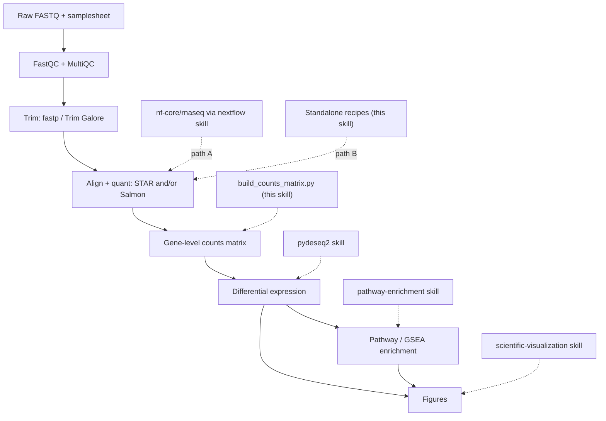

# Bulk RNA-seq

## Overview

This skill orchestrates a complete, **defensible** bulk RNA-seq differential-expression study, from raw sequencing reads to enriched pathways and figures. It is a router, not a reimplementation: most stages already have dedicated skills in this repo, and this skill connects them in the right order, fills the one real gap (raw reads → a gene-level counts matrix), and enforces the design and QC decisions that determine whether the final result is trustworthy.

"Defensible" means three things, applied throughout:
- **Reproducible** — pinned pipeline/tool versions, containers where possible, recorded parameters, fixed random seeds.
- **Quality-gated** — QC is inspected and acted on before, during, and after quantification, not skipped.
- **Statistically sound** — adequate replication, a design that matches the biology, counts handled correctly, and FDR-controlled testing.

The pipeline is: **FastQC/trim → align/quant (STAR/Salmon) → counts → DE (pydeseq2) → enrichment (pathway-enrichment) → figures**.

## When to Use This Skill

Use this skill when the user wants to:
- Go from FASTQ files (or a sequencing run) to differentially expressed genes and pathways.
- Run or configure `nf-core/rnaseq`, or align/quantify with STAR, Salmon, or featureCounts.
- Turn Salmon/STAR/featureCounts output into a counts matrix ready for DESeq2/PyDESeq2.
- Design or sanity-check a bulk RNA-seq experiment (replicates, batch, strandedness) before committing compute.
- Scope an end-to-end RNA-seq analysis and decide which tools and skills to chain.

This is **bulk** RNA-seq (samples = biological specimens). For single-cell/nuclei data use `scanpy`; for the DE statistics alone use `pydeseq2`; for enrichment alone use `pathway-enrichment`.

## The Pipeline at a Glance



## Two Upstream Paths — Pick One

The reads → counts stage can be run two ways. They produce equivalent gene counts; choose by context, then stay on that path.

| Use **Path A — `nf-core/rnaseq`** when… | Use **Path B — standalone tools** when… |
|------------------------------------------|------------------------------------------|
| You want the field-standard, audited, citable pipeline with one command | You have a few samples and want to learn/inspect each step |
| Many samples, or you'll scale to HPC/cloud | No Nextflow/containers available, or a constrained environment |
| Reproducibility and a full MultiQC report matter most | You need a non-standard step the pipeline doesn't expose |
| → Drive it through the **`nextflow`** skill | → Follow `references/upstream-manual.md` |

When unsure, prefer **Path A**: `nf-core/rnaseq` already wires together FastQC → trimming → STAR/Salmon → quantification → tximport → MultiQC with sensible, reviewed defaults, which is the most defensible option. Path B exists for transparency and constrained setups.

Both paths converge on a **gene-level counts matrix**, after which the workflow is identical.

## Setup

```bash
# This skill's glue (bridge + handoffs) — Python
uv pip install pytximport pandas

# Downstream skills install their own deps:
#   pydeseq2 skill           -> uv pip install pydeseq2
#   pathway-enrichment skill -> uv pip install gseapy gprofiler-official

# Path A (nf-core): only Nextflow + a container engine are needed — see the `nextflow` skill.

# Path B (standalone tools): install via bioconda. Pin versions for reproducibility.
conda create -n rnaseq -c bioconda -c conda-forge \
  fastqc fastp trim-galore "star=2.7.11b" "salmon=1.10.3" subread multiqc
```

Record the exact versions you use (pipeline revision, tool versions, reference genome + annotation release) — they belong in the methods section and make the analysis reproducible.

## Quick Start

### Path A — nf-core/rnaseq (recommended)

```bash
# 0. Validate the samplesheet first (catches the most common failures early)
python scripts/validate_samplesheet.py --samplesheet samplesheet.csv

# 1. Smoke-test the environment with tiny bundled data
nextflow run nf-core/rnaseq -r 3.26.0 -profile test,docker --outdir test_results

# 2. Real run: pin the revision, pick an aligner, pass a samplesheet + reference
nextflow run nf-core/rnaseq -r 3.26.0 \
  -profile docker \
  --input samplesheet.csv \
  --genome GRCh38 \
  --aligner star_salmon \
  --outdir results \
  -resume
```

`nf-core/rnaseq` runs tximport internally, so gene counts come out **already merged** — no bridge script needed. Use `results/star_salmon/salmon.merged.gene_counts_length_scaled.tsv` for DE. Samplesheet format, aligner choice, and outputs: `references/upstream-nfcore.md`. For engine/HPC/cloud/container detail, use the **`nextflow`** skill.

### Path B — standalone STAR/Salmon (abbreviated)

```bash
fastqc -o qc/ reads/*.fastq.gz                      # 1. QC raw reads
fastp -i s1_R1.fq.gz -I s1_R2.fq.gz \
      -o s1_R1.trim.fq.gz -O s1_R2.trim.fq.gz \
      --thread 4 -j s1.fastp.json                   # 2. Trim adapters/low-quality
salmon quant -i salmon_index -l A \
      -1 s1_R1.trim.fq.gz -2 s1_R2.trim.fq.gz \
      --gcBias --seqBias -p 8 -o quant/s1            # 3. Quantify (per sample)
```

Full recipes (FastQC, fastp/Trim Galore, STAR index+align+`--quantMode GeneCounts`, Salmon decoy-aware index, featureCounts, strandedness): `references/upstream-manual.md`.

### Counts → DE → enrichment (both paths)

```bash
# Path B only: assemble a gene x sample counts matrix + metadata template for PyDESeq2
python scripts/build_counts_matrix.py --from salmon \
  --quant-dir quant/ --tx2gene tx2gene.tsv --output-dir counts/

# Then hand off (see the dedicated skills):
#   pydeseq2:           counts.csv + metadata.csv -> DE table (log2FC, padj, stat)
#   pathway-enrichment: rank by `stat` (GSEA) or padj+|LFC| hit list (ORA)
#   scientific-visualization / matplotlib: volcano, MA, heatmap, PCA, enrichment dotplot
```

## Stage-by-Stage Workflow

Work top to bottom. Each stage names the skill or file that owns the detail. Don't skip the design/QC stages — they are where bulk RNA-seq studies most often go wrong.

1. **Design & sample sheet.** Confirm ≥3 biological replicates per group, identify batch/confounders, and choose the comparison(s). Build the samplesheet and validate it with `scripts/validate_samplesheet.py`. Rationale and rules: `references/design-and-qc.md`.
2. **Raw-read QC.** FastQC per file; aggregate with MultiQC. Check per-base quality, adapter content, duplication, and over-representation. Thresholds: `references/design-and-qc.md`.
3. **Trimming.** Remove adapters and low-quality tails (via `fastp` or `Trim Galore`). Re-run FastQC to confirm. Recipes: `references/upstream-manual.md` (Path A does this for you).
4. **Align / quantify.** STAR (genome alignment + `--quantMode GeneCounts`) and/or Salmon (transcript quasi-mapping, decoy-aware). Determine strandedness — it is easy to get wrong and silently halves your counts. Detail: `references/upstream-manual.md`; pipeline params: `references/upstream-nfcore.md`.
5. **Build the counts matrix.** Turn quant output into a gene × sample integer matrix and a metadata template (`scripts/build_counts_matrix.py`). The estimated-count and gene-ID-mapping nuances live in `references/counts-and-handoff.md`.
6. **Differential expression → `pydeseq2` skill.** Load `counts.csv` + `metadata.csv`, set the design (e.g. `~batch + condition`), fit, and test with FDR control. Inspect the PCA and p-value histogram as QC.
7. **Enrichment → `pathway-enrichment` skill.** For GSEA, rank the *full* gene list by the DESeq2 `stat`; for ORA, pass the thresholded hit list (padj < 0.05, optionally |log2FC| > 1). Map gene IDs to symbols first.
8. **Figures → `scientific-visualization` skill.** Volcano, MA, sample-distance heatmap, PCA, and enrichment dotplots, plus the MultiQC report for the QC narrative.

## The counts → DE bridge (the key glue)

This is the one stage with no upstream/downstream skill, so this skill owns it. `scripts/build_counts_matrix.py` converts quant output into exactly what `pydeseq2` expects:

- **Salmon** (`--from salmon`): aggregates per-sample `quant.sf` to gene level with `pytximport` using `counts_from_abundance="length_scaled_tpm"` (the right choice for gene-level DE), needs a `tx2gene` map.
- **STAR** (`--from star`): reads each `ReadsPerGene.out.tab`, selecting the column for your `--strandedness` (unstranded/forward/reverse).
- **featureCounts** (`--from featurecounts`): parses the combined `featureCounts` matrix.

It writes `counts.csv` (genes × samples, integers) and `metadata_template.csv` (one row per sample) for you to fill in. **Salmon/RSEM counts are estimates (non-integer); they are rounded to integers** because PyDESeq2 requires integer counts — see `references/counts-and-handoff.md` for why this is acceptable with `length_scaled_tpm` and how it differs from the offset-based DESeq2+tximport route. That reference also covers Ensembl→symbol mapping (needed before enrichment) and the exact orientation PyDESeq2 wants.

## Common Pitfalls

These cause most wrong or irreproducible bulk RNA-seq results:

1. **Too few replicates.** <3 biological replicates per group gives almost no power and unstable dispersion estimates. More replicates beat deeper sequencing.
2. **Confounded batch and condition.** If every treated sample was processed on a different day/lane than controls, the effect is unrecoverable. Randomize, and model known batches (`~batch + condition`). See `references/design-and-qc.md`.
3. **Wrong strandedness.** Choosing the wrong STAR column or featureCounts `-s`/Salmon library type silently discards ~half the reads. Use Salmon `-l A` or infer strandedness, and verify the assigned-reads fraction.
4. **Feeding TPM/FPKM to DESeq2.** DESeq2 needs raw (or length-scaled) **counts**, never TPM/FPKM/normalized values. The bridge handles this.
5. **Non-integer counts.** PyDESeq2 requires integers; round Salmon estimates (the bridge does this).
6. **Gene-ID mismatch into enrichment.** DESeq2 output is often Ensembl IDs; Enrichr/MSigDB want symbols. Map IDs before `pathway-enrichment` or "nothing is significant".
7. **Skipping post-quant QC.** Always look at the PCA and sample-distance heatmap before trusting DE — they expose swapped labels, outliers, and hidden batches.
8. **Mixing aligners across samples.** Quantify every sample with the same tool, version, reference, and parameters.
9. **Unpinned versions.** "latest" pipelines/genomes make results unreproducible; pin `-r`, tool versions, and the genome/annotation release.

## Integration with Other Skills

- **Upstream execution:** `nextflow` (runs `nf-core/rnaseq`, Path A; HPC/cloud/containers).
- **Reference data / gene IDs:** `gget` (`gget ref` for genome+GTF, `gget info`/`gget search` for ID mapping), `database-lookup` (Ensembl/NCBI), `biopython`/`pysam` (FASTA/BAM handling).
- **Differential expression:** `pydeseq2` (the DE engine this skill hands counts to).
- **Enrichment:** `pathway-enrichment` (ORA + GSEA; its `scripts/run_enrichment.py` reads a DESeq2 results CSV directly).
- **Figures & reporting:** `scientific-visualization`, `matplotlib`, `seaborn`; `scientific-writing` for the methods/results narrative.
- **Related but distinct:** `scanpy` (single-cell), `statistical-analysis` (multiple-testing depth).

## Reference Files

Read the relevant file when you need depth — each is self-contained:

- `references/upstream-nfcore.md` — Path A: samplesheet format, `--aligner`/`--pseudo_aligner` choice, key params, the `salmon.merged.gene_counts*.tsv` outputs, MultiQC, and what to hand to `pydeseq2`.
- `references/upstream-manual.md` — Path B: FastQC, fastp/Trim Galore, STAR genome index + alignment + `--quantMode GeneCounts`, Salmon decoy-aware index + `quant`, featureCounts, and how to determine strandedness.
- `references/counts-and-handoff.md` — turning quant output into PyDESeq2-ready `counts.csv`/`metadata.csv` (pytximport, STAR column selection, featureCounts), the integer/estimated-count nuance, Ensembl→symbol mapping, and the DE→enrichment rank/hit-list recipe.
- `references/design-and-qc.md` — experimental design (replication, batch, confounding, design formulas) and QC-metric interpretation (mapping rate, duplication, rRNA, complexity, PCA/outliers) — the defensible-pipeline backbone.

## Resources

- nf-core/rnaseq: https://nf-co.re/rnaseq · STAR: https://github.com/alexdobin/STAR · Salmon: https://salmon.readthedocs.io
- fastp: https://github.com/OpenGene/fastp · Trim Galore: https://github.com/FelixKrueger/TrimGalore · MultiQC: https://multiqc.info
- pytximport: https://pytximport.complextissue.com · featureCounts (Subread): https://subread.sourceforge.net
- Method background: Love et al. 2014 (DESeq2) DOI 10.1186/s13059-014-0550-8 · Soneson et al. 2015 (tximport) DOI 10.12688/f1000research.7563.2

---

## Bundled files (Open WebUI single-file edition)

> This is a conversion of `skills/bulk-rnaseq/` from the K-Dense scientific-agent-skills package (https://github.com/K-Dense-AI/scientific-agent-skills) for Open WebUI, which stores each skill as a single markdown blob. Sibling files the skill text refers to (references, scripts, assets) are inlined below: when instructions mention `references/foo.md`, its content is here.

### `references/counts-and-handoff.md`

# Counts assembly and handoff to DE + enrichment

Goal: turn quant output into the two files the **`pydeseq2`** skill wants, then rank/threshold the DE result for the **`pathway-enrichment`** skill.

- `counts.csv` — a **gene × sample** matrix of **integers** (raw or length-scaled counts; never TPM/FPKM).
- `metadata.csv` — one row per sample (index = sample IDs matching the count columns), columns describing the design (`condition`, `batch`, …).

`scripts/build_counts_matrix.py` produces both. This file explains what it does and the nuances you must get right.

## Orientation (don't trip on this)

PyDESeq2 ultimately needs **samples × genes**. By convention this skill writes `counts.csv` as **genes × samples** (matches Salmon/STAR/featureCounts and nf-core outputs), and the `pydeseq2` skill's loader transposes with `.T`. Keep `counts.csv` genes × samples and let the DE step transpose — don't transpose twice.

## Salmon → gene counts (pytximport)

Salmon is transcript-level; sum to genes with `pytximport` (the Python port of tximport). Use `counts_from_abundance="length_scaled_tpm"` — the correct choice for gene-level DE (corrects for differential transcript-length/usage across samples and yields counts you can feed directly).

```python
from pytximport import tximport

quant_files = ["quant/s1/quant.sf", "quant/s2/quant.sf", "quant/s3/quant.sf"]
txi = tximport(
    quant_files,
    data_type="salmon",
    transcript_gene_map="tx2gene.tsv",          # columns: transcript_id, gene_id
    counts_from_abundance="length_scaled_tpm",
    output_type="xarray",
    ignore_transcript_version=True,              # drops the .N Ensembl version suffix
)
# txi holds gene x sample estimated counts; round to integers for PyDESeq2 (see below).
```

The bundled `scripts/build_counts_matrix.py --from salmon --quant-dir quant/ --tx2gene tx2gene.tsv` wraps this, names columns by sample directory, rounds, and writes `counts.csv` + `metadata_template.csv`.

### Getting a tx2gene map

A two-column transcript_id → gene_id table. Options:
- `pytximport.utils.create_transcript_gene_map(species="human")` (or `human`/`mouse` etc.).
- From the annotation GTF (authoritative — matches your quant reference):

```bash
awk -F'\t' '$3=="transcript"{ match($9,/transcript_id "([^"]+)"/,t); match($9,/gene_id "([^"]+)"/,g); print t[1]"\t"g[1] }' \
  annotation.gtf | sort -u | sed '1i transcript_id\tgene_id' > tx2gene.tsv
```

- nf-core/rnaseq writes the tx2gene it actually used into its output — reuse that on Path A.

## STAR → gene counts (ReadsPerGene)

Each `*.ReadsPerGene.out.tab` has 4 columns: gene_id, unstranded, forward-strand, reverse-strand. Skip STAR's first 4 summary rows (`N_unmapped`, …) and pick the column matching your strandedness (col index 1/2/3 → unstranded/forward/reverse). `scripts/build_counts_matrix.py --from star --quant-dir star/ --strandedness reverse` does this across all samples. These are already integers.

## featureCounts → gene counts

`featureCounts` writes one matrix with a header comment line, then columns: `Geneid, Chr, Start, End, Strand, Length, <bam1>, <bam2>, …`. Keep `Geneid` + the per-BAM count columns, rename columns to sample IDs. `scripts/build_counts_matrix.py --from featurecounts --counts-file counts/featurecounts.txt` handles it. Already integers.

## The estimated-count / integer nuance

PyDESeq2 requires **integer** counts. STAR and featureCounts give integers already. Salmon/RSEM give **estimated** (fractional) counts.

- **What this skill does:** use `length_scaled_tpm` and **round to the nearest integer**. With length-scaled counts the library-size and transcript-length information is already folded into the values, so rounding and treating them as counts is a well-established, defensible approximation for gene-level DE.
- **The "proper" R route** (`tximport` → `DESeqDataSetFromTximport`) instead imports raw counts plus a per-gene **average-transcript-length offset**, letting DESeq2 model length internally. PyDESeq2 does not accept that offset, so the length-scaled-and-round approach is the standard Python equivalent and is what tools like nf-core surface for downstream use.
- Either way: **never** feed TPM/FPKM to DESeq2 — those are normalized and break the count model.

## Gene-ID mapping (do this before enrichment)

DESeq2 output is typically keyed by **Ensembl gene IDs** (e.g. `ENSG00000141510`), often with a version suffix (`.17`). Enrichr/MSigDB/g:Profiler libraries expect **gene symbols** (human UPPERCASE). Mapping mismatch is the #1 cause of "nothing is enriched".

- Strip version suffixes: `ids.str.replace(r"\.\d+$", "", regex=True)`.
- Map Ensembl → symbol with the `gget` skill (`gget info`), `database-lookup`, `pybiomart`, or `mygene`. On Path A, the nf-core `gene_name` column already gives symbols — keep it alongside `gene_id`.
- Keep mapping for *enrichment input*; you can keep Ensembl IDs through DE and map only the final gene lists.

## DE → enrichment recipe

After the `pydeseq2` skill produces `deseq2_results.csv` (columns include `log2FoldChange`, `pvalue`, `padj`, `stat`):

- **GSEA (preranked)** — use the **full** ranked gene list, ranked by the Wald `stat` (sign = direction, magnitude = evidence; more stable than ranking by log2FoldChange). Don't threshold first.
- **ORA** — use the **thresholded** hit list: `padj < 0.05`, optionally also `|log2FoldChange| > 1`; consider running up- and down-regulated sets separately.

The `pathway-enrichment` skill's `scripts/run_enrichment.py` reads a DESeq2 results CSV directly:

```bash
# GSEA straight from the DE table (auto-builds the rank from `stat`)
python ../pathway-enrichment/scripts/run_enrichment.py gsea \
  --deseq2 deseq2_results.csv --organism human --outdir enrichment/ --seed 123

# ORA from a symbol hit list
python ../pathway-enrichment/scripts/run_enrichment.py ora \
  --genes sig_symbols.txt --organism human --outdir enrichment/
```

Make sure the IDs in `deseq2_results.csv` / `sig_symbols.txt` are symbols (or map them first). Then visualize with the `scientific-visualization` skill.

### `references/design-and-qc.md`

# Experimental design and QC

The statistics downstream are only as good as the design and the QC gates. Decide design **before** sequencing; apply QC **before, during, and after** quantification. This is what makes a bulk RNA-seq result defensible.

## Experimental design

### Replication
- Use **biological** replicates (independent samples), not technical (same library re-sequenced). Technical replicates measure machine noise, not biological variability, and don't license generalization.
- **≥3 per group is the practical minimum**; 4–6 is much safer for typical effect sizes. With n=2 you cannot estimate within-group variance reliably and DESeq2's dispersion shrinkage is doing almost all the work.
- More replicates beat more depth for detecting DE. Don't trade replicates for coverage.

### Depth, length, layout
- ~20–30M mapped reads/sample is enough for standard gene-level DE. Push higher (50M+) for lowly expressed genes, novel transcripts, or isoform-level work.
- Paired-end and longer reads help mapping/isoforms but aren't required for gene-level DE; single-end is fine if that's what you have.
- Keep layout, read length, kit, and depth **consistent across all samples** in a comparison.

### Avoid confounding (the design killer)
- A **batch** is anything technical that varies across samples: processing day, sequencing lane/flowcell, kit lot, operator, RNA extraction round.
- If a batch is perfectly aligned with your condition (all treated processed Monday, all controls Tuesday), the biological effect is **mathematically unrecoverable**. No analysis fixes this.
- Defenses: **randomize** sample-to-batch assignment, and **balance** so every batch contains every condition. Record all batch variables in the metadata.

### Design formulas (hand to PyDESeq2)
- Put adjustment variables first, the variable of interest **last**: `~batch + condition`.
- Continuous covariate: `~age + condition` (ensure it's numeric).
- Interaction (does the treatment effect differ by genotype?): `~genotype + condition + genotype:condition`.
- The design matrix must be **full rank** — you can't include a batch that's perfectly confounded with condition; `pydeseq2` will error. Check `pd.crosstab(metadata.condition, metadata.batch)` for empty cells.

## QC gates

### Raw-read QC (FastQC / MultiQC)
- **Per-base quality** — bulk of bases ≥ Q30; some drop at read ends is normal (trimming/soft-clipping handles it).
- **Adapter content** — flagged adapters → trim (Path B step 2; Path A does it automatically).
- **Over-represented sequences** — adapters, rRNA, or highly expressed transcripts. Persistent rRNA suggests poor depletion.
- **GC content** — a bimodal/odd distribution can indicate contamination.
- **Sequence duplication** — high duplication is *expected* in RNA-seq (highly expressed genes); see below.

### Alignment / quantification QC
- **STAR uniquely-mapped %** — typically >70–80% for a good library/reference. Low → wrong/old reference, contamination, or degraded RNA.
- **Salmon mapping rate** (`logs/salmon_quant.log`) — usually >70%. Low → wrong transcriptome, no decoys, or contamination.
- **featureCounts assigned %** — low "assigned" with high "unassigned_NoFeatures" often means **wrong strandedness** (`-s`).
- **rRNA fraction** — high rRNA wastes reads; note it, and consider `--remove_ribo_rna` on Path A.
- Verify **strandedness** matches across tools (see `upstream-manual.md`).

### Don't deduplicate for standard DE
PCR/optical duplicates look alarming but in RNA-seq mostly reflect genuine high expression. Standard gene-level DE (DESeq2) does **not** remove duplicates. Only consider dedup with UMIs (use the UMI, not coordinate dedup).

### Post-quantification QC (before trusting DE)
Always do this on the counts, ideally on variance-stabilized/log values:
- **PCA** — do biological replicates cluster? Does the main axis separate your condition, or a batch? A batch dominating PC1 means you must model it. An obvious outlier may be a swap/failure.
- **Sample-distance heatmap / hierarchical clustering** — confirms grouping and exposes mislabeled or swapped samples.
- If a batch clearly structures the data, add it to the design (`~batch + condition`); if it's unknown, consider surrogate-variable / RUV approaches (out of scope here — note it).

### After DE: p-value histogram
- A well-behaved test gives a roughly **uniform** histogram with a **peak near 0** (the true positives).
- A peak near 1, or a U-shape, signals a problem: misspecified design, unmodeled batch, or filtering issues. Fix the design rather than trusting the gene list.

## Quick gate checklist

```
[ ] >=3 biological replicates per group
[ ] batch recorded and NOT confounded with condition
[ ] raw FastQC reviewed; adapters trimmed
[ ] mapping/assignment rate acceptable; strandedness verified
[ ] PCA + sample-distance heatmap inspected; outliers/swaps resolved
[ ] design formula full-rank, adjustment vars before variable of interest
[ ] p-value histogram sane after DE
[ ] versions pinned (pipeline -r, tools, genome+annotation release)
```

### `references/upstream-manual.md`

# Path B — Standalone tools (reads → quant)

Run each stage yourself when you want transparency, have only a few samples, or can't use Nextflow/containers. Results are equivalent to Path A when tools, versions, reference, and parameters match. Quantify **every sample identically**.

Install (bioconda): `conda create -n rnaseq -c bioconda -c conda-forge fastqc fastp trim-galore "star=2.7.11b" "salmon=1.10.3" subread multiqc rseqc`.

## 0. Reference data

You need, for your organism and a **pinned** annotation release:
- genome FASTA (`genome.fa`) and matching annotation GTF (`annotation.gtf`) — for STAR/featureCounts.
- transcriptome FASTA (`transcripts.fa`, cDNA) — for Salmon.

Fetch download links with the `gget` skill (`gget ref -w dna,gtf,cdna <species>`), or from Ensembl/GENCODE directly. Keep genome and GTF from the **same** release.

## 1. QC raw reads — FastQC

```bash
mkdir -p qc/raw
fastqc -t 8 -o qc/raw reads/*.fastq.gz
```

Inspect per-base quality, adapter content, duplication, and over-represented sequences. Interpretation/thresholds: `design-and-qc.md`.

## 2. Trim — fastp (recommended) or Trim Galore

`fastp` is fast and emits a JSON/HTML report MultiQC understands:

```bash
mkdir -p trimmed
fastp \
  -i reads/s1_R1.fastq.gz -I reads/s1_R2.fastq.gz \
  -o trimmed/s1_R1.fq.gz  -O trimmed/s1_R2.fq.gz \
  --detect_adapter_for_pe --qualified_quality_phred 20 --length_required 36 \
  --thread 4 --json qc/s1.fastp.json --html qc/s1.fastp.html
```

Trim Galore (wraps Cutadapt + FastQC; auto-detects adapters):

```bash
trim_galore --paired --cores 4 --fastqc -o trimmed reads/s1_R1.fastq.gz reads/s1_R2.fastq.gz
```

Aggressive quality trimming is usually unnecessary for modern data and for STAR (which soft-clips); adapter removal is the main goal. Re-run FastQC on trimmed reads to confirm.

## 3a. STAR — genome alignment + gene counts

Build the index once per genome+annotation+read-length. `--sjdbOverhang` = read length − 1 (100 is a safe default). Human needs ~30 GB RAM.

```bash
STAR --runMode genomeGenerate --runThreadN 12 \
  --genomeDir star_index \
  --genomeFastaFiles genome.fa \
  --sjdbGTFfile annotation.gtf \
  --sjdbOverhang 100
```

Align each sample, asking STAR to also count reads per gene:

```bash
STAR --runThreadN 12 --genomeDir star_index \
  --readFilesIn trimmed/s1_R1.fq.gz trimmed/s1_R2.fq.gz --readFilesCommand zcat \
  --outSAMtype BAM SortedByCoordinate \
  --quantMode GeneCounts \
  --outFileNamePrefix star/s1.
```

`--quantMode GeneCounts` writes `s1.ReadsPerGene.out.tab` (4 columns, see strandedness below). The sorted BAM is useful for QC (RSeQC, IGV) and for featureCounts.

## 3b. Salmon — decoy-aware quasi-mapping

Build a **decoy-aware** index (genome as decoy) so reads from unannotated/genomic regions don't get miscounted against transcripts:

```bash
# 1. Decoys = all genome sequence names; gentrome = transcriptome THEN genome (order matters)
grep '^>' genome.fa | sed 's/^>//; s/ .*//' > decoys.txt
cat transcripts.fa genome.fa | gzip > gentrome.fa.gz

# 2. Index (k=31 works for reads >=75 bp; use smaller k for shorter reads)
salmon index -t gentrome.fa.gz -d decoys.txt -i salmon_index -k 31 -p 12
```

Quantify each sample (`-l A` auto-detects library type/strandedness; enable bias correction):

```bash
salmon quant -i salmon_index -l A \
  -1 trimmed/s1_R1.fq.gz -2 trimmed/s1_R2.fq.gz \
  --gcBias --seqBias --validateMappings -p 8 \
  -o quant/s1
```

Each `quant/<sample>/quant.sf` is transcript-level; aggregate to gene level with `scripts/build_counts_matrix.py --from salmon` (needs a `tx2gene` map — see `counts-and-handoff.md`). Always check the reported mapping rate (`quant/<sample>/logs/salmon_quant.log`).

## 3c. featureCounts — counts from a STAR BAM (alternative to STAR GeneCounts)

```bash
featureCounts -T 8 -p --countReadPairs \
  -a annotation.gtf -g gene_id \
  -s 2 \                       # strandedness: 0 unstranded, 1 forward, 2 reverse
  -o counts/featurecounts.txt \
  star/s1.Aligned.sortedByCoord.out.bam star/s2.Aligned.sortedByCoord.out.bam ...
```

Pass all sample BAMs at once to get one matrix. Parse it with `scripts/build_counts_matrix.py --from featurecounts`.

## Strandedness — get this right

The wrong setting silently discards ~half the reads. Determine it once, then apply consistently:

- **Salmon** `-l A` auto-detects and reports the library type in `quant/<sample>/lib_format_counts.json` (`ISR` = reverse-stranded paired, `ISF` = forward, `IU`/`IS` = unstranded).
- Or run **RSeQC** `infer_experiment.py -r genes.bed -i s1.bam` on a STAR BAM.

Map the result to each tool:

| Library | Salmon `-l` | featureCounts `-s` | STAR column (in `ReadsPerGene.out.tab`) |
|---------|-------------|--------------------|------------------------------------------|
| Unstranded | `IU` (auto `A`) | `0` | col 2 |
| Forward (e.g. Ligation) | `ISF` (auto `A`) | `1` | col 3 |
| Reverse (e.g. dUTP/TruSeq stranded) | `ISR` (auto `A`) | `2` | col 4 |

Illumina TruSeq Stranded mRNA — the most common kit — is **reverse** (`-s 2`, STAR col 4). When in doubt, let Salmon auto-detect and match the others to it.

## 4. Aggregate QC — MultiQC

```bash
multiqc qc/ star/ quant/ counts/ -o qc/multiqc
```

MultiQC collates FastQC, fastp/Trim Galore, STAR, Salmon, and featureCounts logs into one report — your QC narrative for the methods section. Then build the counts matrix (`counts-and-handoff.md`) and hand off to `pydeseq2`.

### `references/upstream-nfcore.md`

# Path A — nf-core/rnaseq

`nf-core/rnaseq` is the field-standard, community-audited pipeline for the reads → counts stage. It chains FastQC → trimming (Trim Galore or fastp) → optional contaminant/rRNA removal → alignment + quantification (STAR+Salmon, STAR+RSEM, or HISAT2) → tximport gene/transcript count merging → extensive QC → MultiQC, with reviewed defaults and per-process containers.

This file covers *how to run it and what comes out*. For the Nextflow engine itself — profiles, executors, containers (Docker/Singularity/Conda/Wave), HPC/cloud, `-resume` caching, offline/`nf-core pipelines download` — use the **`nextflow`** skill. Don't duplicate that here.

Current stable revision at time of writing: **3.26.0** (always pin with `-r`).

## Samplesheet

`nf-core/rnaseq` takes a CSV, not loose files. Columns (header required):

```csv
sample,fastq_1,fastq_2,strandedness
CONTROL_REP1,/data/ctrl1_R1.fastq.gz,/data/ctrl1_R2.fastq.gz,auto
CONTROL_REP2,/data/ctrl2_R1.fastq.gz,/data/ctrl2_R2.fastq.gz,auto
TREATED_REP1,/data/trt1_R1.fastq.gz,/data/trt1_R2.fastq.gz,auto
TREATED_REP2,/data/trt1_R1.fastq.gz,,auto
```

- **sample** — sample ID. Rows that share a `sample` value are treated as the same sample sequenced over multiple lanes and are merged.
- **fastq_1 / fastq_2** — paths or URLs to gzipped FASTQ. Leave `fastq_2` empty for single-end.
- **strandedness** — `auto` (recommended; the pipeline infers it with Salmon and warns on mismatch), or `forward` / `reverse` / `unstranded` if you know the kit. TruSeq stranded mRNA is typically `reverse`.

Validate before launching: `python scripts/validate_samplesheet.py --samplesheet samplesheet.csv`.

## Choosing the aligner / quantifier

Set with `--aligner` (genome alignment) or `--pseudo_aligner` (lightweight). Defaults are well chosen.

| Option | What it does | When |
|--------|--------------|------|
| `--aligner star_salmon` (default) | STAR genome alignment, Salmon quantifies against the transcriptome from the BAM | The standard, defensible default — gives counts **and** a genome BAM for QC/IGV |
| `--aligner star_rsem` | STAR + RSEM | You specifically need RSEM estimates |
| `--aligner hisat2` | HISAT2 alignment (no built-in transcript quant) | Lower memory than STAR |
| `--pseudo_aligner salmon` (+ `--skip_alignment`) | Salmon quasi-mapping only, no BAM | Fastest/lightest; you don't need a genome BAM |

`star_salmon` is recommended unless you have a specific reason otherwise. You can also add `--pseudo_aligner salmon` alongside an aligner to get both.

## Running

```bash
# Smoke-test first (tiny bundled data; proves the environment works)
nextflow run nf-core/rnaseq -r 3.26.0 -profile test,docker --outdir test_results

# Real run with an iGenomes reference key
nextflow run nf-core/rnaseq -r 3.26.0 \
  -profile docker \
  --input samplesheet.csv \
  --genome GRCh38 \
  --aligner star_salmon \
  --outdir results \
  -resume

# Or supply your own reference explicitly (more reproducible than iGenomes keys)
nextflow run nf-core/rnaseq -r 3.26.0 \
  -profile singularity \
  --input samplesheet.csv \
  --fasta /ref/genome.fa --gtf /ref/annotation.gtf \
  --aligner star_salmon --outdir results -resume
```

Generate a validated, documented command + params file interactively with `nf-core pipelines launch rnaseq` (see the `nextflow` skill).

### Useful parameters

- `--save_reference` — keep the built STAR/Salmon indices so re-runs and other projects don't rebuild them.
- `--trimmer trimgalore|fastp` — trimming tool (default `trimgalore`).
- `--remove_ribo_rna` — sortmerna rRNA depletion (use if libraries weren't poly-A/ribo-depleted, or to quantify rRNA contamination).
- `--extra_salmon_quant_args='--gcBias'` — pass tool flags through.
- `--skip_*` (e.g. `--skip_markduplicates`, `--skip_stringtie`) — drop stages you don't need.
- `--gencode` — set when using GENCODE (not Ensembl) annotation, so gene IDs/biotypes parse correctly.

Pick the reference release deliberately and record it. iGenomes keys (`--genome GRCh38`) are convenient but version-pinning your own `--fasta`/`--gtf` is more reproducible.

## Outputs

Key paths under `--outdir` (for `star_salmon`):

```
results/
├── multiqc/             # MultiQC report — read this first
├── star_salmon/
│   ├── salmon.merged.gene_counts.tsv                 # raw estimated gene counts (tximport, countsFromAbundance=no)
│   ├── salmon.merged.gene_counts_length_scaled.tsv   # length-scaled counts -> use for DESeq2
│   ├── salmon.merged.gene_tpm.tsv                     # TPM (for visualization, NOT for DESeq2)
│   ├── salmon.merged.gene_counts.rds                  # SummarizedExperiment (R)
│   ├── <SAMPLE>/                                      # per-sample Salmon quant dirs
│   └── deseq2_qc/                                     # PCA + sample-distance plots the pipeline already made
└── pipeline_info/        # execution report, software versions, params
```

**The pipeline already runs tximport**, so on Path A you do **not** need this skill's `build_counts_matrix.py`. Use the merged TSV directly.

## Handoff to PyDESeq2

`salmon.merged.gene_counts_length_scaled.tsv` is genes × samples, with a leading `gene_id` (and usually `gene_name`) column, and non-integer values. Round to integers for PyDESeq2:

```python
import pandas as pd

df = pd.read_csv("results/star_salmon/salmon.merged.gene_counts_length_scaled.tsv", sep="\t")
df = df.drop(columns=[c for c in ["gene_name"] if c in df.columns]).set_index("gene_id")
counts = df.round().astype(int)          # genes x samples, integer
counts.to_csv("counts.csv")              # hand to the pydeseq2 skill (it transposes to samples x genes)
```

Build `metadata.csv` (index = sample IDs matching the count columns; columns = `condition`, `batch`, …) and proceed with the **`pydeseq2`** skill. The pipeline's own `deseq2_qc/` PCA is a good first sanity check before you run your own contrasts. Length-scaled counts are appropriate to round and use directly — see `counts-and-handoff.md` for the reasoning and the alternative offset-based route.

### `scripts/build_counts_matrix.py`

```python
#!/usr/bin/env python3
"""Assemble a gene-level counts matrix from RNA-seq quantification output.

Bridges the upstream (Salmon / STAR / featureCounts) and downstream (PyDESeq2)
halves of a bulk RNA-seq pipeline. Writes:

  counts.csv             genes x samples, INTEGER counts (never TPM/FPKM)
  metadata_template.csv  one row per sample (index=sample) to fill in for DE

Hand both to the `pydeseq2` skill. counts.csv stays genes x samples; the
pydeseq2 loader transposes to samples x genes.

Examples
--------
# Salmon: per-sample quant dirs (each containing quant.sf) + a tx2gene map
python build_counts_matrix.py --from salmon \
    --quant-dir quant/ --tx2gene tx2gene.tsv --output-dir counts/

# STAR --quantMode GeneCounts: a dir of *.ReadsPerGene.out.tab files
python build_counts_matrix.py --from star \
    --quant-dir star/ --strandedness reverse --output-dir counts/

# featureCounts: the combined matrix it wrote
python build_counts_matrix.py --from featurecounts \
    --counts-file counts/featurecounts.txt --output-dir counts/

Requires: pandas. Salmon mode also needs pytximport (uv pip install pytximport).
"""
from __future__ import annotations

import argparse
import sys
from pathlib import Path

import pandas as pd

# STAR ReadsPerGene.out.tab column index per strandedness (col 0 is the gene id).
STAR_STRAND_COL = {"unstranded": 1, "forward": 2, "reverse": 3}


def _clean_sample_name(name: str) -> str:
    """Strip common aligner suffixes/extensions from a file or column name."""
    name = Path(str(name)).name
    for suf in (
        ".ReadsPerGene.out.tab",
        ".Aligned.sortedByCoord.out.bam",
        ".Aligned.out.bam",
        ".bam",
        ".sf",
    ):
        if name.endswith(suf):
            name = name[: -len(suf)]
    return name.rstrip(".")


def build_from_salmon(quant_dir: Path, tx2gene: Path) -> pd.DataFrame:
    """Aggregate per-sample Salmon quant.sf to gene level via pytximport.

    Uses counts_from_abundance='length_scaled_tpm' (the right choice for
    gene-level DE) and rounds the resulting estimated counts to integers,
    which PyDESeq2 requires. See references/counts-and-handoff.md.
    """
    try:
        from pytximport import tximport
    except ImportError:
        sys.exit("Salmon mode needs pytximport. Install with: uv pip install pytximport")

    if tx2gene is None:
        sys.exit("--tx2gene is required for --from salmon (columns: transcript_id, gene_id)")

    # Discover per-sample quant.sf files (sample name = parent directory name).
    sf_files = sorted(quant_dir.glob("*/quant.sf"))
    if not sf_files:
        # Fall back to a flat layout: *.sf directly in quant_dir.
        sf_files = sorted(quant_dir.glob("*.sf"))
    if not sf_files:
        sys.exit(f"No quant.sf found under {quant_dir} (expected <sample>/quant.sf)")

    sample_names = [
        f.parent.name if f.name == "quant.sf" else _clean_sample_name(f.name)
        for f in sf_files
    ]
    print(f"Salmon: {len(sf_files)} samples -> {sample_names}")

    txi = tximport(
        [str(f) for f in sf_files],
        data_type="salmon",
        transcript_gene_map=str(tx2gene),
        counts_from_abundance="length_scaled_tpm",
        ignore_transcript_version=True,
        output_type="anndata",
        return_data=True,
    )
    # AnnData: obs=samples, var=genes, X=samples x genes. Transpose to genes x samples.
    counts = txi.to_df().T
    counts.columns = sample_names
    counts.index.name = "gene_id"
    return counts.round().astype(int)


def build_from_star(quant_dir: Path, strandedness: str) -> pd.DataFrame:
    """Combine STAR *.ReadsPerGene.out.tab files into a gene x sample matrix."""
    col = STAR_STRAND_COL[strandedness]
    tabs = sorted(quant_dir.glob("*ReadsPerGene.out.tab"))
    if not tabs:
        sys.exit(f"No *ReadsPerGene.out.tab found under {quant_dir}")
    print(f"STAR: {len(tabs)} samples, strandedness={strandedness} (column {col})")

    series = {}
    for tab in tabs:
        # First 4 rows are summary stats (N_unmapped, N_multimapping, ...).
        df = pd.read_csv(tab, sep="\t", header=None, skiprows=4)
        s = pd.Series(df[col].values, index=df[0].values, dtype="int64")
        series[_clean_sample_name(tab.name)] = s

    counts = pd.DataFrame(series).fillna(0).astype("int64")
    counts.index.name = "gene_id"
    return counts


def build_from_featurecounts(counts_file: Path) -> pd.DataFrame:
    """Parse a combined featureCounts matrix into a gene x sample matrix."""
    if not counts_file.is_file():
        sys.exit(f"featureCounts file not found: {counts_file}")
    # featureCounts prepends a '#' command line; real header is the next row.
    df = pd.read_csv(counts_file, sep="\t", comment="#")
    # Layout: Geneid, Chr, Start, End, Strand, Length, <bam1>, <bam2>, ...
    meta_cols = ["Geneid", "Chr", "Start", "End", "Strand", "Length"]
    sample_cols = [c for c in df.columns if c not in meta_cols]
    if not sample_cols:
        sys.exit("No sample/count columns found in featureCounts file")
    counts = df.set_index("Geneid")[sample_cols].astype("int64")
    counts.columns = [_clean_sample_name(c) for c in counts.columns]
    counts.index.name = "gene_id"
    print(f"featureCounts: {len(sample_cols)} samples -> {list(counts.columns)}")
    return counts


def write_outputs(counts: pd.DataFrame, output_dir: Path) -> None:
    output_dir.mkdir(parents=True, exist_ok=True)

    # Drop all-zero genes (uninformative; pydeseq2 filters further).
    n_before = counts.shape[0]
    counts = counts[counts.sum(axis=1) > 0]
    dropped = n_before - counts.shape[0]

    counts_path = output_dir / "counts.csv"
    counts.to_csv(counts_path)

    meta = pd.DataFrame(
        {"condition": ["CHANGE_ME"] * counts.shape[1], "batch": [""] * counts.shape[1]},
        index=pd.Index(counts.columns, name="sample"),
    )
    meta_path = output_dir / "metadata_template.csv"
    meta.to_csv(meta_path)

    print(f"\n  genes:   {counts.shape[0]} (dropped {dropped} all-zero)")
    print(f"  samples: {counts.shape[1]}")
    print(f"  wrote {counts_path}  (genes x samples, integer)")
    print(f"  wrote {meta_path}  (fill in 'condition'/'batch', then run the pydeseq2 skill)")
    if (counts.columns.duplicated()).any():
        print("  WARNING: duplicate sample names detected — check your inputs.")


def main() -> None:
    p = argparse.ArgumentParser(
        description=__doc__, formatter_class=argparse.RawDescriptionHelpFormatter
    )
    p.add_argument(
        "--from", dest="source", required=True,
        choices=["salmon", "star", "featurecounts"],
        help="Quantifier that produced the input.",
    )
    p.add_argument("--quant-dir", type=Path,
                   help="Directory of per-sample quant output (salmon/star).")
    p.add_argument("--tx2gene", type=Path,
                   help="transcript_id->gene_id map (salmon). TSV/CSV with those columns.")
    p.add_argument("--strandedness", choices=list(STAR_STRAND_COL), default="reverse",
                   help="Library strandedness for STAR column selection (default: reverse).")
    p.add_argument("--counts-file", type=Path,
                   help="Combined featureCounts matrix (featurecounts).")
    p.add_argument("--output-dir", type=Path, default=Path("counts"),
                   help="Where to write counts.csv + metadata_template.csv (default: counts/).")
    args = p.parse_args()

    if args.source == "salmon":
        if not args.quant_dir:
            sys.exit("--quant-dir is required for --from salmon")
        counts = build_from_salmon(args.quant_dir, args.tx2gene)
    elif args.source == "star":
        if not args.quant_dir:
            sys.exit("--quant-dir is required for --from star")
        counts = build_from_star(args.quant_dir, args.strandedness)
    else:
        if not args.counts_file:
            sys.exit("--counts-file is required for --from featurecounts")
        counts = build_from_featurecounts(args.counts_file)

    write_outputs(counts, args.output_dir)


if __name__ == "__main__":
    main()
```

### `scripts/validate_samplesheet.py`

```python
#!/usr/bin/env python3
"""Validate a bulk RNA-seq samplesheet (and optional design metadata).

Catches the cheap-to-miss, expensive-to-debug problems before you spend compute:
missing/duplicate FASTQs, inconsistent paired/single-end rows, invalid
strandedness, and (with --metadata) too few replicates or batch fully confounded
with condition.

Checks an nf-core/rnaseq-style samplesheet:

    sample,fastq_1,fastq_2,strandedness

Exit code 0 if no errors (warnings allowed), 1 if any error is found.

Examples
--------
python validate_samplesheet.py --samplesheet samplesheet.csv
python validate_samplesheet.py --samplesheet samplesheet.csv \
    --metadata metadata.csv --condition-col condition
python validate_samplesheet.py --samplesheet sheet.csv --no-check-files  # skip local file existence

Requires: pandas.
"""
from __future__ import annotations

import argparse
import sys
from pathlib import Path

import pandas as pd

VALID_STRANDEDNESS = {"auto", "forward", "reverse", "unstranded"}
REMOTE_PREFIXES = ("http://", "https://", "ftp://", "s3://", "gs://", "az://")


class Report:
    """Collects errors (fatal) and warnings (advisory)."""

    def __init__(self) -> None:
        self.errors: list[str] = []
        self.warnings: list[str] = []

    def error(self, msg: str) -> None:
        self.errors.append(msg)

    def warn(self, msg: str) -> None:
        self.warnings.append(msg)

    def summarize(self) -> int:
        for w in self.warnings:
            print(f"  WARN  {w}")
        for e in self.errors:
            print(f"  ERROR {e}")
        print()
        if self.errors:
            print(f"FAILED: {len(self.errors)} error(s), {len(self.warnings)} warning(s)")
            return 1
        print(f"PASSED: 0 errors, {len(self.warnings)} warning(s)")
        return 0


def _is_remote(path: str) -> bool:
    return str(path).startswith(REMOTE_PREFIXES)


def validate_samplesheet(path: Path, check_files: bool, rep: Report) -> pd.DataFrame | None:
    if not path.is_file():
        rep.error(f"samplesheet not found: {path}")
        return None

    df = pd.read_csv(path, dtype=str, keep_default_na=False)
    df.columns = [c.strip() for c in df.columns]
    for col in df.columns:
        df[col] = df[col].str.strip()

    if "sample" not in df.columns or "fastq_1" not in df.columns:
        rep.error("samplesheet must have at least 'sample' and 'fastq_1' columns")
        return None
    has_r2 = "fastq_2" in df.columns
    has_strand = "strandedness" in df.columns
    if not has_strand:
        rep.warn("no 'strandedness' column; nf-core/rnaseq recommends one (use 'auto')")

    seen_r1: dict[str, int] = {}
    for i, row in df.iterrows():
        ln = i + 2  # +1 for header, +1 for 1-based
        sample, r1 = row["sample"], row["fastq_1"]
        r2 = row["fastq_2"] if has_r2 else ""

        if not sample:
            rep.error(f"row {ln}: empty 'sample'")
        if not r1:
            rep.error(f"row {ln}: empty 'fastq_1'")
        if r1 and r2 and r1 == r2:
            rep.error(f"row {ln} ({sample}): fastq_1 and fastq_2 are the same file")
        if r1:
            seen_r1[r1] = seen_r1.get(r1, 0) + 1

        if has_strand:
            s = row["strandedness"].lower()
            if s and s not in VALID_STRANDEDNESS:
                rep.error(f"row {ln} ({sample}): strandedness '{s}' not in {sorted(VALID_STRANDEDNESS)}")

        if check_files:
            for label, fp in (("fastq_1", r1), ("fastq_2", r2)):
                if not fp:
                    continue
                if _is_remote(fp):
                    rep.warn(f"row {ln} ({sample}): {label} is remote; existence not checked")
                elif not Path(fp).is_file():
                    rep.error(f"row {ln} ({sample}): {label} not found: {fp}")
                elif not fp.endswith((".fastq.gz", ".fq.gz", ".fastq", ".fq")):
                    rep.warn(f"row {ln} ({sample}): {label} has an unusual extension: {fp}")

    for r1, n in seen_r1.items():
        if n > 1:
            rep.error(f"fastq_1 appears {n} times (each library file must be unique): {r1}")

    # Per-sample paired/single-end consistency (same sample over lanes is allowed in nf-core).
    if has_r2:
        for sample, grp in df.groupby("sample"):
            layouts = {"paired" if r2 else "single" for r2 in grp["fastq_2"]}
            if len(layouts) > 1:
                rep.error(f"sample '{sample}' mixes paired-end and single-end rows")
        dup_samples = df["sample"][df["sample"].duplicated()].unique()
        if len(dup_samples):
            rep.warn(f"samples appear on multiple rows (will be lane-merged): {list(dup_samples)}")

    print(f"samplesheet: {df['sample'].nunique()} unique sample(s) across {len(df)} row(s)")
    return df


def validate_metadata(meta_path: Path, sheet: pd.DataFrame | None,
                      condition_col: str, min_rep: int, rep: Report) -> None:
    if not meta_path.is_file():
        rep.error(f"metadata not found: {meta_path}")
        return

    meta = pd.read_csv(meta_path, dtype=str, keep_default_na=False, index_col=0)
    meta.index = meta.index.astype(str).str.strip()

    if condition_col not in meta.columns:
        rep.error(f"metadata has no '{condition_col}' column (columns: {list(meta.columns)})")
        return

    # Cross-check sample IDs against the samplesheet.
    if sheet is not None:
        sheet_samples = set(sheet["sample"].unique())
        meta_samples = set(meta.index)
        missing = sheet_samples - meta_samples
        extra = meta_samples - sheet_samples
        if missing:
            rep.error(f"samples in samplesheet but missing from metadata: {sorted(missing)}")
        if extra:
            rep.warn(f"samples in metadata but not in samplesheet: {sorted(extra)}")

    # Replication per condition group.
    groups = meta[condition_col].replace("", pd.NA).dropna()
    if groups.empty:
        rep.error(f"'{condition_col}' is empty for all samples")
        return
    sizes = groups.value_counts()
    print(f"design: '{condition_col}' groups -> {sizes.to_dict()}")
    for level, n in sizes.items():
        if n < 2:
            rep.error(f"group '{level}' has {n} replicate(s); need >=2 to estimate variance")
        elif n < min_rep:
            rep.warn(f"group '{level}' has {n} replicate(s); >={min_rep} recommended for reliable DE")

    # Light confounding check: batch fully nested within condition.
    if "batch" in meta.columns and meta["batch"].replace("", pd.NA).notna().any():
        ct = pd.crosstab(meta[condition_col], meta["batch"])
        each_batch_single_condition = (ct > 0).sum(axis=0).eq(1).all()
        if ct.shape[0] > 1 and ct.shape[1] > 1 and each_batch_single_condition:
            rep.warn(
                "'batch' looks fully confounded with "
                f"'{condition_col}' (each batch holds a single condition); "
                "the batch effect cannot be separated from the biology. See design-and-qc.md."
            )


def main() -> None:
    p = argparse.ArgumentParser(
        description=__doc__, formatter_class=argparse.RawDescriptionHelpFormatter
    )
    p.add_argument("--samplesheet", type=Path, required=True, help="CSV samplesheet to validate.")
    p.add_argument("--metadata", type=Path, help="Optional design metadata CSV (index=sample).")
    p.add_argument("--condition-col", default="condition", help="Condition column in metadata (default: condition).")
    p.add_argument("--min-replicates", type=int, default=3, dest="min_rep",
                   help="Replicates per group to recommend (default: 3).")
    p.add_argument("--no-check-files", action="store_true", help="Skip local FASTQ existence checks.")
    args = p.parse_args()

    rep = Report()
    print(f"Validating {args.samplesheet} ...")
    sheet = validate_samplesheet(args.samplesheet, not args.no_check_files, rep)
    if args.metadata:
        print(f"Validating {args.metadata} ...")
        validate_metadata(args.metadata, sheet, args.condition_col, args.min_rep, rep)

    print()
    sys.exit(rep.summarize())


if __name__ == "__main__":
    main()
```
