# Markdown and Mermaid Writing

## Overview

This skill teaches you — and enforces a standard for — creating scientific documentation
using **markdown with embedded Mermaid diagrams as the default and canonical format**.

The core bet: a relationship expressed as a Mermaid diagram inside a `.md` file is more
valuable than any image. It is text, so it diffs cleanly in git. It requires no build step.
It renders natively on GitHub, GitLab, Notion, VS Code, and any markdown viewer. It uses
fewer tokens than a prose description of the same relationship. And it can always be
converted to a polished image later — but the text version remains the source of truth.

> "The more you get your reports and files in .md in just regular text, which mermaid is
> as well as being a simple 'script language'. This just helps with any downstream rendering
> and especially AI generated images (using mermaid instead of just long form text to
> describe relationships < tokens). Additionally mermaid can render along with markdown for
> easy use almost anywhere by humans or AI."
>
> — Clayton Young (@borealBytes), K-Dense Discord, 2026-02-19

## When to Use This Skill

Use this skill when:

- Creating **any scientific document** — reports, analyses, manuscripts, methods sections
- Writing **any documentation** — READMEs, how-tos, decision records, project docs
- Producing **any diagram** — workflows, data pipelines, architectures, timelines, relationships
- Generating **any output that will be version-controlled** — if it's going into git, it should be markdown
- Working with **any other skill** — this skill defines the documentation layer that wraps every other output
- Someone asks you to "add a diagram" or "visualize the relationship" — Mermaid first, always

Do NOT start with Python matplotlib, seaborn, or AI image generation for structural or relational diagrams.
Those are Phase 2 and Phase 3 — only used when Mermaid cannot express what's needed (e.g., scatter plots with real data, photorealistic images).

## 🎨 The Source Format Philosophy

### Why text-based diagrams win

| What matters | Mermaid in Markdown | Python / AI Image |
| ----------------------------- | :-----------------: | :---------------: |
| Git diff readable | ✅ | ❌ binary blob |
| Editable without regenerating | ✅ | ❌ |
| Token efficient vs. prose | ✅ smaller | ❌ larger |
| Renders without a build step | ✅ | ❌ needs hosting |
| Parseable by AI without vision | ✅ | ❌ |
| Works in GitHub / GitLab / Notion | ✅ | ⚠️ if hosted |
| Accessible (screen readers) | ✅ accTitle/accDescr | ⚠️ needs alt text |
| Convertible to image later | ✅ anytime | — already image |

### The three-phase workflow

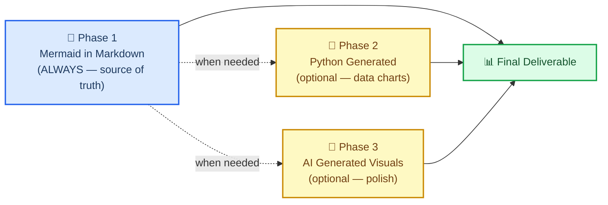
```mermaid
flowchart LR
    accTitle: Three-Phase Documentation Workflow
    accDescr: Phase 1 Mermaid in markdown is always required and is the source of truth. Phases 2 and 3 are optional downstream conversions for polished output.

    p1["📄 Phase 1<br/>Mermaid in Markdown<br/>(ALWAYS — source of truth)"]
    p2["🐍 Phase 2<br/>Python Generated<br/>(optional — data charts)"]
    p3["🎨 Phase 3<br/>AI Generated Visuals<br/>(optional — polish)"]
    out["📊 Final Deliverable"]

    p1 --> out
    p1 -.->|"when needed"| p2
    p1 -.->|"when needed"| p3
    p2 --> out
    p3 --> out

    classDef required fill:#dbeafe,stroke:#2563eb,stroke-width:2px,color:#1e3a5f
    classDef optional fill:#fef9c3,stroke:#ca8a04,stroke-width:2px,color:#713f12
    classDef output fill:#dcfce7,stroke:#16a34a,stroke-width:2px,color:#14532d

    class p1 required
    class p2,p3 optional
    class out output
```

**Phase 1 is mandatory.** Even if you proceed to Phase 2 or 3, the Mermaid source stays committed.

### What Mermaid can express

Mermaid covers 24 diagram types. Almost every scientific relationship fits one:

| Use case | Diagram type | File |
| -------------------------------------------- | ---------------- | ---------------------------------------------------- |
| Experimental workflow / decision logic | Flowchart | `references/diagrams/flowchart.md` |
| Service interactions / API calls / messaging | Sequence | `references/diagrams/sequence.md` |
| Data model / schema | ER diagram | `references/diagrams/er.md` |
| State machine / lifecycle | State | `references/diagrams/state.md` |
| Project timeline / roadmap | Gantt | `references/diagrams/gantt.md` |
| Proportions / composition | Pie | `references/diagrams/pie.md` |
| System architecture (zoom levels) | C4 | `references/diagrams/c4.md` |
| Concept hierarchy / brainstorm | Mindmap | `references/diagrams/mindmap.md` |
| Chronological events / history | Timeline | `references/diagrams/timeline.md` |
| Class hierarchy / type relationships | Class | `references/diagrams/class.md` |
| User journey / satisfaction map | User Journey | `references/diagrams/user_journey.md` |
| Two-axis comparison / prioritization | Quadrant | `references/diagrams/quadrant.md` |
| Requirements traceability | Requirement | `references/diagrams/requirement.md` |
| Flow magnitude / resource distribution | Sankey | `references/diagrams/sankey.md` |
| Numeric trends / bar + line charts | XY Chart | `references/diagrams/xy_chart.md` |
| Component layout / spatial arrangement | Block | `references/diagrams/block.md` |
| Work item status / task columns | Kanban | `references/diagrams/kanban.md` |
| Cloud infrastructure / service topology | Architecture | `references/diagrams/architecture.md` |
| Multi-dimensional comparison / skills radar | Radar | `references/diagrams/radar.md` |
| Hierarchical proportions / budget | Treemap | `references/diagrams/treemap.md` |
| Binary protocol / data format | Packet | `references/diagrams/packet.md` |
| Git branching / merge strategy | Git Graph | `references/diagrams/git_graph.md` |
| Code-style sequence (programming syntax) | ZenUML | `references/diagrams/zenuml.md` |
| Multi-diagram composition patterns | Complex Examples | `references/diagrams/complex_examples.md` |

> 💡 **Pick the right type, not the easy one.** Don't default to flowcharts for everything.
> A timeline beats a flowchart for chronological events. A sequence beats a flowchart for
> service interactions. Scan the table and match.

---

## 🔧 Core workflow

### Step 1: Identify the document type

Check if a template exists before writing from scratch:

| Document type | Template |
| ------------------------------ | ----------------------------------------------- |
| Pull request record | `templates/pull_request.md` |
| Issue / bug / feature request | `templates/issue.md` |
| Sprint / project board | `templates/kanban.md` |
| Architecture decision (ADR) | `templates/decision_record.md` |
| Presentation / briefing | `templates/presentation.md` |
| Research paper / analysis | `templates/research_paper.md` |
| Project documentation | `templates/project_documentation.md` |
| How-to / tutorial | `templates/how_to_guide.md` |
| Status report | `templates/status_report.md` |

### Step 2: Read the style guide

Before writing any `.md` file: read `references/markdown_style_guide.md`.

Key rules to internalize:

- **One H1 per document** — the title. Never more.
- **Emoji on H2 headings only** — one emoji per H2, none in H3/H4
- **Cite everything** — every external claim gets a footnote `[^N]` with full URL
- **Bold sparingly** — max 2-3 bold terms per paragraph, never full sentences
- **Horizontal rule after every `</details>`** — mandatory
- **Tables over prose** for comparisons, configurations, structured data
- **Diagrams over walls of text** — if it describes flow, structure, or relationships, add Mermaid

### Step 3: Pick the diagram type and read its guide

Before creating any Mermaid diagram: read `references/mermaid_style_guide.md`.

Then open the specific type file (e.g., `references/diagrams/flowchart.md`) for the exemplar, tips, and copy-paste template.

Mandatory rules for every diagram:

```
accTitle: Short Name 3-8 Words
accDescr: One or two sentences explaining what this diagram shows.
```

- **No `%%{init}` directives** — breaks GitHub dark mode
- **No inline `style`** — use `classDef` only
- **One emoji per node max** — at the start of the label
- **`snake_case` node IDs** — match the label

### Step 4: Write the document

Start from the template. Apply the markdown style guide. Place diagrams inline with related text — not in a separate "Figures" section.

### Step 5: Commit as text

The `.md` file with embedded Mermaid is what gets committed. If you also generated a PNG or AI image, those are supplementary — the markdown is the source.

---

## ⚠️ Common pitfalls

### Radar chart syntax (`radar-beta`)

**WRONG:**
```mermaid
radar
title Example
x-axis ["A", "B", "C"]
"Series" : [1, 2, 3]
```

**CORRECT:**
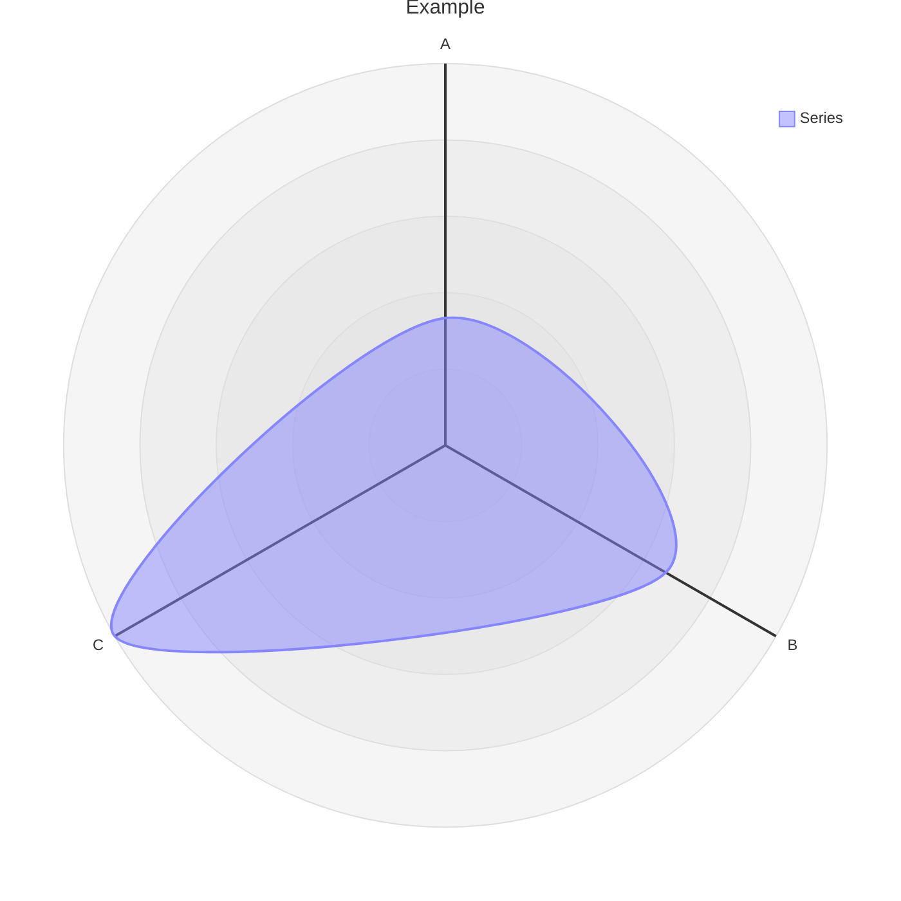
```mermaid
radar-beta
title Example
axis a["A"], b["B"], c["C"]
curve series["Series"]{1, 2, 3}
max 3
```

- **Use `radar-beta`** not `radar` (the bare keyword doesn't exist)
- **Use `axis`** to define dimensions, **not** `x-axis`
- **Use `curve`** to define data series, **not** quoted labels with colon
- **No `accTitle`/`accDescr`** — radar-beta doesn't support accessibility annotations; always add a descriptive italic paragraph above the diagram

### XY Chart vs Radar confusion

| Diagram | Keyword | Axis syntax | Data syntax |
| ------- | ------- | ----------- | ----------- |
| **XY Chart** (bars/lines) | `xychart-beta` | `x-axis ["Label1", "Label2"]` | `bar [10, 20]` or `line [10, 20]` |
| **Radar** (spider/web) | `radar-beta` | `axis id["Label"]` | `curve id["Label"]{10, 20}` |

### Forgetting `accTitle`/`accDescr` on supported types

Only some diagram types support `accTitle`/`accDescr`. For those that don't, always place a descriptive italic paragraph directly above the code block:

> _Radar chart comparing three methods across five performance dimensions. Note: Radar charts do not support accTitle/accDescr._


```mermaid
radar-beta
...
```

---

## 🔗 Integration with other skills

### With `scientific-schematics`

`scientific-schematics` generates AI-powered publication-quality images (PNG). Use the Mermaid diagram as the **brief** for the schematic:

```
Workflow:
1. Create the concept as Mermaid in .md (this skill — Phase 1)
2. Describe the same concept to scientific-schematics for a polished PNG (Phase 3)
3. Commit both — the .md as source, the PNG as a supplementary figure
```

### With `scientific-writing`

When `scientific-writing` produces a manuscript, all diagrams and structural figures should use this skill's standards. The writing skill handles prose and citations; this skill handles visual structure.

```
Workflow:
1. Use scientific-writing to draft the manuscript
2. For every figure that shows a workflow, architecture, or relationship:
   - Replace placeholder with a Mermaid diagram following this skill's guide
3. Use scientific-schematics only for figures that truly need photorealistic/complex rendering
```

### With `literature-review`

Literature review produces summaries with lots of relationship data. Use this skill to:

- Create concept maps (Mindmap) of the literature landscape
- Show publication timelines (Timeline or Gantt)
- Compare methodologies (Quadrant or Radar)
- Diagram data flows described in papers (Sequence or Flowchart)

### With any skill that produces output documents

Before finalizing any document from any skill, apply this skill's checklist:

- [ ] Does the document use a template? If so, did I start from the right one?
- [ ] Are all diagrams in Mermaid with `accTitle` + `accDescr`?
- [ ] No `%%{init}`, no inline `style`, only `classDef`?
- [ ] Are all external claims cited with `[^N]`?
- [ ] One H1, emoji on H2 only?
- [ ] Horizontal rules after every `</details>`?

---

## 📚 Reference index

### Style guides

| Guide | Path | Lines | What it covers |
| ----------------------- | ------------------------------------------- | ----- | -------------------------------------------------- |
| Markdown Style Guide | `references/markdown_style_guide.md` | ~733 | Headings, formatting, citations, tables, Mermaid integration, templates, quality checklist |
| Mermaid Style Guide | `references/mermaid_style_guide.md` | ~458 | Accessibility, emoji set, color classes, theme neutrality, type selection, complexity tiers |

### Diagram type guides (24 types)

Each file contains: production-quality exemplar, tips specific to that type, and a copy-paste template.

`references/diagrams/` — architecture, block, c4, class, complex\_examples, er, flowchart, gantt, git\_graph, kanban, mindmap, packet, pie, quadrant, radar, requirement, sankey, sequence, state, timeline, treemap, user\_journey, xy\_chart, zenuml

### Document templates (9 types)

`templates/` — decision\_record, how\_to\_guide, issue, kanban, presentation, project\_documentation, pull\_request, research\_paper, status\_report

### Examples

`assets/examples/example-research-report.md` — a complete scientific research report demonstrating proper heading hierarchy, multiple diagram types (flowchart, sequence, gantt), tables, footnote citations, collapsible sections, and all style guide rules applied.

---

## 📝 Attribution

All style guides, diagram type guides, and document templates in this skill are ported from the `SuperiorByteWorks-LLC/agent-project` repository under the Apache-2.0 License.

- **Source**: https://github.com/SuperiorByteWorks-LLC/agent-project
- **Author**: Clayton Young / Superior Byte Works, LLC (@borealBytes)
- **License**: Apache-2.0

This skill (as part of scientific-agent-skills) is distributed under the MIT License. The included Apache-2.0 content is compatible for downstream use with attribution retained, as preserved in the file headers throughout this skill.

---

[^1]: GitHub Blog. (2022). "Include diagrams in your Markdown files with Mermaid." https://github.blog/2022-02-14-include-diagrams-markdown-files-mermaid/

[^2]: Mermaid. "Mermaid Diagramming and Charting Tool." https://mermaid.js.org/

---

## Bundled files (Open WebUI single-file edition)

> This is a conversion of `skills/markdown-mermaid-writing/` from the K-Dense scientific-agent-skills package (https://github.com/K-Dense-AI/scientific-agent-skills) for Open WebUI, which stores each skill as a single markdown blob. Sibling files the skill text refers to (references, scripts, assets) are inlined below: when instructions mention `references/foo.md`, its content is here.

### `references/diagrams/architecture.md`

<!-- Source: https://github.com/SuperiorByteWorks-LLC/agent-project | License: Apache-2.0 | Author: Clayton Young / Superior Byte Works, LLC (Boreal Bytes) -->

# Architecture Diagram

> **Back to [Style Guide](../mermaid_style_guide.md)** — Read the style guide first for emoji, color, and accessibility rules.

**Syntax keyword:** `architecture-beta`
**Best for:** Cloud infrastructure, service topology, deployment architecture, network layout
**When NOT to use:** Logical system boundaries (use [C4](c4.md)), component layout without cloud semantics (use [Block](block.md))

> ⚠️ **Accessibility:** Architecture diagrams do **not** support `accTitle`/`accDescr`. Always place a descriptive _italic_ Markdown paragraph directly above the code block.

---

## Exemplar Diagram

_Architecture diagram showing a cloud-hosted web application with a load balancer, API server, database, and cache deployed within a VPC:_

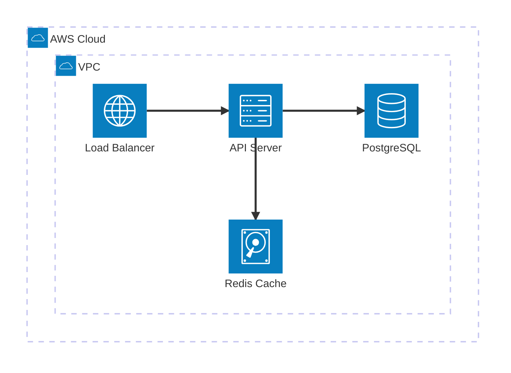
```mermaid
architecture-beta
    group cloud(cloud)[AWS Cloud]
    group vpc(cloud)[VPC] in cloud

    service lb(internet)[Load Balancer] in vpc
    service api(server)[API Server] in vpc
    service db(database)[PostgreSQL] in vpc
    service cache(disk)[Redis Cache] in vpc

    lb:R --> L:api
    api:R --> L:db
    api:B --> T:cache
```

---

## Tips

- Use `group` for logical boundaries (VPC, region, cluster, availability zone)
- Use `service` for individual components
- Direction annotations on connections: `:L` (left), `:R` (right), `:T` (top), `:B` (bottom)
- Built-in icon types: `cloud`, `server`, `database`, `internet`, `disk`
- Nest groups with `in parent_group`
- **Labels must be plain text** — no emoji and no hyphens in `[]` labels (parser treats `-` as an edge operator)
- Use `-->` for directional arrows, `--` for undirected edges
- Keep to **6–8 services** per diagram
- **Always** pair with a Markdown text description above for screen readers

---

## Template

_Description of the infrastructure topology and key components:_

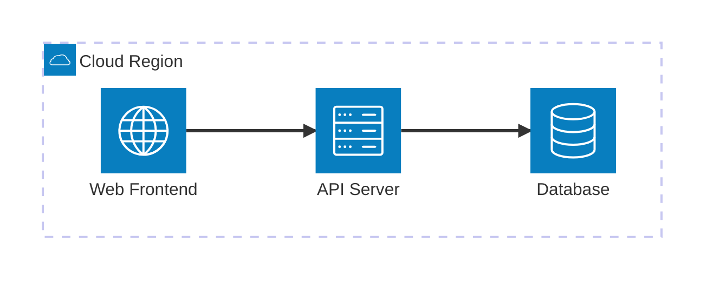
```mermaid
architecture-beta
    group region(cloud)[Cloud Region]

    service frontend(internet)[Web Frontend] in region
    service backend(server)[API Server] in region
    service datastore(database)[Database] in region

    frontend:R --> L:backend
    backend:R --> L:datastore
```

---

## Complex Example

_Multi-region cloud deployment with 3 nested groups (2 regional clusters + shared services) showing 9 services, cross-region database replication, CDN distribution, and centralized monitoring. Demonstrates how nested `group` + `in` syntax creates clear infrastructure boundaries:_

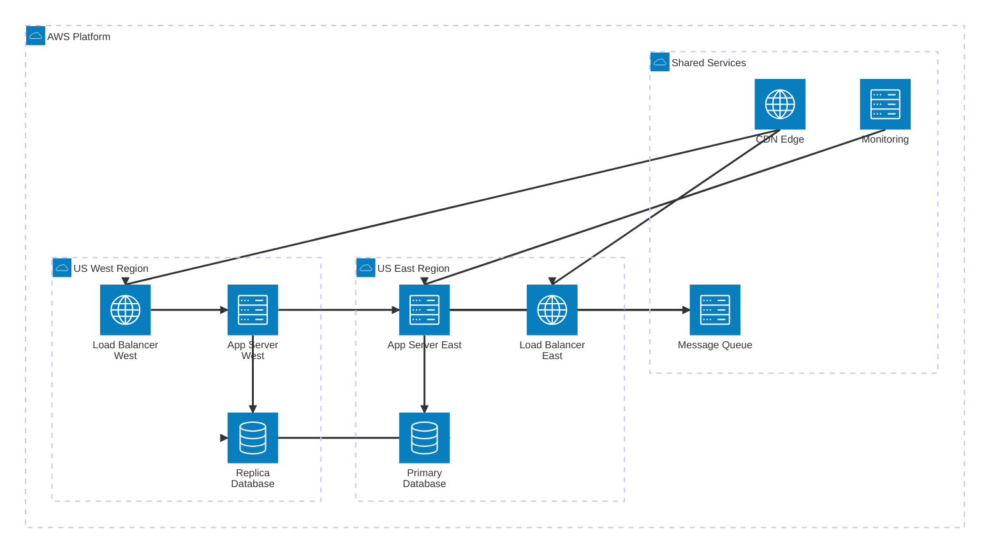
```mermaid
architecture-beta
    group cloud(cloud)[AWS Platform]

    group east(cloud)[US East Region] in cloud
    service lb_east(internet)[Load Balancer East] in east
    service app_east(server)[App Server East] in east
    service db_primary(database)[Primary Database] in east

    group west(cloud)[US West Region] in cloud
    service lb_west(internet)[Load Balancer West] in west
    service app_west(server)[App Server West] in west
    service db_replica(database)[Replica Database] in west

    group shared(cloud)[Shared Services] in cloud
    service cdn(internet)[CDN Edge] in shared
    service monitor(server)[Monitoring] in shared
    service queue(server)[Message Queue] in shared

    cdn:B --> T:lb_east
    cdn:B --> T:lb_west
    lb_east:R --> L:app_east
    lb_west:R --> L:app_west
    app_east:B --> T:db_primary
    app_west:B --> T:db_replica
    db_primary:R --> L:db_replica
    app_east:R --> L:queue
    app_west:R --> L:queue
    monitor:B --> T:app_east
```

### Why this works

- **Nested groups mirror real infrastructure** — cloud > region > services is exactly how teams think about multi-region deployments. The nesting creates clear blast radius boundaries.
- **Plain text labels only** — architecture diagrams parse-fail with emoji in `[]` labels. All visual distinction comes from the group nesting and icon types (`internet`, `server`, `database`).
- **Directional annotations prevent overlap** — `:B --> T:` (bottom-to-top), `:R --> L:` (right-to-left) control where edges connect. Without these, Mermaid stacks edges on top of each other.
- **Cross-region replication is explicit** — the `db_primary:R --> L:db_replica` edge is the most important infrastructure detail and reads clearly as a horizontal connection between regions.

### `references/diagrams/block.md`

<!-- Source: https://github.com/SuperiorByteWorks-LLC/agent-project | License: Apache-2.0 | Author: Clayton Young / Superior Byte Works, LLC (Boreal Bytes) -->

# Block Diagram

> **Back to [Style Guide](../mermaid_style_guide.md)** — Read the style guide first for emoji, color, and accessibility rules.

**Syntax keyword:** `block-beta`
**Best for:** System block composition, layered architectures, component topology where spatial layout matters
**When NOT to use:** Process flows (use [Flowchart](flowchart.md)), infrastructure with cloud icons (use [Architecture](architecture.md))

> ⚠️ **Accessibility:** Block diagrams do **not** support `accTitle`/`accDescr`. Always place a descriptive _italic_ Markdown paragraph directly above the code block.

---

## Exemplar Diagram

_Block diagram showing a three-tier web application architecture from client-facing interfaces through application services to data storage, with emoji labels indicating component types:_

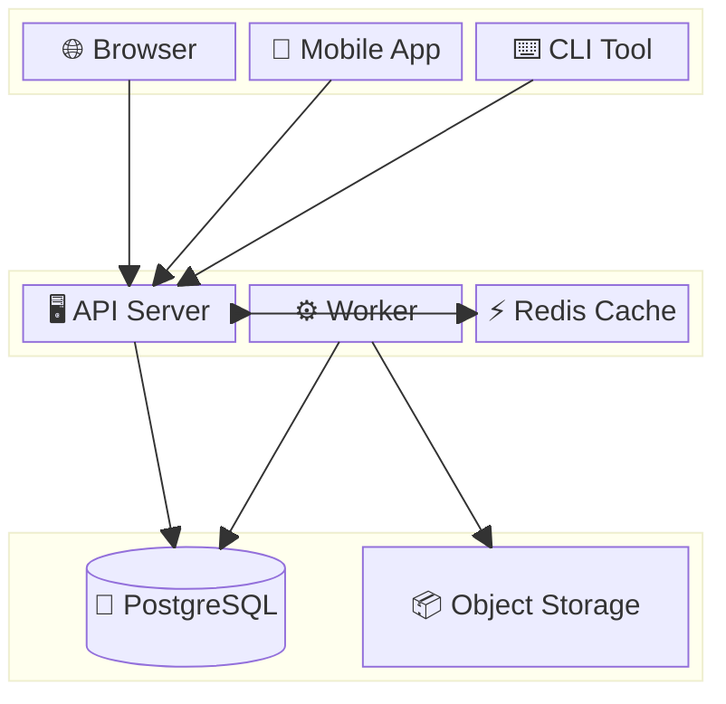
```mermaid
block-beta
    columns 3

    block:client:3
        columns 3
        browser["🌐 Browser"]
        mobile["📱 Mobile App"]
        cli["⌨️ CLI Tool"]
    end

    space:3

    block:app:3
        columns 3
        api["🖥️ API Server"]
        worker["⚙️ Worker"]
        cache["⚡ Redis Cache"]
    end

    space:3

    block:data:3
        columns 2
        db[("💾 PostgreSQL")]
        storage["📦 Object Storage"]
    end

    browser --> api
    mobile --> api
    cli --> api
    api --> worker
    api --> cache
    worker --> db
    api --> db
    worker --> storage
```

---

## Tips

- Use `columns N` to control the layout grid
- Use `space:N` for empty cells (alignment/spacing)
- Nest `block:name:span { ... }` for grouped sections
- Connect blocks with `-->` arrows
- Use **emoji in labels** `["🔧 Component"]` for visual distinction
- Use cylinder `("text")` syntax for databases within blocks
- Keep to **3–4 rows** with **3–4 columns** for readability
- **Always** pair with a Markdown text description above for screen readers

---

## Template

_Description of the system layers and how components connect:_

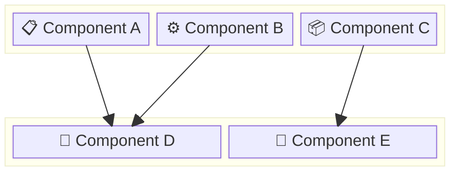
```mermaid
block-beta
    columns 3

    block:layer1:3
        columns 3
        comp_a["📋 Component A"]
        comp_b["⚙️ Component B"]
        comp_c["📦 Component C"]
    end

    space:3

    block:layer2:3
        columns 2
        comp_d["💾 Component D"]
        comp_e["🔧 Component E"]
    end

    comp_a --> comp_d
    comp_b --> comp_d
    comp_c --> comp_e
```

---

## Complex Example

_Enterprise platform architecture rendered as a 5-tier block diagram with 15 components. Each tier is a block group spanning the full width, with internal columns controlling component layout. Connections show the primary data flow paths between tiers:_

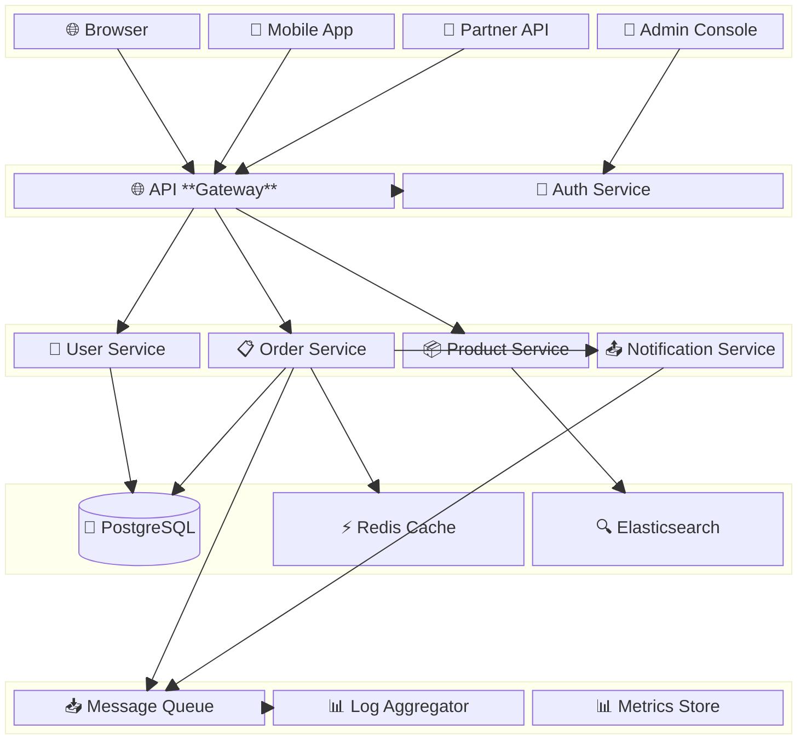
```mermaid
block-beta
    columns 4

    block:clients:4
        columns 4
        browser["🌐 Browser"]
        mobile["📱 Mobile App"]
        partner["🔌 Partner API"]
        admin["🔐 Admin Console"]
    end

    space:4

    block:gateway:4
        columns 2
        apigw["🌐 API **Gateway**"]
        auth["🔐 Auth Service"]
    end

    space:4

    block:services:4
        columns 4
        user_svc["👤 User Service"]
        order_svc["📋 Order Service"]
        product_svc["📦 Product Service"]
        notify_svc["📤 Notification Service"]
    end

    space:4

    block:data:4
        columns 3
        postgres[("💾 PostgreSQL")]
        redis["⚡ Redis Cache"]
        elastic["🔍 Elasticsearch"]
    end

    space:4

    block:infra:4
        columns 3
        mq["📥 Message Queue"]
        logs["📊 Log Aggregator"]
        metrics["📊 Metrics Store"]
    end

    browser --> apigw
    mobile --> apigw
    partner --> apigw
    admin --> auth
    apigw --> auth
    apigw --> user_svc
    apigw --> order_svc
    apigw --> product_svc
    order_svc --> notify_svc
    user_svc --> postgres
    order_svc --> postgres
    product_svc --> elastic
    order_svc --> redis
    notify_svc --> mq
    order_svc --> mq
    mq --> logs
```

### Why this works

- **5 tiers read top-to-bottom** like a network diagram — clients, gateway, services, data, infrastructure. Each tier is a block spanning the full width with its own column layout.
- **`space:4` creates visual separation** between tiers without unnecessary lines or borders, keeping the diagram clean and scannable.
- **Cylinder syntax `("text")` for databases** — PostgreSQL renders as a cylinder, instantly recognizable as a data store. Other components use standard rectangles.
- **Connections show real data paths** — not every possible connection, just the primary flows. A fully-connected diagram would be unreadable; this shows the key paths an engineer would trace during debugging.

### `references/diagrams/c4.md`

<!-- Source: https://github.com/SuperiorByteWorks-LLC/agent-project | License: Apache-2.0 | Author: Clayton Young / Superior Byte Works, LLC (Boreal Bytes) -->

# C4 Diagram

> **Back to [Style Guide](../mermaid_style_guide.md)** — Read the style guide first for emoji, color, and accessibility rules.

**Syntax keyword:** `C4Context`, `C4Container`, `C4Component`
**Best for:** System architecture at varying zoom levels — context, containers, components
**When NOT to use:** Infrastructure topology (use [Architecture](architecture.md)), runtime sequences (use [Sequence](sequence.md))

---

## Exemplar Diagram — System Context

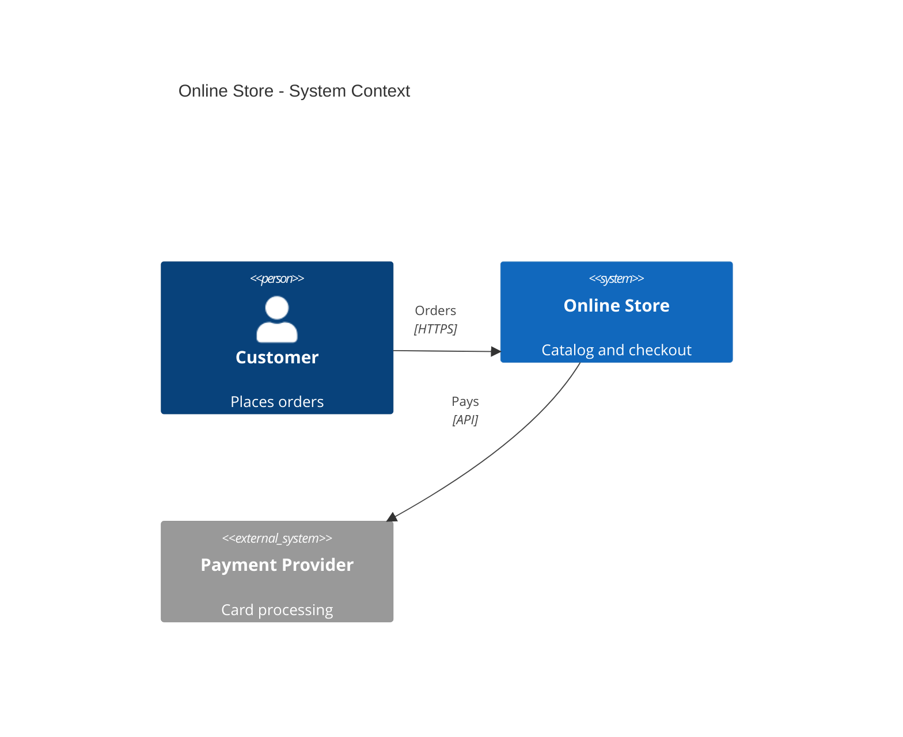
```mermaid
C4Context
    accTitle: Online Store System Context
    accDescr: C4 context diagram showing how a customer interacts with the store and its external payment dependency

    title Online Store - System Context

    Person(customer, "Customer", "Places orders")
    System(store, "Online Store", "Catalog and checkout")
    System_Ext(payment, "Payment Provider", "Card processing")

    Rel(customer, store, "Orders", "HTTPS")
    Rel(store, payment, "Pays", "API")

    UpdateRelStyle(customer, store, $offsetY="-40", $offsetX="-30")
    UpdateRelStyle(store, payment, $offsetY="-40", $offsetX="-30")
```

---

## C4 Zoom Levels

| Level         | Keyword       | Shows                                   | Audience        |
| ------------- | ------------- | --------------------------------------- | --------------- |
| **Context**   | `C4Context`   | Systems + external actors               | Everyone        |
| **Container** | `C4Container` | Apps, databases, queues within a system | Technical leads |
| **Component** | `C4Component` | Internal modules within a container     | Developers      |

## Tips

- Use `Person()` for human actors
- Use `System()` for internal systems, `System_Ext()` for external
- Use `Container()`, `ContainerDb()`, `ContainerQueue()` at the container level
- Label relationships with **verbs** and **protocols**: `"Reads from", "SQL/TLS"`
- Use `Container_Boundary(id, "name") { ... }` to group containers
- **Keep descriptions short** — long text causes label overlaps
- **Limit to 4–5 elements** at the Context level to avoid crowding
- **Avoid emoji in C4 labels** — the C4 renderer handles its own styling
- Use `UpdateRelStyle()` to adjust label positions if overlaps occur

---

## Template

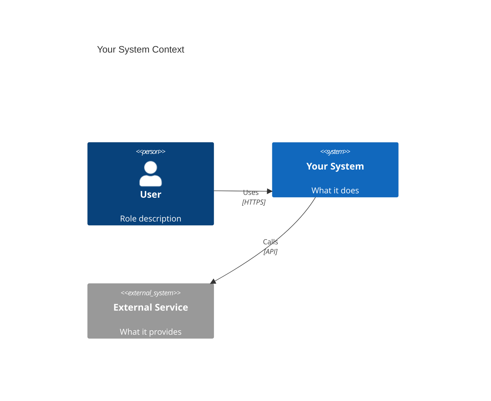
```mermaid
C4Context
    accTitle: Your System Context
    accDescr: Describe the system boundaries and external interactions

    Person(user, "User", "Role description")

    System(main_system, "Your System", "What it does")
    System_Ext(external, "External Service", "What it provides")

    Rel(user, main_system, "Uses", "HTTPS")
    Rel(main_system, external, "Calls", "API")
```

---

## Complex Example

A C4 Container diagram for an e-commerce platform with 3 `Container_Boundary` groups, 10 containers, and 2 external systems. Shows how to use boundaries to organize services by layer, with `UpdateRelStyle` offsets preventing label overlaps.

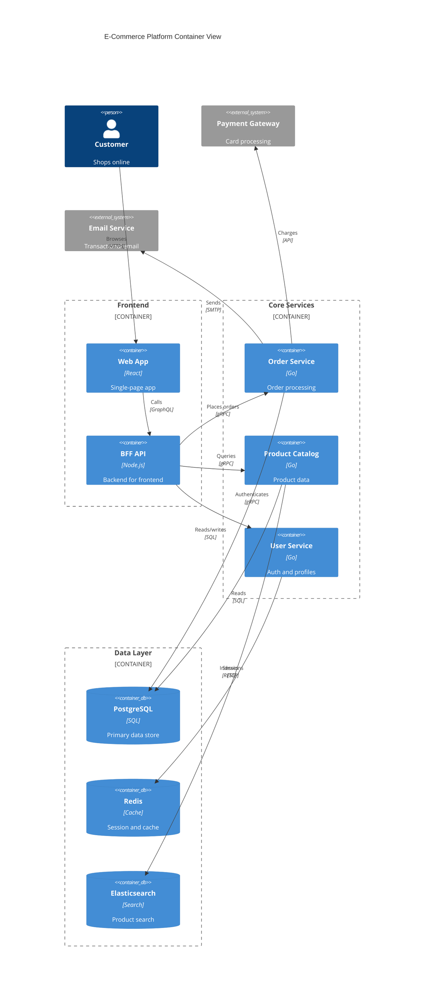
```mermaid
C4Container
    accTitle: E-Commerce Platform Container View
    accDescr: C4 container diagram showing web and mobile frontends, core backend services, and data stores with external payment and email dependencies

    Person(customer, "Customer", "Shops online")

    Container_Boundary(frontend, "Frontend") {
        Container(spa, "Web App", "React", "Single-page app")
        Container(bff, "BFF API", "Node.js", "Backend for frontend")
    }

    Container_Boundary(services, "Core Services") {
        Container(order_svc, "Order Service", "Go", "Order processing")
        Container(catalog_svc, "Product Catalog", "Go", "Product data")
        Container(user_svc, "User Service", "Go", "Auth and profiles")
    }

    Container_Boundary(data, "Data Layer") {
        ContainerDb(pg, "PostgreSQL", "SQL", "Primary data store")
        ContainerDb(redis, "Redis", "Cache", "Session and cache")
        ContainerDb(search, "Elasticsearch", "Search", "Product search")
    }

    System_Ext(payment_gw, "Payment Gateway", "Card processing")
    System_Ext(email_svc, "Email Service", "Transactional email")

    Rel(customer, spa, "Browses", "HTTPS")
    Rel(spa, bff, "Calls", "GraphQL")
    Rel(bff, order_svc, "Places orders", "gRPC")
    Rel(bff, catalog_svc, "Queries", "gRPC")
    Rel(bff, user_svc, "Authenticates", "gRPC")
    Rel(order_svc, pg, "Reads/writes", "SQL")
    Rel(order_svc, payment_gw, "Charges", "API")
    Rel(order_svc, email_svc, "Sends", "SMTP")
    Rel(catalog_svc, search, "Indexes", "REST")
    Rel(user_svc, redis, "Sessions", "TCP")
    Rel(catalog_svc, pg, "Reads", "SQL")

    UpdateRelStyle(customer, spa, $offsetY="-40", $offsetX="-50")
    UpdateRelStyle(spa, bff, $offsetY="-30", $offsetX="10")
    UpdateRelStyle(bff, order_svc, $offsetY="-30", $offsetX="-40")
    UpdateRelStyle(bff, catalog_svc, $offsetY="-30", $offsetX="10")
    UpdateRelStyle(bff, user_svc, $offsetY="-30", $offsetX="50")
    UpdateRelStyle(order_svc, pg, $offsetY="-30", $offsetX="-50")
    UpdateRelStyle(order_svc, payment_gw, $offsetY="-30", $offsetX="10")
    UpdateRelStyle(order_svc, email_svc, $offsetY="10", $offsetX="10")
    UpdateRelStyle(catalog_svc, search, $offsetY="-30", $offsetX="10")
    UpdateRelStyle(user_svc, redis, $offsetY="-30", $offsetX="10")
    UpdateRelStyle(catalog_svc, pg, $offsetY="10", $offsetX="30")
```

### Why this works

- **Container_Boundary groups map to deployment units** — frontend, core services, and data layer each correspond to real infrastructure boundaries (CDN, Kubernetes namespace, managed databases)
- **Every `Rel` has `UpdateRelStyle`** — C4's auto-layout stacks labels on top of each other by default. Offset every relationship to prevent overlaps, even if it seems fine at first (adding elements later will shift things)
- **Descriptions are kept to 1-3 words** — "Card processing", "Session and cache", "Auth and profiles". Long descriptions are the #1 cause of C4 rendering issues
- **Container types are semantic** — `ContainerDb` for databases gives them the cylinder icon, `Container` for services. The C4 renderer provides its own visual differentiation

### `references/diagrams/class.md`

<!-- Source: https://github.com/SuperiorByteWorks-LLC/agent-project | License: Apache-2.0 | Author: Clayton Young / Superior Byte Works, LLC (Boreal Bytes) -->

# Class Diagram

> **Back to [Style Guide](../mermaid_style_guide.md)** — Read the style guide first for emoji, color, and accessibility rules.

**Syntax keyword:** `classDiagram`
**Best for:** Object-oriented design, type hierarchies, interface contracts, domain models
**When NOT to use:** Database schemas (use [ER](er.md)), runtime behavior (use [Sequence](sequence.md))

---

## Exemplar Diagram

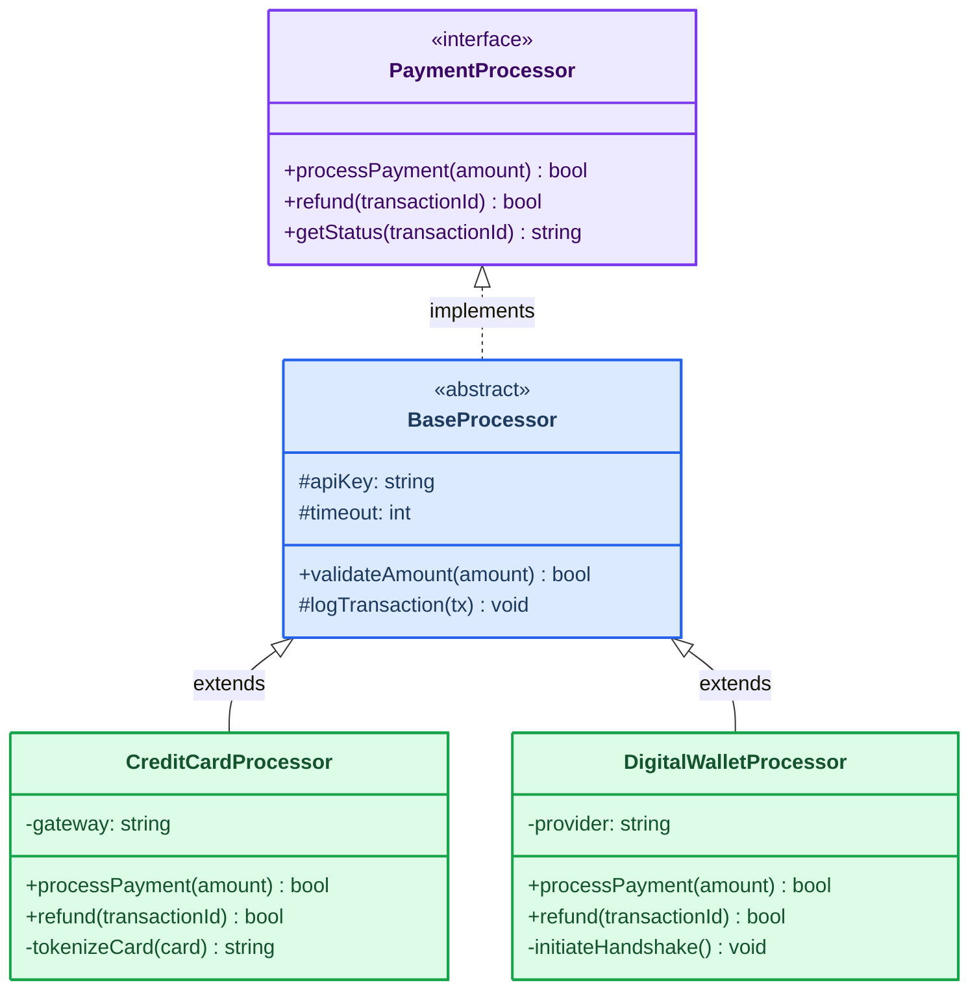
```mermaid
classDiagram
    accTitle: Payment Processing Class Hierarchy
    accDescr: Interface and abstract base class with two concrete implementations for credit card and digital wallet payment processing

    class PaymentProcessor {
        <<interface>>
        +processPayment(amount) bool
        +refund(transactionId) bool
        +getStatus(transactionId) string
    }

    class BaseProcessor {
        <<abstract>>
        #apiKey: string
        #timeout: int
        +validateAmount(amount) bool
        #logTransaction(tx) void
    }

    class CreditCardProcessor {
        -gateway: string
        +processPayment(amount) bool
        +refund(transactionId) bool
        -tokenizeCard(card) string
    }

    class DigitalWalletProcessor {
        -provider: string
        +processPayment(amount) bool
        +refund(transactionId) bool
        -initiateHandshake() void
    }

    PaymentProcessor <|.. BaseProcessor : implements
    BaseProcessor <|-- CreditCardProcessor : extends
    BaseProcessor <|-- DigitalWalletProcessor : extends

    style PaymentProcessor fill:#ede9fe,stroke:#7c3aed,stroke-width:2px,color:#3b0764
    style BaseProcessor fill:#dbeafe,stroke:#2563eb,stroke-width:2px,color:#1e3a5f
    style CreditCardProcessor fill:#dcfce7,stroke:#16a34a,stroke-width:2px,color:#14532d
    style DigitalWalletProcessor fill:#dcfce7,stroke:#16a34a,stroke-width:2px,color:#14532d
```

---

## Tips

- Use `<<interface>>` and `<<abstract>>` stereotypes for clarity
- Show visibility: `+` public, `-` private, `#` protected
- Keep to **4–6 classes** per diagram — split larger hierarchies
- Use `style ClassName fill:...,stroke:...,color:...` for light semantic coloring:
  - 🟣 Purple for interfaces/abstractions
  - 🔵 Blue for base/abstract classes
  - 🟢 Green for concrete implementations
- Relationship arrows:
  - `<|--` inheritance (extends)
  - `<|..` implementation (implements)
  - `*--` composition · `o--` aggregation · `-->` dependency

---

## Template

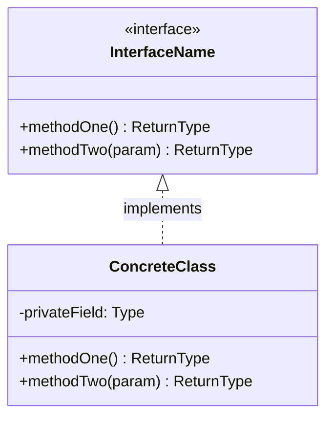
```mermaid
classDiagram
    accTitle: Your Title Here
    accDescr: Describe the class hierarchy and the key relationships between types

    class InterfaceName {
        <<interface>>
        +methodOne() ReturnType
        +methodTwo(param) ReturnType
    }

    class ConcreteClass {
        -privateField: Type
        +methodOne() ReturnType
        +methodTwo(param) ReturnType
    }

    InterfaceName <|.. ConcreteClass : implements
```

---

## Complex Example

An event-driven notification platform with 11 classes organized into 3 `namespace` groups — core orchestration, delivery channels, and data models. Shows interface implementation, composition, and dependency relationships across layers.

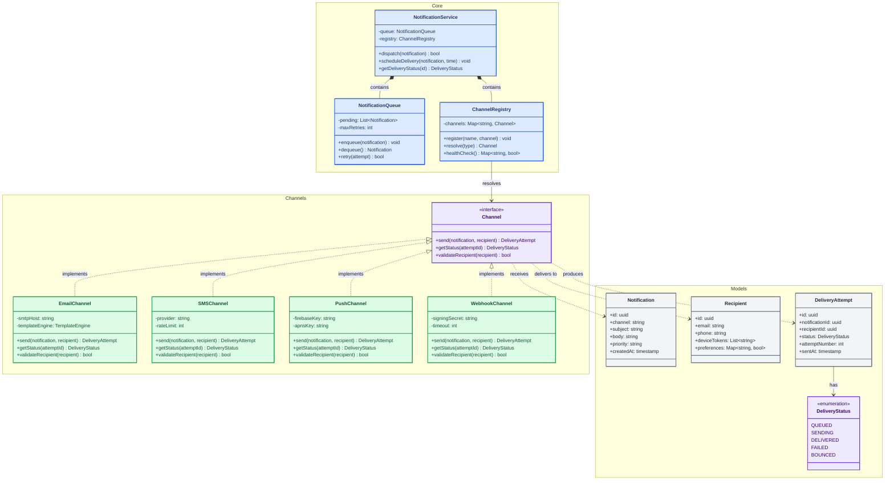
```mermaid
classDiagram
    accTitle: Event-Driven Notification Platform
    accDescr: Multi-namespace class hierarchy for a notification system showing core orchestration, four delivery channel implementations, and supporting data models with composition and dependency relationships

    namespace Core {
        class NotificationService {
            -queue: NotificationQueue
            -registry: ChannelRegistry
            +dispatch(notification) bool
            +scheduleDelivery(notification, time) void
            +getDeliveryStatus(id) DeliveryStatus
        }

        class NotificationQueue {
            -pending: List~Notification~
            -maxRetries: int
            +enqueue(notification) void
            +dequeue() Notification
            +retry(attempt) bool
        }

        class ChannelRegistry {
            -channels: Map~string, Channel~
            +register(name, channel) void
            +resolve(type) Channel
            +healthCheck() Map~string, bool~
        }
    }

    namespace Channels {
        class Channel {
            <<interface>>
            +send(notification, recipient) DeliveryAttempt
            +getStatus(attemptId) DeliveryStatus
            +validateRecipient(recipient) bool
        }

        class EmailChannel {
            -smtpHost: string
            -templateEngine: TemplateEngine
            +send(notification, recipient) DeliveryAttempt
            +getStatus(attemptId) DeliveryStatus
            +validateRecipient(recipient) bool
        }

        class SMSChannel {
            -provider: string
            -rateLimit: int
            +send(notification, recipient) DeliveryAttempt
            +getStatus(attemptId) DeliveryStatus
            +validateRecipient(recipient) bool
        }

        class PushChannel {
            -firebaseKey: string
            -apnsKey: string
            +send(notification, recipient) DeliveryAttempt
            +getStatus(attemptId) DeliveryStatus
            +validateRecipient(recipient) bool
        }

        class WebhookChannel {
            -signingSecret: string
            -timeout: int
            +send(notification, recipient) DeliveryAttempt
            +getStatus(attemptId) DeliveryStatus
            +validateRecipient(recipient) bool
        }
    }

    namespace Models {
        class Notification {
            +id: uuid
            +channel: string
            +subject: string
            +body: string
            +priority: string
            +createdAt: timestamp
        }

        class Recipient {
            +id: uuid
            +email: string
            +phone: string
            +deviceTokens: List~string~
            +preferences: Map~string, bool~
        }

        class DeliveryAttempt {
            +id: uuid
            +notificationId: uuid
            +recipientId: uuid
            +status: DeliveryStatus
            +attemptNumber: int
            +sentAt: timestamp
        }

        class DeliveryStatus {
            <<enumeration>>
            QUEUED
            SENDING
            DELIVERED
            FAILED
            BOUNCED
        }
    }

    NotificationService *-- NotificationQueue : contains
    NotificationService *-- ChannelRegistry : contains
    ChannelRegistry --> Channel : resolves

    Channel <|.. EmailChannel : implements
    Channel <|.. SMSChannel : implements
    Channel <|.. PushChannel : implements
    Channel <|.. WebhookChannel : implements

    Channel ..> Notification : receives
    Channel ..> Recipient : delivers to
    Channel ..> DeliveryAttempt : produces

    DeliveryAttempt --> DeliveryStatus : has

    style Channel fill:#ede9fe,stroke:#7c3aed,stroke-width:2px,color:#3b0764
    style DeliveryStatus fill:#ede9fe,stroke:#7c3aed,stroke-width:2px,color:#3b0764
    style NotificationService fill:#dbeafe,stroke:#2563eb,stroke-width:2px,color:#1e3a5f
    style NotificationQueue fill:#dbeafe,stroke:#2563eb,stroke-width:2px,color:#1e3a5f
    style ChannelRegistry fill:#dbeafe,stroke:#2563eb,stroke-width:2px,color:#1e3a5f
    style EmailChannel fill:#dcfce7,stroke:#16a34a,stroke-width:2px,color:#14532d
    style SMSChannel fill:#dcfce7,stroke:#16a34a,stroke-width:2px,color:#14532d
    style PushChannel fill:#dcfce7,stroke:#16a34a,stroke-width:2px,color:#14532d
    style WebhookChannel fill:#dcfce7,stroke:#16a34a,stroke-width:2px,color:#14532d
    style Notification fill:#f3f4f6,stroke:#6b7280,stroke-width:2px,color:#1f2937
    style Recipient fill:#f3f4f6,stroke:#6b7280,stroke-width:2px,color:#1f2937
    style DeliveryAttempt fill:#f3f4f6,stroke:#6b7280,stroke-width:2px,color:#1f2937
```

### Why this works

- **3 namespaces mirror architectural layers** — Core (orchestration), Channels (delivery implementations), Models (data). A developer can scan one namespace without reading the others.
- **Color encodes the role** — purple for interfaces/enums, blue for core services, green for concrete implementations, gray for data models. The pattern is instantly recognizable.
- **Relationship types are deliberate** — composition (`*--`) for "owns and manages", implementation (`<|..`) for "fulfills contract", dependency (`..>`) for "uses at runtime". Each arrow type carries meaning.

### `references/diagrams/complex_examples.md`

<!-- Source: https://github.com/SuperiorByteWorks-LLC/agent-project | License: Apache-2.0 | Author: Clayton Young / Superior Byte Works, LLC (Boreal Bytes) -->

# Composing Complex Diagram Sets

> **Back to [Style Guide](../mermaid_style_guide.md)** — This file covers how to combine multiple diagram types to document complex systems comprehensively.

**Purpose:** A single diagram captures a single perspective. Real documentation often needs multiple diagram types working together — an overview flowchart linked to a detailed sequence diagram, an ER schema paired with a state machine showing entity lifecycle, a Gantt timeline complemented by architecture before/after views. This file teaches you when and how to compose diagrams for maximum clarity.

---

## When to Compose Multiple Diagrams

| What you're documenting  | Diagram combination                                                              | Why it works                                                                        |
| ------------------------ | -------------------------------------------------------------------------------- | ----------------------------------------------------------------------------------- |
| Full system architecture | C4 Context + Architecture + Sequence (key flows)                                 | Context for stakeholders, infrastructure for ops, sequences for developers          |
| API design documentation | ER (data model) + Sequence (request flows) + State (entity lifecycle)            | Schema for the database team, interactions for backend, states for business logic   |
| Feature specification    | Flowchart (happy path) + Sequence (service interactions) + User Journey (UX)     | Process for PM, implementation for engineers, experience for design                 |
| Migration project        | Gantt (timeline) + Architecture (before/after) + Flowchart (migration process)   | Schedule for leadership, topology for infra, steps for the migration team           |
| Onboarding documentation | User Journey + Flowchart (setup steps) + Sequence (first API call)               | Experience map for product, checklist for new hires, technical walkthrough for devs |
| Incident response        | State (alert lifecycle) + Sequence (escalation flow) + Flowchart (decision tree) | Status tracking for on-call, communication for management, triage for responders    |

---

## Pattern 1: Overview + Detail

**When to use:** You need both the big picture AND the specifics. Leadership sees the overview; engineers drill into the detail.

The overview diagram shows high-level phases or components. One or more detail diagrams zoom into specific phases showing the internal interactions.

### Overview — Release Pipeline

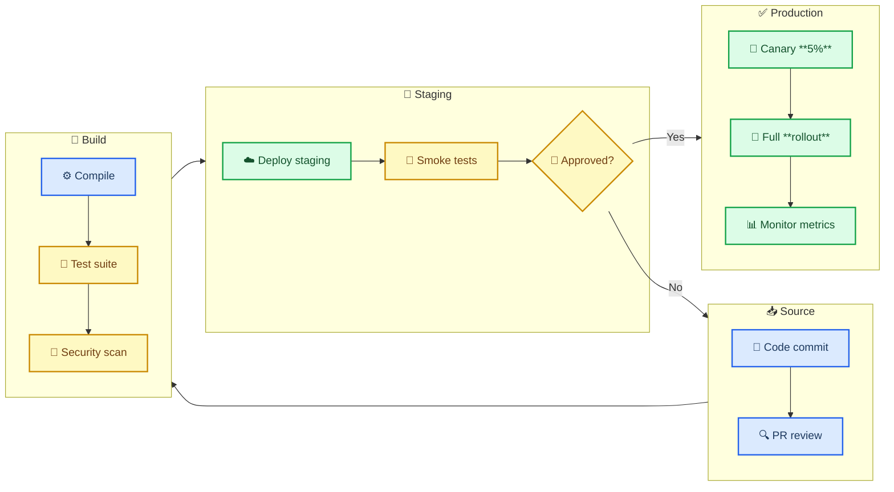
```mermaid
flowchart LR
    accTitle: Release Pipeline Overview
    accDescr: High-level four-phase release pipeline from code commit through build, staging, and production deployment

    subgraph source ["📥 Source"]
        commit[📝 Code commit] --> pr_review[🔍 PR review]
    end

    subgraph build ["🔧 Build"]
        compile[⚙️ Compile] --> test[🧪 Test suite]
        test --> scan[🔐 Security scan]
    end

    subgraph staging ["🚀 Staging"]
        deploy_stg[☁️ Deploy staging] --> smoke[🧪 Smoke tests]
        smoke --> approval{👤 Approved?}
    end

    subgraph production ["✅ Production"]
        canary[🚀 Canary **5%**] --> rollout[🚀 Full **rollout**]
        rollout --> monitor[📊 Monitor metrics]
    end

    source --> build
    build --> staging
    approval -->|Yes| production
    approval -->|No| source

    classDef phase_start fill:#dbeafe,stroke:#2563eb,stroke-width:2px,color:#1e3a5f
    classDef phase_test fill:#fef9c3,stroke:#ca8a04,stroke-width:2px,color:#713f12
    classDef phase_deploy fill:#dcfce7,stroke:#16a34a,stroke-width:2px,color:#14532d

    class commit,pr_review,compile phase_start
    class test,scan,smoke,approval phase_test
    class deploy_stg,canary,rollout,monitor phase_deploy
```

_The production deployment phase involves multiple service interactions. See the detail sequence below for the canary rollout process._

### Detail — Canary Deployment Sequence

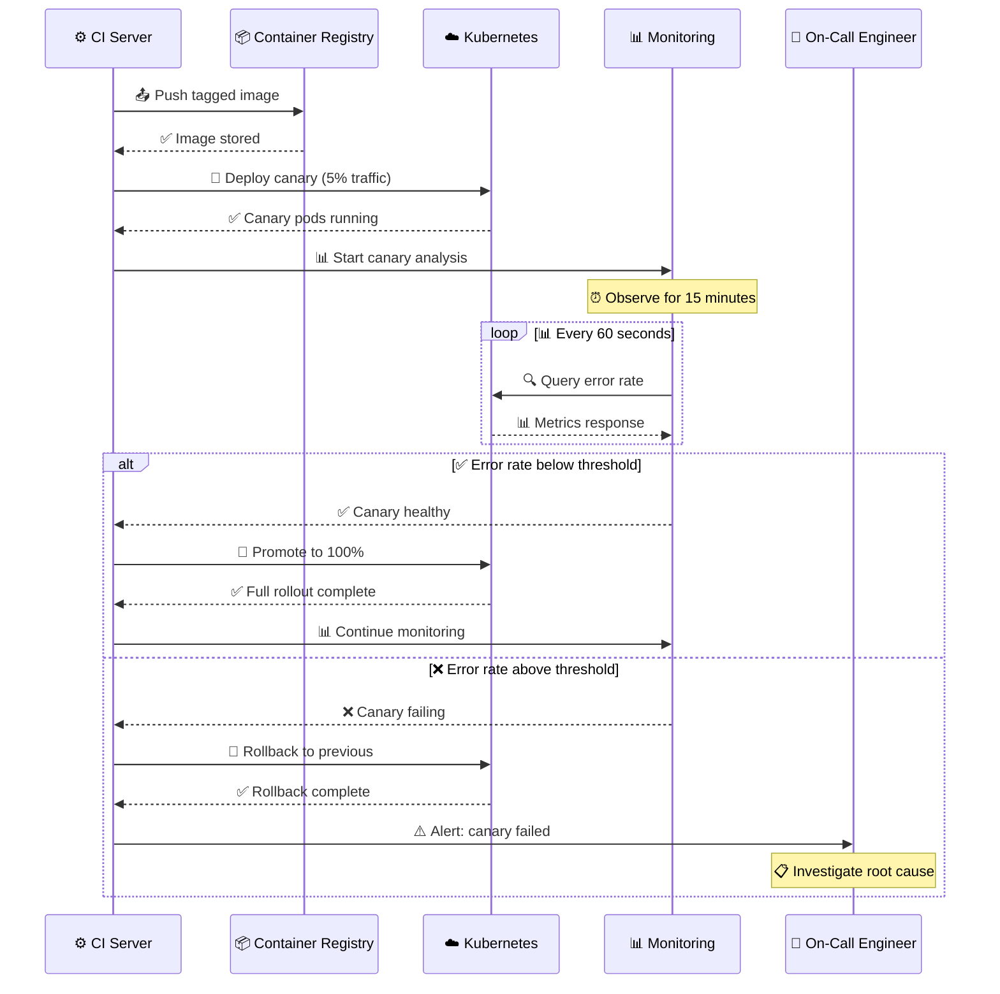
```mermaid
sequenceDiagram
    accTitle: Canary Deployment Service Interactions
    accDescr: Detailed sequence showing how the CI server orchestrates a canary deployment through the container registry, Kubernetes cluster, and monitoring stack with automated rollback on failure

    participant ci as ⚙️ CI Server
    participant registry as 📦 Container Registry
    participant k8s as ☁️ Kubernetes
    participant monitor as 📊 Monitoring
    participant oncall as 👤 On-Call Engineer

    ci->>registry: 📤 Push tagged image
    registry-->>ci: ✅ Image stored

    ci->>k8s: 🚀 Deploy canary (5% traffic)
    k8s-->>ci: ✅ Canary pods running

    ci->>monitor: 📊 Start canary analysis
    Note over monitor: ⏰ Observe for 15 minutes

    loop 📊 Every 60 seconds
        monitor->>k8s: 🔍 Query error rate
        k8s-->>monitor: 📊 Metrics response
    end

    alt ✅ Error rate below threshold
        monitor-->>ci: ✅ Canary healthy
        ci->>k8s: 🚀 Promote to 100%
        k8s-->>ci: ✅ Full rollout complete
        ci->>monitor: 📊 Continue monitoring
    else ❌ Error rate above threshold
        monitor-->>ci: ❌ Canary failing
        ci->>k8s: 🔄 Rollback to previous
        k8s-->>ci: ✅ Rollback complete
        ci->>oncall: ⚠️ Alert: canary failed
        Note over oncall: 📋 Investigate root cause
    end
```

### How these connect

- The **overview flowchart** shows the full pipeline with subgraph-to-subgraph connections — leadership reads this to understand the release process
- The **detail sequence** zooms into "Canary 5% → Full rollout" from the Production subgraph, showing the actual service interactions an engineer would debug
- **Naming is consistent** — "Canary" and "Monitor metrics" appear in both diagrams, creating a clear bridge between overview and detail

---

## Pattern 2: Multi-Perspective Documentation

**When to use:** The same system needs to be documented for different audiences — database teams, backend engineers, and product managers each need a different view of the same feature.

This example documents a **User Authentication** feature from three perspectives.

### Data Model — for database team

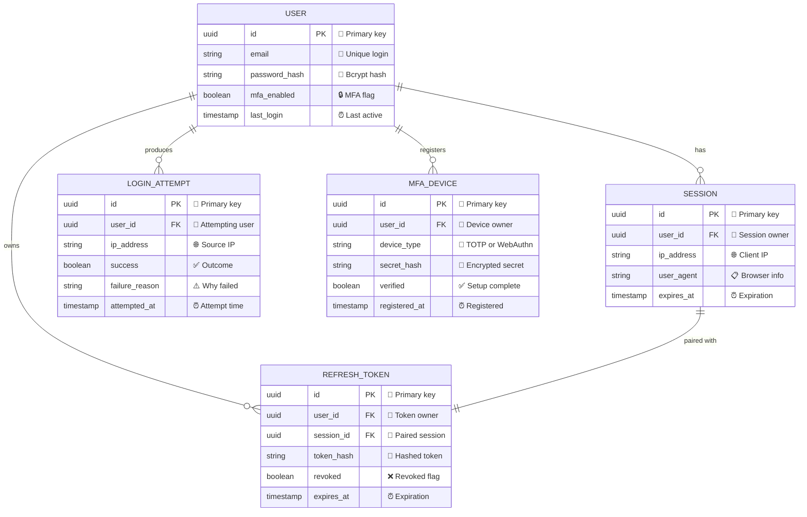
```mermaid
erDiagram
    accTitle: Authentication Data Model
    accDescr: Five-entity schema for user authentication covering users, sessions, refresh tokens, login attempts, and MFA devices with cardinality relationships

    USER ||--o{ SESSION : "has"
    USER ||--o{ REFRESH_TOKEN : "owns"
    USER ||--o{ LOGIN_ATTEMPT : "produces"
    USER ||--o{ MFA_DEVICE : "registers"
    SESSION ||--|| REFRESH_TOKEN : "paired with"

    USER {
        uuid id PK "🔑 Primary key"
        string email "📧 Unique login"
        string password_hash "🔐 Bcrypt hash"
        boolean mfa_enabled "🔒 MFA flag"
        timestamp last_login "⏰ Last active"
    }

    SESSION {
        uuid id PK "🔑 Primary key"
        uuid user_id FK "👤 Session owner"
        string ip_address "🌐 Client IP"
        string user_agent "📋 Browser info"
        timestamp expires_at "⏰ Expiration"
    }

    REFRESH_TOKEN {
        uuid id PK "🔑 Primary key"
        uuid user_id FK "👤 Token owner"
        uuid session_id FK "🔗 Paired session"
        string token_hash "🔐 Hashed token"
        boolean revoked "❌ Revoked flag"
        timestamp expires_at "⏰ Expiration"
    }

    LOGIN_ATTEMPT {
        uuid id PK "🔑 Primary key"
        uuid user_id FK "👤 Attempting user"
        string ip_address "🌐 Source IP"
        boolean success "✅ Outcome"
        string failure_reason "⚠️ Why failed"
        timestamp attempted_at "⏰ Attempt time"
    }

    MFA_DEVICE {
        uuid id PK "🔑 Primary key"
        uuid user_id FK "👤 Device owner"
        string device_type "📱 TOTP or WebAuthn"
        string secret_hash "🔐 Encrypted secret"
        boolean verified "✅ Setup complete"
        timestamp registered_at "⏰ Registered"
    }
```

### Authentication Flow — for backend team

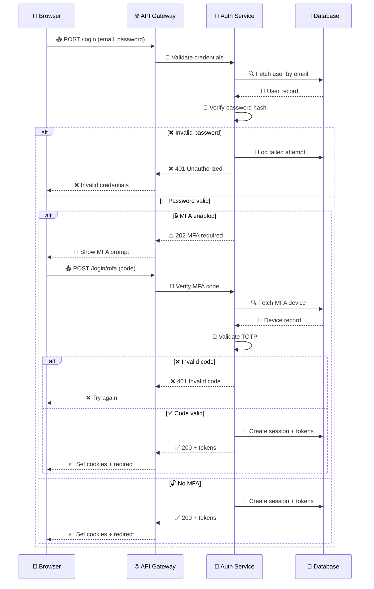
```mermaid
sequenceDiagram
    accTitle: Login Flow with MFA
    accDescr: Step-by-step authentication sequence showing credential validation, conditional MFA challenge, token issuance, and failure handling between browser, API, auth service, and database

    participant B as 👤 Browser
    participant API as 🌐 API Gateway
    participant Auth as 🔐 Auth Service
    participant DB as 💾 Database

    B->>API: 📤 POST /login (email, password)
    API->>Auth: 🔐 Validate credentials
    Auth->>DB: 🔍 Fetch user by email
    DB-->>Auth: 👤 User record

    Auth->>Auth: 🔐 Verify password hash

    alt ❌ Invalid password
        Auth->>DB: 📝 Log failed attempt
        Auth-->>API: ❌ 401 Unauthorized
        API-->>B: ❌ Invalid credentials
    else ✅ Password valid
        alt 🔒 MFA enabled
            Auth-->>API: ⚠️ 202 MFA required
            API-->>B: 📱 Show MFA prompt

            B->>API: 📤 POST /login/mfa (code)
            API->>Auth: 🔐 Verify MFA code
            Auth->>DB: 🔍 Fetch MFA device
            DB-->>Auth: 📱 Device record
            Auth->>Auth: 🔐 Validate TOTP

            alt ❌ Invalid code
                Auth-->>API: ❌ 401 Invalid code
                API-->>B: ❌ Try again
            else ✅ Code valid
                Auth->>DB: 📝 Create session + tokens
                Auth-->>API: ✅ 200 + tokens
                API-->>B: ✅ Set cookies + redirect
            end
        else 🔓 No MFA
            Auth->>DB: 📝 Create session + tokens
            Auth-->>API: ✅ 200 + tokens
            API-->>B: ✅ Set cookies + redirect
        end
    end
```

### Login Experience — for product team

```mermaid
journey
    accTitle: Login Experience Journey Map
    accDescr: User satisfaction scores across the sign-in experience for password-only users and MFA users showing friction points in the multi-factor flow

    title 👤 Login Experience
    section 🔐 Sign In
        Navigate to login          : 4 : User
        Enter email and password   : 3 : User
        Click sign in button       : 4 : User
    section 📱 MFA Challenge
        Receive MFA prompt         : 3 : MFA User
        Open authenticator app     : 2 : MFA User
        Enter 6-digit code         : 2 : MFA User
        Handle expired code        : 1 : MFA User
    section ✅ Post-Login
        Land on dashboard          : 5 : User
        See personalized content   : 5 : User
        Resume previous session    : 4 : User
```

### How these connect

- **Same entities, different views** — "User", "Session", "MFA Device" appear in the ER diagram as tables, in the sequence as participants/operations, and in the journey as experience touchpoints
- **Each audience gets actionable information** — the DB team sees indexes and cardinality, the backend team sees API contracts and error codes, the product team sees satisfaction scores and friction points
- **The journey reveals what the sequence hides** — the sequence diagram shows MFA as a clean conditional branch, but the journey map shows it's actually the worst part of the UX (scores 1-2). This drives the product decision to invest in WebAuthn/passkeys

---

## Pattern 3: Before/After Architecture

**When to use:** Migration documentation where stakeholders need to see the current state, the target state, and understand the transformation.

### Current State — Monolith

```mermaid
flowchart TB
    accTitle: Current State Monolith Architecture
    accDescr: Single Rails monolith handling all traffic through one server connected to one database showing the scaling bottleneck

    client([👤 All traffic]) --> mono[🖥️ Rails **Monolith**]
    mono --> db[(💾 Single PostgreSQL)]
    mono --> jobs[⏰ Background **jobs**]
    jobs --> db

    classDef bottleneck fill:#fee2e2,stroke:#dc2626,stroke-width:2px,color:#7f1d1d
    classDef neutral fill:#f3f4f6,stroke:#6b7280,stroke-width:2px,color:#1f2937

    class mono,db bottleneck
    class client,jobs neutral
```

> ⚠️ **Problem:** Single database is the bottleneck. Monolith can't scale horizontally. Deploy = full restart.

### Target State — Microservices

```mermaid
flowchart TB
    accTitle: Target State Microservices Architecture
    accDescr: Decomposed microservices architecture with API gateway routing to independent services each with their own data store and a shared message queue for async communication

    client([👤 All traffic]) --> gw[🌐 API **Gateway**]

    subgraph services ["⚙️ Services"]
        user_svc[👤 User Service]
        order_svc[📋 Order Service]
        product_svc[📦 Product Service]
    end

    subgraph data ["💾 Data Stores"]
        user_db[(💾 Users DB)]
        order_db[(💾 Orders DB)]
        product_db[(💾 Products DB)]
    end

    gw --> user_svc
    gw --> order_svc
    gw --> product_svc

    user_svc --> user_db
    order_svc --> order_db
    product_svc --> product_db

    order_svc --> mq[📥 Message Queue]
    mq --> user_svc
    mq --> product_svc

    classDef gateway fill:#ede9fe,stroke:#7c3aed,stroke-width:2px,color:#3b0764
    classDef service fill:#dbeafe,stroke:#2563eb,stroke-width:2px,color:#1e3a5f
    classDef datastore fill:#dcfce7,stroke:#16a34a,stroke-width:2px,color:#14532d
    classDef infra fill:#fef9c3,stroke:#ca8a04,stroke-width:2px,color:#713f12

    class gw gateway
    class user_svc,order_svc,product_svc service
    class user_db,order_db,product_db datastore
    class mq infra
```

> ✅ **Result:** Each service scales independently. Database-per-service eliminates the shared bottleneck. Async messaging decouples service dependencies.

### How these connect

- **Same layout, different complexity** — both diagrams use `flowchart TB` so the structural transformation is visually obvious. The monolith is 4 nodes; the target is 11 nodes with subgraphs.
- **Color tells the story** — the monolith uses red (danger) on the bottleneck components. The target uses blue/green/purple to show healthy, differentiated components.
- **Prose bridges the diagrams** — the ⚠️ problem callout and ✅ result callout explain _why_ the architecture changes, not just _what_ changed.

---

## Linking Diagrams in Documentation

When composing diagrams in a real document, follow these practices:

| Practice                     | Example                                                                                                                             |
| ---------------------------- | ----------------------------------------------------------------------------------------------------------------------------------- |
| **Use headers as anchors**   | `See [Authentication Flow](#authentication-flow-for-backend-team) for the full login sequence`                                      |
| **Reference specific nodes** | "The **API Gateway** from the overview connects to the services detailed below"                                                     |
| **Consistent naming**        | Same entity = same name in every diagram (User Service, not "User Svc" in one and "Users API" in another)                           |
| **Adjacent placement**       | Keep related diagrams in consecutive sections, not scattered across the document                                                    |
| **Bridging prose**           | One sentence between diagrams explaining how they connect: "The sequence below zooms into the Deploy phase from the pipeline above" |
| **Audience labels**          | Mark sections: "### Data Model — _for database team_" so readers skip to their view                                                 |

---

## Choosing Your Composition Strategy

```mermaid
flowchart TB
    accTitle: Diagram Composition Decision Tree
    accDescr: Decision flowchart for choosing between single diagram, overview plus detail, multi-perspective, or before-after composition strategies based on audience and documentation needs

    start([📋 What are you documenting?]) --> audience{👥 Multiple audiences?}

    audience -->|Yes| perspectives[📐 Multi-Perspective]
    audience -->|No| depth{📏 Need both summary and detail?}

    depth -->|Yes| overview[🔍 Overview + Detail]
    depth -->|No| change{🔄 Showing a change over time?}

    change -->|Yes| before_after[⚡ Before / After]
    change -->|No| single[📊 Single diagram is fine]

    classDef decision fill:#fef9c3,stroke:#ca8a04,stroke-width:2px,color:#713f12
    classDef result fill:#dbeafe,stroke:#2563eb,stroke-width:2px,color:#1e3a5f
    classDef start_style fill:#ede9fe,stroke:#7c3aed,stroke-width:2px,color:#3b0764

    class audience,depth,change decision
    class perspectives,overview,before_after,single result
    class start start_style
```

### `references/diagrams/er.md`

<!-- Source: https://github.com/SuperiorByteWorks-LLC/agent-project | License: Apache-2.0 | Author: Clayton Young / Superior Byte Works, LLC (Boreal Bytes) -->

# Entity Relationship (ER) Diagram

> **Back to [Style Guide](../mermaid_style_guide.md)** — Read the style guide first for emoji, color, and accessibility rules.

**Syntax keyword:** `erDiagram`
**Best for:** Database schemas, data models, entity relationships, API data structures
**When NOT to use:** Class hierarchies with methods (use [Class](class.md)), process flows (use [Flowchart](flowchart.md))

---

## Exemplar Diagram

```mermaid
erDiagram
    accTitle: Project Management Data Model
    accDescr: Entity relationships for a project management system showing teams, projects, tasks, members, and comments with cardinality

    TEAM ||--o{ PROJECT : "owns"
    PROJECT ||--o{ TASK : "contains"
    TASK ||--o{ COMMENT : "has"
    TEAM ||--o{ MEMBER : "includes"
    MEMBER ||--o{ TASK : "assigned to"
    MEMBER ||--o{ COMMENT : "writes"

    TEAM {
        uuid id PK "🔑 Primary key"
        string name "👥 Team name"
        string department "🏢 Department"
    }

    PROJECT {
        uuid id PK "🔑 Primary key"
        uuid team_id FK "🔗 Team reference"
        string title "📋 Project title"
        string status "📊 Current status"
        date deadline "⏰ Due date"
    }

    TASK {
        uuid id PK "🔑 Primary key"
        uuid project_id FK "🔗 Project reference"
        uuid assignee_id FK "👤 Assigned member"
        string title "📝 Task title"
        string priority "⚠️ Priority level"
        string status "📊 Current status"
    }

    MEMBER {
        uuid id PK "🔑 Primary key"
        uuid team_id FK "🔗 Team reference"
        string name "👤 Full name"
        string email "📧 Email address"
        string role "🏷️ Job role"
    }

    COMMENT {
        uuid id PK "🔑 Primary key"
        uuid task_id FK "🔗 Task reference"
        uuid author_id FK "👤 Author reference"
        text body "📝 Comment text"
        timestamp created_at "⏰ Created time"
    }
```

---

## Tips

- Include data types, `PK`/`FK` annotations, and **comment strings** with emoji for context
- Use clear verb-phrase relationship labels: `"owns"`, `"contains"`, `"assigned to"`
- Cardinality notation:
  - `||--o{` one-to-many
  - `||--||` one-to-one
  - `}o--o{` many-to-many
  - `o` = zero or more, `|` = exactly one
- Limit to **5–7 entities** per diagram — split large schemas by domain
- Entity names: `UPPER_CASE` (SQL convention)

---

## Template

```mermaid
erDiagram
    accTitle: Your Title Here
    accDescr: Describe the data model and key relationships between entities

    ENTITY_A ||--o{ ENTITY_B : "has many"
    ENTITY_B ||--|| ENTITY_C : "belongs to"

    ENTITY_A {
        uuid id PK "🔑 Primary key"
        string name "📝 Display name"
    }

    ENTITY_B {
        uuid id PK "🔑 Primary key"
        uuid entity_a_id FK "🔗 Reference"
        string value "📊 Value field"
    }
```

---

## Complex Example

A multi-tenant SaaS platform schema with 10 entities spanning three domains — identity & access, billing & subscriptions, and audit & security. Relationships show the full cardinality picture from tenant isolation through user permissions to invoice generation.

```mermaid
erDiagram
    accTitle: SaaS Multi-Tenant Platform Schema
    accDescr: Ten-entity data model for a multi-tenant SaaS platform covering identity management, role-based access, subscription billing, and audit logging with full cardinality relationships

    TENANT ||--o{ ORGANIZATION : "contains"
    ORGANIZATION ||--o{ USER : "employs"
    ORGANIZATION ||--|| SUBSCRIPTION : "holds"
    USER }o--o{ ROLE : "assigned"
    ROLE ||--o{ PERMISSION : "grants"
    SUBSCRIPTION ||--|| PLAN : "subscribes to"
    SUBSCRIPTION ||--o{ INVOICE : "generates"
    USER ||--o{ AUDIT_LOG : "produces"
    TENANT ||--o{ AUDIT_LOG : "scoped to"
    USER ||--o{ API_KEY : "owns"

    TENANT {
        uuid id PK "🔑 Primary key"
        string name "🏢 Tenant name"
        string subdomain "🌐 Unique subdomain"
        string tier "🏷️ Service tier"
        boolean active "✅ Active status"
        timestamp created_at "⏰ Created time"
    }

    ORGANIZATION {
        uuid id PK "🔑 Primary key"
        uuid tenant_id FK "🔗 Tenant reference"
        string name "👥 Org name"
        string billing_email "📧 Billing contact"
        int seat_count "📊 Licensed seats"
    }

    USER {
        uuid id PK "🔑 Primary key"
        uuid org_id FK "🔗 Organization reference"
        string email "📧 Login email"
        string display_name "👤 Display name"
        string status "📊 Account status"
        timestamp last_login "⏰ Last active"
    }

    ROLE {
        uuid id PK "🔑 Primary key"
        uuid tenant_id FK "🔗 Tenant scope"
        string name "🏷️ Role name"
        string description "📝 Role purpose"
        boolean system_role "🔒 Built-in flag"
    }

    PERMISSION {
        uuid id PK "🔑 Primary key"
        uuid role_id FK "🔗 Role reference"
        string resource "🎯 Target resource"
        string action "⚙️ Allowed action"
        string scope "🔒 Permission scope"
    }

    PLAN {
        uuid id PK "🔑 Primary key"
        string name "🏷️ Plan name"
        int price_cents "💰 Monthly price"
        int seat_limit "👥 Max seats"
        jsonb features "📋 Feature flags"
        boolean active "✅ Available flag"
    }

    SUBSCRIPTION {
        uuid id PK "🔑 Primary key"
        uuid org_id FK "🔗 Organization reference"
        uuid plan_id FK "🔗 Plan reference"
        string status "📊 Sub status"
        date current_period_start "📅 Period start"
        date current_period_end "📅 Period end"
    }

    INVOICE {
        uuid id PK "🔑 Primary key"
        uuid subscription_id FK "🔗 Subscription reference"
        int amount_cents "💰 Total amount"
        string currency "💱 Currency code"
        string status "📊 Payment status"
        timestamp issued_at "⏰ Issue date"
    }

    AUDIT_LOG {
        uuid id PK "🔑 Primary key"
        uuid tenant_id FK "🔗 Tenant scope"
        uuid user_id FK "👤 Acting user"
        string action "⚙️ Action performed"
        string resource_type "🎯 Target type"
        uuid resource_id "🔗 Target ID"
        jsonb metadata "📋 Event details"
        timestamp created_at "⏰ Event time"
    }

    API_KEY {
        uuid id PK "🔑 Primary key"
        uuid user_id FK "👤 Owner"
        string prefix "🏷️ Key prefix"
        string hash "🔐 Hashed secret"
        string name "📝 Key name"
        timestamp expires_at "⏰ Expiration"
        boolean revoked "❌ Revoked flag"
    }
```

### Why this works

- **10 entities organized by domain** — identity (Tenant, Organization, User, Role, Permission), billing (Plan, Subscription, Invoice), and security (Audit Log, API Key). The relationship lines naturally cluster related entities together.
- **Full cardinality tells the business rules** — `||--||` (one-to-one) for Organization-Subscription means one subscription per org. `}o--o{` (many-to-many) for User-Role means flexible RBAC. Each relationship symbol encodes a constraint.
- **Every field has type, annotation, and purpose** — PK/FK for schema generation, emoji comments for human scanning. A developer can read this diagram and write the migration script directly.

### `references/diagrams/flowchart.md`

<!-- Source: https://github.com/SuperiorByteWorks-LLC/agent-project | License: Apache-2.0 | Author: Clayton Young / Superior Byte Works, LLC (Boreal Bytes) -->

# Flowchart

> **Back to [Style Guide](../mermaid_style_guide.md)** — Read the style guide first for emoji, color, and accessibility rules.

**Syntax keyword:** `flowchart`
**Best for:** Sequential processes, workflows, decision logic, troubleshooting trees
**When NOT to use:** Complex timing between actors (use [Sequence](sequence.md)), state machines (use [State](state.md))

---

## Exemplar Diagram

```mermaid
flowchart TB
    accTitle: Feature Development Lifecycle
    accDescr: End-to-end feature flow from idea through design, build, test, review, and release with a revision loop on failed reviews

    idea([💡 Feature idea]) --> spec[📋 Write spec]
    spec --> design[🎨 Design solution]
    design --> build[🔧 Implement]
    build --> test[🧪 Run tests]
    test --> review{🔍 Review passed?}
    review -->|Yes| release[🚀 Release to prod]
    review -->|No| revise[✏️ Revise code]
    revise --> test
    release --> monitor([📊 Monitor metrics])

    classDef start fill:#ede9fe,stroke:#7c3aed,stroke-width:2px,color:#3b0764
    classDef process fill:#dbeafe,stroke:#2563eb,stroke-width:2px,color:#1e3a5f
    classDef decision fill:#fef9c3,stroke:#ca8a04,stroke-width:2px,color:#713f12
    classDef success fill:#dcfce7,stroke:#16a34a,stroke-width:2px,color:#14532d

    class idea,monitor start
    class spec,design,build,test,revise process
    class review decision
    class release success
```

---

## Tips

- Use `TB` (top-to-bottom) for processes, `LR` (left-to-right) for pipelines
- Rounded rectangles `([text])` for start/end, diamonds `{text}` for decisions
- Max 10 nodes — split larger flows into "Phase 1" / "Phase 2" diagrams
- Max 3 decision points per diagram
- Edge labels should be 1–4 words: `-->|Yes|`, `-->|All green|`
- Use `classDef` for **semantic** coloring — decisions in amber, success in green, actions in blue

## Subgraph Pattern

When you need grouped stages:

```mermaid
flowchart TB
    accTitle: CI/CD Pipeline Stages
    accDescr: Three-stage pipeline grouping code quality checks, testing, and deployment into distinct phases

    trigger([⚡ Push to main])

    subgraph quality ["🔍 Code Quality"]
        lint[📝 Lint code] --> format[⚙️ Check formatting]
    end

    subgraph testing ["🧪 Testing"]
        unit[🧪 Unit tests] --> integration[🔗 Integration tests]
    end

    subgraph deploy ["🚀 Deployment"]
        build[📦 Build artifacts] --> ship[☁️ Deploy to staging]
    end

    trigger --> quality
    quality --> testing
    testing --> deploy
    deploy --> done([✅ Pipeline complete])

    classDef trigger_style fill:#ede9fe,stroke:#7c3aed,stroke-width:2px,color:#3b0764
    classDef success fill:#dcfce7,stroke:#16a34a,stroke-width:2px,color:#14532d

    class trigger trigger_style
    class done success
```

---

## Template

```mermaid
flowchart TB
    accTitle: Your Title Here (3-8 words)
    accDescr: One or two sentences explaining what this diagram shows and what insight the reader gains

    start([🏁 Starting point]) --> step1[⚙️ First action]
    step1 --> decision{🔍 Check condition?}
    decision -->|Yes| step2[✅ Positive path]
    decision -->|No| step3[🔧 Alternative path]
    step2 --> done([🏁 Complete])
    step3 --> done
```

---

## Complex Example

A 20+ node e-commerce order pipeline organized into 5 subgraphs, each representing a processing phase. Subgraphs connect through internal nodes, decision points route orders to exception handling, and color classes distinguish phases at a glance.

```mermaid
flowchart TB
    accTitle: E-Commerce Order Processing Pipeline
    accDescr: Full order lifecycle from intake through fulfillment, shipping, and notification with exception handling paths for payment failures, stockouts, and delivery issues

    order_in([📥 New order]) --> validate_pay{💰 Payment valid?}

    subgraph intake ["📥 Order Intake"]
        validate_pay -->|Yes| check_fraud{🔐 Fraud check}
        validate_pay -->|No| pay_fail[❌ Payment **declined**]
        check_fraud -->|Clear| check_stock{📦 In stock?}
        check_fraud -->|Flagged| manual_review[🔍 Manual **review**]
        manual_review --> check_stock
    end

    subgraph fulfill ["📦 Fulfillment"]
        pick[📋 **Pick** items] --> pack[📦 Pack order]
        pack --> label[🏷️ Generate **shipping** label]
    end

    subgraph ship ["🚚 Shipping"]
        handoff[🚚 Carrier **handoff**] --> transit[📍 In transit]
        transit --> deliver{✅ Delivered?}
    end

    subgraph notify ["📤 Notifications"]
        confirm_email[📧 Order **confirmed**]
        ship_update[📧 Shipping **update**]
        deliver_email[📧 Delivery **confirmed**]
    end

    subgraph exception ["⚠️ Exception Handling"]
        pay_fail --> retry_pay[🔄 Retry payment]
        retry_pay --> validate_pay
        out_of_stock[📦 **Backorder** created]
        deliver_fail[🔄 **Reattempt** delivery]
    end

    check_stock -->|Yes| pick
    check_stock -->|No| out_of_stock
    label --> handoff
    deliver -->|Yes| deliver_email
    deliver -->|No| deliver_fail
    deliver_fail --> transit

    check_stock -->|Yes| confirm_email
    handoff --> ship_update
    deliver_email --> complete([✅ Order **complete**])

    classDef intake_style fill:#dbeafe,stroke:#2563eb,stroke-width:2px,color:#1e3a5f
    classDef fulfill_style fill:#ede9fe,stroke:#7c3aed,stroke-width:2px,color:#3b0764
    classDef ship_style fill:#dcfce7,stroke:#16a34a,stroke-width:2px,color:#14532d
    classDef warn_style fill:#fef9c3,stroke:#ca8a04,stroke-width:2px,color:#713f12
    classDef danger_style fill:#fee2e2,stroke:#dc2626,stroke-width:2px,color:#7f1d1d

    class validate_pay,check_fraud,check_stock,manual_review intake_style
    class pick,pack,label fulfill_style
    class handoff,transit,deliver ship_style
    class confirm_email,ship_update,deliver_email warn_style
    class pay_fail,retry_pay,out_of_stock,deliver_fail danger_style
```

### Why this works

- **5 subgraphs map to real business phases** — intake, fulfillment, shipping, notification, and exceptions are how operations teams actually think about orders
- **Exception handling is its own subgraph** — not scattered across phases. Agents and readers can see all failure paths in one place
- **Color classes reinforce structure** — blue for intake, purple for fulfillment, green for shipping, amber for notifications, red for exceptions. Even without reading labels, the color pattern tells you which phase you're looking at
- **Decisions route between subgraphs** — the diamonds (`{Payment valid?}`, `{In stock?}`, `{Delivered?}`) are the points where flow branches, and each branch leads to a clearly-labeled destination

### `references/diagrams/gantt.md`

<!-- Source: https://github.com/SuperiorByteWorks-LLC/agent-project | License: Apache-2.0 | Author: Clayton Young / Superior Byte Works, LLC (Boreal Bytes) -->

# Gantt Chart

> **Back to [Style Guide](../mermaid_style_guide.md)** — Read the style guide first for emoji, color, and accessibility rules.

**Syntax keyword:** `gantt`
**Best for:** Project timelines, roadmaps, phase planning, milestone tracking, task dependencies
**When NOT to use:** Simple chronological events (use [Timeline](timeline.md)), process logic (use [Flowchart](flowchart.md))

---

## Exemplar Diagram

```mermaid
gantt
    accTitle: Q1 Product Launch Roadmap
    accDescr: Eight-week project timeline across discovery, design, build, and launch phases with milestones for design review and go/no-go decision

    title 🚀 Q1 Product Launch Roadmap
    dateFormat YYYY-MM-DD
    axisFormat %b %d

    section 📋 Discovery
        User research          :done, research, 2026-01-05, 7d
        Competitive analysis   :done, compete, 2026-01-05, 5d
        Requirements doc       :done, reqs, after compete, 3d

    section 🎨 Design
        Wireframes             :done, wire, after reqs, 5d
        Visual design          :active, visual, after wire, 7d
        🏁 Design review       :milestone, review, after visual, 0d

    section 🔧 Build
        Core features          :crit, core, after visual, 10d
        API integration        :api, after visual, 8d
        Testing                :test, after core, 5d

    section 🚀 Launch
        Staging deploy         :staging, after test, 3d
        🏁 Go / no-go          :milestone, decision, after staging, 0d
        Production release     :crit, release, after staging, 2d
```

---

## Tips

- Use `section` with emoji prefix to group by phase or team
- Mark milestones with `:milestone` and `0d` duration — prefix with 🏁
- Status tags: `:done`, `:active`, `:crit` (critical path, highlighted)
- Use `after taskId` for dependencies
- Keep total timeline **under 3 months** for readability
- Use `axisFormat` to control date display (`%b %d` = "Jan 05", `%m/%d` = "01/05")

---

## Template

```mermaid
gantt
    accTitle: Your Title Here
    accDescr: Describe the timeline scope and key milestones

    title 📋 Your Roadmap Title
    dateFormat YYYY-MM-DD
    axisFormat %b %d

    section 📋 Phase 1
        Task one       :done, t1, 2026-01-01, 5d
        Task two       :active, t2, after t1, 3d

    section 🔧 Phase 2
        Task three     :crit, t3, after t2, 7d
        🏁 Milestone   :milestone, m1, after t3, 0d
```

---

## Complex Example

A cross-team platform migration spanning 4 months with 6 sections, 24 tasks, and 3 milestones. Shows dependencies across teams (backend migration blocks frontend migration), critical path items, and the full lifecycle from planning through launch monitoring.

```mermaid
gantt
    accTitle: Multi-Team Platform Migration Roadmap
    accDescr: Four-month migration project across planning, backend, frontend, data, QA, and launch teams with cross-team dependencies, critical path items, and three milestone gates

    title 🚀 Platform Migration — Q1/Q2 2026
    dateFormat YYYY-MM-DD
    axisFormat %b %d

    section 📋 Planning
        Kickoff meeting               :done, plan1, 2026-01-05, 2d
        Architecture review            :done, plan2, after plan1, 5d
        Migration plan document        :done, plan3, after plan2, 5d
        Risk assessment                :done, plan4, after plan2, 3d
        🏁 Planning complete           :milestone, m_plan, after plan3, 0d

    section 🔧 Backend Team
        API redesign                   :crit, be1, after m_plan, 12d
        Data migration scripts         :be2, after m_plan, 10d
        New service deployment         :crit, be3, after be1, 8d
        Backward compatibility layer   :be4, after be1, 6d

    section 🎨 Frontend Team
        Component library update       :fe1, after m_plan, 10d
        Page migration                 :crit, fe2, after be3, 12d
        A/B testing setup              :fe3, after fe2, 5d
        Feature parity validation      :fe4, after fe2, 4d

    section 🗄️ Data Team
        Schema migration               :crit, de1, after be2, 8d
        ETL pipeline update            :de2, after de1, 7d
        Data validation suite          :de3, after de2, 5d
        Rollback scripts               :de4, after de1, 4d

    section 🧪 QA Team
        Test plan creation             :qa1, after m_plan, 7d
        Regression suite               :qa2, after be3, 10d
        Performance testing            :crit, qa3, after qa2, 7d
        UAT coordination               :qa4, after qa3, 5d
        🏁 QA sign-off                 :milestone, m_qa, after qa4, 0d

    section 🚀 Launch
        Staging deploy                 :crit, l1, after m_qa, 3d
        🏁 Go / no-go decision         :milestone, m_go, after l1, 0d
        Production cutover             :crit, l2, after m_go, 2d
        Post-launch monitoring         :l3, after l2, 10d
        Legacy system decommission     :l4, after l3, 5d
```

### Why this works

- **6 sections map to real teams** — each team sees their workstream at a glance. Cross-team dependencies (frontend waits for backend API, QA waits for backend deploy) are explicit via `after taskId`.
- **`:crit` marks the critical path** — the chain of tasks that determines the total project duration. If any critical task slips, the launch date moves. Mermaid highlights these in red.
- **3 milestones are decision gates** — Planning Complete, QA Sign-off, and Go/No-Go. These are the points where stakeholders make decisions, not just status updates.
- **24 tasks across 4 months** is readable because sections group by team. Without sections, this would be an unreadable wall of bars.

### `references/diagrams/git_graph.md`

<!-- Source: https://github.com/SuperiorByteWorks-LLC/agent-project | License: Apache-2.0 | Author: Clayton Young / Superior Byte Works, LLC (Boreal Bytes) -->

# Git Graph

> **Back to [Style Guide](../mermaid_style_guide.md)** — Read the style guide first for emoji, color, and accessibility rules.

**Syntax keyword:** `gitGraph`
**Best for:** Branching strategies, merge workflows, release processes, git-flow visualization
**When NOT to use:** General processes (use [Flowchart](flowchart.md)), project timelines (use [Gantt](gantt.md))

---

## Exemplar Diagram

```mermaid
gitGraph
    accTitle: Trunk-Based Development Workflow
    accDescr: Git history showing short-lived feature branches merging into main with release tags demonstrating trunk-based development

    commit id: "init"
    commit id: "setup CI"

    branch feature/auth
    checkout feature/auth
    commit id: "add login"
    commit id: "add tests"

    checkout main
    merge feature/auth id: "merge auth" tag: "v1.0"

    commit id: "update deps"

    branch feature/dashboard
    checkout feature/dashboard
    commit id: "add charts"
    commit id: "add filters"

    checkout main
    merge feature/dashboard id: "merge dash"

    commit id: "perf fixes" tag: "v1.1"
```

---

## Tips

- Use descriptive `id:` labels on commits
- Add `tag:` for release versions
- Branch names should match your actual convention (`feature/`, `fix/`, `release/`)
- Show the **ideal** workflow — this is prescriptive, not descriptive
- Use `type: HIGHLIGHT` on important merge commits
- Keep to **10–15 commits** maximum for readability

---

## Template

```mermaid
gitGraph
    accTitle: Your Title Here
    accDescr: Describe the branching strategy and merge pattern

    commit id: "initial"
    commit id: "second commit"

    branch feature/your-feature
    checkout feature/your-feature
    commit id: "feature work"
    commit id: "add tests"

    checkout main
    merge feature/your-feature id: "merge feature" tag: "v1.0"
```

### `references/diagrams/kanban.md`

<!-- Source: https://github.com/SuperiorByteWorks-LLC/agent-project | License: Apache-2.0 | Author: Clayton Young / Superior Byte Works, LLC (Boreal Bytes) -->

# Kanban Board

> **Back to [Style Guide](../mermaid_style_guide.md)** — Read the style guide first for emoji, color, and accessibility rules.

**Syntax keyword:** `kanban`
**Best for:** Task status boards, workflow columns, work-in-progress visualization, sprint status
**When NOT to use:** Task timelines/dependencies (use [Gantt](gantt.md)), process logic (use [Flowchart](flowchart.md))

> ⚠️ **Accessibility:** Kanban boards do **not** support `accTitle`/`accDescr`. Always place a descriptive _italic_ Markdown paragraph directly above the code block.

---

## Exemplar Diagram

_Kanban board showing the current sprint's work items distributed across four workflow columns, with emoji indicating column status:_

```mermaid
kanban
Backlog
  task1[🔐 Upgrade auth library]
  task2[🛡️ Add rate limiting]
  task3[📚 Write API docs]
In Progress
  task4[📊 Build dashboard]
  task5[🐛 Fix login bug]
In Review
  task6[💰 Refactor payments]
Done
  task7[📊 Deploy monitoring]
  task8[⚙️ Update CI pipeline]
```

> ⚠️ **Tip:** Each task gets ONE domain emoji at the start — this is your primary visual signal for categorization. Column emoji indicates workflow state.

---

## Tips

- Name columns with **status emoji** for instant visual scanning
- Add **domain emoji** to tasks for quick categorization
- Keep to **3–5 columns**
- Limit to **3–4 items per column** (representative, not exhaustive)
- Items are simple text descriptions — keep concise
- Good for sprint snapshots in documentation
- **Always** pair with a Markdown text description above for screen readers

---

## Template

_Description of the workflow columns and what the board represents. Always show all 6 columns:_

```mermaid
kanban
Backlog
  task1[🔧 Task description]
  task2[📝 Task description]
In Progress
  task3[⚙️ Task description]
In Review
  task4[👀 Task description]
Done
  task5[🚀 Task description]
Blocked
  task6[⛔ Task description]
Won't Do
  task7[❌ Task description]
```

> ⚠️ Always include all 6 columns — Backlog, In Progress, In Review, Done, Blocked, Won't Do. Even if a column is empty, include a placeholder item like [No items yet] to make the structure explicit.

---

## Complex Example

_Sprint W07 board for the Payments Team showing a realistic distribution of work items across all six columns, including blocked items:_

```mermaid
kanban
Backlog
  b1[📊 Add pool monitoring to auth]
  b2[🔍 Evaluate PgBouncer]
  b3[📝 Update runbook for pool alerts]
In Progress
  ip1[📊 Build merchant dashboard MVP]
  ip2[📚 Write v2 API migration guide]
  ip3[🔐 Add OAuth2 PKCE flow]
In Review
  r1[🛡️ Request validation middleware]
Done
  d1[🛡️ Rate limiting on /v2/charges]
  d2[🐛 Fix pool exhaustion errors]
  d3[📊 Pool utilization alerts]
Blocked
  bl1[🔄 Auth service pool config]
Won't Do
  w1[❌ Mobile SDK in this sprint]
```

Tips for complex kanban diagrams:

- Add a Blocked column to surface stalled work — this is the highest-signal column on any board
- Keep items to 3–4 per column max even in complex boards — the diagram is a summary, not an exhaustive list
- Use the same emoji per domain across columns for visual tracking (📊 = dashboards, 🛡️ = security, 🐛 = bugs)
- Always show all 6 columns — use placeholder items like [No items] when a column is empty

### `references/diagrams/mindmap.md`

<!-- Source: https://github.com/SuperiorByteWorks-LLC/agent-project | License: Apache-2.0 | Author: Clayton Young / Superior Byte Works, LLC (Boreal Bytes) -->

# Mindmap

> **Back to [Style Guide](../mermaid_style_guide.md)** — Read the style guide first for emoji, color, and accessibility rules.

**Syntax keyword:** `mindmap`
**Best for:** Brainstorming, concept organization, knowledge hierarchies, topic breakdown
**When NOT to use:** Sequential processes (use [Flowchart](flowchart.md)), timelines (use [Timeline](timeline.md))

> ⚠️ **Accessibility:** Mindmaps do **not** support `accTitle`/`accDescr`. Always place a descriptive _italic_ Markdown paragraph directly above the code block.

---

## Exemplar Diagram

_Mindmap showing a platform engineering team's key responsibility areas organized into infrastructure, developer experience, security, and observability domains:_

```mermaid
mindmap
    root((🏗️ Platform Engineering))
        ☁️ Infrastructure
            Kubernetes clusters
            Service mesh
            Load balancing
            Auto-scaling
        🔧 Developer Experience
            CI/CD pipelines
            Local dev environments
            Internal CLI tools
            Documentation
        🔐 Security
            Secret management
            Network policies
            Vulnerability scanning
            Access control
        📊 Observability
            Metrics collection
            Log aggregation
            Distributed tracing
            Alerting rules
```

---

## Tips

- Keep to **3–4 main branches** with **3–5 sub-items** each
- Use emoji on branch headers for visual distinction
- Don't nest deeper than 3 levels
- Root node uses `(( ))` for circle shape
- **Always** pair with a Markdown text description above for screen readers

---

## Template

_Description of what this mindmap shows and the key categories it covers:_

```mermaid
mindmap
    root((🎯 Central Concept))
        📋 Branch One
            Sub-item A
            Sub-item B
            Sub-item C
        🔧 Branch Two
            Sub-item D
            Sub-item E
        📊 Branch Three
            Sub-item F
            Sub-item G
            Sub-item H
```

### `references/diagrams/packet.md`

<!-- Source: https://github.com/SuperiorByteWorks-LLC/agent-project | License: Apache-2.0 | Author: Clayton Young / Superior Byte Works, LLC (Boreal Bytes) -->

# Packet Diagram

> **Back to [Style Guide](../mermaid_style_guide.md)** — Read the style guide first for emoji, color, and accessibility rules.

**Syntax keyword:** `packet-beta`
**Best for:** Network protocol headers, data structure layouts, binary format documentation, bit-level specifications
**When NOT to use:** General data models (use [ER](er.md)), system architecture (use [C4](c4.md) or [Architecture](architecture.md))

> ⚠️ **Accessibility:** Packet diagrams do **not** support `accTitle`/`accDescr`. Always place a descriptive _italic_ Markdown paragraph directly above the code block.

---

## Exemplar Diagram

_Packet diagram showing the structure of a simplified TCP header with field sizes in bits:_

```mermaid
packet-beta
    0-15: "Source Port"
    16-31: "Destination Port"
    32-63: "Sequence Number"
    64-95: "Acknowledgment Number"
    96-99: "Data Offset"
    100-105: "Reserved"
    106-111: "Flags (URG,ACK,PSH,RST,SYN,FIN)"
    112-127: "Window Size"
    128-143: "Checksum"
    144-159: "Urgent Pointer"
```

---

## Tips

- Ranges are `start-end:` in bits (0-indexed)
- Keep field labels concise — abbreviate if needed
- Use for any fixed-width binary format, not just network packets
- Row width defaults to 32 bits — fields wrap naturally
- **Always** pair with a Markdown text description above for screen readers

---

## Template

_Description of the protocol or data format and its field structure:_

```mermaid
packet-beta
    0-7: "Field A"
    8-15: "Field B"
    16-31: "Field C"
    32-63: "Field D"
```

### `references/diagrams/pie.md`

<!-- Source: https://github.com/SuperiorByteWorks-LLC/agent-project | License: Apache-2.0 | Author: Clayton Young / Superior Byte Works, LLC (Boreal Bytes) -->

# Pie Chart

> **Back to [Style Guide](../mermaid_style_guide.md)** — Read the style guide first for emoji, color, and accessibility rules.

**Syntax keyword:** `pie`
**Best for:** Simple proportional breakdowns, budget allocation, composition, survey results
**When NOT to use:** Trends over time (use [XY Chart](xy_chart.md)), exact comparisons (use a table), more than 7 categories

---

## Exemplar Diagram

```mermaid
pie
    accTitle: Engineering Time Allocation
    accDescr: Pie chart showing how engineering team time is distributed across feature work, tech debt, bug fixes, on-call, and learning

    title 📊 Engineering Time Allocation
    "🔧 Feature development" : 45
    "🔄 Tech debt reduction" : 20
    "🐛 Bug fixes" : 20
    "📱 On-call & support" : 10
    "📚 Learning & growth" : 5
```

---

## Tips

- Values are proportional — they don't need to sum to 100
- Use descriptive labels with **emoji prefix** for visual distinction
- Limit to **7 slices maximum** — group small ones into "📦 Other"
- Always include a `title` with relevant emoji
- Order slices largest to smallest for readability

---

## Template

```mermaid
pie
    accTitle: Your Title Here
    accDescr: Describe what proportions are being shown

    title 📊 Your Chart Title
    "📋 Category A" : 40
    "🔧 Category B" : 30
    "📦 Category C" : 20
    "🗂️ Other" : 10
```

### `references/diagrams/quadrant.md`

<!-- Source: https://github.com/SuperiorByteWorks-LLC/agent-project | License: Apache-2.0 | Author: Clayton Young / Superior Byte Works, LLC (Boreal Bytes) -->

# Quadrant Chart

> **Back to [Style Guide](../mermaid_style_guide.md)** — Read the style guide first for emoji, color, and accessibility rules.

**Syntax keyword:** `quadrantChart`
**Best for:** Prioritization matrices, risk assessment, two-axis comparisons, effort/impact analysis
**When NOT to use:** Time-based data (use [Gantt](gantt.md) or [XY Chart](xy_chart.md)), simple rankings (use a table)

> ⚠️ **Accessibility:** Quadrant charts do **not** support `accTitle`/`accDescr`. Always place a descriptive _italic_ Markdown paragraph directly above the code block.

---

## Exemplar Diagram

_Priority matrix plotting engineering initiatives by effort required versus business impact, helping teams decide what to build next:_

```mermaid
quadrantChart
    title 🎯 Engineering Priority Matrix
    x-axis Low Effort --> High Effort
    y-axis Low Impact --> High Impact
    quadrant-1 Do First
    quadrant-2 Plan Carefully
    quadrant-3 Reconsider
    quadrant-4 Quick Wins
    Upgrade auth library: [0.3, 0.9]
    Migrate to new DB: [0.9, 0.8]
    Fix typos in docs: [0.1, 0.2]
    Add dark mode: [0.4, 0.6]
    Rewrite legacy API: [0.95, 0.95]
    Update CI cache: [0.15, 0.5]
    Add unit tests: [0.5, 0.7]
```

---

## Tips

- Label axes with `Low X --> High X` format
- Name all four quadrants with **actionable** labels
- Plot items as `Name: [x, y]` with values 0.0–1.0
- Limit to **5–10 items** — more becomes cluttered
- Quadrant numbering: 1=top-right, 2=top-left, 3=bottom-left, 4=bottom-right
- **Always** pair with a Markdown text description above for screen readers

---

## Template

_Description of the two axes and what the quadrant placement means:_

```mermaid
quadrantChart
    title 🎯 Your Matrix Title
    x-axis Low X Axis --> High X Axis
    y-axis Low Y Axis --> High Y Axis
    quadrant-1 High Both
    quadrant-2 High Y Only
    quadrant-3 Low Both
    quadrant-4 High X Only
    Item A: [0.3, 0.8]
    Item B: [0.7, 0.6]
    Item C: [0.2, 0.3]
```

### `references/diagrams/radar.md`

<!-- Source: https://github.com/SuperiorByteWorks-LLC/agent-project | License: Apache-2.0 | Author: Clayton Young / Superior Byte Works, LLC (Boreal Bytes) -->

# Radar Chart

> **Back to [Style Guide](../mermaid_style_guide.md)** — Read the style guide first for emoji, color, and accessibility rules.

**Syntax keyword:** `radar-beta`
**Mermaid version:** v11.6.0+
**Best for:** Multi-dimensional comparisons, skill assessments, performance profiles, competitive analysis
**When NOT to use:** Time series data (use [XY Chart](xy_chart.md)), simple proportions (use [Pie](pie.md))

> ⚠️ **Accessibility:** Radar charts do **not** support `accTitle`/`accDescr`. Always place a descriptive _italic_ Markdown paragraph directly above the code block.

---

## Exemplar Diagram

_Radar chart comparing two engineering candidates across six core competency areas, showing complementary strengths:_

```mermaid
radar-beta
    title Team Skill Assessment
    axis sys["System Design"], algo["Algorithms"], comms["Communication"], team["Teamwork"], ops["DevOps"], acq["Domain Knowledge"]
    curve candidate_a["Candidate A"]{4, 3, 5, 5, 2, 3}
    curve candidate_b["Candidate B"]{2, 5, 3, 3, 5, 4}
    max 5
    graticule polygon
    ticks 5
    showLegend true
```

---

## Tips

- Define axes with `axis id["Label"]` — use short labels (1–2 words)
- Define curves with `curve id["Label"]{val1, val2, ...}` matching axis order
- Set `max` to normalize all values to the same scale
- `graticule` options: `circle` (default) or `polygon`
- `ticks` controls the number of concentric rings (default 5)
- `showLegend true` adds a legend for multiple curves
- Keep to **5–8 axes** and **2–4 curves** for readability
- **Always** pair with a Markdown text description above for screen readers

---

## Template

_Description of what dimensions are being compared across which entities:_

```mermaid
radar-beta
    title Your Radar Title
    axis dim1["Dimension 1"], dim2["Dimension 2"], dim3["Dimension 3"], dim4["Dimension 4"], dim5["Dimension 5"]
    curve series_a["Series A"]{3, 4, 2, 5, 3}
    curve series_b["Series B"]{5, 2, 4, 3, 4}
    max 5
    showLegend true
```

### `references/diagrams/requirement.md`

<!-- Source: https://github.com/SuperiorByteWorks-LLC/agent-project | License: Apache-2.0 | Author: Clayton Young / Superior Byte Works, LLC (Boreal Bytes) -->

# Requirement Diagram

> **Back to [Style Guide](../mermaid_style_guide.md)** — Read the style guide first for emoji, color, and accessibility rules.

**Syntax keyword:** `requirementDiagram`
**Best for:** System requirements traceability, compliance mapping, formal requirements engineering
**When NOT to use:** Informal task tracking (use [Kanban](kanban.md)), general relationships (use [ER](er.md))

---

## Exemplar Diagram

```mermaid
requirementDiagram

    requirement high_availability {
        id: 1
        text: System shall maintain 99.9 percent uptime
        risk: high
        verifymethod: test
    }

    requirement data_encryption {
        id: 2
        text: All data at rest shall be AES-256 encrypted
        risk: medium
        verifymethod: inspection
    }

    requirement session_timeout {
        id: 3
        text: Sessions expire after 30 minutes idle
        risk: low
        verifymethod: test
    }

    element auth_service {
        type: service
        docref: auth-service-v2
    }

    element crypto_module {
        type: module
        docref: crypto-lib-v3
    }

    auth_service - satisfies -> high_availability
    auth_service - satisfies -> session_timeout
    crypto_module - satisfies -> data_encryption
```

---

## Tips

- Each requirement needs: `id`, `text`, `risk`, `verifymethod`
- **`id` must be numeric** — use `id: 1`, `id: 2`, etc. (dashes like `REQ-001` can cause parse errors)
- Risk levels: `low`, `medium`, `high` (all lowercase)
- Verify methods: `analysis`, `inspection`, `test`, `demonstration` (all lowercase)
- Use `element` for design components that satisfy requirements
- Relationship types: `- satisfies ->`, `- traces ->`, `- contains ->`, `- derives ->`, `- refines ->`, `- copies ->`
- Keep to **3–5 requirements** per diagram
- Avoid special characters in text fields — spell out symbols (e.g., "99.9 percent" not "99.9%")
- Use 4-space indentation inside `{ }` blocks

---

## Template

```mermaid
requirementDiagram

    requirement your_requirement {
        id: 1
        text: The requirement statement here
        risk: medium
        verifymethod: test
    }

    element your_component {
        type: service
        docref: component-ref
    }

    your_component - satisfies -> your_requirement
```

### `references/diagrams/sankey.md`

<!-- Source: https://github.com/SuperiorByteWorks-LLC/agent-project | License: Apache-2.0 | Author: Clayton Young / Superior Byte Works, LLC (Boreal Bytes) -->

# Sankey Diagram

> **Back to [Style Guide](../mermaid_style_guide.md)** — Read the style guide first for emoji, color, and accessibility rules.

**Syntax keyword:** `sankey-beta`
**Best for:** Flow magnitude visualization, resource distribution, budget allocation, traffic routing
**When NOT to use:** Simple proportions (use [Pie](pie.md)), process steps (use [Flowchart](flowchart.md))

> ⚠️ **Accessibility:** Sankey diagrams do **not** support `accTitle`/`accDescr`. Always place a descriptive _italic_ Markdown paragraph directly above the code block.

---

## Exemplar Diagram

_Sankey diagram showing how a $100K monthly cloud budget flows from the total allocation through service categories (compute, storage, networking, observability) to specific AWS services, with band widths proportional to cost:_

```mermaid
sankey-beta

Cloud Budget,Compute,45000
Cloud Budget,Storage,25000
Cloud Budget,Networking,15000
Cloud Budget,Observability,10000
Cloud Budget,Security,5000

Compute,EC2 Instances,30000
Compute,Lambda Functions,10000
Compute,ECS Containers,5000

Storage,S3 Buckets,15000
Storage,RDS Databases,10000

Networking,CloudFront CDN,8000
Networking,API Gateway,7000

Observability,CloudWatch,6000
Observability,Datadog,4000
```

---

## Tips

- Format: `Source,Target,Value` — one flow per line
- Values determine the width of each flow band
- Keep to **3 levels** maximum (source → category → destination)
- Blank lines between groups improve source readability
- Good for answering "where does the 💰 go?" questions
- No emoji in node names (parser limitation) — use descriptive text
- **Always** pair with a Markdown text description above for screen readers

---

## Template

_Description of what flows from where to where and what the magnitudes represent:_

```mermaid
sankey-beta

Source,Category A,500
Source,Category B,300
Source,Category C,200

Category A,Destination 1,300
Category A,Destination 2,200

Category B,Destination 3,300
```

### `references/diagrams/sequence.md`

<!-- Source: https://github.com/SuperiorByteWorks-LLC/agent-project | License: Apache-2.0 | Author: Clayton Young / Superior Byte Works, LLC (Boreal Bytes) -->

# Sequence Diagram

> **Back to [Style Guide](../mermaid_style_guide.md)** — Read the style guide first for emoji, color, and accessibility rules.

**Syntax keyword:** `sequenceDiagram`
**Best for:** API interactions, temporal flows, multi-actor communication, request/response patterns
**When NOT to use:** Simple linear processes (use [Flowchart](flowchart.md)), static relationships (use [Class](class.md) or [ER](er.md))

---

## Exemplar Diagram

```mermaid
sequenceDiagram
    accTitle: OAuth 2.0 Authorization Code Flow
    accDescr: Step-by-step OAuth flow between user browser, app server, and identity provider showing the token exchange and error path

    participant U as 👤 User Browser
    participant A as 🖥️ App Server
    participant I as 🔐 Identity Provider

    U->>A: Click Sign in
    A-->>U: Redirect to IdP

    U->>I: Enter credentials
    I->>I: 🔍 Validate credentials

    alt ✅ Valid credentials
        I-->>U: Redirect with auth code
        U->>A: Send auth code
        A->>I: Exchange code for token
        I-->>A: 🔐 Access + refresh token
        A-->>U: ✅ Set session cookie
        Note over U,A: 🔒 User is now authenticated
    else ❌ Invalid credentials
        I-->>U: ⚠️ Show error message
    end
```

---

## Tips

- Limit to **4–5 participants** — more becomes unreadable
- Solid arrows (`->>`) for requests, dashed (`-->>`) for responses
- Use `alt/else/end` for conditional branches
- Use `Note over X,Y:` for contextual annotations with emoji
- Use `par/end` for parallel operations
- Use `loop/end` for repeated interactions
- Emoji in **message text** works great for status clarity (✅, ❌, ⚠️, 🔐)

## Common Patterns

**Parallel calls:**

```
par 📥 Fetch user
    A->>B: GET /user
and 📥 Fetch orders
    A->>C: GET /orders
end
```

**Loops:**

```
loop ⏰ Every 30 seconds
    A->>B: Health check
    B-->>A: ✅ 200 OK
end
```

---

## Template

```mermaid
sequenceDiagram
    accTitle: Your Title Here
    accDescr: Describe the interaction between participants and what the sequence demonstrates

    participant A as 👤 Actor
    participant B as 🖥️ System
    participant C as 💾 Database

    A->>B: 📤 Request action
    B->>C: 🔍 Query data
    C-->>B: 📥 Return results
    B-->>A: ✅ Deliver response
```

---

## Complex Example

A microservices checkout flow with 6 participants grouped in `box` regions. Shows parallel calls, conditional branching, error handling with `break`, retry logic, and contextual notes — the full toolkit for complex sequences.

```mermaid
sequenceDiagram
    accTitle: Microservices Checkout Flow
    accDescr: Multi-service checkout sequence showing parallel inventory and payment processing, error recovery with retries, and async notification dispatch across client, gateway, and backend service layers

    box rgb(237,233,254) 🌐 Client Layer
        participant browser as 👤 Browser
    end

    box rgb(219,234,254) 🖥️ API Layer
        participant gw as 🌐 API Gateway
        participant order as 📋 Order Service
    end

    box rgb(220,252,231) ⚙️ Backend Services
        participant inventory as 📦 Inventory
        participant payment as 💰 Payment
        participant notify as 📤 Notifications
    end

    browser->>gw: 🛒 Submit checkout
    gw->>gw: 🔐 Validate JWT token
    gw->>order: 📋 Create order

    Note over order: 📊 Order status: PENDING

    par ⚡ Parallel validation
        order->>inventory: 📦 Reserve items
        inventory-->>order: ✅ Items reserved
    and
        order->>payment: 💰 Authorize card
        payment-->>order: ✅ Payment authorized
    end

    alt ✅ Both succeeded
        order->>payment: 💰 Capture payment
        payment-->>order: ✅ Payment captured
        order->>inventory: 📦 Confirm reservation

        Note over order: 📊 Order status: CONFIRMED

        par 📤 Async notifications
            order->>notify: 📧 Send confirmation email
        and
            order->>notify: 📱 Send push notification
        end

        order-->>gw: ✅ Order confirmed
        gw-->>browser: ✅ Show confirmation page

    else ❌ Inventory unavailable
        order->>payment: 🔄 Void authorization
        order-->>gw: ⚠️ Items out of stock
        gw-->>browser: ⚠️ Show stock error

    else ❌ Payment declined
        order->>inventory: 🔄 Release reservation

        loop 🔄 Retry up to 2 times
            order->>payment: 💰 Retry authorization
            payment-->>order: ❌ Still declined
        end

        order-->>gw: ❌ Payment failed
        gw-->>browser: ❌ Show payment error
    end
```

### Why this works

- **`box` grouping** clusters participants by architectural layer — readers instantly see which services are client-facing vs backend
- **`par` blocks** show parallel inventory + payment checks happening simultaneously, which is how real checkout systems work for performance
- **Nested `alt`/`else`** covers the happy path AND two distinct failure modes, each with proper cleanup (void auth, release reservation)
- **`loop` for retry logic** shows the payment retry pattern without cluttering the happy path
- **Emoji in messages** makes scanning fast — 📦 for inventory, 💰 for payment, ✅/❌ for outcomes

### `references/diagrams/state.md`

<!-- Source: https://github.com/SuperiorByteWorks-LLC/agent-project | License: Apache-2.0 | Author: Clayton Young / Superior Byte Works, LLC (Boreal Bytes) -->

# State Diagram

> **Back to [Style Guide](../mermaid_style_guide.md)** — Read the style guide first for emoji, color, and accessibility rules.

**Syntax keyword:** `stateDiagram-v2`
**Best for:** State machines, lifecycle flows, status transitions, object lifecycles
**When NOT to use:** Sequential processes with many steps (use [Flowchart](flowchart.md)), timing-critical interactions (use [Sequence](sequence.md))

---

## Exemplar Diagram

```mermaid
stateDiagram-v2
    accTitle: Order Fulfillment Lifecycle
    accDescr: State machine for an e-commerce order from placement through payment, fulfillment, and delivery with cancellation paths

    [*] --> Placed: 📋 Customer submits

    Placed --> PaymentPending: 💰 Initiate payment
    PaymentPending --> PaymentFailed: ❌ Declined
    PaymentPending --> Confirmed: ✅ Payment received

    PaymentFailed --> Placed: 🔄 Retry payment
    PaymentFailed --> Cancelled: 🚫 Customer cancels

    Confirmed --> Picking: 📦 Warehouse picks
    Picking --> Shipped: 🚚 Carrier collected
    Shipped --> Delivered: ✅ Proof of delivery
    Delivered --> [*]: 🏁 Complete

    Cancelled --> [*]: 🏁 Closed

    note right of Confirmed
        📋 Inventory reserved
        💰 Invoice generated
    end note
```

---

## Tips

- Always start with `[*]` (initial state) and end with `[*]` (terminal)
- Label transitions with **emoji + action** for visual clarity
- Use `note right of` / `note left of` for contextual details
- State names: `CamelCase` (Mermaid convention for state diagrams)
- Use nested states sparingly: `state "name" as s1 { ... }`
- Keep to **8–10 states** maximum

---

## Template

```mermaid
stateDiagram-v2
    accTitle: Your Title Here
    accDescr: Describe the entity lifecycle and key transitions between states

    [*] --> InitialState: ⚡ Trigger event

    InitialState --> ActiveState: ▶️ Action taken
    ActiveState --> CompleteState: ✅ Success
    ActiveState --> FailedState: ❌ Error

    CompleteState --> [*]: 🏁 Done
    FailedState --> [*]: 🏁 Closed
```

---

## Complex Example

A CI/CD pipeline modeled as a state machine with 3 composite (nested) states, each containing internal substates. Shows how source changes flow through build, test, and deploy phases with failure recovery and rollback transitions.

```mermaid
stateDiagram-v2
    accTitle: CI/CD Pipeline State Machine
    accDescr: Composite state diagram for a CI/CD pipeline showing source detection, build and test phases with parallel scanning, and a three-stage deployment with approval gate and rollback path

    [*] --> Source: ⚡ Commit pushed

    state "📥 Source" as Source {
        [*] --> Idle
        Idle --> Fetching: 🔄 Poll detected change
        Fetching --> Validating: 📋 Checkout complete
        Validating --> [*]: ✅ Config valid
    }

    Source --> Build: ⚙️ Pipeline triggered

    state "🔧 Build & Test" as Build {
        [*] --> Compiling
        Compiling --> UnitTests: ✅ Build artifact ready
        UnitTests --> IntegrationTests: ✅ Unit tests pass
        IntegrationTests --> SecurityScan: ✅ Integration pass
        SecurityScan --> [*]: ✅ No vulnerabilities

        note right of Compiling
            📦 Docker image built
            🏷️ Tagged with commit SHA
        end note
    }

    Build --> Deploy: 📦 Artifact published
    Build --> Failed: ❌ Build or test failure

    state "🚀 Deployment" as Deploy {
        [*] --> Staging
        Staging --> WaitApproval: ✅ Staging healthy
        WaitApproval --> Production: ✅ Approved
        WaitApproval --> Cancelled: 🚫 Rejected
        Production --> Monitoring: 🚀 Deployed
        Monitoring --> [*]: ✅ Stable 30 min

        note right of WaitApproval
            👤 Requires team lead approval
            ⏰ Auto-reject after 24h
        end note
    }

    Deploy --> Rollback: ❌ Health check failed
    Rollback --> Deploy: 🔄 Revert to previous
    Deploy --> Complete: 🏁 Pipeline finished
    Failed --> Source: 🔧 Fix pushed
    Cancelled --> [*]: 🏁 Pipeline aborted
    Complete --> [*]: 🏁 Done

    state Failed {
        [*] --> AnalyzeFailure
        AnalyzeFailure --> NotifyTeam: 📤 Alert sent
        NotifyTeam --> [*]
    }

    state Rollback {
        [*] --> RevertArtifact
        RevertArtifact --> RestorePrevious: 🔄 Previous version
        RestorePrevious --> VerifyRollback: 🔍 Health check
        VerifyRollback --> [*]
    }
```

### Why this works

- **Composite states group pipeline phases** — Source, Build & Test, and Deployment each contain their internal flow, readable in isolation or as part of the whole
- **Failure and rollback are first-class states** — not just transition labels. The Failed and Rollback states have their own internal substates showing what actually happens during recovery
- **Notes on key states** add operational context — the approval gate has timeout rules, the compile step documents the artifact format. This is the kind of detail operators need.
- **Transitions between composite states** are the high-level flow (Source → Build → Deploy → Complete), while transitions within composites are the detailed steps. Two levels of reading for two audiences.

### `references/diagrams/timeline.md`

<!-- Source: https://github.com/SuperiorByteWorks-LLC/agent-project | License: Apache-2.0 | Author: Clayton Young / Superior Byte Works, LLC (Boreal Bytes) -->

# Timeline

> **Back to [Style Guide](../mermaid_style_guide.md)** — Read the style guide first for emoji, color, and accessibility rules.

**Syntax keyword:** `timeline`
**Best for:** Chronological events, historical progression, milestones over time, release history
**When NOT to use:** Task durations/dependencies (use [Gantt](gantt.md)), detailed project plans (use [Gantt](gantt.md))

> ⚠️ **Accessibility:** Timelines do **not** support `accTitle`/`accDescr`. Always place a descriptive _italic_ Markdown paragraph directly above the code block.

---

## Exemplar Diagram

_Timeline of a startup's growth milestones from founding through Series A, organized by year and quarter:_

```mermaid
timeline
    title 🚀 Startup Growth Milestones
    section 2024
        Q1 : 💡 Founded : Built MVP
        Q2 : 🧪 Beta launch : 100 users
        Q3 : 📈 Product-market fit : 1K users
        Q4 : 💰 Seed round : $2M raised
    section 2025
        Q1 : 👥 Team of 10 : Hired engineering lead
        Q2 : 🌐 Public launch : 10K users
        Q3 : 🏢 Enterprise tier : First B2B deal
        Q4 : 📊 $1M ARR : Series A prep
    section 2026
        Q1 : 🚀 Series A : $15M raised
```

---

## Tips

- Use `section` to group by year, quarter, or phase
- Each entry can have multiple items separated by `:`
- Keep items concise — 2–4 words each
- Emoji at the start of key items for visual anchoring
- **Always** pair with a Markdown text description above for screen readers

---

## Template

_Description of the timeline and the period it covers:_

```mermaid
timeline
    title 📋 Your Timeline Title
    section Period 1
        Event A : Detail one : Detail two
        Event B : Detail three
    section Period 2
        Event C : Detail four
        Event D : Detail five : Detail six
```

---

## Complex Example

_Multi-year technology platform evolution tracking a startup's journey from monolith through microservices to AI-powered platform. Six sections span 2020-2025, each capturing key technical milestones and business metrics that drove architecture decisions:_

```mermaid
timeline
    title 🚀 Platform Architecture Evolution
    section 2020 — Monolith Era
        Q1 : 💡 Founded company : Rails monolith launched : 10 engineers
        Q3 : ⚠️ Hit scaling ceiling : 50K concurrent users : Database bottleneck
    section 2021 — Breaking Apart
        Q1 : 🔐 Extracted auth service : 🐳 Adopted Docker : CI/CD pipeline live
        Q3 : 📦 Split order processing : ⚡ Added Redis cache : 200K users
    section 2022 — Microservices
        Q1 : ⚙️ 8 services in production : ☸️ Kubernetes migration : Service mesh pilot
        Q3 : 📥 Event-driven architecture : 📊 Observability stack : 500K users
    section 2023 — Platform Maturity
        Q1 : 🌐 Multi-region deployment : 🛡️ Zero-trust networking : 50 engineers
        Q3 : 🔄 Canary deployments : 📈 99.99% uptime SLA : 2M users
    section 2024 — AI Integration
        Q1 : 🧠 ML recommendation engine : ⚡ Real-time personalization
        Q3 : 🔍 AI-powered search : 📊 Predictive analytics : 5M users
    section 2025 — Next Generation
        Q1 : ☁️ Edge computing rollout : 🤖 AI agent platform : 10M users
```

### Why this works

- **6 sections are eras, not just years** — "Monolith Era", "Breaking Apart", "Microservices" tell the story of _why_ the architecture changed, not just _when_
- **Business metrics alongside tech milestones** — user counts and team size appear next to architecture decisions. This shows the _pressure_ that drove each evolution (50K users → scaling ceiling → extracted services)
- **Multiple items per time point** — each quarter packs 2-3 items separated by `:`, giving a dense but scannable view of everything happening in parallel
- **Emoji anchors the scan** — eyes land on 🧠 ML, 🌐 Multi-region, ⚡ Redis before reading the text. For a quick skim, the emoji alone tells the story

### `references/diagrams/treemap.md`

<!-- Source: https://github.com/SuperiorByteWorks-LLC/agent-project | License: Apache-2.0 | Author: Clayton Young / Superior Byte Works, LLC (Boreal Bytes) -->

# Treemap Diagram

> **Back to [Style Guide](../mermaid_style_guide.md)** — Read the style guide first for emoji, color, and accessibility rules.

**Syntax keyword:** `treemap-beta`
**Mermaid version:** v11.12.0+
**Best for:** Hierarchical data proportions, budget breakdowns, disk usage, portfolio composition
**When NOT to use:** Simple flat proportions (use [Pie](pie.md)), flow-based hierarchy (use [Sankey](sankey.md))

> ⚠️ **Accessibility:** Treemap diagrams do **not** support `accTitle`/`accDescr`. Always place a descriptive _italic_ Markdown paragraph directly above the code block.
>
> ⚠️ **GitHub support:** Treemap is very new — verify it renders on your target GitHub version before using.

---

## Exemplar Diagram

_Treemap showing annual cloud infrastructure costs broken down by service category and specific service, with rectangle sizes proportional to spend:_

```mermaid
treemap-beta
"Compute"
    "EC2 Instances": 45000
    "Lambda Functions": 12000
    "ECS Containers": 8000
"Storage"
    "S3 Buckets": 18000
    "RDS Databases": 15000
    "DynamoDB": 6000
"Networking"
    "CloudFront CDN": 9000
    "API Gateway": 7000
"Observability"
    "CloudWatch": 5000
    "Datadog": 8000
```

---

## Tips

- Parent nodes (sections) use quoted text: `"Section Name"`
- Leaf nodes add a value: `"Leaf Name": 123`
- Hierarchy is created by **indentation** (spaces or tabs)
- Values determine the size of each rectangle — larger value = larger area
- Keep to **2–3 levels** of nesting for clarity
- Use `classDef` and `:::class` syntax for styling nodes
- **Always** pair with a Markdown text description above for screen readers

---

## Template

_Description of the hierarchical data and what the proportions represent:_

```mermaid
treemap-beta
"Category A"
    "Sub A1": 40
    "Sub A2": 25
"Category B"
    "Sub B1": 20
    "Sub B2": 15
```

### `references/diagrams/user_journey.md`

<!-- Source: https://github.com/SuperiorByteWorks-LLC/agent-project | License: Apache-2.0 | Author: Clayton Young / Superior Byte Works, LLC (Boreal Bytes) -->

# User Journey

> **Back to [Style Guide](../mermaid_style_guide.md)** — Read the style guide first for emoji, color, and accessibility rules.

**Syntax keyword:** `journey`
**Best for:** User experience mapping, customer journey, process satisfaction scoring, onboarding flows
**When NOT to use:** Simple processes without satisfaction data (use [Flowchart](flowchart.md)), chronological events (use [Timeline](timeline.md))

---

## Exemplar Diagram

```mermaid
journey
    accTitle: New Developer Onboarding Experience
    accDescr: Journey map tracking a new developer through day-one setup, first-week integration, and month-one productivity with satisfaction scores at each step

    title 👤 New Developer Onboarding
    section 📋 Day 1 Setup
        Read onboarding doc       : 3 : New Dev
        Clone repositories        : 4 : New Dev
        Configure local env       : 2 : New Dev
        Run into setup issues     : 1 : New Dev
    section 🤝 Week 1 Integration
        Meet the team             : 5 : New Dev
        Pair program on first PR  : 4 : New Dev, Mentor
        Navigate codebase         : 2 : New Dev
        First PR merged           : 5 : New Dev
    section 🚀 Month 1 Productivity
        Own a small feature       : 4 : New Dev
        Participate in code review: 4 : New Dev
        Ship to production        : 5 : New Dev
```

---

## Tips

- Scores: **1** = 😤 frustrated, **3** = 😐 neutral, **5** = 😄 delighted
- Assign actors after the score: `5 : Actor1, Actor2`
- Use `section` with **emoji prefix** to group by time period or phase
- Focus on **pain points** (low scores) — that's where the insight is
- Keep to **3–4 sections** with **3–4 steps** each

---

## Template

```mermaid
journey
    accTitle: Your Title Here
    accDescr: Describe the user journey and what experience insights it reveals

    title 👤 Journey Title
    section 📋 Phase 1
        Step one           : 3 : Actor
        Step two           : 4 : Actor
    section 🔧 Phase 2
        Step three         : 2 : Actor
        Step four          : 5 : Actor
```

---

## Complex Example

A multi-persona e-commerce journey comparing a New Customer vs Returning Customer across 5 phases. The two actors experience the same flow with different satisfaction scores, revealing exactly where first-time UX needs investment.

```mermaid
journey
    accTitle: E-Commerce Customer Journey Comparison
    accDescr: Side-by-side journey map comparing new customer and returning customer satisfaction across discovery, shopping, checkout, fulfillment, and post-purchase phases to identify first-time experience gaps

    title 👤 E-Commerce Customer Journey Comparison
    section 🔍 Discovery
        Find the product         : 3 : New Customer, Returning Customer
        Read reviews             : 4 : New Customer, Returning Customer
        Compare alternatives     : 3 : New Customer
        Go to saved favorite     : 5 : Returning Customer
    section 🛒 Shopping
        Add to cart              : 4 : New Customer, Returning Customer
        Apply coupon code        : 2 : New Customer
        Use stored coupon        : 5 : Returning Customer
        Choose shipping option   : 3 : New Customer, Returning Customer
    section 💰 Checkout
        Enter payment details    : 2 : New Customer
        Use saved payment        : 5 : Returning Customer
        Review and confirm       : 4 : New Customer, Returning Customer
        Receive confirmation     : 5 : New Customer, Returning Customer
    section 📦 Fulfillment
        Track shipment           : 3 : New Customer, Returning Customer
        Receive delivery         : 5 : New Customer, Returning Customer
        Unbox product            : 5 : New Customer, Returning Customer
    section 🔄 Post-Purchase
        Leave a review           : 2 : New Customer
        Contact support          : 1 : New Customer
        Reorder same item        : 5 : Returning Customer
        Recommend to friend      : 3 : Returning Customer
```

### Why this works

- **Two personas on the same map** — instead of two separate diagrams, both actors appear in each step. The satisfaction gap between New Customer (2-3) and Returning Customer (4-5) is immediately visible in checkout and post-purchase.
- **5 sections follow the real funnel** — discovery → shopping → checkout → fulfillment → post-purchase. Each section tells a story about where the experience breaks down for new users.
- **Some steps are persona-specific** — "Compare alternatives" is only New Customer, "Reorder same item" is only Returning Customer. This shows divergent paths within the shared journey.
- **Low scores are the actionable insight** — New Customer scores 1-2 on payment entry, coupon application, and support contact. These are the specific UX investments that would improve conversion.

### `references/diagrams/xy_chart.md`

<!-- Source: https://github.com/SuperiorByteWorks-LLC/agent-project | License: Apache-2.0 | Author: Clayton Young / Superior Byte Works, LLC (Boreal Bytes) -->

# XY Chart

> **Back to [Style Guide](../mermaid_style_guide.md)** — Read the style guide first for emoji, color, and accessibility rules.

**Syntax keyword:** `xychart-beta`
**Best for:** Numeric data visualization, trends over time, bar/line comparisons, metric dashboards
**When NOT to use:** Proportional breakdowns (use [Pie](pie.md)), qualitative comparisons (use [Quadrant](quadrant.md))

> ⚠️ **Accessibility:** XY charts do **not** support `accTitle`/`accDescr`. Always place a descriptive _italic_ Markdown paragraph directly above the code block.

---

## Exemplar Diagram

_XY chart comparing monthly revenue growth (bars) versus customer acquisition cost (line) over six months, showing improving unit economics as revenue rises while CAC steadily decreases:_

```mermaid
xychart-beta
    title "📈 Revenue vs Customer Acquisition Cost"
    x-axis [Jan, Feb, Mar, Apr, May, Jun]
    y-axis "Thousands ($)" 0 --> 120
    bar [20, 35, 48, 62, 78, 95]
    line [50, 48, 45, 40, 35, 30]
```

---

## Tips

- Combine `bar` and `line` to show different metrics on the same chart
- Use **emoji in the title** for visual flair: `"📈 Revenue Growth"`
- Use quoted `title` and axis labels
- Define axis range with `min --> max`
- Keep data points to **6–12** for readability
- Multiple `bar` or `line` entries create grouped series
- **Always** pair with a detailed Markdown text description above for screen readers

---

## Template

_Description of what the X axis, Y axis, bars, and lines represent and the key insight:_

```mermaid
xychart-beta
    title "📊 Your Chart Title"
    x-axis [Label1, Label2, Label3, Label4]
    y-axis "Unit" 0 --> 100
    bar [25, 50, 75, 60]
    line [30, 45, 70, 55]
```

### `references/diagrams/zenuml.md`

<!-- Source: https://github.com/SuperiorByteWorks-LLC/agent-project | License: Apache-2.0 | Author: Clayton Young / Superior Byte Works, LLC (Boreal Bytes) -->

# ZenUML Sequence Diagram

> **Back to [Style Guide](../mermaid_style_guide.md)** — Read the style guide first for emoji, color, and accessibility rules.

**Syntax keyword:** `zenuml`
**Best for:** Code-like sequence diagrams, method-call-style interactions, developers familiar with programming syntax
**When NOT to use:** Prefer standard [Sequence Diagrams](sequence.md) for most use cases — ZenUML requires an external plugin and has limited GitHub support.

> ⚠️ **GitHub support:** ZenUML requires the `@mermaid-js/mermaid-zenuml` external module. It may **not render** on GitHub natively. Use standard `sequenceDiagram` syntax for GitHub compatibility.
>
> ⚠️ **Accessibility:** ZenUML does **not** support `accTitle`/`accDescr`. Always place a descriptive _italic_ Markdown paragraph directly above the code block.

---

## Exemplar Diagram

_ZenUML sequence diagram showing a user authentication flow with credential validation and token generation using programming-style syntax:_

```mermaid
zenuml
    @Actor User
    @Boundary AuthAPI
    @Entity Database

    // User initiates login
    User->AuthAPI.login(credentials) {
        AuthAPI->Database.findUser(email) {
            return user
        }
        if (user.valid) {
            return token
        } else {
            return error
        }
    }
```

---

## Tips

- Uses **programming-style syntax** with method calls: `A->B.method(args)`
- Curly braces `{}` create natural nesting (activation bars)
- Control flow: `if/else`, `while`, `for`, `try/catch/finally`, `par`
- Participant types: `@Actor`, `@Boundary`, `@Entity`, `@Database`, `@Control`
- Comments with `//` render above messages
- `return` keyword draws return arrows
- **Prefer standard `sequenceDiagram`** for GitHub compatibility
- Use ZenUML only when the code-style syntax is specifically desired

---

## Template

_Description of the interaction flow:_

```mermaid
zenuml
    @Actor User
    @Boundary Server
    @Entity DB

    User->Server.request(data) {
        Server->DB.query(params) {
            return results
        }
        return response
    }
```

### `references/markdown_style_guide.md`

<!-- Source: https://github.com/SuperiorByteWorks-LLC/agent-project | License: Apache-2.0 | Author: Clayton Young / Superior Byte Works, LLC (Boreal Bytes) -->

# Markdown Style Guide

> **For AI agents:** Read this file for all core formatting rules. When creating any markdown document, follow these conventions for consistent, professional output. When a template exists for your document type, start from it — see [Templates](#templates).
>
> **For humans:** This guide ensures every markdown document in your project is clean, scannable, well-cited, and renders beautifully on GitHub. Reference it from your `AGENTS.md` or contributing guide.

**Target platform:** GitHub Markdown (Issues, PRs, Discussions, Wikis, `.md` files)
**Design goal:** Clear, professional documents that communicate effectively through consistent structure, meaningful formatting, proper citations, and strategic use of diagrams.

---

## Quick Start for Agents

1. **Identify the document type** → Check if a [template](#templates) exists
2. **Structure first** → Heading hierarchy, then content
3. **Apply formatting from this guide** → Headings, text, lists, tables, images, links
4. **Add citations** → Footnote references for all claims and sources
5. **Consider diagrams** → Would a [Mermaid diagram](mermaid_style_guide.md) communicate this better than text?
6. **Add collapsible sections** → For supplementary detail, speaker notes, or lengthy context
7. **Verify** → Run through the [quality checklist](#quality-checklist)

---

## Core Principles

| #   | Principle                         | Rule                                                                                                                                                                                       |
| --- | --------------------------------- | ------------------------------------------------------------------------------------------------------------------------------------------------------------------------------------------ |
| 1   | **Answer before they ask**        | Anticipate reader questions and address them inline. A great document resolves doubts as they form — the reader finishes with no lingering "but what about...?"                            |
| 2   | **Scannable first**               | Readers skim before they read. Use headings, bold, and lists to make the structure visible at a glance.                                                                                    |
| 3   | **Cite everything**               | Every claim, statistic, or external reference gets a footnote citation with a full URL. No orphan claims.                                                                                  |
| 4   | **Diagrams over walls of text**   | If a concept involves flow, relationships, or structure, use a [Mermaid diagram](mermaid_style_guide.md) alongside the text.                                                               |
| 5   | **Generous with information**     | Don't hide the details — surface them. Use collapsible sections for depth without clutter, but never omit information because "they probably don't need it." If it's relevant, include it. |
| 6   | **Consistent structure**          | Same heading hierarchy, same formatting patterns, same emoji placement across every document.                                                                                              |
| 7   | **One idea per section**          | Each heading should cover one topic. If you're covering two ideas, split into two headings.                                                                                                |
| 8   | **Professional but approachable** | Clean formatting, no clutter, no decorative noise — but not stiff or academic. Write like a senior engineer explains to a colleague.                                                       |

---

## 🗂️ Everything is Code

Everything is code. PRs, issues, kanban boards — they're all markdown files in your repo, not data trapped in a platform's database.

### Why this matters

- **Portable** — GitHub → GitLab → Gitea → anywhere. Your project management data isn't locked into any vendor. Switch platforms and your issues, PR records, and boards come with you — they're just files.
- **AI-native** — Agents can read every issue, PR record, and kanban board with local file access. No API tokens, no rate limits, no platform-specific queries. `grep` beats `gh api` every time.
- **Auditable** — Project management changes go through the same PR review process as code changes. Every board update, every issue status change — it's all in git history with attribution and timestamps.

### How it works

| What                 | Where it lives                                            | What GitHub does                                                                                                                                                   |
| -------------------- | --------------------------------------------------------- | ------------------------------------------------------------------------------------------------------------------------------------------------------------------ |
| **Pull requests**    | `docs/project/pr/pr-NNNNNNNN-short-description.md`        | GitHub PR is a thin pointer — humans go there to comment on diffs, approve, and watch CI. The record of what changed, why, and what was learned lives in the file. |
| **Issues**           | `docs/project/issues/issue-NNNNNNNN-short-description.md` | GitHub Issues is a notification and comment layer. Bug reports, feature requests, investigation logs, and resolutions live in the file.                            |
| **Kanban boards**    | `docs/project/kanban/{scope}-{id}-short-description.md`   | No external board tool needed. Modify the board in your branch, merge it with your PR. The board evolves with the codebase.                                        |
| **Decision records** | `docs/decisions/NNN-{slug}.md`                            | Not tracked in GitHub at all — purely repo-native.                                                                                                                 |

### The rule

> 📌 **Don't capture information in GitHub's UI that should be captured in a file.** Approve PRs in GitHub. Watch CI in GitHub. Comment in GitHub. But the actual content — the description, the investigation, the decision — lives in a committed file. If it's worth writing down, it's worth committing.

### Templates for tracked documents

- [Pull request record](../templates/pull_request.md) — the PR description IS this file
- [Issue record](../templates/issue.md) — bug reports and feature requests as repo files
- [Kanban board](../templates/kanban.md) — sprint/project boards that merge with your code

See [File conventions](#file-conventions-for-tracked-documents) for directory structure and naming.

---

## Document Structure

### Title and metadata

Every document starts with exactly one H1 title, followed by a brief context line and a separator:

```markdown
# Document Title Here

_Brief context — project name, date, or purpose in one line_

---
```

- **One H1 per document** — never more
- Context line in italics — what this document is, when, and for whom
- Horizontal rule separates metadata from content

### Heading hierarchy

| Level | Syntax          | Use                     | Max per document    |
| ----- | --------------- | ----------------------- | ------------------- |
| H1    | `# Title`       | Document title          | **1** (exactly one) |
| H2    | `## Section`    | Major sections          | 4–10                |
| H3    | `### Topic`     | Topics within a section | 2–5 per H2          |
| H4    | `#### Subtopic` | Subtopics when needed   | 2–4 per H3          |
| H5+   | Never use       | —                       | 0                   |

**Rules:**

- **Never skip levels** — don't jump from H2 to H4
- **Emoji in H2 headings** — one emoji per H2, at the start: `## 📋 Project Overview`
- **No emoji in H3/H4** — keep sub-headings clean
- **Sentence case** — `## 📋 Project overview` not `## 📋 Project Overview` (exception: proper nouns)
- **Descriptive headings** — `### Authentication flow` not `### Details`

---

## Text Formatting

### Bold, italic, code

| Format     | Syntax       | When to use                                   | Example                             |
| ---------- | ------------ | --------------------------------------------- | ----------------------------------- |
| **Bold**   | `**text**`   | Key terms, important concepts, emphasis       | **Primary database** handles writes |
| _Italic_   | `*text*`     | Definitions, titles, subtle emphasis          | The process is called _sharding_    |
| `Code`     | `` `text` `` | Technical terms, commands, file names, values | Run `npm install` to install        |
| ~~Strike~~ | `~~text~~`   | Deprecated content, corrections               | ~~Old approach~~ replaced by v2     |

**Rules:**

- **Bold sparingly** — if everything is bold, nothing is. Max 2–3 bold terms per paragraph.
- **Don't combine** bold and italic (`***text***`) — pick one
- **Code for anything technical** — file names (`README.md`), commands (`git push`), config values (`true`), environment variables (`NODE_ENV`)
- **Never bold entire sentences** — bold the key word(s) within the sentence

### Blockquotes

Use blockquotes for definitions, callouts, and important notes:

```markdown
> **Definition:** A _load balancer_ distributes incoming network traffic
> across multiple servers to ensure no single server bears too much demand.
```

For warnings and callouts:

```markdown
> ⚠️ **Warning:** This operation is destructive and cannot be undone.

> 💡 **Tip:** Use `--dry-run` to preview changes before applying.

> 📌 **Note:** This requires admin permissions on the repository.
```

- Prefix with emoji + bold label for typed callouts
- Keep blockquotes to 1–3 lines
- Don't nest blockquotes (`>>`)

---

## Lists

### When to use each type

| List type | Syntax       | Use when                                  |
| --------- | ------------ | ----------------------------------------- |
| Bullet    | `- item`     | Items have no inherent order              |
| Numbered  | `1. step`    | Steps must happen in sequence             |
| Checkbox  | `- [ ] item` | Tracking completion (agendas, checklists) |

### Formatting rules

- **Consistent indentation** — 2 spaces for sub-items (some renderers use 4; pick one, stick with it)
- **Parallel structure** — every item in a list should have the same grammatical form
- **No period at end** unless items are full sentences
- **Keep items concise** — if a bullet needs a paragraph, it should be a sub-section instead
- **Max nesting depth: 2 levels** — if you need a third level, restructure

```markdown
✅ Good — parallel structure, concise:

- Configure the database connection
- Run the migration scripts
- Verify the schema changes

❌ Bad — mixed structure, verbose:

- You need to configure the database
- Migration scripts
- After that, you should verify that the schema looks correct
```

---

## Links and Citations

### Inline links

```markdown
See the [Mermaid Style Guide](mermaid_style_guide.md) for diagram conventions.
```

- **Meaningful link text** — `[Mermaid Style Guide]` not `[click here]` or `[link]`
- **Relative paths** for internal links — `[Guide](./README.md)` not absolute URLs
- **Full URLs** for external links — always `https://`

### Footnote citations

**Every claim, statistic, or reference to external work MUST have a footnote citation.** This is non-negotiable for credibility.

```markdown
Markdown was created by John Gruber in 2004 as a lightweight
markup language designed for readability[^1]. GitHub adopted
Mermaid diagram support in February 2022[^2].

[^1]: Gruber, J. (2004). "Markdown." _Daring Fireball_. https://daringfireball.net/projects/markdown/

[^2]: GitHub Blog. (2022). "Include diagrams in your Markdown files with Mermaid." https://github.blog/2022-02-14-include-diagrams-markdown-files-mermaid/
```

**Citation format:**

```
[^N]: Author/Org. (Year). "Title." *Publication*. https://full-url
```

**Rules:**

- **Number sequentially** — `[^1]`, `[^2]`, `[^3]` in order of appearance
- **Full URL always included** — the reader must be able to reach the source
- **Group all footnotes at the document bottom** — under a `## References` section or at the very end
- **Every external claim needs one** — statistics, quotes, methodologies, tools mentioned
- **Internal project links don't need footnotes** — use inline links instead

### Reference-style links (for repeated URLs)

When the same URL appears multiple times, use reference-style links to keep the text clean:

```markdown
The [official docs][mermaid-docs] cover all diagram types.
See [Mermaid documentation][mermaid-docs] for the full syntax.

[mermaid-docs]: https://mermaid.js.org/ 'Mermaid Documentation'
```

---

## Images and Figures

### Placement and syntax

```markdown

_Figure 1: System architecture showing the three-tier deployment model_
```

**Rules:**

- **Inline with content** — place images where they're relevant, not in a separate "Images" section
- **Descriptive alt text** — `![Three-tier architecture diagram]` not `![image]` or `![screenshot]`
- **Italic caption below** — `*Figure N: What this image shows*`
- **Number figures sequentially** — Figure 1, Figure 2, etc. if multiple images
- **Relative paths** — `images/file.png` not absolute paths
- **Reasonable file sizes** — compress PNGs, use SVG where possible

### Image naming convention

```
{document-slug}_{description}.{ext}

Examples:
  auth_flow_overview.png
  deployment_architecture.svg
  api_response_example.png
```

### When NOT to use an image

If the content could be expressed as a **Mermaid diagram**, prefer that over a static image:

| Scenario                   | Use                                        |
| -------------------------- | ------------------------------------------ |
| Architecture diagram       | Mermaid `flowchart` or `architecture-beta` |
| Sequence/interaction       | Mermaid `sequenceDiagram`                  |
| Data model                 | Mermaid `erDiagram`                        |
| Timeline                   | Mermaid `timeline` or `gantt`              |
| Screenshot of UI           | Image (Mermaid can't do this)              |
| Photo / real-world image   | Image                                      |
| Complex data visualization | Image or Mermaid `xychart-beta`            |

See the [Mermaid Style Guide](mermaid_style_guide.md) for diagram type selection and styling.

---

## Tables

### When to use tables

- **Structured comparisons** — features, options, tradeoffs
- **Reference data** — configuration values, API parameters, status codes
- **Schedules and matrices** — timelines, responsibility assignments

### When NOT to use tables

- **Narrative content** — use paragraphs instead
- **Simple lists** — use bullet points
- **More than 5 columns** — becomes unreadable on mobile; restructure

### Formatting

```markdown
| Feature | Free Tier | Pro Tier | Enterprise |
| ------- | --------- | -------- | ---------- |
| Users   | 5         | 50       | Unlimited  |
| Storage | 1 GB      | 100 GB   | Custom     |
| Support | Community | Email    | Dedicated  |
```

**Rules:**

- **Header row always** — no headerless tables
- **Left-align text columns** — `|---|` (default)
- **Right-align number columns** — `|---:|` when appropriate
- **Concise cell content** — 1–5 words per cell. If you need more, it's not a table problem
- **Bold key column** — the first column or the column the reader scans first
- **Consistent formatting within columns** — don't mix sentences and fragments

---

## Code Blocks

### Inline code

Use backticks for technical terms within prose:

```markdown
Run `git status` to check for uncommitted changes.
The `NODE_ENV` variable controls the runtime environment.
```

### Fenced code blocks

Always specify the language for syntax highlighting:

````markdown
```python
def calculate_average(values: list[float]) -> float:
    """Return the arithmetic mean of a list of values."""
    return sum(values) / len(values)
```
````

**Rules:**

- **Always include language identifier** — ` ```python `, ` ```bash `, ` ```json `, etc.
- **Use ` ```text ` for plain output** — not ` ``` ` with no language
- **Keep blocks focused** — show the relevant snippet, not the entire file
- **Add a comment if context needed** — `# Configure the database connection` at the top of the block

---

## Collapsible Sections

Use HTML `<details>` for supplementary content that shouldn't clutter the main flow — speaker notes, implementation details, verbose logs, or optional deep-dives.

```markdown
<details>
<summary><strong>💬 Speaker Notes</strong></summary>

- Key talking point one
- Transition to next topic
- **Bold** emphasis works inside details
- [Links](https://example.com) work too

</details>

---
```

**Rules:**

- **Collapsed by default** — the `<details>` tag collapses automatically
- **Descriptive summary** — `<strong>💬 Speaker Notes</strong>` or `<strong>📋 Implementation Details</strong>`
- **Blank line after `<summary>` tag** — required for markdown to render inside the block
- **ALWAYS follow with `---`** — horizontal rule after every `</details>` for visual separation
- **Any markdown works inside** — bullets, bold, links, code blocks, tables

### Common collapsible patterns

| Summary label         | Use for                                          |
| --------------------- | ------------------------------------------------ |
| 💬 **Speaker Notes**  | Presentation talking points, timing, transitions |
| 📋 **Details**        | Extended explanation, verbose context            |
| 🔧 **Implementation** | Technical details, code samples, config          |
| 📊 **Raw Data**       | Full output, logs, data tables                   |
| 💡 **Background**     | Context that helps but isn't essential           |

---

## Horizontal Rules

Use `---` (three hyphens) for visual separation:

```markdown
---
```

**When to use:**

- **After every `</details>` block** — mandatory, creates clear separation
- **After title/metadata** — separates document header from content
- **Between major sections** — when an H2 heading alone doesn't create enough visual break
- **Before footnotes/references** — separates content from citation list

**When NOT to use:**

- Between every paragraph (too busy)
- Between H3 sub-sections within the same H2 (use whitespace instead)

---

## Approved Emoji Set

One emoji per H2 heading, at the start. Use sparingly in body text for callouts and emphasis only.

### Section headings

| Emoji | Use for                                |
| ----- | -------------------------------------- |
| 📋    | Overview, summary, agenda, checklist   |
| 🎯    | Goals, objectives, outcomes, targets   |
| 📚    | Content, documentation, main body      |
| 🔗    | Resources, references, links           |
| 📍    | Agenda, navigation, current position   |
| 🏠    | Housekeeping, logistics, announcements |
| ✍️    | Tasks, assignments, action items       |

### Status and outcomes

| Emoji | Meaning                              |
| ----- | ------------------------------------ |
| ✅    | Success, complete, correct, approved |
| ❌    | Failure, incorrect, avoid, rejected  |
| ⚠️    | Warning, caution, important notice   |
| 💡    | Tip, insight, idea, best practice    |
| 📌    | Important, key point, remember       |
| 🚫    | Prohibited, do not, blocked          |

### Technical and process

| Emoji | Meaning                           |
| ----- | --------------------------------- |
| ⚙️    | Configuration, settings, process  |
| 🔧    | Tools, utilities, setup           |
| 🔍    | Analysis, investigation, review   |
| 📊    | Data, metrics, analytics          |
| 📈    | Growth, trends, improvement       |
| 🔄    | Cycle, refresh, iteration         |
| ⚡    | Performance, speed, quick action  |
| 🔐    | Security, authentication, privacy |
| 🌐    | Web, API, network, global         |
| 💾    | Storage, database, persistence    |
| 📦    | Package, artifact, deployment     |

### People and collaboration

| Emoji | Meaning                             |
| ----- | ----------------------------------- |
| 👤    | User, person, individual            |
| 👥    | Team, group, collaboration          |
| 💬    | Discussion, comments, speaker notes |
| 🎓    | Learning, education, knowledge      |
| 🤔    | Question, consideration, reflection |

### Emoji rules

1. **One per H2 heading** at the start — `## 📋 Overview`
2. **None in H3/H4** — keep sub-headings clean
3. **Sparingly in body text** — for callouts (`> ⚠️ **Warning:**`) and key markers only
4. **Never in**: titles (H1), code blocks, link text, table data cells
5. **No decorative emoji** — 🎉 💯 🔥 🎊 💥 ✨ add noise, not meaning
6. **Consistency** — same emoji = same meaning across all documents in the project

---

## Mermaid Diagram Integration

**Whenever content describes flow, structure, relationships, or processes, consider whether a Mermaid diagram would communicate it better than prose alone.** Diagrams and text together are more effective than either alone.

### When to add a diagram

**Any time your text describes flow, structure, relationships, timing, or comparisons, there's a Mermaid diagram that communicates it better.** Scan the table below to identify the right type, then follow this workflow:

1. **Read the [Mermaid Style Guide](mermaid_style_guide.md) first** — emoji, color palette, accessibility, complexity management
2. **Then open the specific type file** — exemplar, tips, template, complex example

| Your content describes...                            | Add a...                 | Type file                                           |
| ---------------------------------------------------- | ------------------------ | --------------------------------------------------- |
| Steps in a process, workflow, decision logic         | **Flowchart**            | [flowchart.md](diagrams/flowchart.md)       |
| Who talks to whom and when (API calls, messages)     | **Sequence diagram**     | [sequence.md](diagrams/sequence.md)         |
| Class hierarchy, type relationships, interfaces      | **Class diagram**        | [class.md](diagrams/class.md)               |
| Status transitions, entity lifecycle, state machine  | **State diagram**        | [state.md](diagrams/state.md)               |
| Database schema, data model, entity relationships    | **ER diagram**           | [er.md](diagrams/er.md)                     |
| Project timeline, roadmap, task dependencies         | **Gantt chart**          | [gantt.md](diagrams/gantt.md)               |
| Parts of a whole, proportions, distribution          | **Pie chart**            | [pie.md](diagrams/pie.md)                   |
| Git branching strategy, merge/release flow           | **Git Graph**            | [git_graph.md](diagrams/git_graph.md)       |
| Concept hierarchy, brainstorm, topic map             | **Mindmap**              | [mindmap.md](diagrams/mindmap.md)           |
| Chronological events, milestones, history            | **Timeline**             | [timeline.md](diagrams/timeline.md)         |
| User experience, satisfaction scores, journey        | **User Journey**         | [user_journey.md](diagrams/user_journey.md) |
| Two-axis comparison, prioritization matrix           | **Quadrant chart**       | [quadrant.md](diagrams/quadrant.md)         |
| Requirements traceability, compliance mapping        | **Requirement diagram**  | [requirement.md](diagrams/requirement.md)   |
| System architecture at varying zoom levels           | **C4 diagram**           | [c4.md](diagrams/c4.md)                     |
| Flow magnitude, resource distribution, budgets       | **Sankey diagram**       | [sankey.md](diagrams/sankey.md)             |
| Numeric trends, bar charts, line charts              | **XY Chart**             | [xy_chart.md](diagrams/xy_chart.md)         |
| Component layout, spatial arrangement, layers        | **Block diagram**        | [block.md](diagrams/block.md)               |
| Work item tracking, status board, task columns       | **Kanban board**         | [kanban.md](diagrams/kanban.md)             |
| Binary protocol layout, data packet format           | **Packet diagram**       | [packet.md](diagrams/packet.md)             |
| Cloud infrastructure, service topology, networking   | **Architecture diagram** | [architecture.md](diagrams/architecture.md) |
| Multi-dimensional comparison, skills, radar analysis | **Radar chart**          | [radar.md](diagrams/radar.md)               |
| Hierarchical proportions, budget breakdown           | **Treemap**              | [treemap.md](diagrams/treemap.md)           |

> 💡 **Pick the right type, not the easy type.** Don't default to flowcharts for everything — a timeline is better than a flowchart for chronological events, a sequence diagram is better for service interactions, an ER diagram is better for data models. Scan the table above and match your content to the most specific type. **If you catch yourself writing a paragraph that describes a visual concept, stop and diagram it.**

### How to integrate

Place the diagram **inline with the related text**, not in a separate section:

````markdown
### Authentication Flow

The login process validates credentials, checks MFA status,
and issues session tokens. Failed attempts are logged for
security monitoring.

‎```mermaid
sequenceDiagram
accTitle: Login Authentication Flow
accDescr: User login sequence through API and auth service

    participant U as 👤 User
    participant A as 🌐 API
    participant S as 🔐 Auth Service

    U->>A: POST /login
    A->>S: Validate credentials
    S-->>A: ✅ Token issued
    A-->>U: 200 OK + session

‎```

The token expires after 24 hours. See [Authentication flow](#authentication-flow)
for refresh token details.
````

**Always follow the [Mermaid Style Guide](mermaid_style_guide.md)** for diagram styling — emoji, color classes, accessibility (`accTitle`/`accDescr`), and type-specific conventions.

---

## Whitespace and Spacing

- **Blank line between paragraphs** — always
- **Blank line before and after headings** — always
- **Blank line before and after code blocks** — always
- **Blank line before and after blockquotes** — always
- **No blank line between list items** — keep lists tight
- **No trailing whitespace** — clean line endings
- **One blank line at end of file** — standard convention
- **No more than one consecutive blank line** — two blank lines = too much space

---

## Quality Checklist

### Structure

- [ ] Exactly one H1 title
- [ ] Heading hierarchy is correct (H1 → H2 → H3 → H4, no skips)
- [ ] Each H2 has exactly one emoji at the start
- [ ] H3 and H4 have no emoji
- [ ] Horizontal rules after title metadata and after every `</details>` block

### Content

- [ ] Every external claim has a footnote citation
- [ ] All footnotes have full URLs
- [ ] All links tested and working
- [ ] Meaningful link text (no "click here")
- [ ] Bold used for key terms, not entire sentences
- [ ] Code formatting for all technical terms

### Visual elements

- [ ] Images have descriptive alt text
- [ ] Images have italic figure captions
- [ ] Images placed inline with related content (not in separate section)
- [ ] Tables have header rows and consistent formatting
- [ ] Mermaid diagrams considered where applicable (with `accTitle`/`accDescr`)

### Collapsible sections

- [ ] `<details>` blocks have descriptive `<summary>` labels
- [ ] Blank line after `<summary>` tag (for markdown rendering)
- [ ] Horizontal rule `---` after every `</details>` block
- [ ] Content inside collapses renders correctly

### Polish

- [ ] No spelling or grammar errors
- [ ] Consistent whitespace (no trailing spaces, no double blanks)
- [ ] Parallel grammatical structure in lists
- [ ] Renders correctly in GitHub light and dark mode

---

## Templates

Templates provide pre-built structures for common document types. Copy the template, fill in your content, and follow this style guide for formatting. Every template enforces the principles above — citations, diagrams, collapsible depth, and self-answering structure.

| Document type                   | Template                                                                | Best for                                                                                              |
| ------------------------------- | ----------------------------------------------------------------------- | ----------------------------------------------------------------------------------------------------- |
| Presentation / briefing         | [presentation.md](../templates/presentation.md)                   | Slide-deck-style documents with speaker notes, structured sections, and visual flow                   |
| Research paper / analysis       | [research_paper.md](../templates/research_paper.md)               | Data-driven analysis, literature reviews, methodology + findings with heavy citations                 |
| Project documentation           | [project_documentation.md](../templates/project_documentation.md) | Software/product docs — architecture, getting started, API reference, contribution guide              |
| Decision record (ADR/RFC)       | [decision_record.md](../templates/decision_record.md)             | Recording why a decision was made — context, options evaluated, outcome, consequences                 |
| How-to / tutorial guide         | [how_to_guide.md](../templates/how_to_guide.md)                   | Step-by-step instructions with prerequisites, verification steps, and troubleshooting                 |
| Status report / executive brief | [status_report.md](../templates/status_report.md)                 | Progress updates, risk summaries, decisions needed — for leadership and stakeholders                  |
| Pull request record             | [pull_request.md](../templates/pull_request.md)                   | PR documentation with change inventory, testing evidence, rollback plan, and review notes             |
| Issue record                    | [issue.md](../templates/issue.md)                                 | Bug reports (reproduction steps, root cause) and feature requests (acceptance criteria, user stories) |
| Kanban board                    | [kanban.md](../templates/kanban.md)                               | Sprint/release/project work tracking with visual board, WIP limits, metrics, and blocked items        |

### File conventions for tracked documents

Some templates produce documents that accumulate over time. Use these directory conventions:

| Document type    | Directory              | Naming pattern                              | Example                                                                 |
| ---------------- | ---------------------- | ------------------------------------------- | ----------------------------------------------------------------------- |
| Pull requests    | `docs/project/pr/`     | `pr-NNNNNNNN-short-description.md`          | `docs/project/pr/pr-00000123-fix-auth-timeout.md`                       |
| Issues           | `docs/project/issues/` | `issue-NNNNNNNN-short-description.md`       | `docs/project/issues/issue-00000456-add-export-filter.md`               |
| Kanban boards    | `docs/project/kanban/` | `{scope}-{identifier}-short-description.md` | `docs/project/kanban/sprint-2026-w07-agentic-template-modernization.md` |
| Decision records | `docs/decisions/`      | `NNN-{slug}.md`                             | `docs/decisions/001-use-postgresql.md`                                  |
| Status reports   | `docs/status/`         | `status-{date}.md`                          | `docs/status/status-2026-02-14.md`                                      |

### Choosing a template

- **Presenting to people?** → Presentation
- **Publishing analysis or research?** → Research paper
- **Documenting a codebase or product?** → Project documentation
- **Recording why you chose X over Y?** → Decision record
- **Teaching someone how to do something?** → How-to guide
- **Updating leadership on progress?** → Status report
- **Documenting a PR for posterity?** → Pull request record
- **Tracking a bug or requesting a feature?** → Issue record
- **Managing work items for a sprint or project?** → Kanban board
- **None of these fit?** → Start from this style guide's rules directly — no template required

---

## Common Mistakes

### ❌ Multiple emoji per heading

```markdown
## 📚📊📈 Content Topics ← Too many
```

✅ Fix: One emoji per H2

```markdown
## 📚 Content topics
```

### ❌ Missing citations

```markdown
Studies show 73% of developers prefer Markdown. ← Where's the source?
```

✅ Fix: Add footnote

```markdown
Studies show 73% of developers prefer Markdown[^1].

[^1]: Stack Overflow. (2024). "Developer Survey Results." https://survey.stackoverflow.co/2024
```

### ❌ Wall of text without structure

```markdown
The system handles authentication by first checking the JWT token
validity, then verifying the user exists in the database, then
checking their permissions against the requested resource...
```

✅ Fix: Use a list, heading, or diagram

```markdown
### Authentication flow

1. Validate JWT token signature and expiration
2. Verify user exists in the database
3. Check user permissions against the requested resource
```

### ❌ Images in a separate section

```markdown
## Content

[paragraphs of text]

## Screenshots

[all images grouped here] ← Disconnected from context
```

✅ Fix: Place images inline where relevant

### ❌ No horizontal rule after collapsible sections

```markdown
</details>
### Next Topic  ← Runs together visually
```

✅ Fix: Always add `---` after `</details>`

```markdown
</details>

---

### Next topic ← Clear separation
```

---

## Resources

- [GitHub Flavored Markdown Spec](https://github.github.com/gfm/) · [Mermaid Style Guide](mermaid_style_guide.md) · [GitHub Basic Formatting](https://docs.github.com/en/get-started/writing-on-github/getting-started-with-writing-and-formatting-on-github/basic-writing-and-formatting-syntax)

### `references/mermaid_style_guide.md`

<!-- Source: https://github.com/SuperiorByteWorks-LLC/agent-project | License: Apache-2.0 | Author: Clayton Young / Superior Byte Works, LLC (Boreal Bytes) -->

# Mermaid Diagram Style Guide

> **For AI agents:** Read this file for all core styling rules. Then use the [diagram selection table](#choosing-the-right-diagram) to pick the right type and follow its link — each type has its own file with a production-quality exemplar, tips, and a copy-paste template.
>
> **For humans:** This guide + the linked diagram files ensure every Mermaid diagram in your repo is accessible, professional, and renders cleanly in GitHub light and dark modes. Reference it from your `AGENTS.md` or contributing guide.

**Target platform:** GitHub Markdown (Issues, PRs, Discussions, Wikis, `.md` files)
**Design goal:** Minimal professional styling that renders beautifully in both GitHub light and dark modes, is accessible to screen readers, and communicates clearly with zero visual noise.

---

## Quick Start for Agents

1. **Pick the diagram type** → [Selection table](#choosing-the-right-diagram)
2. **Open that type's file** → Copy the template, fill in your content
3. **Apply styling from this file** → Emoji from [approved set](#approved-emoji-set), colors from [approved palette](#github-compatible-color-classes)
4. **Add accessibility** → `accTitle` + `accDescr` (or italic Markdown paragraph for unsupported types)
5. **Verify** → Renders in light mode, dark mode, and screen reader

---

## Core Principles

| #   | Principle                      | Rule                                                                                                   |
| --- | ------------------------------ | ------------------------------------------------------------------------------------------------------ |
| 1   | **Clarity at every scale**     | Simple diagrams stay flat. Complex ones use subgraphs. Very complex ones split into overview + detail. |
| 2   | **Accessibility always**       | Every diagram gets `accTitle` + `accDescr`. No exceptions.                                             |
| 3   | **Theme neutral**              | No `%%{init}` theme directives. No inline `style`. Let GitHub auto-theme.                              |
| 4   | **Semantic clarity**           | `snake_case` node IDs that match labels. Active voice. Sentence case.                                  |
| 5   | **Consistent styling**         | Same emoji = same meaning everywhere. Same shapes = same semantics.                                    |
| 6   | **Minimal professional flair** | A touch of emoji + strategic bold + optional `classDef` — never more.                                  |

---

## Accessibility Requirements

**Every diagram MUST include both `accTitle` and `accDescr`:**

```
accTitle: Short Name 3-8 Words
accDescr: One or two sentences explaining what this diagram shows and what insight the reader gains from it
```

- `accTitle` — 3–8 words, plain text, names the diagram
- `accDescr` — 1–2 sentences on a **single line** (GitHub limitation), explains purpose and key structure

**Diagram types that do NOT support `accTitle`/`accDescr`:** Mindmap, Timeline, Quadrant, Sankey, XY Chart, Block, Kanban, Packet, Architecture, Radar, Treemap. For these, place a descriptive _italic_ Markdown paragraph directly above the code block as the accessible description.

> **ZenUML note:** ZenUML requires an external plugin and may not render on GitHub. Prefer standard `sequenceDiagram` syntax.

---

## Theme Configuration

### ✅ Do: No theme directive (GitHub auto-detects)

```mermaid
flowchart LR
    accTitle: Secure API Request Flow
    accDescr: Three-step API request from authentication through processing to response

    auth[🔐 Authenticate] --> process[⚙️ Process request] --> respond[📤 Return response]
```

### ❌ Don't: Inline styles or custom themes

```
%% BAD — breaks dark mode
style A fill:#e8f5e9
%%{init: {'theme':'base'}}%%
```

---

## Approved Emoji Set

One emoji per node, at the start of the label. Same emoji = same meaning across all diagrams in a project.

### Systems & Infrastructure

| Emoji | Meaning                           | Example                   |
| ----- | --------------------------------- | ------------------------- |
| ☁️    | Cloud / platform / hosted service | `[☁️ AWS Lambda]`         |
| 🌐    | Network / web / connectivity      | `[🌐 API gateway]`        |
| 🖥️    | Server / compute / machine        | `[🖥️ Application server]` |
| 💾    | Storage / database / persistence  | `[💾 PostgreSQL]`         |
| 🔌    | Integration / plugin / connector  | `[🔌 Webhook handler]`    |

### Processes & Actions

| Emoji | Meaning                          | Example                   |
| ----- | -------------------------------- | ------------------------- |
| ⚙️    | Process / configuration / engine | `[⚙️ Build pipeline]`     |
| 🔄    | Cycle / sync / recurring process | `[🔄 Retry loop]`         |
| 🚀    | Deploy / launch / release        | `[🚀 Ship to production]` |
| ⚡    | Fast action / trigger / event    | `[⚡ Webhook fired]`      |
| 📦    | Package / artifact / bundle      | `[📦 Docker image]`       |
| 🔧    | Tool / utility / maintenance     | `[🔧 Migration script]`   |
| ⏰    | Scheduled / cron / time-based    | `[⏰ Nightly job]`        |

### People & Roles

| Emoji | Meaning                      | Example              |
| ----- | ---------------------------- | -------------------- |
| 👤    | User / person / actor        | `[👤 End user]`      |
| 👥    | Team / group / organization  | `[👥 Platform team]` |
| 🤖    | Bot / agent / automation     | `[🤖 CI bot]`        |
| 🧠    | Intelligence / decision / AI | `[🧠 ML classifier]` |

### Status & Outcomes

| Emoji | Meaning                         | Example                |
| ----- | ------------------------------- | ---------------------- |
| ✅    | Success / approved / complete   | `[✅ Tests passed]`    |
| ❌    | Failure / blocked / rejected    | `[❌ Build failed]`    |
| ⚠️    | Warning / caution / risk        | `[⚠️ Rate limited]`    |
| 🔒    | Locked / restricted / protected | `[🔒 Requires admin]`  |
| 🔐    | Security / encryption / auth    | `[🔐 OAuth handshake]` |

### Information & Data

| Emoji | Meaning                         | Example              |
| ----- | ------------------------------- | -------------------- |
| 📊    | Analytics / metrics / dashboard | `[📊 Usage metrics]` |
| 📋    | Checklist / form / inventory    | `[📋 Requirements]`  |
| 📝    | Document / log / record         | `[📝 Audit trail]`   |
| 📥    | Input / receive / ingest        | `[📥 Event stream]`  |
| 📤    | Output / send / emit            | `[📤 Notification]`  |
| 🔍    | Search / review / inspect       | `[🔍 Code review]`   |
| 🏷️    | Label / tag / version           | `[🏷️ v2.1.0]`        |

### Domain-Specific

| Emoji | Meaning                         | Example                 |
| ----- | ------------------------------- | ----------------------- |
| 💰    | Finance / cost / billing        | `[💰 Invoice]`          |
| 🧪    | Testing / experiment / QA       | `[🧪 A/B test]`         |
| 📚    | Documentation / knowledge base  | `[📚 API docs]`         |
| 🎯    | Goal / target / objective       | `[🎯 OKR tracking]`     |
| 🗂️    | Category / organize / archive   | `[🗂️ Backlog]`          |
| 🔗    | Link / reference / dependency   | `[🔗 External API]`     |
| 🛡️    | Protection / guardrail / policy | `[🛡️ Rate limiter]`     |
| 🏁    | Start / finish / milestone      | `[🏁 Sprint complete]`  |
| ✏️    | Edit / revise / update          | `[✏️ Address feedback]` |
| 🎨    | Design / creative / UI          | `[🎨 Design review]`    |
| 💡    | Idea / insight / inspiration    | `[💡 Feature idea]`     |

### Emoji Rules

1. **Place at start:** `[🔐 Authenticate]` not `[Authenticate 🔐]`
2. **Max one per node** — never stack
3. **Consistency is mandatory** — same emoji = same concept across all diagrams
4. **Not every node needs one** — use on key nodes that benefit from visual distinction
5. **No decorative emoji:** 🎉 💯 🔥 🎊 💥 ✨ — they add noise, not meaning

---

## GitHub-Compatible Color Classes

Use **only** when you genuinely need color-coding (multi-actor diagrams, severity levels). Prefer shapes + emoji first.

**Approved palette (tested in both GitHub light and dark modes):**

| Semantic Use           | `classDef` Definition                                        | Visual                                             |
| ---------------------- | ------------------------------------------------------------ | -------------------------------------------------- |
| **Primary / action**   | `fill:#dbeafe,stroke:#2563eb,stroke-width:2px,color:#1e3a5f` | Light blue fill, blue border, dark navy text       |
| **Success / positive** | `fill:#dcfce7,stroke:#16a34a,stroke-width:2px,color:#14532d` | Light green fill, green border, dark forest text   |
| **Warning / caution**  | `fill:#fef9c3,stroke:#ca8a04,stroke-width:2px,color:#713f12` | Light yellow fill, amber border, dark brown text   |
| **Danger / critical**  | `fill:#fee2e2,stroke:#dc2626,stroke-width:2px,color:#7f1d1d` | Light red fill, red border, dark crimson text      |
| **Neutral / info**     | `fill:#f3f4f6,stroke:#6b7280,stroke-width:2px,color:#1f2937` | Light gray fill, gray border, near-black text      |
| **Accent / highlight** | `fill:#ede9fe,stroke:#7c3aed,stroke-width:2px,color:#3b0764` | Light violet fill, purple border, dark purple text |
| **Warm / commercial**  | `fill:#ffedd5,stroke:#ea580c,stroke-width:2px,color:#7c2d12` | Light peach fill, orange border, dark rust text    |

**Live preview — all 7 classes rendered:**

```mermaid
flowchart LR
    accTitle: Color Palette Preview
    accDescr: Visual reference showing all seven approved classDef color classes side by side

    primary[🔵 Primary] ~~~ success[✅ Success] ~~~ warning[⚠️ Warning] ~~~ danger[❌ Danger]
    neutral[ℹ️ Neutral] ~~~ accent[🟣 Accent] ~~~ warm[🟠 Warm]

    classDef primary fill:#dbeafe,stroke:#2563eb,stroke-width:2px,color:#1e3a5f
    classDef success fill:#dcfce7,stroke:#16a34a,stroke-width:2px,color:#14532d
    classDef warning fill:#fef9c3,stroke:#ca8a04,stroke-width:2px,color:#713f12
    classDef danger fill:#fee2e2,stroke:#dc2626,stroke-width:2px,color:#7f1d1d
    classDef neutral fill:#f3f4f6,stroke:#6b7280,stroke-width:2px,color:#1f2937
    classDef accent fill:#ede9fe,stroke:#7c3aed,stroke-width:2px,color:#3b0764
    classDef warm fill:#ffedd5,stroke:#ea580c,stroke-width:2px,color:#7c2d12

    class primary primary
    class success success
    class warning warning
    class danger danger
    class neutral neutral
    class accent accent
    class warm warm
```

**Rules:**

1. Always include `color:` (text color) — dark-mode backgrounds can hide default text
2. Use `classDef` + `class` — **never** inline `style` directives
3. Max **3–4 color classes** per diagram
4. **Never rely on color alone** — always pair with emoji, shape, or label text

---

## Node Naming & Labels

| Rule                  | ✅ Good                    | ❌ Bad                              |
| --------------------- | -------------------------- | ----------------------------------- | --- | ----- | ----------------------------- | --- |
| `snake_case` IDs      | `run_tests`, `deploy_prod` | `A`, `B`, `node1`                   |
| IDs match labels      | `open_pr` → "Open PR"      | `x` → "Open PR"                     |
| Specific names        | `check_unit_tests`         | `check`                             |
| Verbs for actions     | `run_lint`, `deploy_app`   | `linter`, `deployment`              |
| Nouns for states      | `review_state`, `error`    | `reviewing`, `erroring`             |
| 3–6 word labels       | `[📥 Fetch raw data]`      | `[Raw data is fetched from source]` |
| Active voice          | `[🧪 Run tests]`           | `[Tests are run]`                   |
| Sentence case         | `[Start pipeline]`         | `[Start Pipeline]`                  |
| Edge labels 1–4 words | `-->                       | All green                           |     |`---> | All tests passed successfully |     |

---

## Node Shapes

Use shapes consistently to convey node type without color:

| Shape             | Syntax     | Meaning                      |
| ----------------- | ---------- | ---------------------------- |
| Rounded rectangle | `([text])` | Start / end / terminal       |
| Rectangle         | `[text]`   | Process / action / step      |
| Diamond           | `{text}`   | Decision / condition         |
| Subroutine        | `[[text]]` | Subprocess / grouped action  |
| Cylinder          | `[(text)]` | Database / data store        |
| Asymmetric        | `>text]`   | Event / trigger / external   |
| Hexagon           | `{{text}}` | Preparation / initialization |

---

## Bold Text

Use `**bold**` on **one** key term per node — the word the reader's eye should land on first.

- ✅ `[🚀 **Gradual** rollout]` — highlights the distinguishing word
- ❌ `[**Gradual** **Rollout** **Process**]` — everything bold = nothing bold
- Max 1–2 bold terms per node. Never bold entire labels.

---

## Subgraphs

Subgraphs are the primary tool for organizing complex diagrams. They create visual groupings that help readers parse structure at a glance.

```
subgraph name ["📋 Descriptive Title"]
    node1 --> node2
end
```

**Subgraph rules:**

- Quoted titles with emoji: `["🔍 Code Quality"]`
- Group by stage, domain, team, or layer — whatever creates the clearest mental model
- 2–6 nodes per subgraph is ideal; up to 8 if tightly related
- Subgraphs can connect to each other via edges between their internal nodes
- One level of nesting is acceptable when it genuinely clarifies hierarchy (e.g., a "Backend" subgraph containing "API" and "Workers" subgraphs). Avoid deeper nesting.
- Give every subgraph a meaningful ID and title — `subgraph deploy ["🚀 Deployment"]` not `subgraph sg3`

**Connecting subgraphs — choose the right level of detail:**

Use **subgraph-to-subgraph** edges when the audience needs the high-level flow and internal details would be noise:

```
subgraph build ["📦 Build"]
    compile --> package
end
subgraph deploy ["🚀 Deploy"]
    stage --> prod
end
build --> deploy
```

Use **internal-node-to-internal-node** edges when the audience needs to see exactly which step hands off to which:

```
subgraph build ["📦 Build"]
    compile --> package
end
subgraph deploy ["🚀 Deploy"]
    stage --> prod
end
package --> stage
```

**Pick based on your audience:**

| Audience              | Connect via                   | Why                                |
| --------------------- | ----------------------------- | ---------------------------------- |
| Leadership / overview | Subgraph → subgraph           | They need phases, not steps        |
| Engineers / operators | Internal node → internal node | They need the exact handoff points |
| Mixed / documentation | Both in separate diagrams     | Overview diagram + detail diagram  |

---

## Managing Complexity

Not every diagram is simple, and that's fine. The goal is **clarity at every scale** — a 5-node flowchart and a 30-node system diagram should both be immediately understandable. Use the right strategy for the complexity level.

### Complexity tiers

| Tier             | Node count  | Strategy                                                                                                                                                   |
| ---------------- | ----------- | ---------------------------------------------------------------------------------------------------------------------------------------------------------- |
| **Simple**       | 1–10 nodes  | Flat diagram, no subgraphs needed                                                                                                                          |
| **Moderate**     | 10–20 nodes | **Use subgraphs** to group related nodes into 2–4 logical clusters                                                                                         |
| **Complex**      | 20–30 nodes | **Subgraphs are mandatory.** 3–6 subgraphs, each with a clear title and purpose. Consider whether an overview + detail approach would be clearer.          |
| **Very complex** | 30+ nodes   | **Split into multiple diagrams.** Create an overview diagram showing subgraph-level relationships, then a detail diagram per subgraph. Link them in prose. |

### When to use subgraphs vs. split into multiple diagrams

**Use subgraphs when:**

- The connections _between_ groups are essential to understanding (splitting would lose that)
- A reader needs to see the full picture in one place (e.g., deployment pipeline, request lifecycle)
- Each group has 2–6 nodes and there are 3–5 groups total

**Split into multiple diagrams when:**

- Groups are mostly independent (few cross-group connections)
- The single diagram would exceed ~30 nodes even with subgraphs
- Different audiences need different views (overview for leadership, detail for engineers)
- The diagram is too wide/tall to read without scrolling

**Use overview + detail pattern when:**

- You need both the big picture AND the details
- The overview shows subgraph-level blocks with key connections
- Each detail diagram zooms into one subgraph with full internal structure
- Link them: _"See [Managing complexity](#managing-complexity) for the full scaling guidance."_

### Best practices at any scale

- **One primary flow direction** per diagram — `TB` for hierarchies/processes, `LR` for pipelines/timelines. Mixed directions confuse readers.
- **Decision points** — keep to ≤3 per subgraph. If a single subgraph has 4+ decisions, it deserves its own focused diagram.
- **Edge crossings** — minimize by grouping tightly-connected nodes together. If edges are crossing multiple subgraphs chaotically, reorganize the groupings.
- **Labels stay concise** regardless of diagram size — 3–6 words per node, 1–4 words per edge. Complexity comes from structure, not verbose labels.
- **Color-code subgraph purpose** — in complex diagrams, use `classDef` classes to visually distinguish layers (e.g., all "data" nodes in one color, all "API" nodes in another). Max 3–4 classes even in large diagrams.

### Composing multiple diagrams

When a single diagram isn't enough — multiple audiences, overview + detail needs, or before/after migration docs — see **[Composing Complex Diagram Sets](diagrams/complex_examples.md)** for patterns and production-quality examples showing how to combine flowcharts, sequences, ER diagrams, and more into cohesive documentation.

---

## Choosing the Right Diagram

Read the "best for" column, then follow the link to the type file for the exemplar diagram, tips, and template.

| You want to show...                      | Type             | File                                                |
| ---------------------------------------- | ---------------- | --------------------------------------------------- |
| Steps in a process / decisions           | **Flowchart**    | [flowchart.md](diagrams/flowchart.md)       |
| Who talks to whom, when                  | **Sequence**     | [sequence.md](diagrams/sequence.md)         |
| Class hierarchy / type relationships     | **Class**        | [class.md](diagrams/class.md)               |
| Status transitions / lifecycle           | **State**        | [state.md](diagrams/state.md)               |
| Database schema / data model             | **ER**           | [er.md](diagrams/er.md)                     |
| Project timeline / roadmap               | **Gantt**        | [gantt.md](diagrams/gantt.md)               |
| Parts of a whole (proportions)           | **Pie**          | [pie.md](diagrams/pie.md)                   |
| Git branching / merge strategy           | **Git Graph**    | [git_graph.md](diagrams/git_graph.md)       |
| Concept hierarchy / brainstorm           | **Mindmap**      | [mindmap.md](diagrams/mindmap.md)           |
| Events over time (chronological)         | **Timeline**     | [timeline.md](diagrams/timeline.md)         |
| User experience / satisfaction map       | **User Journey** | [user_journey.md](diagrams/user_journey.md) |
| Two-axis prioritization / comparison     | **Quadrant**     | [quadrant.md](diagrams/quadrant.md)         |
| Requirements traceability                | **Requirement**  | [requirement.md](diagrams/requirement.md)   |
| System architecture (zoom levels)        | **C4**           | [c4.md](diagrams/c4.md)                     |
| Flow magnitude / resource distribution   | **Sankey**       | [sankey.md](diagrams/sankey.md)             |
| Numeric trends (bar + line charts)       | **XY Chart**     | [xy_chart.md](diagrams/xy_chart.md)         |
| Component layout / spatial arrangement   | **Block**        | [block.md](diagrams/block.md)               |
| Work item status board                   | **Kanban**       | [kanban.md](diagrams/kanban.md)             |
| Binary protocol / data format            | **Packet**       | [packet.md](diagrams/packet.md)             |
| Infrastructure topology                  | **Architecture** | [architecture.md](diagrams/architecture.md) |
| Multi-dimensional comparison / skills    | **Radar**        | [radar.md](diagrams/radar.md)               |
| Hierarchical proportions / budget        | **Treemap**      | [treemap.md](diagrams/treemap.md)           |
| Code-style sequence (programming syntax) | **ZenUML**       | [zenuml.md](diagrams/zenuml.md)             |

**Pick the most specific type.** Don't default to flowcharts — match your content to the diagram type that was designed for it. A sequence diagram communicates service interactions better than a flowchart ever will.

---

## Known Parser Gotchas

These will save you debugging time:

| Diagram Type     | Gotcha                                          | Fix                                                                 |
| ---------------- | ----------------------------------------------- | ------------------------------------------------------------------- |
| **Architecture** | Emoji in `[]` labels causes parse errors        | Use plain text labels only                                          |
| **Architecture** | Hyphens in `[]` labels parsed as edge operators | `[US East Region]` not `[US-East Region]`                           |
| **Architecture** | `-->` arrow syntax is strict about spacing      | Use `lb:R --> L:api` format exactly                                 |
| **Requirement**  | `id` field with dashes (`REQ-001`) can fail     | Use numeric IDs: `id: 1`                                            |
| **Requirement**  | Capitalized risk/verify values can fail         | Use lowercase: `risk: high`, `verifymethod: test`                   |
| **C4**           | Long descriptions cause label overlaps          | Keep descriptions under 4 words; use `UpdateRelStyle()` for offsets |
| **C4**           | Emoji in labels render but look odd             | Skip emoji in C4 — renderer has its own icons                       |
| **Flowchart**    | The word `end` breaks parsing                   | Wrap in quotes: `["End"]` or use `end_node` as ID                   |
| **Sankey**       | No emoji in node names                          | Parser doesn't support them — use plain text                        |
| **ZenUML**       | Requires external plugin                        | May not render on GitHub — prefer `sequenceDiagram`                 |
| **Treemap**      | Very new (v11.12.0+)                            | Verify GitHub supports it before using                              |
| **Radar**        | Requires v11.6.0+                               | Verify GitHub supports it before using                              |

---

## Quality Checklist

### Every Diagram

- [ ] `accTitle` + `accDescr` present (or italic Markdown paragraph for unsupported types)
- [ ] Complexity managed: ≤10 nodes flat, 10–30 with subgraphs, 30+ split into multiple diagrams
- [ ] Subgraphs used if >10 nodes (grouped by stage, domain, team, or layer)
- [ ] ≤3 decision points per subgraph
- [ ] Semantic `snake_case` IDs
- [ ] Labels: 3–6 words, active voice, sentence case
- [ ] Edge labels: 1–4 words
- [ ] Consistent shapes for consistent meanings
- [ ] Single primary flow direction (`TB` or `LR`)
- [ ] No inline `style` directives
- [ ] Minimal edge crossings (reorganize groupings if chaotic)

### If Using Color/Emoji/Bold

- [ ] Colors from approved palette using `classDef` + `class`
- [ ] Text `color:` included in every `classDef`
- [ ] ≤4 color classes
- [ ] Emoji from approved set, max 1 per node
- [ ] Bold on max 1–2 words per node
- [ ] Meaning never conveyed by color alone

### Before Merge

- [ ] Renders in GitHub **light** mode
- [ ] Renders in GitHub **dark** mode
- [ ] Emoji meanings consistent across all diagrams in the document

---

## Testing

1. **GitHub:** Push to branch → toggle Profile → Settings → Appearance → Theme
2. **VS Code:** "Markdown Preview Mermaid Support" extension → `Cmd/Ctrl + Shift + V`
3. **Live editor:** [mermaid.live](https://mermaid.live/) — paste and toggle themes
4. **Screen reader:** Verify `accTitle`/`accDescr` announced (VoiceOver, NVDA, JAWS)

---

## Resources

- [Markdown Style Guide](markdown_style_guide.md) — Formatting, citations, and document structure for the markdown that wraps your diagrams
- [Mermaid Docs](https://mermaid.js.org/) · [Live Editor](https://mermaid.live/) · [Accessibility](https://mermaid.js.org/config/accessibility.html) · [GitHub Support](https://github.blog/2022-02-14-include-diagrams-markdown-files-mermaid/) · [VS Code Extension](https://marketplace.visualstudio.com/items?itemName=vstirbu.vscode-mermaid-preview)

### `assets/examples/example-research-report.md`

# CRISPR-Based Gene Editing Efficiency Analysis

_Example research report — demonstrates markdown-mermaid-writing skill standards. All diagrams use Mermaid embedded in markdown as the source format._

---

## 📋 Overview

This report analyzes the efficiency of CRISPR-Cas9 gene editing across three cell line models under variable guide RNA (gRNA) conditions. Editing efficiency was quantified by T7E1 assay and next-generation sequencing (NGS) of on-target loci[^1].

**Key findings:**

- HEK293T cells show highest editing efficiency (mean 78%) across all gRNA designs
- GC content between 40–65% correlates with editing efficiency (r = 0.82)
- Off-target events occur at <0.1% frequency across all conditions tested

---

## 🔄 Experimental workflow

CRISPR editing experiments followed a standardized five-stage protocol. Each stage has defined go/no-go criteria before proceeding.

```mermaid
flowchart TD
    accTitle: CRISPR Editing Experimental Workflow
    accDescr: Five-stage experimental pipeline from gRNA design through data analysis, with quality checkpoints between each stage.

    design["🧬 Stage 1<br/>gRNA Design<br/>(CRISPRscan + Cas-OFFinder)"]
    synth["⚙️ Stage 2<br/>Oligo Synthesis<br/>& Annealing"]
    transfect["🔬 Stage 3<br/>Cell Transfection<br/>(Lipofectamine 3000)"]
    screen["🧪 Stage 4<br/>Primary Screen<br/>(T7E1 assay)"]
    ngs["📊 Stage 5<br/>NGS Validation<br/>(150 bp PE reads)"]

    qc1{GC 40-65%?}
    qc2{Yield ≥ 2 µg?}
    qc3{Viability ≥ 85%?}
    qc4{Band visible?}

    design --> qc1
    qc1 -->|"✅ Pass"| synth
    qc1 -->|"❌ Redesign"| design
    synth --> qc2
    qc2 -->|"✅ Pass"| transfect
    qc2 -->|"❌ Re-synthesize"| synth
    transfect --> qc3
    qc3 -->|"✅ Pass"| screen
    qc3 -->|"❌ Optimize"| transfect
    screen --> qc4
    qc4 -->|"✅ Pass"| ngs
    qc4 -->|"❌ Repeat"| screen

    classDef stage fill:#dbeafe,stroke:#2563eb,stroke-width:2px,color:#1e3a5f
    classDef gate fill:#fef9c3,stroke:#ca8a04,stroke-width:2px,color:#713f12
    classDef fail fill:#fee2e2,stroke:#dc2626,stroke-width:2px,color:#7f1d1d

    class design,synth,transfect,screen,ngs stage
    class qc1,qc2,qc3,qc4 gate
```

---

## 🔬 Methods

### Cell lines and culture

Three cell lines were used: HEK293T (human embryonic kidney), K562 (chronic myelogenous leukemia), and Jurkat (T-lymphocyte). All lines were maintained in RPMI-1640 with 10% FBS at 37°C / 5% CO₂[^2].

### gRNA design and efficiency prediction

gRNAs targeting the _EMX1_ locus were designed using CRISPRscan[^3] with the following criteria:

| Criterion | Threshold | Rationale |
| -------------------- | --------- | ------------------------------------- |
| GC content | 40–65% | Optimal Tm and Cas9 binding |
| CRISPRscan score | ≥ 0.6 | Predicted on-target activity |
| Off-target sites | ≤ 5 (≤3 mismatches) | Reduce off-target editing risk |
| Homopolymer runs | None (>4 nt) | Prevents premature transcription stop |

### Transfection protocol

RNP complexes were assembled at 1:1.2 molar ratio (Cas9:gRNA) and delivered by lipofection. Cells were harvested 72 hours post-transfection for genomic DNA extraction.

### Analysis pipeline

```mermaid
sequenceDiagram
    accTitle: NGS Data Analysis Pipeline
    accDescr: Sequence of computational steps from raw FASTQ files through variant calling to final efficiency report.

    participant raw as 📥 Raw FASTQ
    participant qc as 🔍 FastQC
    participant trim as ✂️ Trimmomatic
    participant align as 🗺️ BWA-MEM2
    participant call as ⚙️ CRISPResso2
    participant report as 📊 Report

    raw->>qc: Per-base quality scores
    qc-->>trim: Flag low-Q reads (Q<20)
    trim->>align: Cleaned reads
    align->>align: Index reference genome (hg38)
    align->>call: BAM + target region BED
    call->>call: Quantify indel frequency
    call-->>report: Editing efficiency (%)
    call-->>report: Off-target events
    report-->>report: Statistical summary
```

---

## 📊 Results

### Editing efficiency by cell line

| Cell line | n (replicates) | Mean efficiency (%) | SD (%) | Range (%) |
| ---------- | -------------- | ------------------- | ------ | --------- |
| **HEK293T** | 6 | **78.4** | 4.2 | 71.2–84.6 |
| K562 | 6 | 52.1 | 8.7 | 38.4–63.2 |
| Jurkat | 6 | 31.8 | 11.3 | 14.2–47.5 |

HEK293T cells showed significantly higher editing efficiency than both K562 (p < 0.001) and Jurkat (p < 0.001) lines by one-way ANOVA with Tukey post-hoc correction.

### Effect of GC content on efficiency

GC content between 40–65% was strongly correlated with editing efficiency (Pearson r = 0.82, p < 0.0001, n = 48 gRNAs).

```mermaid
xychart-beta
    accTitle: Editing Efficiency vs gRNA GC Content
    accDescr: Bar chart showing mean editing efficiency grouped by GC content bins, demonstrating optimal performance in the 40 to 65 percent GC range

    title "Mean Editing Efficiency by GC Content Bin (HEK293T)"
    x-axis ["< 30%", "30–40%", "40–50%", "50–65%", "> 65%"]
    y-axis "Editing Efficiency (%)" 0 --> 100
    bar [18, 42, 76, 81, 38]
```

### Timeline of key experimental milestones

```mermaid
timeline
    accTitle: Experiment Timeline — CRISPR Efficiency Study
    accDescr: Chronological milestones from study design through manuscript submission across six months

    section Month 1
        Study design and gRNA library design : 48 gRNAs across 3 target loci
        Cell line authentication : STR profiling confirmed all three lines
    section Month 2
        gRNA synthesis and QC : 46/48 gRNAs passed yield threshold
        Pilot transfections (HEK293T) : Optimized lipofection conditions
    section Month 3
        Full transfection series : All 3 cell lines, all 46 gRNAs, 6 replicates
        T7E1 primary screening : Passed go/no-go for all conditions
    section Month 4
        NGS library preparation : 276 samples processed
        Sequencing run (NovaSeq) : 150 bp PE, mean 50k reads/sample
    section Month 5
        Bioinformatic analysis : CRISPResso2 pipeline
        Statistical analysis : ANOVA, correlation, regression
    section Month 6
        Manuscript preparation : This report
```

---

## 🔍 Discussion

### Why HEK293T outperforms suspension lines

HEK293T's superior editing efficiency relative to K562 and Jurkat likely reflects three factors[^4]:

1. **Adherent morphology** — enables more uniform lipofection contact
2. **High transfection permissiveness** — HEK293T expresses the SV40 large T antigen, which may facilitate nuclear import
3. **Cell cycle distribution** — higher proportion in S/G2 phase where HDR is favored

<details>
<summary><strong>🔧 Technical details — off-target analysis</strong></summary>

Off-target editing was assessed by GUIDE-seq at the 5 highest-activity gRNAs. No off-target sites exceeding 0.1% editing frequency were detected. The three potential sites flagged by Cas-OFFinder (≤2 mismatches) showed 0.00%, 0.02%, and 0.04% indel frequencies — all below the assay noise floor of 0.05%.

Full GUIDE-seq data available in supplementary data package (GEO accession pending).

</details>

---

### Comparison with published benchmarks

_Radar chart comparing three CRISPR delivery methods across five performance dimensions. Note: Radar charts do not support `accTitle`/`accDescr` — description provided above._

```mermaid
radar-beta
title Performance vs. Published Methods
axis eff["Efficiency"], spec["Specificity"], del["Delivery ease"], cost["Cost"], viab["Cell viability"]
curve this_study["This study (RNP + Lipo)"]{78, 95, 80, 85, 90}
curve plasmid["Plasmid Cas9 (lit.)"]{55, 70, 90, 95, 75}
curve electroporation["Electroporation RNP (lit.)"]{88, 96, 50, 60, 65}
max 100
graticule polygon
ticks 5
showLegend true
```

---

## 🎯 Conclusions

1. RNP-lipofection in HEK293T achieves >75% CRISPR editing efficiency — competitive with electroporation without the associated viability cost
2. gRNA GC content is the single strongest predictor of editing efficiency in our dataset (r = 0.82)
3. This protocol is not directly transferable to suspension lines without further optimization; K562 and Jurkat require electroporation or viral delivery for comparable efficiency

---

## 🔗 References

[^1]: Ran, F.A. et al. (2013). "Genome engineering using the CRISPR-Cas9 system." _Nature Protocols_, 8(11), 2281–2308. https://doi.org/10.1038/nprot.2013.143

[^2]: ATCC. (2024). "Cell Line Authentication and Quality Control." https://www.atcc.org/resources/technical-documents/cell-line-authentication

[^3]: Moreno-Mateos, M.A. et al. (2015). "CRISPRscan: designing highly efficient sgRNAs for CRISPR-Cas9 targeting in vivo." _Nature Methods_, 12(10), 982–988. https://doi.org/10.1038/nmeth.3543

[^4]: Molla, K.A. & Yang, Y. (2019). "CRISPR/Cas-Mediated Base Editing: Technical Considerations and Practical Applications." _Trends in Biotechnology_, 37(10), 1121–1142. https://doi.org/10.1016/j.tibtech.2019.03.008

### `templates/decision_record.md`

<!-- Source: https://github.com/SuperiorByteWorks-LLC/agent-project | License: Apache-2.0 | Author: Clayton Young / Superior Byte Works, LLC (Boreal Bytes) -->

# Decision Record (ADR/RFC) Template

> **Back to [Markdown Style Guide](../markdown_style_guide.md)** — Read the style guide first for formatting, citation, and emoji rules.

**Use this template for:** Architecture Decision Records (ADRs), Requests for Comment (RFCs), technical design documents, or any decision that needs to be documented with its context, options considered, and rationale. Designed so that future teams understand not just _what_ was decided, but _why_ — and can evaluate whether the decision still holds.

**Key features:** Structured options comparison with explicit tradeoffs, decision matrix, consequences section that captures both benefits and risks, and status tracking for the decision lifecycle.

**Philosophy:** Decisions rot faster than code. Six months from now, someone will ask "why did we do it this way?" If the answer is "nobody remembers," the decision is as good as random. This template makes the reasoning permanent, searchable, and evaluable. It also forces the author to genuinely consider alternatives — if you can't articulate why you rejected Option B, you haven't done enough analysis.

---

## How to Use

1. Copy this file to your project's `docs/decisions/` or `adr/` directory
2. Name it sequentially: `001-use-postgresql-over-mongodb.md`
3. Replace all `[bracketed placeholders]` with your content
4. **Present options honestly** — don't set up straw men just to knock them down
5. Add [Mermaid diagrams](../mermaid_style_guide.md) for architecture comparisons, data flow changes, or migration paths

---

## The Template

Everything below the line is the template. Copy from here:

---

# [ADR-NNN]: [Decision Title — Clear and Specific]

| Field               | Value                                                      |
| ------------------- | ---------------------------------------------------------- |
| **Status**          | [Proposed / Accepted / Deprecated / Superseded by ADR-NNN] |
| **Date**            | [YYYY-MM-DD]                                               |
| **Decision makers** | [Names or roles]                                           |
| **Consulted**       | [Who was asked for input]                                  |
| **Informed**        | [Who needs to know the outcome]                            |

---

## 📋 Context

### What prompted this decision?

[Describe the situation that requires a decision. What changed? What problem emerged? What opportunity appeared? Be specific — include metrics, incidents, or user feedback that triggered this.]

### Current state

[How things work today. What architecture, tool, or process is currently in place. Include a diagram if it helps.]

```mermaid
flowchart LR
    accTitle: Current State Architecture
    accDescr: How the system works today before this decision is implemented

    a[⚙️ Current component] --> b[💾 Current dependency]
    b --> c[📤 Current output]
```

### Constraints

- **[Constraint 1]:** [Budget, timeline, team size, compliance requirement, etc.]
- **[Constraint 2]:** [Technical constraint, backward compatibility, SLA, etc.]
- **[Constraint 3]:** [Organizational constraint, vendor lock-in, skills gap, etc.]

### Requirements

This decision must:

- [ ] [Requirement 1 — specific and measurable]
- [ ] [Requirement 2]
- [ ] [Requirement 3]

---

## 🔍 Options Considered

### Option A: [Name]

**Description:** [What this option entails — 2–3 sentences]

**Pros:**

- [Specific benefit with evidence if available]
- [Another benefit]

**Cons:**

- [Specific drawback with impact assessment]
- [Another drawback]

**Estimated effort:** [T-shirt size or days/weeks]
**Estimated cost:** [If relevant — licensing, infrastructure, personnel]

### Option B: [Name]

**Description:** [What this option entails]

**Pros:**

- [Benefit]
- [Benefit]

**Cons:**

- [Drawback]
- [Drawback]

**Estimated effort:** [Estimate]
**Estimated cost:** [If relevant]

### Option C: [Name] _(if applicable)_

**Description:** [What this option entails]

**Pros:**

- [Benefit]

**Cons:**

- [Drawback]

**Estimated effort:** [Estimate]

### Decision matrix

| Criterion                               | Weight         | Option A            | Option B | Option C |
| --------------------------------------- | -------------- | ------------------- | -------- | -------- |
| [Criterion 1 — e.g., Performance]       | [High/Med/Low] | [Score or ✅/⚠️/❌] | [Score]  | [Score]  |
| [Criterion 2 — e.g., Team expertise]    | [Weight]       | [Score]             | [Score]  | [Score]  |
| [Criterion 3 — e.g., Migration effort]  | [Weight]       | [Score]             | [Score]  | [Score]  |
| [Criterion 4 — e.g., Long-term cost]    | [Weight]       | [Score]             | [Score]  | [Score]  |
| [Criterion 5 — e.g., Community/support] | [Weight]       | [Score]             | [Score]  | [Score]  |

---

## 🎯 Decision

**We chose Option [X]: [Name].**

[2–3 sentences explaining the core rationale. What tipped the decision? Which criteria mattered most and why?]

### Why not the others?

- **Option [Y] was rejected because:** [Specific reason — not "it wasn't good enough" but "the migration effort would take 3 sprints and delay the Q2 launch"]
- **Option [Z] was rejected because:** [Specific reason]

---

## ⚡ Consequences

### Positive

- [Benefit 1 — what improves, with expected impact]
- [Benefit 2]

### Negative

- [Tradeoff 1 — what we lose or what becomes harder]
- [Tradeoff 2]

### Risks

| Risk     | Likelihood     | Impact         | Mitigation            |
| -------- | -------------- | -------------- | --------------------- |
| [Risk 1] | [Low/Med/High] | [Low/Med/High] | [How we'll handle it] |
| [Risk 2] | [Likelihood]   | [Impact]       | [Mitigation]          |

### Implementation impact

```mermaid
flowchart LR
    accTitle: Post-Decision Architecture
    accDescr: How the system will work after this decision is implemented

    a[⚙️ New component] --> b[💾 New dependency]
    b --> c[📤 New output]
```

---

## 📋 Implementation plan

| Step     | Owner         | Target date | Status                             |
| -------- | ------------- | ----------- | ---------------------------------- |
| [Step 1] | [Person/Team] | [Date]      | [Not started / In progress / Done] |
| [Step 2] | [Person/Team] | [Date]      | [Status]                           |
| [Step 3] | [Person/Team] | [Date]      | [Status]                           |

---

## 🔗 References

- [Related ADR or RFC](../adr/ADR-001-agent-optimized-documentation-system.md)
- [External documentation or benchmark](https://example.com)
- [Relevant issue or discussion thread](../../docs/project/issues/issue-00000001-agentic-documentation-system.md)

---

## Review log

| Date   | Reviewer | Outcome                                   |
| ------ | -------- | ----------------------------------------- |
| [Date] | [Name]   | [Proposed / Approved / Requested changes] |

---

_Last updated: [Date]_

### `templates/how_to_guide.md`

<!-- Source: https://github.com/SuperiorByteWorks-LLC/agent-project | License: Apache-2.0 | Author: Clayton Young / Superior Byte Works, LLC (Boreal Bytes) -->

# How-To / Tutorial Guide Template

> **Back to [Markdown Style Guide](../markdown_style_guide.md)** — Read the style guide first for formatting, citation, and emoji rules.

**Use this template for:** Step-by-step tutorials, how-to guides, onboarding walkthroughs, runbooks, setup instructions, or any document whose primary job is teaching someone to do something. Designed so the reader succeeds on the first attempt.

**Key features:** Prerequisites with verification commands, numbered steps with expected output at each stage, "verify it works" checkpoints, troubleshooting section for common failures, and "what's next" pathways.

**Philosophy:** A how-to guide fails if the reader gets stuck. Every step should be verifiable — the reader should be able to confirm they did it right before moving to the next one. Anticipate the exact moment they'll wonder "did that work?" and put a checkpoint there. Include the error messages they'll actually see, not just the happy path.

---

## How to Use

1. Copy this file to your project
2. Replace all `[bracketed placeholders]` with your content
3. **Test the guide yourself from scratch** — follow every step on a clean machine. If you skip this, the guide has bugs.
4. Add [Mermaid diagrams](../mermaid_style_guide.md) for process overviews, decision points, or architecture context
5. Include actual output (trimmed) at every verification step — don't just say "you should see output"

---

## The Template

Everything below the line is the template. Copy from here:

---

# [How to: Specific Task Description]

_[Estimated time: N minutes] · [Difficulty: Beginner / Intermediate / Advanced] · [Last verified: Date]_

---

## 📋 Overview

### What you'll accomplish

[One paragraph: what the reader will have built, configured, or achieved by the end of this guide. Be concrete.]

### What you'll learn

- [Skill or concept 1]
- [Skill or concept 2]
- [Skill or concept 3]

### Process overview

```mermaid
flowchart LR
    accTitle: Tutorial Process Overview
    accDescr: High-level steps from prerequisites through setup, configuration, and verification

    prereqs([📋 Prerequisites]) --> setup[🔧 Setup]
    setup --> configure[⚙️ Configure]
    configure --> build[📦 Build]
    build --> verify[✅ Verify]

    classDef done fill:#dcfce7,stroke:#16a34a,stroke-width:2px,color:#14532d
    class verify done
```

---

## 📋 Prerequisites

Before starting, ensure you have:

| Requirement      | Version     | Verify with           | Install link                         |
| ---------------- | ----------- | --------------------- | ------------------------------------ |
| [Tool/Runtime]   | ≥ [version] | `[command] --version` | [Install guide](https://example.com) |
| [Dependency]     | ≥ [version] | `[command] --version` | [Install guide](https://example.com) |
| [Account/Access] | —           | [How to verify]       | [Sign up](https://example.com)       |

**Verify all prerequisites:**

```bash
# Run each command — all should succeed before proceeding
[command1] --version    # Expected: [version] or higher
[command2] --version    # Expected: [version] or higher
```

> ⚠️ **Don't skip this.** Step 3 will fail if [specific prerequisite] isn't installed correctly.

---

## 🔧 Steps

### Step 1: [Action verb — Set up / Create / Configure / Install]

[Brief context: why this step is necessary — one sentence.]

```bash
[command to run]
```

**Expected output:**

```
[What the terminal should show — include actual output, trimmed if long]
```

> 💡 **Tip:** [Helpful context about this step — common variation, what to do if on a different OS, etc.]

---

### Step 2: [Action verb]

[Brief context.]

```bash
[command to run]
```

**Expected output:**

```
[What you should see]
```

**If you see an error here**, check:

- [Most common cause and fix]
- [Second most common cause and fix]

---

### Step 3: [Action verb]

[Brief context.]

[If this step involves editing a file, show the exact content:]

```yaml
# config/[filename]
[key]: [value]
[key]: [value]

# [Comment explaining what this section does]
[key]:
  [nested_key]: [value]
  [nested_key]: [value]
```

> 📌 **Important:** [Critical detail about this configuration — what breaks if you get it wrong]

---

### Step 4: [Action verb]

[Brief context.]

```bash
[command to run]
```

**Expected output:**

```
[What you should see]
```

---

### Step 5: [Action verb — this should be the final action]

[Brief context.]

```bash
[final command]
```

---

## ✅ Verify it works

Run through these checks to confirm everything is working:

| Check     | Command     | Expected result           |
| --------- | ----------- | ------------------------- |
| [Check 1] | `[command]` | [What success looks like] |
| [Check 2] | `[command]` | [What success looks like] |
| [Check 3] | `[command]` | [What success looks like] |

**All checks pass?** You're done. Jump to [What's next](#-whats-next).

**Something failed?** See [Troubleshooting](#-troubleshooting) below.

---

## 🔧 Troubleshooting

### "[Exact error message the reader will see]"

**Cause:** [What triggers this error — be specific]

**Fix:**

```bash
[exact commands to resolve]
```

**Verify the fix:**

```bash
[command to confirm the error is resolved]
```

---

### "[Another common error message]"

**Cause:** [What triggers this]

**Fix:**

1. [Step 1]
2. [Step 2]
3. Re-run the step that failed

---

### "[Third common issue — might not be an error message but a symptom]"

**Cause:** [What causes this behavior]

**Fix:**

[Solution with commands]

---

### Still stuck?

- **Search existing issues:** [docs/project/issues/](../../docs/project/issues/)
- **Ask for help:** [docs/project/kanban/](../../docs/project/kanban/)
- **File a bug:** [issue template](../../docs/project/issues/issue-00000001-agentic-documentation-system.md)

---

## 🚀 What's next

Now that you've completed this guide:

- **[Next tutorial]** — [What it covers and why you'd want to do it next](../workflow_guide.md)
- **[Reference docs]** — [Where to learn the full feature set](../markdown_style_guide.md)
- **[Advanced topic]** — [Deeper dive for when you're ready](../operational_readiness.md)

<details>
<summary><strong>📋 Quick reference card</strong></summary>

Key commands and values from this guide for future reference:

| Action         | Command     |
| -------------- | ----------- |
| [Start]        | `[command]` |
| [Stop]         | `[command]` |
| [Check status] | `[command]` |
| [View logs]    | `[command]` |
| [Reset]        | `[command]` |

</details>

---

## 🔗 References

- [Official documentation](https://example.com) — [Which section is most relevant]
- [Source repository](https://github.com/SuperiorByteWorks-LLC) — [For bug reports and contributions]

---

_Last verified: [Date] on [OS/Platform version] · Maintained by [Team/Author]_

### `templates/issue.md`

<!-- Source: https://github.com/SuperiorByteWorks-LLC/agent-project | License: Apache-2.0 | Author: Clayton Young / Superior Byte Works, LLC (Boreal Bytes) -->

# Issue Documentation Template

> **Back to [Markdown Style Guide](../markdown_style_guide.md)** — Read the style guide first for formatting, citation, and emoji rules.

**Use this template for:** Documenting bugs, feature requests, improvement proposals, incidents, or any trackable work item as a persistent markdown record. This file IS the issue — the full lifecycle from report through investigation, resolution, and lessons learned — in a format that's searchable, portable, and part of your codebase.

**Key features:** Classification with severity/priority, customer impact quantification, reproduction steps with expected vs actual, investigation log, resolution with root cause, acceptance criteria for feature requests, and SLA tracking.

**Philosophy:** This file is the source of truth for the issue — not GitHub Issues, not Jira, not Linear. Those platforms are notification and comment layers. The full lifecycle — report, investigation, root cause, fix, and lessons learned — lives HERE, committed to the repo.

An issue report is a contract between the reporter and the resolver. Vague issues get vague fixes. The best issue documents are so clear that anyone on the team — or any AI agent — could pick them up, understand the problem, and start working without asking a single clarifying question. Include everything. Assume the person reading this has zero prior context.

This is the [Everything is Code](../markdown_style_guide.md#-everything-is-code) philosophy: any agent or team member can find, read, and update issues with file access alone. No API, no tokens, no platform lock-in. `grep docs/project/issues/` beats searching Jira every time.

---

## File Convention

```
docs/project/issues/issue-00000456-fix-session-timeout-race.md
docs/project/issues/issue-00000457-add-csv-export-filtering.md
docs/project/issues/issue-00000458-improve-onboarding-copy.md
```

- **Directory:** `docs/project/issues/`
- **Naming:** `issue-` + issue number zero-padded to 8 digits + `-` + short lowercase hyphenated description
- **Cross-reference:** Link to the live issue tracker in the metadata table

---

## Template Variants

This template has two variants — use the section that matches your issue type:

- **[Bug report](#bug-report-template)** — Something is broken, behaving unexpectedly, or crashing
- **[Feature request](#feature-request-template)** — Something new that should exist

---

## Bug Report Template

---

# Issue-[NUMBER]: [Short Description of the Bug]

| Field                  | Value                                                                                             |
| ---------------------- | ------------------------------------------------------------------------------------------------- |
| **Issue**              | `#NUMBER` (add tracker URL if your project uses one)                                              |
| **Type**               | 🐛 Bug                                                                                            |
| **Severity**           | 🟢 Low / 🟡 Medium / 🔴 High / 💀 Critical                                                        |
| **Priority**           | P0 / P1 / P2 / P3                                                                                 |
| **Reporter**           | [Name]                                                                                            |
| **Assignee**           | [Name or Unassigned]                                                                              |
| **Date reported**      | [YYYY-MM-DD]                                                                                      |
| **Status**             | [Open / In progress / Resolved / Closed / Won't fix]                                              |
| **Users affected**     | [Count or segment — e.g., "~2,000 free-tier users" / "All API consumers"]                         |
| **Revenue impact**     | [None / Indirect / Direct — $N/day or N% of transactions]                                         |
| **Resolved in**        | [PR-#NUMBER](../../docs/project/pr/pr-00000001-agentic-docs-and-monorepo-modernization.md) or N/A |
| **Time to resolution** | [N hours / N days — from report to fix deployed]                                                  |

---

## 📋 Summary

[One paragraph: What's broken, who's affected, and how severe the impact is. Be specific — "Users can't log in" not "auth is broken."]

### Customer impact

| Dimension             | Assessment                                                                |
| --------------------- | ------------------------------------------------------------------------- |
| **Who's affected**    | [User segment, account type, region — be specific]                        |
| **How many**          | [Count, percentage, or estimate — e.g., "~500 enterprise accounts"]       |
| **Business impact**   | [Revenue, SLA violation, churn risk, reputational — quantify if possible] |
| **Workaround exists** | [Yes — describe briefly / No]                                             |

---

## 🔄 Reproduction Steps

### Environment

| Detail               | Value                                        |
| -------------------- | -------------------------------------------- |
| **Version / commit** | [App version, commit SHA, or deploy tag]     |
| **Environment**      | [Production / Staging / Local]               |
| **OS / Browser**     | [e.g., macOS 15.2, Chrome 122]               |
| **Account type**     | [Admin / Standard / Free tier — if relevant] |

### Steps to reproduce

1. [Exact step 1 — be precise: "Navigate to /settings/profile"]
2. [Exact step 2 — "Click the 'Save' button"]
3. [Exact step 3 — "Observe the error"]

**Reproducibility:** [Always / Intermittent (~N% of attempts) / Once]

### Expected behavior

[What should happen when following the steps above.]

### Actual behavior

[What actually happens. Include the exact error message, screenshot, or log output.]

```
[Paste exact error message or log output here]
```

Screenshot placeholder: `docs/project/issues/images/issue-NUMBER-screenshot.png`

### Workaround

[If users can work around this bug, describe how. If no workaround exists, state "None known." This helps support teams while the fix is in progress.]

---

## 🔍 Investigation

### Root cause

[What's actually causing the bug. Fill this in during investigation, not at report time.]

[If the root cause involves a data flow or logic issue, diagram it:]

```mermaid
flowchart TB
    accTitle: Bug Root Cause Flow
    accDescr: Diagram showing where the failure occurs in the normal processing path

    input[📥 Input] --> process[⚙️ Process]
    process --> check{🔍 Validation}
    check -->|Pass| success[✅ Expected]
    check -->|Fail| bug[❌ Bug occurs here]

    classDef bugstyle fill:#fee2e2,stroke:#dc2626,stroke-width:2px,color:#7f1d1d
    class bug bugstyle
```

### Investigation log

| Date   | Who    | Finding               |
| ------ | ------ | --------------------- |
| [Date] | [Name] | [What was discovered] |
| [Date] | [Name] | [Next finding]        |

<details>
<summary><strong>🔧 Technical Details</strong></summary>

[Stack traces, debug logs, database queries, config diffs — anything that supports the investigation but is too verbose for the main document.]

</details>

---

## ✅ Resolution

### Fix description

[What was changed to fix the bug. Link to the PR.]

**Fixed in:** [PR-#NUMBER](../../docs/project/pr/pr-00000001-agentic-docs-and-monorepo-modernization.md)

### Verification

- [ ] Fix verified in [environment]
- [ ] Regression test added
- [ ] No side effects observed
- [ ] Reporter confirmed fix

### Lessons learned

[What should change to prevent this class of bug? New test? Better validation? Monitoring alert? Process change?]

---

## 🔗 References

- [Related issues](../../docs/project/issues/issue-00000001-agentic-documentation-system.md)
- [Relevant documentation](https://example.com)
- [Monitoring dashboard or alert](https://example.com)

---

_Last updated: [Date]_

---

---

## Feature Request Template

---

# Issue-[NUMBER]: [Feature Title — What Should Exist]

| Field              | Value                                                                                             |
| ------------------ | ------------------------------------------------------------------------------------------------- |
| **Issue**          | `#NUMBER` (add tracker URL if your project uses one)                                              |
| **Type**           | ✨ Feature request                                                                                |
| **Priority**       | P0 / P1 / P2 / P3                                                                                 |
| **Requester**      | [Name or Team]                                                                                    |
| **Assignee**       | [Name or Unassigned]                                                                              |
| **Date requested** | [YYYY-MM-DD]                                                                                      |
| **Status**         | [Proposed / Accepted / In progress / Shipped / Declined]                                          |
| **Target release** | [Version, sprint, or quarter]                                                                     |
| **Shipped in**     | [PR-#NUMBER](../../docs/project/pr/pr-00000001-agentic-docs-and-monorepo-modernization.md) or N/A |

---

## 📋 Summary

### Problem statement

[What user problem or business need does this feature address? Who experiences this problem and how often? Include metrics if available.]

### Proposed solution

[High-level description of what you want built. Focus on the _what_ and _why_, not the _how_ — leave implementation details to the builder.]

### User story

> As a **[role]**, I want to **[action]** so that **[benefit]**.

---

## 🎯 Acceptance Criteria

The feature is complete when:

- [ ] [Specific, testable criterion — "User can export data as CSV from the dashboard"]
- [ ] [Another criterion — "Export includes all filtered results, not just the current page"]
- [ ] [Another criterion — "Download starts within 3 seconds for datasets under 10K rows"]
- [ ] [Non-functional — "Works on mobile viewport (375px+)"]
- [ ] [Documentation — "API endpoint documented in project docs"]

---

## 📐 Design

### User flow

```mermaid
flowchart TB
    accTitle: Feature User Flow
    accDescr: Step-by-step flow showing how a user interacts with the proposed feature

    start([👤 User action]) --> step1[⚙️ System response]
    step1 --> check{🔍 Condition?}
    check -->|Yes| success[✅ Success path]
    check -->|No| alt[🔄 Alternative path]
    alt --> step1
    success --> done([📤 Result delivered])
```

### Mockup / wireframe

[If visual, include a mockup or screenshot of the expected UI. If not visual, describe the expected behavior in detail.]

### Technical considerations

- **[Consideration 1]:** [Impact on existing architecture, data model, or APIs]
- **[Consideration 2]:** [Performance, scalability, or security implications]
- **[Consideration 3]:** [Dependencies on other features, services, or teams]

<details>
<summary><strong>📋 Implementation Notes</strong></summary>

[Deeper technical context for the implementer — suggested approach, relevant code paths, database schema changes, API contract, migration strategy. This saves the builder from discovery time.]

</details>

---

## 📊 Impact

| Dimension           | Assessment                                  |
| ------------------- | ------------------------------------------- |
| **Users affected**  | [How many users / what segment]             |
| **Revenue impact**  | [Direct, indirect, or none]                 |
| **Effort estimate** | [T-shirt size: S / M / L / XL]              |
| **Dependencies**    | [Other features, teams, or services needed] |

### Success metrics

[How will you know this feature is successful after shipping? Be specific and measurable.]

- **[Metric 1]:** [Current baseline] → [Target] within [timeframe]
- **[Metric 2]:** [Current baseline] → [Target] within [timeframe]

---

## 🔗 References

- [User feedback or support tickets](https://example.com)
- [Competitive analysis](https://example.com)
- [Related feature requests](../../docs/project/issues/issue-00000001-agentic-documentation-system.md)
- [Design document or ADR](../adr/ADR-001-agent-optimized-documentation-system.md)

---

_Last updated: [Date]_

### `templates/kanban.md`

<!-- Source: https://github.com/SuperiorByteWorks-LLC/agent-project | License: Apache-2.0 | Author: Clayton Young / Superior Byte Works, LLC (Boreal Bytes) -->

# Kanban Board Documentation Template

> **Back to [Markdown Style Guide](../markdown_style_guide.md)** — Read the style guide first for formatting, citation, and emoji rules.

**Use this template for:** Tracking work items, sprint boards, project task management, release planning, or any scenario where you need a persistent, markdown-based view of work status. This board IS the tracking system — a file in your repo that evolves with your codebase.

**Key features:** Visual Mermaid kanban diagram, work item tables with status tracking, WIP limits, blocked items, explicit Won't Do decisions, aging indicators, flow efficiency metrics, and historical throughput.

**Philosophy:** This board is a file. Modify it in your branch, merge it with your PR. The board evolves WITH the codebase — no external board tool required. Anyone with repo access sees the board, AI agents included.

A kanban board's job is to make work visible. This template serves two purposes: (1) a living board that gets updated as work progresses, and (2) a historical snapshot when archived. The Mermaid diagram gives the instant visual overview; the tables give the detail. Together they answer: What's being worked on? What's blocked? What's done? What's next?

When archived, the board becomes the historical record of what was worked on, what was blocked, and what was completed — all in git history, with full attribution and timestamps. This is the [Everything is Code](../markdown_style_guide.md#-everything-is-code) philosophy: project management data lives in the repo, versioned and portable.

---

## File Convention

```
docs/project/kanban/sprint-2026-w07-agentic-template-modernization.md
docs/project/kanban/release-v2.3.0-launch-readiness.md
docs/project/kanban/project-auth-migration-phase-1.md
```

- **Directory:** `docs/project/kanban/`
- **Naming:** Prefix with board scope (`sprint-`, `release-`, `project-`) + identifier + short lowercase hyphenated description
- **Archiving:** When a board is complete, keep it in place — it becomes the historical record

---

## The Template

Everything below the line is the template. Copy from here:

---

# [Board Name] — Kanban Board

_[Scope: Sprint W07 2026 / Release v2.3.0 / Project: Auth Migration]_
_[Team/Owner] · Last updated: [YYYY-MM-DD HH:MM]_

---

## 📋 Board Overview

**Period:** [Start date] → [End date]
**Goal:** [One sentence — what does "done" look like for this board?]
**WIP Limit:** [Max items in "In Progress" — e.g., 3 per person, 6 total]

### Visual board

_Kanban board showing current work distribution across backlog, in-progress, review, done, blocked, and Won't Do columns:_

```mermaid
kanban
    Backlog
        task1[🔧 Deploy monitoring]
        task2[📝 Write API docs]
    In Progress
        task3[⚙️ Build user dashboard]
        task4[🐛 Fix payment timeout]
    In Review
        task5[👀 Add export feature]
    Done
        task6[🚀 Set up CI pipeline]
        task7[📊 Database migration]
    Blocked
        task8[⛔ Waiting for security approval]
    Won't Do
        task9[❌ Drop mobile support in this sprint]
```

> ⚠️ Always show all 6 columns — Even if a column has no items, include it with a placeholder. This makes the board structure explicit and ensures categories are never forgotten. Use a placeholder like [No items yet] when a column is empty.

---

## 🚦 Board Status

| Column             | Count | WIP Limit | Status                                         |
| ------------------ | ----- | --------- | ---------------------------------------------- |
| 📋 **Backlog**     | [N]   | —         | [Notes]                                        |
| 🔄 **In Progress** | [N]   | [Limit]   | [🟢 Under limit / 🟡 At limit / 🔴 Over limit] |
| 🔍 **In Review**   | [N]   | [Limit]   | [Status]                                       |
| ✅ **Done**        | [N]   | —         | [This period]                                  |
| 🚫 **Blocked**     | [N]   | —         | [See blocked section below]                    |
| 🚫 **Won't Do**    | [N]   | —         | [Explicitly declined with rationale]           |

> ⚠️ **Always include all 6 columns** — Each column represents a workflow state. Even if count is 0, keep the row visible. This prevents categories from being overlooked.

---

## 📋 Backlog

_Prioritized top-to-bottom. Top items are next to be pulled. Include at least one placeholder item if empty._

| #   | Item              | Priority  | Estimate | Assignee | Notes                   |
| --- | ----------------- | --------- | -------- | -------- | ----------------------- |
| 1   | [Work item title] | 🔴 High   | [S/M/L]  | [Person] | [Context or dependency] |
| 2   | [Work item title] | 🟡 Medium | [Size]   | [Person] | [Notes]                 |
|     | _[No items yet]_  |           |          |          |                         |

---

## 🔄 In Progress

_Items currently being worked on. Include at least one placeholder item if empty._

| Item        | Assignee | Started | Expected | Days in column | Aging | Status           |
| ----------- | -------- | ------- | -------- | -------------- | ----- | ---------------- |
| [Work item] | [Person] | [Date]  | [Date]   | [N]            | 🟢    | 🟢 On track      |
|             |          |         |          |                |       | _[No items yet]_ |

> 💡 **Aging indicator:** 🟢 Under expected time · 🟡 At expected time · 🔴 Over expected time — items aging red need attention or re-scoping.

> ⚠️ **WIP limit:** [N] / [Limit]. [Under limit / At limit — pull more work / Over limit — finish something before starting new work]

---

## 🔍 In Review

_Items awaiting or in code review. Include at least one placeholder item if empty._

| Item        | Author   | Reviewer | PR                                                                                   | Days in review | Aging | Status                                           |
| ----------- | -------- | -------- | ------------------------------------------------------------------------------------ | -------------- | ----- | ------------------------------------------------ |
| [Work item] | [Person] | [Person] | [#NNN](../../docs/project/pr/pr-00000001-agentic-docs-and-monorepo-modernization.md) | [N]            | 🟢    | [Awaiting review / Changes requested / Approved] |
|             |          |          |                                                                                      |                |       | _[No items yet]_                                 |

---

## ✅ Done

_Completed this period. Include at least one placeholder item if empty._

| Item        | Assignee | Completed | Cycle time | PR                                                                                   |
| ----------- | -------- | --------- | ---------- | ------------------------------------------------------------------------------------ |
| [Work item] | [Person] | [Date]    | [N days]   | [#NNN](../../docs/project/pr/pr-00000001-agentic-docs-and-monorepo-modernization.md) |
|             |          |           |            | _[No items completed this period]_                                                   |

---

## 🚫 Blocked

_Items that cannot proceed. Always include at least the placeholder — blocked items are high-signal and should never be hidden._

| Item        | Assignee | Blocked since | Blocked by                                              | Escalated to  | Unblock action         |
| ----------- | -------- | ------------- | ------------------------------------------------------- | ------------- | ---------------------- |
| [Work item] | [Person] | [Date]        | [What's blocking — dependency, decision, external team] | [Person/team] | [What needs to happen] |
|             |          |               |                                                         |               | _[No blocked items]_   |

> 🔴 **[N] items blocked.** [Summary of what's needed to unblock them.]

---

## 🚫 Won't Do

_Explicitly out of scope for this board period. Capture rationale so these decisions are transparent and auditable. Include placeholder if empty._

| Item        | Date decided | Decision owner | Rationale                                      | Revisit trigger                      |
| ----------- | ------------ | -------------- | ---------------------------------------------- | ------------------------------------ |
| [Work item] | [Date]       | [Person/team]  | [Why this is intentionally excluded right now] | [What change would reopen this item] |
|             |              |                | _[No items explicitly declined]_               |                                      |

---

## 📊 Metrics

### This period

| Metric                             | Value    | Target   | Trend   |
| ---------------------------------- | -------- | -------- | ------- |
| **Throughput** (items completed)   | [N]      | [Target] | [↑/→/↓] |
| **Avg cycle time** (start → done)  | [N days] | [Target] | [↑/→/↓] |
| **Avg lead time** (created → done) | [N days] | [Target] | [↑/→/↓] |
| **Avg review time**                | [N days] | [Target] | [↑/→/↓] |
| **Flow efficiency**                | [N%]     | [Target] | [↑/→/↓] |
| **Blocked items**                  | [N]      | 0        | [↑/→/↓] |
| **WIP limit breaches**             | [N]      | 0        | [↑/→/↓] |
| **Items aging red**                | [N]      | 0        | [↑/→/↓] |

> 💡 **Flow efficiency** = active work time ÷ total cycle time × 100. A healthy team targets 40%+. Below 15% means items spend most of their time waiting, not being worked on.

<details>
<summary><strong>📊 Historical Throughput</strong></summary>

| Period              | Items completed | Avg cycle time | Blocked days |
| ------------------- | --------------- | -------------- | ------------ |
| [Previous period 3] | [N]             | [N days]       | [N]          |
| [Previous period 2] | [N]             | [N days]       | [N]          |
| [Previous period 1] | [N]             | [N days]       | [N]          |
| **Current**         | [N]             | [N days]       | [N]          |

</details>

---

## 📝 Board Notes

### Decisions made this period

- **[Date]:** [Decision and context — e.g., "Deprioritized auth refactor to focus on payment bug"]
- **[Date]:** [Added/updated Won't Do decision with explicit rationale and revisit trigger]

### Carryover from last period

- [Item carried over] — [Why it wasn't completed and current status]

### Upcoming dependencies

- [Date]: [External dependency, release, or event that affects this board]

---

## 🔗 References

- [Live project board](../../docs/project/kanban/sprint-2026-w08-crewai-review-hardening-and-memory.md) — Real-time tracking
- [Previous board](../../docs/project/kanban/sprint-2026-w07-agentic-template-modernization.md) — Last period's snapshot
- [Status report](../../docs/project/pr/pr-00000001-agentic-docs-and-monorepo-modernization.md) — Executive summary of this period

---

_Next update: [Date] · Board owner: [Person/Team]_

### `templates/presentation.md`

<!-- Source: https://github.com/SuperiorByteWorks-LLC/agent-project | License: Apache-2.0 | Author: Clayton Young / Superior Byte Works, LLC (Boreal Bytes) -->

# Presentation / Briefing Template

> **Back to [Markdown Style Guide](../markdown_style_guide.md)** — Read the style guide first for formatting, citation, and emoji rules.

**Use this template for:** Slide-deck-style documents, research presentations, briefings, lectures, walkthroughs, or any content that would traditionally be a PowerPoint. Designed to read well as a standalone document AND to serve as speaker-ready presentation notes.

**Key features:** Collapsible speaker notes under every section, structured flow from context through content to action items, figure captions, and footnote citations.

---

## How to Use

1. Copy this file to your project
2. Replace all `[bracketed placeholders]` with your content
3. Delete sections that don't apply (but keep the core flow)
4. Add/remove content topics (H3s under 📚 Content) as needed
5. Follow the [Markdown Style Guide](../markdown_style_guide.md) for all formatting
6. Add [Mermaid diagrams](../mermaid_style_guide.md) wherever a concept benefits from a visual

---

## Template Structure

The presentation follows a 6-section flow. Each section has an H2 with one emoji, content, and optional collapsible speaker notes.

```
1. 🏠 Housekeeping — Logistics, context, announcements
2. 📍 Agenda — What we'll cover, with time estimates
3. 🎯 Objectives — What the audience will walk away with
4. 📚 Content — The main body (multiple H3 topics)
5. ✍️ Action Items — What happens next, who owns what
6. 🔗 References — Citations, resources, further reading
```

---

## The Template

Everything below the line is the template. Copy from here:

---

# [Presentation Title]

_[Context line — project, team, date, or purpose]_

---

## 🏠 Housekeeping

- [Logistics item or announcement]
- [Important deadline or reminder]
- [Any prerequisite context the audience needs]

<details>
<summary><strong>💬 Speaker Notes</strong></summary>

- **Timing:** 2–3 minutes for this section
- **Tone:** Conversational, get the room settled
- [Specific note about announcement context]
- [Transition line:] "With that covered, here's our plan for today..."

</details>

---

## 📍 Agenda

- [x] Housekeeping (3 min)
- [ ] [Topic 1 name] (10 min)
- [ ] [Topic 2 name] (15 min)
- [ ] [Topic 3 name] (15 min)
- [ ] Action items and Q&A (10 min)

**Total:** [estimated time]

<details>
<summary><strong>💬 Speaker Notes</strong></summary>

- Reference this agenda when transitioning between topics
- If running long on a topic, note what you'll compress
- "We have a natural break around the halfway point"
- Adjust timing based on audience engagement — questions are good

</details>

---

## 🎯 Objectives

After this presentation, you'll be able to:

- **[Action verb]** [specific, measurable outcome]
- **[Action verb]** [specific, measurable outcome]
- **[Action verb]** [specific, measurable outcome]

<details>
<summary><strong>💬 Speaker Notes</strong></summary>

- Reference these objectives throughout the presentation
- "This connects back to our first objective..."
- At the end, revisit: "Let's check — did we hit all three?"
- **Strong action verbs:** Identify, Analyze, Compare, Evaluate, Design, Implement, Explain, Distinguish, Create, Apply

</details>

---

## 📚 Content

### [Topic 1 title]

[Opening context — why this matters, what problem it solves]

**Key points:**

- [Point 1 with brief explanation]
- [Point 2 with brief explanation]
- [Point 3 with brief explanation]

Image placeholder: `images/slide-[filename].png`
_Figure 1: [What this image demonstrates]_

> 💡 **Key insight:** [The one-liner the audience should remember from this topic]

<details>
<summary><strong>💬 Speaker Notes</strong></summary>

### Teaching strategy

- **Open with a question:** "[Engaging question for the audience]?"
- Take 2–3 responses
- "Good thinking. Here's how this actually works..."

### Core explanation (3–5 min)

- Start with the definition/concept
- Walk through step by step
- Use a real-world example: "[Specific scenario]"

### Common misconceptions

- **What people think:** [Misconception]
- **What's actually true:** [Reality]
- **How to address it:** [Reframe]

### Transition

- "Now that we understand [concept], let's look at how it applies to..."

</details>

---

### [Topic 2 title]

[Context and explanation]

**Comparison of approaches:**

| Approach   | Best for   | Tradeoffs |
| ---------- | ---------- | --------- |
| [Option A] | [Scenario] | [Pro/con] |
| [Option B] | [Scenario] | [Pro/con] |
| [Option C] | [Scenario] | [Pro/con] |

```mermaid
flowchart LR
    accTitle: [Short title for this diagram]
    accDescr: [One sentence describing what the diagram shows]

    step1[⚙️ Step one] --> step2[🔍 Step two] --> step3[✅ Step three]
```

[Explanation of what the diagram shows and why it matters]

<details>
<summary><strong>💬 Speaker Notes</strong></summary>

### Walk through each option (5–6 min)

**Option A:**

- "Used when [scenario]"
- "Advantage: [benefit]"
- "Disadvantage: [drawback]"

**Option B:**

- "Used when [scenario]"
- "Advantage: [benefit]"
- "Disadvantage: [drawback]"

### Decision-making exercise

- Ask: "Given [scenario], which would you choose?"
- Take responses, discuss reasoning
- "In practice, professionals choose based on [criteria]"

### Real-world example

- "[Company/project] chose Option B because [reasoning]"
- "The result was [outcome]"
- "This matters because [relevance to audience]"[^1]

</details>

---

### [Topic 3 title]

[Context and explanation]

**Process:**

1. [First step with explanation]
2. [Second step with explanation]
3. [Third step with explanation]

> ⚠️ **Common pitfall:** [What goes wrong and how to avoid it]

[Deeper explanation, examples, or data supporting the topic]

<details>
<summary><strong>💬 Speaker Notes</strong></summary>

### Interactive element

- Pause at step 2: "What happens next?"
- Take guesses before revealing step 3
- "Why does this matter? Because [stakes]"

### If audience is advanced

- Skip the basics, jump to: "[Advanced angle]"
- Challenge question: "What if [scenario changed]?"

### If audience is struggling

- Slow down, repeat the analogy
- "Think of it like [simple comparison]"
- Offer to cover more in Q&A

### Timing

- This should take about [N] minutes
- If running long, compress the [specific part]

</details>

---

## ✍️ Action items

### Next steps

| Action                 | Owner         | Due    |
| ---------------------- | ------------- | ------ |
| [Specific action item] | [Person/team] | [Date] |
| [Specific action item] | [Person/team] | [Date] |
| [Specific action item] | [Person/team] | [Date] |

### Key takeaways

1. **[Takeaway 1]** — [one sentence summary]
2. **[Takeaway 2]** — [one sentence summary]
3. **[Takeaway 3]** — [one sentence summary]

<details>
<summary><strong>💬 Speaker Notes</strong></summary>

- Walk through each action item explicitly
- "Who owns this? When is it due?"
- "Questions about any of these?"
- Revisit the objectives: "Did we hit all three?"
- "Thank you for your time. I'm available for follow-up at [contact]."

</details>

---

## 🔗 References

### Sources cited

_All footnote references from the presentation are collected here:_

[^1]: [Author/Org]. ([Year]). "[Title]." _[Publication]_. <https://example.com>

### Further reading

- [Resource title](https://example.com) — Why this is useful
- [Resource title](https://example.com) — What it provides

### Tools mentioned

- [Tool name](https://example.com) — Purpose and how to access

<details>
<summary><strong>💬 Speaker Notes</strong></summary>

- "These resources are available in the shared document"
- "Start with [specific resource] — it's the most practical"
- "If you want to go deeper, [specific resource] covers the advanced topics"

</details>

---

_Last updated: [Date]_

### `templates/project_documentation.md`

<!-- Source: https://github.com/SuperiorByteWorks-LLC/agent-project | License: Apache-2.0 | Author: Clayton Young / Superior Byte Works, LLC (Boreal Bytes) -->

# Project Documentation Template

> **Back to [Markdown Style Guide](../markdown_style_guide.md)** — Read the style guide first for formatting, citation, and emoji rules.

**Use this template for:** Software projects, open-source libraries, internal tools, APIs, platforms, or any product that needs documentation for users and contributors. Designed to take someone from "what is this?" to "I'm contributing" in a single read.

**Key features:** Quick start that gets people running in under 5 minutes, architecture overview with Mermaid diagrams, API reference structure, troubleshooting section that addresses real problems, and contribution guidelines.

**Philosophy:** The best project docs eliminate the need to read the source code to understand the system. A new team member should be productive in hours, not weeks. Every "how does this work?" question should have an answer in this document or be one click away.

---

## How to Use

1. Copy this file as your project's main `README.md` or `docs/index.md`
2. Replace all `[bracketed placeholders]` with your content
3. Delete sections that don't apply (a CLI tool might skip API reference; a library might skip deployment)
4. Add [Mermaid diagrams](../mermaid_style_guide.md) — especially for architecture, data flow, and request lifecycle
5. Keep the Quick Start brutally simple — if setup takes more than 5 commands, simplify it

---

## The Template

Everything below the line is the template. Copy from here:

---

# [Project Name]

[One sentence: what this does and why someone would use it.]

[One sentence: the key differentiator or value proposition.]

[]() []()

---

## 📋 Table of contents

- [Quick start](#-quick-start)
- [Architecture](#-architecture)
- [Configuration](#-configuration)
- [API reference](#-api-reference)
- [Deployment](#-deployment)
- [Troubleshooting](#-troubleshooting)
- [Contributing](#-contributing)
- [References](#-references)

---

## 🚀 Quick start

### Prerequisites

| Requirement        | Version     | Check command         |
| ------------------ | ----------- | --------------------- |
| [Runtime/Language] | ≥ [version] | `[command] --version` |
| [Database/Service] | ≥ [version] | `[command] --version` |
| [Tool]             | ≥ [version] | `[command] --version` |

### Install and run

```bash
# Clone the repository
git clone https://github.com/[org]/[repo].git
cd [repo]

# Install dependencies
[package-manager] install

# Configure environment
cp .env.example .env
# Edit .env with your values

# Start the application
[package-manager] run dev
```

**Verify it works:**

```bash
curl http://localhost:[port]/health
# Expected: {"status": "ok", "version": "[version]"}
```

> 💡 **First-time setup issues?** See [Troubleshooting](#-troubleshooting) for common problems.

---

## 🏗️ Architecture

### System overview

[2–3 sentences explaining the high-level architecture — what the major components are and how they interact.]

```mermaid
flowchart TB
    accTitle: System Architecture Overview
    accDescr: High-level architecture showing client, API, services, and data layers with primary data flow paths

    client([👤 Client]) --> api[🌐 API Gateway]

    subgraph services ["⚙️ Services"]
        svc_a[📋 Service A]
        svc_b[📦 Service B]
        svc_c[🔐 Auth Service]
    end

    subgraph data ["💾 Data"]
        db[(💾 Primary DB)]
        cache[⚡ Cache]
        queue[📥 Message Queue]
    end

    api --> svc_c
    api --> svc_a
    api --> svc_b
    svc_a --> db
    svc_a --> cache
    svc_b --> queue
    svc_b --> db

    classDef svc fill:#dbeafe,stroke:#2563eb,stroke-width:2px,color:#1e3a5f
    classDef data fill:#dcfce7,stroke:#16a34a,stroke-width:2px,color:#14532d

    class svc_a,svc_b,svc_c svc
    class db,cache,queue data
```

### Key components

| Component     | Purpose        | Technology   |
| ------------- | -------------- | ------------ |
| [Component 1] | [What it does] | [Tech stack] |
| [Component 2] | [What it does] | [Tech stack] |
| [Component 3] | [What it does] | [Tech stack] |

### Data flow

[Describe the primary request lifecycle — what happens when a user makes a typical request.]

```mermaid
sequenceDiagram
    accTitle: Primary Request Lifecycle
    accDescr: Sequence showing how a typical request flows through the API gateway, service layer, and data stores

    participant C as 👤 Client
    participant A as 🌐 API Gateway
    participant S as ⚙️ Service
    participant D as 💾 Database

    C->>A: 📤 Request
    A->>A: 🔐 Authenticate
    A->>S: ⚙️ Process
    S->>D: 🔍 Query
    D-->>S: 📥 Results
    S-->>A: 📤 Response
    A-->>C: ✅ 200 OK
```

<details>
<summary><strong>📋 Detailed Architecture Notes</strong></summary>

### Directory structure

```
[repo]/
├── src/
│   ├── api/          # Route handlers and middleware
│   ├── services/     # Business logic
│   ├── models/       # Data models and schemas
│   ├── config/       # Configuration and environment
│   └── utils/        # Shared utilities
├── tests/
│   ├── unit/
│   └── integration/
├── docs/             # Additional documentation
└── scripts/          # Build, deploy, and maintenance scripts
```

### Design decisions

- **[Decision 1]:** [Why this approach was chosen over alternatives. Link to ADR if one exists.]
- **[Decision 2]:** [Why this approach was chosen.]

</details>

---

## ⚙️ Configuration

### Environment variables

| Variable       | Required | Default          | Description                                         |
| -------------- | -------- | ---------------- | --------------------------------------------------- |
| `DATABASE_URL` | Yes      | —                | PostgreSQL connection string                        |
| `REDIS_URL`    | No       | `localhost:6379` | Redis cache connection                              |
| `LOG_LEVEL`    | No       | `info`           | Logging verbosity: `debug`, `info`, `warn`, `error` |
| `PORT`         | No       | `3000`           | HTTP server port                                    |
| `[VAR_NAME]`   | [Yes/No] | [default]        | [Description]                                       |

### Configuration files

| File                     | Purpose                                       |
| ------------------------ | --------------------------------------------- |
| `.env`                   | Local environment variables (never committed) |
| `config/default.json`    | Default settings for all environments         |
| `config/production.json` | Production overrides                          |

---

## 📡 API Reference

### Authentication

All API requests require a bearer token in the `Authorization` header:

```
Authorization: Bearer <token>
```

Obtain a token via `POST /auth/login`. Tokens expire after [duration].

### Endpoints

#### `GET /api/[resource]`

**Description:** [What this endpoint returns]

**Parameters:**

| Parameter | Type    | Required | Description                         |
| --------- | ------- | -------- | ----------------------------------- |
| `limit`   | integer | No       | Max results (default: 20, max: 100) |
| `offset`  | integer | No       | Pagination offset                   |
| `[param]` | [type]  | [Yes/No] | [Description]                       |

**Response:**

```json
{
  "data": [
    {
      "id": "uuid",
      "name": "Example",
      "created_at": "2026-01-15T10:30:00Z"
    }
  ],
  "meta": {
    "total": 42,
    "limit": 20,
    "offset": 0
  }
}
```

**Error responses:**

| Status | Meaning      | When                         |
| ------ | ------------ | ---------------------------- |
| `401`  | Unauthorized | Missing or invalid token     |
| `403`  | Forbidden    | Insufficient permissions     |
| `404`  | Not found    | Resource doesn't exist       |
| `429`  | Rate limited | Exceeded [N] requests/minute |

<details>
<summary><strong>📡 Additional Endpoints</strong></summary>

#### `POST /api/[resource]`

[Request body, parameters, response format]

#### `PUT /api/[resource]/:id`

[Request body, parameters, response format]

#### `DELETE /api/[resource]/:id`

[Parameters, response format]

</details>

---

## 🚀 Deployment

### Production deployment

```bash
# Build
[package-manager] run build

# Run database migrations
[package-manager] run migrate

# Start production server
[package-manager] run start
```

### Environment requirements

| Requirement | Production | Staging |
| ----------- | ---------- | ------- |
| CPU         | [spec]     | [spec]  |
| Memory      | [spec]     | [spec]  |
| Storage     | [spec]     | [spec]  |
| Database    | [spec]     | [spec]  |

### Health checks

| Endpoint            | Expected | Purpose                                  |
| ------------------- | -------- | ---------------------------------------- |
| `GET /health`       | `200 OK` | Basic liveness                           |
| `GET /health/ready` | `200 OK` | Full readiness (DB, cache, dependencies) |

<details>
<summary><strong>🔧 CI/CD Pipeline Details</strong></summary>

[Describe the deployment pipeline — build steps, test stages, deployment targets, rollback procedures.]

</details>

---

## 🔧 Troubleshooting

### Common issues

#### "Connection refused" on startup

**Cause:** Database is not running or connection string is incorrect.

**Fix:**

1. Verify database is running: `[check-command]`
2. Check `DATABASE_URL` in `.env`
3. Test connection: `[test-command]`

#### "[Specific error message]"

**Cause:** [What triggers this error]

**Fix:**

1. [Step 1]
2. [Step 2]

#### Slow response times

**Cause:** [Common causes — missing indexes, cache cold start, etc.]

**Fix:**

1. Check cache connectivity: `[command]`
2. Verify database indexes: `[command]`
3. Review recent changes to query patterns

### Getting help

- **Bug reports:** [Link to issue template or process]
- **Questions:** [Link to discussions, Slack channel, or forum]
- **Security issues:** [Email or private disclosure process]

---

## 🤝 Contributing

### Development setup

```bash
# Fork and clone
git clone https://github.com/[your-fork]/[repo].git

# Install with dev dependencies
[package-manager] install --dev

# Run tests
[package-manager] test

# Run linter
[package-manager] run lint
```

### Workflow

1. Create a branch from `main`: `git checkout -b feature/your-feature`
2. Make changes following the code style (enforced by linter)
3. Write tests for new functionality
4. Run the full test suite: `[package-manager] test`
5. Open a pull request with a clear description

### Code standards

- [Language/framework style guide or linter config]
- [Test coverage expectations]
- [PR review process]
- [Documentation expectations for new features]

---

## 🔗 References

- [Official framework docs](https://example.com) — [What version and which sections are most relevant]
- [API specification](https://example.com) — [OpenAPI/Swagger link if applicable]
- [Architecture Decision Records](../adr/) — [Why key decisions were made]

---

_Last updated: [Date] · Maintained by [Team/Owner]_

### `templates/pull_request.md`

<!-- Source: https://github.com/SuperiorByteWorks-LLC/agent-project | License: Apache-2.0 | Author: Clayton Young / Superior Byte Works, LLC (Boreal Bytes) -->

# Pull Request Documentation Template

> **Back to [Markdown Style Guide](../markdown_style_guide.md)** — Read the style guide first for formatting, citation, and emoji rules.

**Use this template for:** Documenting pull requests as persistent, searchable markdown records. This file IS the PR — not a companion document. It captures everything: what changed, why, how to verify, security impact, deployment strategy, and what was learned.

**Key features:** Summary with impact classification, change inventory with before/after, testing evidence, security review, breaking change documentation, deployment strategy, observability plan, rollback plan, and reviewer checklist.

**Philosophy:** This file IS the PR description — not a companion, not a supplement, not a copy. The GitHub PR is a thin pointer: humans go there to comment on diffs, approve, and watch CI. But the actual record — what changed, why it changed, testing evidence, rollback plan, and lessons learned — lives HERE, committed to the repo.

When someone asks "what was PR #123 about?" six months from now, they `grep docs/project/pr/`, not the GitHub API. When you migrate from GitHub to GitLab, every PR record comes with you. When an AI agent needs to understand the history of a module, it reads these files locally — no tokens, no rate limits, no platform dependency.

This is the [Everything is Code](../markdown_style_guide.md#-everything-is-code) philosophy: project management data lives in the repo, versioned and portable. Don't capture information in GitHub's UI that should be captured in this file. Invest the 10 minutes. A great PR file eliminates the "what was this PR about?" Slack message and the "can someone check the GitHub PR?" context switch — the answer is already in the repo.

---

## File Convention

```
docs/project/pr/pr-00000123-fix-auth-timeout.md
docs/project/pr/pr-00000124-add-job-retry-metrics.md
docs/project/pr/pr-00000125-refactor-ci-stage-order.md
```

- **Directory:** `docs/project/pr/`
- **Naming:** `pr-` + PR number zero-padded to 8 digits + `-` + short lowercase hyphenated description
- **Cross-reference:** Link to the live PR in the metadata table
- **GitHub PR body:** Use only the full branch URL to this file (for example, `https://github.com/<org>/<repo>/blob/<branch>/docs/project/pr/pr-00000123-fix-auth-timeout.md`)

---

## The Template

Everything below the line is the template. Copy from here:

---

# PR-[NUMBER]: [Concise Title — What This Changes]

| Field               | Value                                                                                                                                                                                         |
| ------------------- | --------------------------------------------------------------------------------------------------------------------------------------------------------------------------------------------- |
| **PR**              | `#NUMBER` (add tracker URL if your project uses one)                                                                                                                                          |
| **Author**          | [Name]                                                                                                                                                                                        |
| **Date**            | [YYYY-MM-DD]                                                                                                                                                                                  |
| **Status**          | [Open / Merged / Closed]                                                                                                                                                                      |
| **Branch**          | `[feature/branch-name]` → `main`                                                                                                                                                              |
| **Related issues**  | [#ISSUE](../../docs/project/issues/issue-00000001-agentic-documentation-system.md), [#ISSUE2](../../docs/project/issues/issue-00000002-provider-priority-fail-fast-review-cost-visibility.md) |
| **Deploy strategy** | [Standard / Canary / Blue-green / Feature flag]                                                                                                                                               |

---

## 📋 Summary

### What changed and why

[2–4 sentences. What this PR does at a business/product level, not code level. Why was this change necessary? What problem does it solve or what feature does it enable?]

### Impact classification

| Dimension         | Level                                                   | Notes                                 |
| ----------------- | ------------------------------------------------------- | ------------------------------------- |
| **Risk**          | 🟢 Low / 🟡 Medium / 🔴 High                            | [Why this risk level]                 |
| **Scope**         | [Narrow / Moderate / Broad]                             | [What areas are affected]             |
| **Reversibility** | [Easily reversible / Requires migration / Irreversible] | [Rollback complexity]                 |
| **Security**      | [None / Low / Medium / High]                            | [Auth, data, or permissions changes?] |

---

## 🔍 Changes

### Change inventory

| File / Area      | Change type                            | Description            |
| ---------------- | -------------------------------------- | ---------------------- |
| `[path/to/file]` | [Added / Modified / Deleted / Renamed] | [What changed and why] |
| `[path/to/file]` | [Type]                                 | [Description]          |
| `[path/to/file]` | [Type]                                 | [Description]          |

### Before and after

[For behavioral changes, show the difference. Use code blocks, screenshots, or diagrams as appropriate.]

**Before:**

```
[Previous behavior, output, or code pattern]
```

**After:**

```
[New behavior, output, or code pattern]
```

### Architecture impact

[If this PR changes how components interact, include a diagram. Skip this section for small changes.]

```mermaid
flowchart LR
    accTitle: Architecture Change
    accDescr: How this PR modifies the component interaction pattern

    a[⚙️ Component A] -->|New path| b[📦 Component B]
    b --> c[💾 Data Store]
```

<details>
<summary><strong>📋 Detailed Change Notes</strong></summary>

[Extended context for complex PRs — design tradeoffs, alternative approaches considered, migration details, performance benchmarks, or anything that helps reviewers understand the depth of the change.]

</details>

---

## 🧪 Testing

### How to verify

```bash
# Steps a reviewer can follow to test this change locally
[command 1]
[command 2]
[command 3 — with expected output]
```

### Test coverage

| Test type         | Status      | Notes                              |
| ----------------- | ----------- | ---------------------------------- |
| Unit tests        | ✅ Passing  | [N new / N modified]               |
| Integration tests | ✅ Passing  | [Details]                          |
| Manual testing    | ✅ Verified | [What was tested manually]         |
| Performance       | ⬜ N/A      | [Or benchmark results if relevant] |

### Edge cases considered

- [Edge case 1 — how it's handled]
- [Edge case 2 — how it's handled]
- [Edge case 3 — or "not applicable" for this change]

---

## 🔒 Security

### Security checklist

- [ ] No secrets, credentials, API keys, or PII in the diff
- [ ] Authentication/authorization changes reviewed (if applicable)
- [ ] Input validation added for new user-facing inputs
- [ ] Injection protections maintained (SQL, XSS, CSRF)
- [ ] Dependencies scanned for known vulnerabilities
- [ ] Data encryption at rest/in transit maintained

**Security impact:** [None / Low / Medium / High] — [Brief justification]

[If security-sensitive: **Reviewed by:** [security reviewer name, date]]

<details>
<summary><strong>🔐 Security Details</strong></summary>

[For security-sensitive changes: threat model, attack vectors considered, mitigations applied. This section helps future security audits understand what was evaluated.]

</details>

---

## ⚡ Breaking Changes

**This PR introduces breaking changes:** [Yes / No]

[If no, delete the rest of this section.]

### What breaks

| What breaks                        | Who's affected           | Migration path   |
| ---------------------------------- | ------------------------ | ---------------- |
| [API endpoint / behavior / config] | [Service / team / users] | [How to migrate] |

### Migration guide

**Before:**

```
[Old usage, API call, config, or behavior]
```

**After:**

```
[New usage — what consumers need to change]
```

**Deprecation timeline:** [When the old behavior will be removed, if applicable]

---

## 🔄 Rollback Plan

[How to revert this change if something goes wrong in production.]

**Revert command:**

```bash
git revert [commit-sha]
```

**Additional steps needed:**

- [ ] [Database migration rollback if applicable]
- [ ] [Feature flag disable if applicable]
- [ ] [Cache invalidation if applicable]
- [ ] [Notify affected teams]

> ⚠️ **Rollback risk:** [Any caveats — data migration that's one-way, API consumers that may have adopted the new contract, etc.]

---

## 🚀 Deployment

### Strategy

**Approach:** [Standard deploy / Canary (N% → 100%) / Blue-green / Feature flag]

**Feature flags:** [Flag name: `[flag_name]` — default: [off/on], rollout: [%/audience]]

### Pre-deployment

- [ ] [Database migrations applied]
- [ ] [Environment variables set]
- [ ] [Dependent services deployed first: [service names]]
- [ ] [Feature flag configured in [flag management tool]]

### Post-deployment verification

- [ ] [Health check endpoint returns 200]
- [ ] [Key user flow verified: [which flow]]
- [ ] [Metrics baseline captured: [which metrics]]
- [ ] [No error rate spike in first [N] minutes]

---

## 📡 Observability

### Monitoring

- **Dashboard:** [Link to relevant dashboard or "existing dashboards sufficient"]
- **Key metrics to watch:** [Latency p95, error rate, throughput — be specific]
- **Watch window:** [How long to monitor post-deploy: 15m / 1h / 24h]

### Alerts

- [New alerts added: [alert name, threshold, channel]]
- [Existing alerts affected: [which ones and how]]
- [Or: "No alert changes needed"]

### Logging

- [New log entries: [what's logged, at what level]]
- [Changed log levels: [what changed and why]]
- [Or: "No logging changes"]

### Success criteria

[How do you know this deploy is healthy? Be specific: "p95 latency stays under 200ms, error rate stays below 0.1%, no new error types in logs for 1 hour."]

---

## ✅ Reviewer Checklist

- [ ] Code follows project style guide and linting rules
- [ ] No `TODO` or `FIXME` comments introduced without linked issues
- [ ] Error handling covers failure modes (no empty catch blocks)
- [ ] No secrets, credentials, or PII in the diff
- [ ] Tests cover the happy path and at least one error path
- [ ] Documentation updated if public API or behavior changed
- [ ] Database migrations are reversible (if applicable)
- [ ] Performance impact considered (no N+1 queries, no unbounded lists)
- [ ] Breaking changes documented with migration guide (if applicable)
- [ ] Feature flag configured correctly (if applicable)
- [ ] Monitoring/alerting updated for new failure modes (if applicable)
- [ ] Security review completed (if security-sensitive)

---

## 💬 Discussion

[Capture key review feedback and decisions made during the review process. This is the institutional memory — future developers will read this.]

### Release note

**Category:** [Feature / Fix / Enhancement / Breaking / Security / Performance]

> [One-line release note for changelog — written for end users, not developers]

### Key review decisions

- **[Topic]:** [What was discussed and what was decided]
- **[Topic]:** [Discussion and resolution]

### Follow-up items

- [ ] [Task that should happen after merge but isn't blocking](../../docs/project/issues/issue-00000003-local-review-context-pack-and-resilience.md)
- [ ] [Technical debt to address later](../../docs/project/issues/issue-00000004-memory-backend-self-hosted-and-sql-seed.md)

---

## 🔗 References

- [Design document or ADR](../adr/ADR-001-agent-optimized-documentation-system.md)
- [Related issue](../../docs/project/issues/issue-00000001-agentic-documentation-system.md)
- [Relevant documentation](https://example.com)

---

_Last updated: [Date]_

### `templates/research_paper.md`

<!-- Source: https://github.com/SuperiorByteWorks-LLC/agent-project | License: Apache-2.0 | Author: Clayton Young / Superior Byte Works, LLC (Boreal Bytes) -->

# Research Paper / Technical Analysis Template

> **Back to [Markdown Style Guide](../markdown_style_guide.md)** — Read the style guide first for formatting, citation, and emoji rules.

**Use this template for:** Research papers, technical analyses, literature reviews, data-driven reports, competitive analyses, market research, or any document built around evidence and methodology. Designed for heavy citation, structured argumentation, and reproducible findings.

**Key features:** Abstract for quick assessment, methodology section for credibility, findings with supporting data/diagrams, rigorous footnote citations throughout, and a complete references section.

**Philosophy:** A great research document lets the reader evaluate your conclusions independently. Show your work. Cite your sources. Present counter-arguments. The reader should trust your findings because the evidence is right there — not because you said so.

---

## How to Use

1. Copy this file to your project
2. Replace all `[bracketed placeholders]` with your content
3. Adjust sections — not every paper needs every section, but the core flow (Abstract → Introduction → Methodology → Findings → Conclusion) should stay intact
4. **Cite aggressively** — every claim, every statistic, every external methodology reference gets a `[^N]` footnote
5. Add [Mermaid diagrams](../mermaid_style_guide.md) for any process, architecture, data flow, or comparison

---

## Template Structure

```
1. Abstract — What you did, what you found, why it matters (150-300 words)
2. 📋 Introduction — Problem statement, context, scope, research questions
3. 📚 Background — Prior work, literature review, industry context
4. 🔬 Methodology — How you did the research, data sources, approach
5. 📊 Findings — What you discovered, with evidence and diagrams
6. 💡 Analysis — What the findings mean, implications, limitations
7. 🎯 Conclusions — Summary, recommendations, future work
8. 🔗 References — All cited sources with full URLs
```

---

## The Template

Everything below the line is the template. Copy from here:

---

# [Paper Title: Descriptive and Specific]

_[Author(s) or Team] · [Organization] · [Date]_

---

## Abstract

[150–300 word summary structured as: **Context** (1–2 sentences on the problem space), **Objective** (what this paper investigates), **Method** (how the research was conducted), **Key findings** (the most important results), **Significance** (why this matters and who should care).]

**Keywords:** [keyword 1], [keyword 2], [keyword 3], [keyword 4], [keyword 5]

---

## 📋 Introduction

### Problem statement

[What problem exists? Why does it matter? Who is affected? Be specific — include metrics where available.]

[The scope of the problem, with citation][^1].

### Research questions

This paper investigates:

1. **[RQ1]** — [Specific, answerable question]
2. **[RQ2]** — [Specific, answerable question]
3. **[RQ3]** — [Specific, answerable question]

### Scope and boundaries

- **In scope:** [What this paper covers]
- **Out of scope:** [What this paper deliberately excludes and why]
- **Target audience:** [Who will benefit from these findings]

<details>
<summary><strong>💬 Context Notes</strong></summary>

- Why this research was initiated
- Organizational context or business driver
- Relationship to prior internal work
- Known constraints that shaped the scope

</details>

---

## 📚 Background

### Industry context

[Current state of the field. What's known. What the established approaches are. Cite existing work.]

[Key finding from prior research][^2]. [Another relevant study found][^3].

### Prior work

| Study / Source      | Key Finding       | Relevance to Our Work |
| ------------------- | ----------------- | --------------------- |
| [Author (Year)][^4] | [What they found] | [How it connects]     |
| [Author (Year)][^5] | [What they found] | [How it connects]     |
| [Author (Year)][^6] | [What they found] | [How it connects]     |

### Gap in current knowledge

[What's missing from existing research? What question remains unanswered? This is the gap your paper fills.]

<details>
<summary><strong>📋 Extended Literature Review</strong></summary>

[Deeper discussion of related work, historical context, evolution of approaches, and detailed comparison of methodologies used by prior researchers. This depth supports the paper's credibility without cluttering the main flow.]

</details>

---

## 🔬 Methodology

### Approach

[Describe your research methodology — qualitative, quantitative, mixed methods, experimental, observational, case study, etc.]

```mermaid
flowchart LR
    accTitle: Research Methodology Flow
    accDescr: Four-phase research process from data collection through analysis to validation and reporting

    collect[📥 Data **collection**] --> clean[⚙️ Data **cleaning**]
    clean --> analyze[🔍 **Analysis**]
    analyze --> validate[🧪 **Validation**]
    validate --> report[📤 Report **findings**]

    classDef process fill:#dbeafe,stroke:#2563eb,stroke-width:2px,color:#1e3a5f
    class collect,clean,analyze,validate,report process
```

### Data sources

| Source     | Type                             | Size / Scope              | Collection Period |
| ---------- | -------------------------------- | ------------------------- | ----------------- |
| [Source 1] | [Survey / API / Database / etc.] | [N records / respondents] | [Date range]      |
| [Source 2] | [Type]                           | [Size]                    | [Date range]      |

### Tools and technologies

- **[Tool 1]** — [Purpose and version]
- **[Tool 2]** — [Purpose and version]
- **[Analysis framework]** — [Why this was chosen]

### Limitations of methodology

> ⚠️ **Known limitations:** [Be upfront about what could affect the validity of your results — sample size, selection bias, time constraints, data quality issues. This builds credibility, not weakness.]

<details>
<summary><strong>🔧 Detailed Methodology</strong></summary>

### Data collection protocol

[Step-by-step description of how data was gathered]

### Cleaning and preprocessing

[What transformations were applied, what was excluded and why]

### Statistical methods

[Specific tests, confidence levels, software used]

### Reproducibility

[How someone else could replicate this research — data availability, code repositories, environment setup]

</details>

---

## 📊 Findings

### Finding 1: [Descriptive title]

[Present the finding clearly. Lead with the conclusion, then show the evidence.]

[Data supporting this finding][^7]:

| Metric     | Before  | After   | Change  |
| ---------- | ------- | ------- | ------- |
| [Metric 1] | [Value] | [Value] | [+/- %] |
| [Metric 2] | [Value] | [Value] | [+/- %] |

> 📌 **Key insight:** [One-sentence takeaway from this finding]

### Finding 2: [Descriptive title]

[Present the finding. Include a diagram if the finding involves relationships, processes, or comparisons.]

```mermaid
xychart-beta
    title "[Chart title]"
    x-axis ["Category A", "Category B", "Category C", "Category D"]
    y-axis "Measurement" 0 --> 100
    bar [45, 72, 63, 89]
```

[Explanation of what the data shows and why it matters.]

### Finding 3: [Descriptive title]

[Present the finding with supporting evidence.]

<details>
<summary><strong>📊 Supporting Data Tables</strong></summary>

[Detailed data tables, raw numbers, statistical breakdowns that support the findings but would interrupt the reading flow if placed inline. Readers who want to verify can expand.]

</details>

---

## 💡 Analysis

### Interpretation

[What do the findings mean? Connect back to your research questions. Explain the "so what?"]

- **RQ1:** [How Finding 1 answers Research Question 1]
- **RQ2:** [How Finding 2 answers Research Question 2]
- **RQ3:** [How Finding 3 answers Research Question 3]

### Implications

**For [audience 1]:**

- [What this means for them and what action they should consider]

**For [audience 2]:**

- [What this means for them and what action they should consider]

### Comparison with prior work

[How do your findings compare with the studies referenced in the Background section? Do they confirm, contradict, or extend prior work?]

### Limitations

[What caveats should the reader keep in mind? What factors might affect generalizability? Be honest — this is where credibility is built.]

<details>
<summary><strong>💬 Discussion Notes</strong></summary>

- Alternative interpretations of the data
- Edge cases or outliers observed
- Areas where more data would strengthen conclusions
- Potential confounding variables

</details>

---

## 🎯 Conclusions

### Summary

[3–5 sentences. Restate the problem, summarize the key findings, and state the primary recommendation. A reader who skips to this section should understand the entire paper's value.]

### Recommendations

1. **[Recommendation 1]** — [Specific, actionable. What to do, who should do it, expected impact]
2. **[Recommendation 2]** — [Specific, actionable]
3. **[Recommendation 3]** — [Specific, actionable]

### Future work

- [Research direction 1] — [What it would investigate and why it matters]
- [Research direction 2] — [What it would investigate and why it matters]

---

## 🔗 References

_All sources cited in this paper:_

[^1]: [Author/Org]. ([Year]). "[Title]." _[Publication]_. <https://example.com>

[^2]: [Author/Org]. ([Year]). "[Title]." _[Publication]_. <https://example.com>

[^3]: [Author/Org]. ([Year]). "[Title]." _[Publication]_. <https://example.com>

[^4]: [Author/Org]. ([Year]). "[Title]." _[Publication]_. <https://example.com>

[^5]: [Author/Org]. ([Year]). "[Title]." _[Publication]_. <https://example.com>

[^6]: [Author/Org]. ([Year]). "[Title]." _[Publication]_. <https://example.com>

[^7]: [Author/Org]. ([Year]). "[Title]." _[Publication]_. <https://example.com>

---

_Last updated: [Date]_

### `templates/status_report.md`

<!-- Source: https://github.com/SuperiorByteWorks-LLC/agent-project | License: Apache-2.0 | Author: Clayton Young / Superior Byte Works, LLC (Boreal Bytes) -->

# Status Report / Executive Briefing Template

> **Back to [Markdown Style Guide](../markdown_style_guide.md)** — Read the style guide first for formatting, citation, and emoji rules.

**Use this template for:** Weekly/monthly status updates, executive briefings, project health reports, quarterly reviews, sprint retrospectives, or any document that updates stakeholders on progress, risks, and decisions needed. Designed to be read in under 5 minutes by someone with decision-making authority.

**Key features:** TL;DR at the top for executives who won't read further, traffic-light health indicators, explicit "decisions needed" section that surfaces blockers, metrics table with trends, and risk register with mitigations.

**Philosophy:** The #1 failure mode of status reports is burying the important stuff in a wall of accomplishments. Lead with what needs attention. If the reader only has 30 seconds, the TL;DR and health summary give them what they need. If they have 5 minutes, the full report answers every follow-up question they'd ask. Never make leadership dig for the thing they need to act on.

---

## How to Use

1. Copy this file for each reporting period
2. Name it by date: `status-2026-02-14.md` or `status-week-07.md`
3. **Fill in the TL;DR first** — if you can't summarize it, you don't understand it yet
4. Be honest about health status — green means green, not "green because I'm optimistic"
5. Add [Mermaid diagrams](../mermaid_style_guide.md) for progress timelines, architecture changes, or risk impact flows

---

## The Template

Everything below the line is the template. Copy from here:

---

# [Project/Team Name] — Status Report

_[Reporting period: Week of Month DD, YYYY / Month YYYY / Q# YYYY]_
_[Author] · [Date]_

---

## 📋 TL;DR

[3–5 bullet points. One sentence each. The most important things leadership needs to know. If they read nothing else, this is it.]

- **Overall:** [One-sentence project health summary]
- **Progress:** [Key milestone hit or approaching]
- **Blocker:** [The biggest risk or decision needed, or "None" if clear]
- **Next:** [What happens in the next period]

---

## 🚦 Health Summary

| Area         | Status       | Trend | Notes                     |
| ------------ | ------------ | ----- | ------------------------- |
| **Schedule** | 🟢 On track  | →     | [Brief context]           |
| **Scope**    | 🟡 At risk   | ↓     | [What's causing concern]  |
| **Budget**   | 🟢 On track  | →     | [Brief context]           |
| **Quality**  | 🟢 Good      | ↑     | [What's improving]        |
| **Team**     | 🟡 Stretched | →     | [Staffing or morale note] |

**Status key:** 🟢 On track · 🟡 At risk · 🔴 Off track / blocked
**Trend key:** ↑ Improving · → Stable · ↓ Declining

---

## ⚠️ Decisions Needed

> **This section is for items that require action from leadership or stakeholders.** If nothing needs a decision, write "No decisions needed this period."

### Decision 1: [Specific question that needs an answer]

**Context:** [Why this decision is needed now — 2–3 sentences]

**Options:**

| Option     | Impact         | Recommendation                  |
| ---------- | -------------- | ------------------------------- |
| [Option A] | [What happens] | [Recommended / Not recommended] |
| [Option B] | [What happens] | [Recommended / Not recommended] |

**Deadline:** [When this decision is needed by and what happens if it's delayed]

### Decision 2: [Another question]

[Same structure as above]

---

## 📊 Key Metrics

| Metric                             | Previous | Current | Target   | Trend   |
| ---------------------------------- | -------- | ------- | -------- | ------- |
| [Metric 1 — e.g., Sprint velocity] | [Value]  | [Value] | [Target] | [↑/→/↓] |
| [Metric 2 — e.g., Open bugs]       | [Value]  | [Value] | [Target] | [↑/→/↓] |
| [Metric 3 — e.g., Test coverage]   | [Value]  | [Value] | [Target] | [↑/→/↓] |
| [Metric 4 — e.g., Uptime SLA]      | [Value]  | [Value] | [Target] | [↑/→/↓] |

<details>
<summary><strong>📊 Detailed Metrics</strong></summary>

[Extended metrics, charts, or breakdowns that support the summary table but would overwhelm the main report.]

</details>

---

## ✅ Accomplishments

### Completed this period

- **[Accomplishment 1]** — [Impact or outcome. Why it matters.]
- **[Accomplishment 2]** — [Impact]
- **[Accomplishment 3]** — [Impact]

### Milestones

| Milestone     | Planned date | Actual date | Status         |
| ------------- | ------------ | ----------- | -------------- |
| [Milestone 1] | [Date]       | [Date or —] | ✅ Complete    |
| [Milestone 2] | [Date]       | [Date or —] | 🔄 In progress |
| [Milestone 3] | [Date]       | —           | 📋 Upcoming    |

---

## 🔄 In Progress

| Work item | Owner    | Started | Expected completion | Status                         |
| --------- | -------- | ------- | ------------------- | ------------------------------ |
| [Item 1]  | [Person] | [Date]  | [Date]              | [On track / At risk / Blocked] |
| [Item 2]  | [Person] | [Date]  | [Date]              | [Status]                       |
| [Item 3]  | [Person] | [Date]  | [Date]              | [Status]                       |

---

## 🚨 Risks and Issues

### Active risks

| Risk     | Likelihood | Impact  | Mitigation                  | Owner    |
| -------- | ---------- | ------- | --------------------------- | -------- |
| [Risk 1] | 🟡 Medium  | 🔴 High | [What we're doing about it] | [Person] |
| [Risk 2] | [Level]    | [Level] | [Mitigation]                | [Person] |

### Active blockers

| Blocker                 | Impact           | Needed from       | Status                           |
| ----------------------- | ---------------- | ----------------- | -------------------------------- |
| [Blocker 1 — or "None"] | [What's delayed] | [Who can unblock] | [Escalated / Waiting / Resolved] |

<details>
<summary><strong>📋 Resolved Issues</strong></summary>

| Issue     | Resolution            | Date resolved |
| --------- | --------------------- | ------------- |
| [Issue 1] | [How it was resolved] | [Date]        |
| [Issue 2] | [Resolution]          | [Date]        |

</details>

---

## 📍 Plan for Next Period

### Priorities

1. **[Priority 1]** — [What will be done and expected outcome]
2. **[Priority 2]** — [What will be done]
3. **[Priority 3]** — [What will be done]

### Key dates

| Date   | Event              |
| ------ | ------------------ |
| [Date] | [What's happening] |
| [Date] | [What's happening] |

---

## 🔗 References

- [Project board / Jira / Linear](https://example.com) — Live work tracking
- [Previous status report](../../docs/project/kanban/sprint-2026-w07-agentic-template-modernization.md) — For context on trends
- [Relevant decision record](../adr/ADR-001-agent-optimized-documentation-system.md) — Background on recent changes

---

_Next report due: [Date]_
