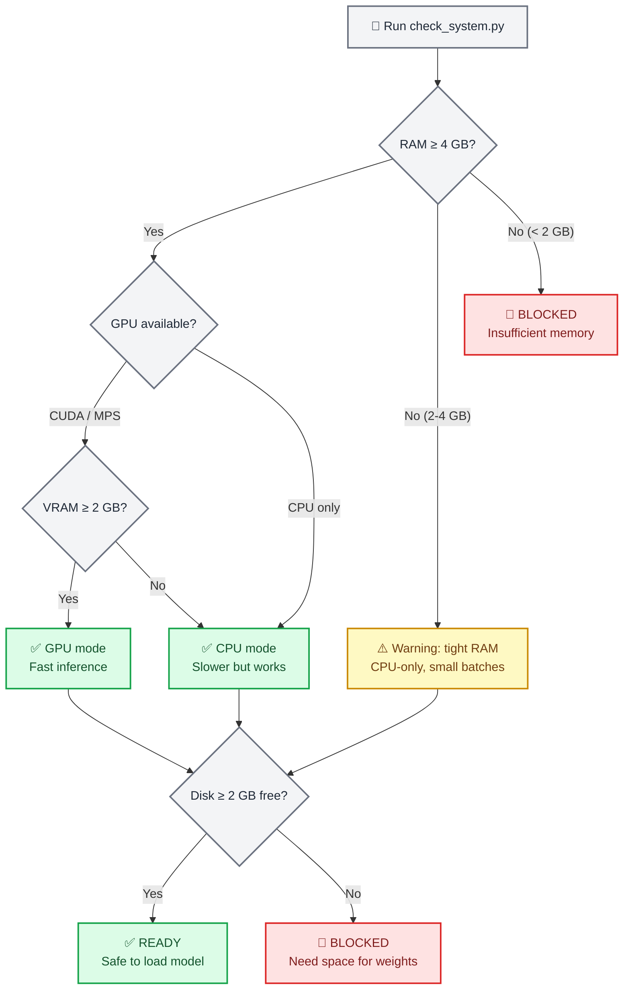
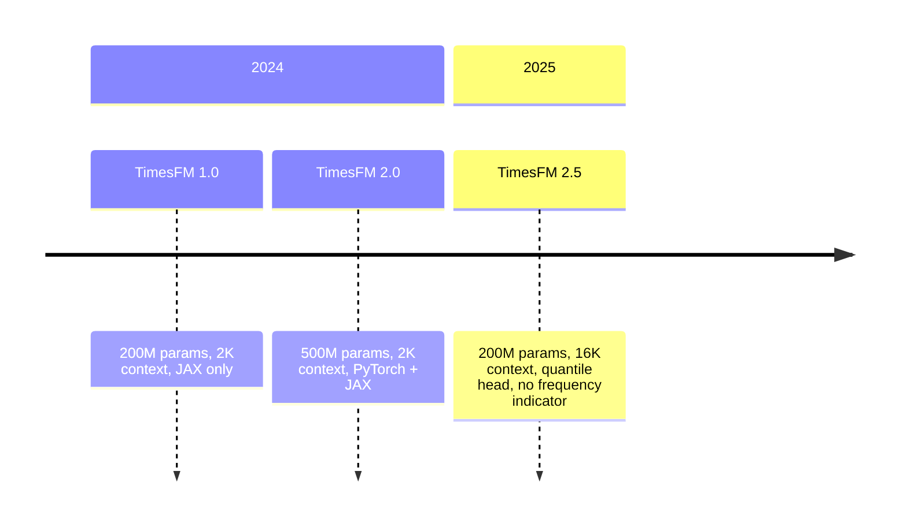
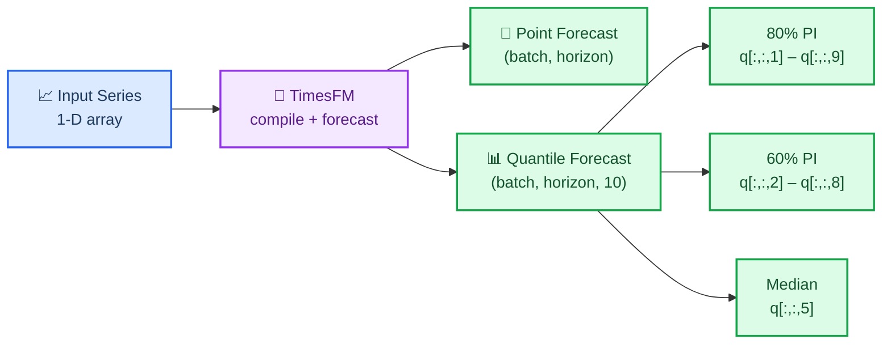
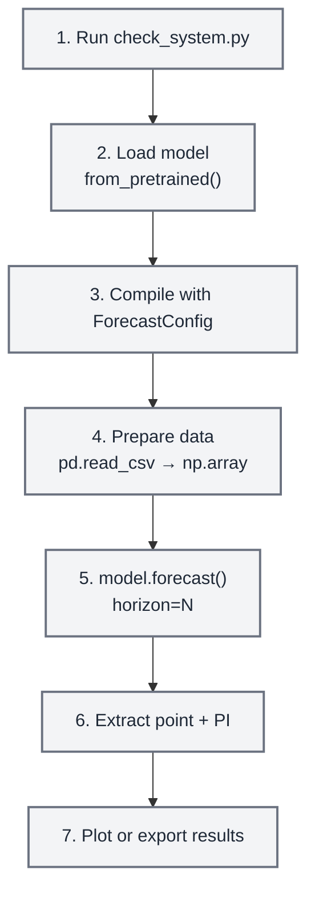

# TimesFM Forecasting

## Overview

TimesFM (Time Series Foundation Model) is a pretrained decoder-only foundation model
developed by Google Research for time-series forecasting. It works **zero-shot** — feed it
any univariate time series and it returns point forecasts with calibrated quantile
prediction intervals, no training required.

This skill wraps TimesFM for safe, agent-friendly local inference. It includes a
**mandatory preflight system checker** that verifies RAM, GPU memory, and disk space
before the model is ever loaded so the agent never crashes a user's machine.

> **Key numbers**: TimesFM 2.5 uses 200M parameters (~800 MB on disk, ~1.5 GB in RAM on
> CPU, ~1 GB VRAM on GPU). The archived v1/v2 500M-parameter model needs ~32 GB RAM.
> Always run the system checker first.

## When to Use This Skill

Use this skill when:

- Forecasting **any univariate time series** (sales, demand, sensor, vitals, price, weather)
- You need **zero-shot forecasting** without training a custom model
- You want **probabilistic forecasts** with calibrated prediction intervals (quantiles)
- You have time series of **any length** (the model handles 1–16,384 context points)
- You need to **batch-forecast** hundreds or thousands of series efficiently
- You want a **foundation model** approach instead of hand-tuning ARIMA/ETS parameters

Do **not** use this skill when:

- You need classical statistical models with coefficient interpretation → use `statsmodels`
- You need time series classification or clustering → use `aeon`
- You need multivariate vector autoregression or Granger causality → use `statsmodels`
- Your data is tabular (not temporal) → use `scikit-learn`

> **Note on Anomaly Detection**: TimesFM does not have built-in anomaly detection, but you can
> use the **quantile forecasts as prediction intervals** — values outside the 90% CI (q10–q90)
> are statistically unusual. See the `examples/anomaly-detection/` directory for a full example.

## ⚠️ Mandatory Preflight: System Requirements Check

**CRITICAL — ALWAYS run the system checker before loading the model for the first time.**

```bash
python scripts/check_system.py
```

This script checks:

1. **Available RAM** — warns if below 4 GB, blocks if below 2 GB
2. **GPU availability** — detects CUDA/MPS devices and VRAM
3. **Disk space** — verifies room for the ~800 MB model download
4. **Python version** — requires 3.10+
5. **Existing installation** — checks if `timesfm` and `torch` are installed

> **Note:** Model weights are **NOT stored in this repository**. TimesFM weights (~800 MB)
> download on-demand from HuggingFace on first use and cache in `~/.cache/huggingface/`.
> The preflight checker ensures sufficient resources before any download begins.



### Hardware Requirements by Model Version

| Model | Parameters | RAM (CPU) | VRAM (GPU) | Disk | Context |
| ----- | ---------- | --------- | ---------- | ---- | ------- |
| **TimesFM 2.5** (recommended) | 200M | ≥ 4 GB | ≥ 2 GB | ~800 MB | up to 16,384 |
| TimesFM 2.0 (archived) | 500M | ≥ 16 GB | ≥ 8 GB | ~2 GB | up to 2,048 |
| TimesFM 1.0 (archived) | 200M | ≥ 8 GB | ≥ 4 GB | ~800 MB | up to 2,048 |

> **Recommendation**: Always use TimesFM 2.5 unless you have a specific reason to use an
> older checkpoint. It is smaller, faster, and supports 8× longer context.

## 🔧 Installation

### Step 1: Verify System (always first)

```bash
python scripts/check_system.py
```

### Step 2: Install TimesFM

```bash
# Using uv (recommended by this repo)
uv pip install timesfm[torch]

# For JAX/Flax backend (faster on TPU/GPU)
uv pip install timesfm[flax]
```

### Step 3: Install PyTorch for Your Hardware

```bash
# CUDA 12.1 (NVIDIA GPU)
uv pip install torch>=2.0.0 --index-url https://download.pytorch.org/whl/cu121

# CPU only
uv pip install torch>=2.0.0 --index-url https://download.pytorch.org/whl/cpu

# Apple Silicon (MPS)
uv pip install torch>=2.0.0  # MPS support is built-in
```

### Step 4: Verify Installation

```python
import timesfm
import numpy as np
print(f"TimesFM version: {timesfm.__version__}")
print("Installation OK")
```

## 🎯 Quick Start

### Minimal Example (5 Lines)

```python
import torch, numpy as np, timesfm

torch.set_float32_matmul_precision("high")

model = timesfm.TimesFM_2p5_200M_torch.from_pretrained(
    "google/timesfm-2.5-200m-pytorch"
)
model.compile(timesfm.ForecastConfig(
    max_context=1024, max_horizon=256, normalize_inputs=True,
    use_continuous_quantile_head=True, force_flip_invariance=True,
    infer_is_positive=True, fix_quantile_crossing=True,
))

point, quantiles = model.forecast(horizon=24, inputs=[
    np.sin(np.linspace(0, 20, 200)),  # any 1-D array
])
# point.shape == (1, 24)        — median forecast
# quantiles.shape == (1, 24, 10) — 10th–90th percentile bands
```

### Forecast from CSV

```python
import pandas as pd, numpy as np

df = pd.read_csv("monthly_sales.csv", parse_dates=["date"], index_col="date")

# Convert each column to a list of arrays
inputs = [df[col].dropna().values.astype(np.float32) for col in df.columns]

point, quantiles = model.forecast(horizon=12, inputs=inputs)

# Build a results DataFrame
for i, col in enumerate(df.columns):
    last_date = df[col].dropna().index[-1]
    future_dates = pd.date_range(last_date, periods=13, freq="MS")[1:]
    forecast_df = pd.DataFrame({
        "date": future_dates,
        "forecast": point[i],
        "lower_80": quantiles[i, :, 2],  # 20th percentile
        "upper_80": quantiles[i, :, 8],  # 80th percentile
    })
    print(f"\n--- {col} ---")
    print(forecast_df.to_string(index=False))
```

### Forecast with Covariates (XReg)

TimesFM 2.5+ supports exogenous variables through `forecast_with_covariates()`. Requires `timesfm[xreg]`.

```python
# Requires: uv pip install timesfm[xreg]
point, quantiles = model.forecast_with_covariates(
    inputs=inputs,
    dynamic_numerical_covariates={"price": price_arrays},
    dynamic_categorical_covariates={"holiday": holiday_arrays},
    static_categorical_covariates={"region": region_labels},
    xreg_mode="xreg + timesfm",  # or "timesfm + xreg"
)
```

| Covariate Type | Description | Example |
| -------------- | ----------- | ------- |
| `dynamic_numerical` | Time-varying numeric | price, temperature, promotion spend |
| `dynamic_categorical` | Time-varying categorical | holiday flag, day of week |
| `static_numerical` | Per-series numeric | store size, account age |
| `static_categorical` | Per-series categorical | store type, region, product category |

**XReg Modes:**
- `"xreg + timesfm"` (default): TimesFM forecasts first, then XReg adjusts residuals
- `"timesfm + xreg"`: XReg fits first, then TimesFM forecasts residuals

> See `examples/covariates-forecasting/` for a complete example with synthetic retail data.

### Anomaly Detection (via Quantile Intervals)

TimesFM does not have built-in anomaly detection, but the **quantile forecasts naturally provide
prediction intervals** that can detect anomalies:

```python
point, q = model.forecast(horizon=H, inputs=[values])

# 90% prediction interval
lower_90 = q[0, :, 1]  # 10th percentile
upper_90 = q[0, :, 9]  # 90th percentile

# Detect anomalies: values outside the 90% CI
actual = test_values  # your holdout data
anomalies = (actual < lower_90) | (actual > upper_90)

# Severity levels
is_warning = (actual < q[0, :, 2]) | (actual > q[0, :, 8])  # outside 80% CI
is_critical = anomalies  # outside 90% CI
```

| Severity | Condition | Interpretation |
| -------- | --------- | -------------- |
| **Normal** | Inside 80% CI | Expected behavior |
| **Warning** | Outside 80% CI | Unusual but possible |
| **Critical** | Outside 90% CI | Statistically rare (< 10% probability) |

> See `examples/anomaly-detection/` for a complete example with visualization.

```python
# Requires: uv pip install timesfm[xreg]
point, quantiles = model.forecast_with_covariates(
    inputs=inputs,
    dynamic_numerical_covariates={"temperature": temp_arrays},
    dynamic_categorical_covariates={"day_of_week": dow_arrays},
    static_categorical_covariates={"region": region_labels},
    xreg_mode="xreg + timesfm",  # or "timesfm + xreg"
)
```

## Output, Configuration, Workflows, and Tuning

- [references/output_and_config.md](references/output_and_config.md): reading the point
  forecast and the 10 quantile bands, deriving prediction intervals, and every
  `ForecastConfig` field.
- [references/workflows.md](references/workflows.md): the standard forecast sequence,
  many-series forecasting from a wide CSV, and backtesting with interval coverage.
- [references/performance_tuning.md](references/performance_tuning.md): GPU and TF32
  setup, `per_core_batch_size` by available memory, and memory management.
- [references/examples_and_validation.md](references/examples_and_validation.md):
  runnable examples, the quality checklist, common mistakes, and regression checks.

## 🔗 Integration with Other Skills

### With `statsmodels`

Use `statsmodels` for classical models (ARIMA, SARIMAX) as a **comparison baseline**:

```python
# TimesFM forecast
tfm_point, tfm_q = model.forecast(horizon=H, inputs=[values])

# statsmodels ARIMA forecast
from statsmodels.tsa.arima.model import ARIMA
arima = ARIMA(values, order=(1,1,1)).fit()
arima_forecast = arima.forecast(steps=H)

# Compare
print(f"TimesFM MAE: {np.mean(np.abs(actual - tfm_point[0])):.2f}")
print(f"ARIMA MAE:   {np.mean(np.abs(actual - arima_forecast)):.2f}")
```

### With `matplotlib` / `scientific-visualization`

Plot forecasts with prediction intervals as publication-quality figures.

### With `exploratory-data-analysis`

Run EDA on the time series before forecasting to understand trends, seasonality, and stationarity.


## 📚 Available Scripts

### `scripts/check_system.py`

**Mandatory preflight checker.** Run before first model load.

```bash
python scripts/check_system.py
```

Output example:
```
=== TimesFM System Requirements Check ===

[RAM]       Total: 32.0 GB | Available: 24.3 GB  ✅ PASS
[GPU]       NVIDIA RTX 4090 | VRAM: 24.0 GB      ✅ PASS
[Disk]      Free: 142.5 GB                        ✅ PASS
[Python]    3.12.1                                 ✅ PASS
[timesfm]   Installed (2.5.0)                      ✅ PASS
[torch]     Installed (2.4.1+cu121)                ✅ PASS

VERDICT: ✅ System is ready for TimesFM 2.5 (GPU mode)
Recommended: per_core_batch_size=128
```

### `scripts/forecast_csv.py`

End-to-end CSV forecasting with automatic system check.

```bash
python scripts/forecast_csv.py input.csv \
    --horizon 24 \
    --date-col date \
    --value-cols sales,revenue \
    --output forecasts.csv
```

## 📖 Reference Documentation

Detailed guides in `references/`:

| File | Contents |
| ---- | -------- |
| `references/system_requirements.md` | Hardware tiers, GPU/CPU selection, memory estimation formulas |
| `references/api_reference.md` | Full `ForecastConfig` docs, `from_pretrained` options, output shapes |
| `references/data_preparation.md` | Input formats, NaN handling, CSV loading, covariate setup |

## Common Pitfalls

1. **Not running system check** → model load crashes on low-RAM machines. Always run `check_system.py` first.
2. **Forgetting `model.compile()`** → `RuntimeError: Model is not compiled`. Must call `compile()` before `forecast()`.
3. **Not setting `normalize_inputs=True`** → unstable forecasts for series with large values.
4. **Using v1/v2 on machines with < 32 GB RAM** → use TimesFM 2.5 (200M params) instead.
5. **Not setting `fix_quantile_crossing=True`** → quantiles may not be monotonic (q10 > q50).
6. **Huge `per_core_batch_size` on small GPU** → CUDA OOM. Start small, increase.
7. **Passing 2-D arrays** → TimesFM expects a **list of 1-D arrays**, not a 2-D matrix.
8. **Forgetting `torch.set_float32_matmul_precision("high")`** → slower inference on Ampere+ GPUs.
9. **Not handling NaN in output** → edge cases with very short series. Always check `np.isnan(point).any()`.
10. **Using `infer_is_positive=True` for series that can be negative** → clamps forecasts at zero. Set False for temperature, returns, etc.

## Model Versions



| Version | Params | Context | Quantile Head | Frequency Flag | Status |
| ------- | ------ | ------- | ------------- | -------------- | ------ |
| **2.5** | 200M | 16,384 | ✅ Continuous (30M) | ❌ Removed | **Latest** |
| 2.0 | 500M | 2,048 | ✅ Fixed buckets | ✅ Required | Archived |
| 1.0 | 200M | 2,048 | ✅ Fixed buckets | ✅ Required | Archived |

**Hugging Face checkpoints:**

- `google/timesfm-2.5-200m-pytorch` (recommended)
- `google/timesfm-2.5-200m-flax`
- `google/timesfm-2.0-500m-pytorch` (archived)
- `google/timesfm-1.0-200m-pytorch` (archived)

## Resources

- **Paper**: [A Decoder-Only Foundation Model for Time-Series Forecasting](https://arxiv.org/abs/2310.10688) (ICML 2024)
- **Repository**: https://github.com/google-research/timesfm
- **Hugging Face**: https://huggingface.co/collections/google/timesfm-release-66e4be5fdb56e960c1e482a6
- **Google Blog**: https://research.google/blog/a-decoder-only-foundation-model-for-time-series-forecasting/
- **BigQuery Integration**: https://cloud.google.com/bigquery/docs/timesfm-model

---

## Bundled files (Open WebUI single-file edition)

> This is a conversion of `skills/timesfm-forecasting/` from the K-Dense scientific-agent-skills package (https://github.com/K-Dense-AI/scientific-agent-skills) for Open WebUI, which stores each skill as a single markdown blob. Sibling files the skill text refers to (references, scripts, assets) are inlined below: when instructions mention `references/foo.md`, its content is here.

> Excluded (not usable as inline text — binary assets, vendored schemas, or bulk data): examples/anomaly-detection/output/anomaly_detection.png, examples/covariates-forecasting/output/covariates_data.png, examples/global-temperature/output/forecast_animation.gif, examples/global-temperature/output/forecast_visualization.png

### `references/api_reference.md`

# TimesFM API Reference

## Model Classes

### `timesfm.TimesFM_2p5_200M_torch`

The primary model class for TimesFM 2.5 (200M parameters, PyTorch backend).

#### `from_pretrained()`

```python
model = timesfm.TimesFM_2p5_200M_torch.from_pretrained(
    "google/timesfm-2.5-200m-pytorch",
    cache_dir=None,         # Optional: custom cache directory
    force_download=True,    # Re-download even if cached
)
```

| Parameter | Type | Default | Description |
| --------- | ---- | ------- | ----------- |
| `model_id` | str | `"google/timesfm-2.5-200m-pytorch"` | Hugging Face model ID |
| `revision` | str \| None | None | Specific model revision |
| `cache_dir` | str \| Path \| None | None | Custom cache directory |
| `force_download` | bool | True | Force re-download of weights |

**Returns**: Initialized `TimesFM_2p5_200M_torch` instance (not yet compiled).

#### `compile()`

Compiles the model with the given forecast configuration. **Must be called before `forecast()`.**

```python
model.compile(
    timesfm.ForecastConfig(
        max_context=1024,
        max_horizon=256,
        normalize_inputs=True,
        per_core_batch_size=32,
        use_continuous_quantile_head=True,
        force_flip_invariance=True,
        infer_is_positive=True,
        fix_quantile_crossing=True,
    )
)
```

**Raises**: Nothing (but `forecast()` will raise `RuntimeError` if not compiled).

#### `forecast()`

Run inference on one or more time series.

```python
point_forecast, quantile_forecast = model.forecast(
    horizon=24,
    inputs=[array1, array2, ...],
)
```

| Parameter | Type | Description |
| --------- | ---- | ----------- |
| `horizon` | int | Number of future steps to forecast |
| `inputs` | list[np.ndarray] | List of 1-D numpy arrays (each is a time series) |

**Returns**: `tuple[np.ndarray, np.ndarray]`

- `point_forecast`: shape `(batch_size, horizon)` — median (0.5 quantile)
- `quantile_forecast`: shape `(batch_size, horizon, 10)` — [mean, q10, q20, ..., q90]

**Raises**: `RuntimeError` if model is not compiled.

**Key behaviors**:

- Leading NaN values are stripped automatically
- Internal NaN values are linearly interpolated
- Series longer than `max_context` are truncated (last `max_context` points used)
- Series shorter than `max_context` are padded

#### `forecast_with_covariates()`

Run inference with exogenous variables (requires `timesfm[xreg]`).

```python
point, quantiles = model.forecast_with_covariates(
    inputs=inputs,
    dynamic_numerical_covariates={"temp": [temp_array1, temp_array2]},
    dynamic_categorical_covariates={"dow": [dow_array1, dow_array2]},
    static_categorical_covariates={"region": ["east", "west"]},
    xreg_mode="xreg + timesfm",
)
```

| Parameter | Type | Description |
| --------- | ---- | ----------- |
| `inputs` | list[np.ndarray] | Target time series |
| `dynamic_numerical_covariates` | dict[str, list[np.ndarray]] | Time-varying numeric features |
| `dynamic_categorical_covariates` | dict[str, list[np.ndarray]] | Time-varying categorical features |
| `static_categorical_covariates` | dict[str, list[str]] | Fixed categorical features per series |
| `xreg_mode` | str | `"xreg + timesfm"` or `"timesfm + xreg"` |

**Note**: Dynamic covariates must have length `context + horizon` for each series.

---

## `timesfm.ForecastConfig`

Immutable dataclass controlling all forecast behavior.

```python
@dataclasses.dataclass(frozen=True)
class ForecastConfig:
    max_context: int = 0
    max_horizon: int = 0
    normalize_inputs: bool = False
    per_core_batch_size: int = 1
    use_continuous_quantile_head: bool = False
    force_flip_invariance: bool = True
    infer_is_positive: bool = True
    fix_quantile_crossing: bool = False
    return_backcast: bool = False
    quantiles: list[float] = [0.1, 0.2, 0.3, 0.4, 0.5, 0.6, 0.7, 0.8, 0.9]
    decode_index: int = 5
```

### Parameter Details

#### `max_context` (int, default=0)

Maximum number of historical time points to use as context.

- **0**: Use the model's maximum supported context (16,384 for v2.5)
- **N**: Truncate series to last N points
- **Best practice**: Set to the length of your longest series, or 512–2048 for speed

#### `max_horizon` (int, default=0)

Maximum forecast horizon.

- **0**: Use the model's maximum
- **N**: Forecasts up to N steps (can still call `forecast(horizon=M)` where M ≤ N)
- **Best practice**: Set to your expected maximum forecast length

#### `normalize_inputs` (bool, default=False)

Whether to z-normalize each series before feeding to the model.

- **True** (RECOMMENDED): Normalizes each series to zero mean, unit variance
- **False**: Raw values are passed directly
- **When False is OK**: Only if your series are already normalized or very close to scale 1.0

#### `per_core_batch_size` (int, default=1)

Number of series processed per device in each batch.

- Increase for throughput, decrease if OOM
- See `references/system_requirements.md` for recommended values by hardware

#### `use_continuous_quantile_head` (bool, default=False)

Use the 30M-parameter continuous quantile head for better interval calibration.

- **True** (RECOMMENDED): More accurate prediction intervals, especially for longer horizons
- **False**: Uses fixed quantile buckets (faster but less accurate intervals)

#### `force_flip_invariance` (bool, default=True)

Ensures the model satisfies `f(-x) = -f(x)`.

- **True** (RECOMMENDED): Mathematical consistency — forecasts are invariant to sign flip
- **False**: Slightly faster but may produce asymmetric forecasts

#### `infer_is_positive` (bool, default=True)

Automatically detect if all input values are positive and clamp forecasts ≥ 0.

- **True**: Safe for sales, demand, counts, prices, volumes
- **False**: Required for temperature, returns, PnL, any series that can be negative

#### `fix_quantile_crossing` (bool, default=False)

Post-process quantiles to ensure monotonicity (q10 ≤ q20 ≤ ... ≤ q90).

- **True** (RECOMMENDED): Guarantees well-ordered quantiles
- **False**: Slightly faster but quantiles may occasionally cross

#### `return_backcast` (bool, default=False)

Return the model's reconstruction of the input (backcast) in addition to forecast.

- **True**: Used for covariate workflows and diagnostics
- **False**: Only return forecast

---

## Available Model Checkpoints

| Model ID | Version | Params | Backend | Context |
| -------- | ------- | ------ | ------- | ------- |
| `google/timesfm-2.5-200m-pytorch` | 2.5 | 200M | PyTorch | 16,384 |
| `google/timesfm-2.5-200m-flax` | 2.5 | 200M | JAX/Flax | 16,384 |
| `google/timesfm-2.5-200m-transformers` | 2.5 | 200M | Transformers | 16,384 |
| `google/timesfm-2.0-500m-pytorch` | 2.0 | 500M | PyTorch | 2,048 |
| `google/timesfm-2.0-500m-jax` | 2.0 | 500M | JAX | 2,048 |
| `google/timesfm-1.0-200m-pytorch` | 1.0 | 200M | PyTorch | 2,048 |
| `google/timesfm-1.0-200m` | 1.0 | 200M | JAX | 2,048 |

---

## Output Shape Reference

| Output | Shape | Description |
| ------ | ----- | ----------- |
| `point_forecast` | `(B, H)` | Median forecast for B series, H steps |
| `quantile_forecast` | `(B, H, 10)` | Full quantile distribution |
| `quantile_forecast[:,:,0]` | `(B, H)` | Mean |
| `quantile_forecast[:,:,1]` | `(B, H)` | 10th percentile |
| `quantile_forecast[:,:,5]` | `(B, H)` | 50th percentile (= point_forecast) |
| `quantile_forecast[:,:,9]` | `(B, H)` | 90th percentile |

Where `B` = batch size (number of input series), `H` = forecast horizon.

---

## Error Handling

| Error | Cause | Fix |
| ----- | ----- | --- |
| `RuntimeError: Model is not compiled` | Called `forecast()` before `compile()` | Call `model.compile(ForecastConfig(...))` first |
| `torch.cuda.OutOfMemoryError` | Batch too large for GPU | Reduce `per_core_batch_size` |
| `ValueError: inputs must be list` | Passed array instead of list | Wrap in list: `[array]` |
| `HfHubHTTPError` | Download failed | Check internet, set `HF_HOME` to writable dir |

### `references/data_preparation.md`

# Data Preparation for TimesFM

## Input Format

TimesFM accepts a **list of 1-D numpy arrays**. Each array represents one
univariate time series.

```python
inputs = [
    np.array([1.0, 2.0, 3.0, 4.0, 5.0]),       # Series 1
    np.array([10.0, 20.0, 15.0, 25.0]),          # Series 2 (different length)
    np.array([100.0, 110.0, 105.0, 115.0, 120.0, 130.0]),  # Series 3
]
```

### Key Properties

- **Variable lengths**: Series in the same batch can have different lengths
- **Float values**: Use `np.float32` or `np.float64`
- **1-D only**: Each array must be 1-dimensional (not 2-D matrix rows)
- **NaN handling**: Leading NaNs are stripped; internal NaNs are linearly interpolated

## Loading from Common Formats

### CSV — Single Series (Long Format)

```python
import pandas as pd
import numpy as np

df = pd.read_csv("data.csv", parse_dates=["date"])
values = df["value"].values.astype(np.float32)
inputs = [values]
```

### CSV — Multiple Series (Wide Format)

```python
df = pd.read_csv("data.csv", parse_dates=["date"], index_col="date")
inputs = [df[col].dropna().values.astype(np.float32) for col in df.columns]
```

### CSV — Long Format with ID Column

```python
df = pd.read_csv("data.csv", parse_dates=["date"])
inputs = []
for series_id, group in df.groupby("series_id"):
    values = group.sort_values("date")["value"].values.astype(np.float32)
    inputs.append(values)
```

### Pandas DataFrame

```python
# Single column
inputs = [df["temperature"].values.astype(np.float32)]

# Multiple columns
inputs = [df[col].dropna().values.astype(np.float32) for col in numeric_cols]
```

### Numpy Arrays

```python
# 2-D array (rows = series, cols = time steps)
data = np.load("timeseries.npy")  # shape (N, T)
inputs = [data[i] for i in range(data.shape[0])]

# Or from 1-D
inputs = [np.sin(np.linspace(0, 10, 200))]
```

### Excel

```python
df = pd.read_excel("data.xlsx", sheet_name="Sheet1")
inputs = [df[col].dropna().values.astype(np.float32) for col in df.select_dtypes(include=[np.number]).columns]
```

### Parquet

```python
df = pd.read_parquet("data.parquet")
inputs = [df[col].dropna().values.astype(np.float32) for col in df.select_dtypes(include=[np.number]).columns]
```

### JSON

```python
import json

with open("data.json") as f:
    data = json.load(f)

# Assumes {"series_name": [values...], ...}
inputs = [np.array(values, dtype=np.float32) for values in data.values()]
```

## NaN Handling

TimesFM handles NaN values automatically:

### Leading NaNs

Stripped before feeding to the model:

```python
# Input:  [NaN, NaN, 1.0, 2.0, 3.0]
# Actual: [1.0, 2.0, 3.0]
```

### Internal NaNs

Linearly interpolated:

```python
# Input:  [1.0, NaN, 3.0, NaN, NaN, 6.0]
# Actual: [1.0, 2.0, 3.0, 4.0, 5.0, 6.0]
```

### Trailing NaNs

**Not handled** — drop them before passing to the model:

```python
values = df["value"].values.astype(np.float32)
# Remove trailing NaNs
while len(values) > 0 and np.isnan(values[-1]):
    values = values[:-1]
inputs = [values]
```

### Best Practice

```python
def clean_series(arr: np.ndarray) -> np.ndarray:
    """Clean a time series for TimesFM input."""
    arr = np.asarray(arr, dtype=np.float32)
    # Remove trailing NaNs
    while len(arr) > 0 and np.isnan(arr[-1]):
        arr = arr[:-1]
    # Replace inf with NaN (will be interpolated)
    arr[np.isinf(arr)] = np.nan
    return arr

inputs = [clean_series(df[col].values) for col in cols]
```

## Context Length Considerations

| Context Length | Use Case | Notes |
| -------------- | -------- | ----- |
| 64–256 | Quick prototyping | Minimal context, fast |
| 256–512 | Daily data, ~1 year | Good balance |
| 512–1024 | Daily data, ~2-3 years | Standard production |
| 1024–4096 | Hourly data, weekly patterns | More context = better |
| 4096–16384 | High-frequency, long patterns | TimesFM 2.5 maximum |

**Rule of thumb**: Provide at least 3–5 full cycles of the dominant pattern
(e.g., for weekly seasonality with daily data, provide at least 21–35 days).

## Covariates (XReg)

TimesFM 2.5 supports exogenous variables through the `forecast_with_covariates()` API.

### Types of Covariates

| Type | Description | Example |
| ---- | ----------- | ------- |
| **Dynamic numerical** | Time-varying numeric features | Temperature, price, promotion spend |
| **Dynamic categorical** | Time-varying categorical features | Day of week, holiday flag |
| **Static categorical** | Fixed per-series features | Store ID, region, product category |

### Preparing Covariates

Each covariate must have length `context + horizon` for each series:

```python
import numpy as np

context_len = 100   # length of historical data
horizon = 24        # forecast horizon
total_len = context_len + horizon

# Dynamic numerical: temperature forecast for each series
temp = [
    np.random.randn(total_len).astype(np.float32),  # Series 1
    np.random.randn(total_len).astype(np.float32),  # Series 2
]

# Dynamic categorical: day of week (0-6) for each series
dow = [
    np.tile(np.arange(7), total_len // 7 + 1)[:total_len],  # Series 1
    np.tile(np.arange(7), total_len // 7 + 1)[:total_len],  # Series 2
]

# Static categorical: one label per series
regions = ["east", "west"]

# Forecast with covariates
point, quantiles = model.forecast_with_covariates(
    inputs=[values1, values2],
    dynamic_numerical_covariates={"temperature": temp},
    dynamic_categorical_covariates={"day_of_week": dow},
    static_categorical_covariates={"region": regions},
    xreg_mode="xreg + timesfm",
)
```

### XReg Modes

| Mode | Description |
| ---- | ----------- |
| `"xreg + timesfm"` | Covariates processed first, then combined with TimesFM forecast |
| `"timesfm + xreg"` | TimesFM forecast first, then adjusted by covariates |

## Common Data Issues

### Issue: Series too short

TimesFM needs at least 1 data point, but more context = better forecasts.

```python
MIN_LENGTH = 32  # Practical minimum for meaningful forecasts

inputs = [
    arr for arr in raw_inputs
    if len(arr[~np.isnan(arr)]) >= MIN_LENGTH
]
```

### Issue: Series with constant values

Constant series may produce NaN or zero-width prediction intervals:

```python
for i, arr in enumerate(inputs):
    if np.std(arr[~np.isnan(arr)]) < 1e-10:
        print(f"⚠️ Series {i} is constant — forecast will be flat")
```

### Issue: Extreme outliers

Large outliers can destabilize forecasts even with normalization:

```python
def clip_outliers(arr: np.ndarray, n_sigma: float = 5.0) -> np.ndarray:
    """Clip values beyond n_sigma standard deviations."""
    mu = np.nanmean(arr)
    sigma = np.nanstd(arr)
    if sigma > 0:
        arr = np.clip(arr, mu - n_sigma * sigma, mu + n_sigma * sigma)
    return arr
```

### Issue: Mixed frequencies in batch

TimesFM handles each series independently, so you can mix frequencies:

```python
inputs = [
    daily_sales,      # 365 points
    weekly_revenue,   # 52 points
    monthly_users,    # 24 points
]
# All forecasted in one batch — TimesFM handles different lengths
point, q = model.forecast(horizon=12, inputs=inputs)
```

However, the `horizon` is shared. If you need different horizons per series,
forecast in separate calls.

### `references/examples_and_validation.md`

# Examples, Checklists, and Validation

Runnable examples, the pre-delivery quality checklist, the mistakes that most often
produce wrong forecasts, and the regression checks that confirm the skill still works.

## Examples

Three fully-working reference examples live in `examples/`. Use them as ground truth for correct API usage and expected output shape.

| Example | Directory | What It Demonstrates | When To Use It |
| ------- | --------- | -------------------- | -------------- |
| **Global Temperature Forecast** | `examples/global-temperature/` | Basic `model.forecast()` call, CSV -> PNG -> GIF pipeline, 36-month NOAA context | Starting point; copy-paste baseline for any univariate series |
| **Anomaly Detection** | `examples/anomaly-detection/` | Two-phase detection: linear detrend + Z-score on context, quantile PI on forecast; 2-panel viz | Any task requiring outlier detection on historical + forecasted data |
| **Covariates (XReg)** | `examples/covariates-forecasting/` | `forecast_with_covariates()` API (TimesFM 2.5), covariate decomposition, 2x2 shared-axis viz | Retail, energy, or any series with known exogenous drivers |

### Running the Examples

```bash
# Global temperature (no TimesFM 2.5 needed)
cd examples/global-temperature && python run_forecast.py && python visualize_forecast.py

# Anomaly detection (uses TimesFM 1.0)
cd examples/anomaly-detection && python detect_anomalies.py

# Covariates (API demo -- requires TimesFM 2.5 + timesfm[xreg] for real inference)
cd examples/covariates-forecasting && python demo_covariates.py
```

### Expected Outputs

| Example | Key output files | Acceptance criteria |
| ------- | ---------------- | ------------------- |
| global-temperature | `output/forecast_output.json`, `output/forecast_visualization.png` | `point_forecast` has 12 values; PNG shows context + forecast + PI bands |
| anomaly-detection | `output/anomaly_detection.json`, `output/anomaly_detection.png` | Sep 2023 flagged CRITICAL (z >= 3.0); >= 2 forecast CRITICAL from injected anomalies |
| covariates-forecasting | `output/sales_with_covariates.csv`, `output/covariates_data.png` | CSV has 108 rows (3 stores x 36 weeks); stores have **distinct** price arrays |

## Quality Checklist

Run this checklist after every TimesFM task before declaring success:

- [ ] **Output shape correct** -- `point_fc` shape is `(n_series, horizon)`, `quant_fc` is `(n_series, horizon, 10)`
- [ ] **Quantile indices** -- index 0 = mean, 1 = q10, 2 = q20 ... 9 = q90. **NOT** 0 = q0, 1 = q10.
- [ ] **Frequency flag** -- TimesFM 1.0/2.0: pass `freq=[0]` for monthly data. TimesFM 2.5: no freq flag.
- [ ] **Series length** -- context must be >= 32 data points (model minimum). Warn if shorter.
- [ ] **No NaN** -- `np.isnan(point_fc).any()` should be False. Check input series for gaps first.
- [ ] **Visualization axes** -- if multiple panels share data, use `sharex=True`. All time axes must cover the same span.
- [ ] **Binary outputs in Git LFS** -- PNG and GIF files must be tracked via `.gitattributes` (repo root already configured).
- [ ] **No large datasets committed** -- any real dataset > 1 MB should be downloaded to `tempfile.mkdtemp()` and annotated in code.
- [ ] **`matplotlib.use('Agg')`** -- must appear before any pyplot import when running headless.
- [ ] **`infer_is_positive`** -- set `False` for temperature anomalies, financial returns, or any series that can be negative.

## Common Mistakes

These bugs have appeared in this skill's examples. Learn from them:

1. **Quantile index off-by-one** -- The most common mistake. `quant_fc[..., 0]` is the **mean**, not q0. q10 = index 1, q90 = index 9. Always define named constants: `IDX_Q10, IDX_Q20, IDX_Q80, IDX_Q90 = 1, 2, 8, 9`.

2. **Variable shadowing in comprehensions** -- If you build per-series covariate dicts inside a loop, do NOT use the loop variable as the comprehension variable. Accumulate into separate `dict[str, ndarray]` outside the loop, then assign.
   ```python
   # WRONG -- outer `store_id` gets shadowed:
   covariates = {store_id: arr[store_id] for store_id in stores}  # inside outer loop over store_id
   # CORRECT -- use a different name or accumulate beforehand:
   prices_by_store: dict[str, np.ndarray] = {}
   for store_id, config in stores.items():
       prices_by_store[store_id] = compute_price(config)
   ```

3. **Wrong CSV column name** -- The global-temperature CSV uses `anomaly_c`, not `anomaly`. Always `print(df.columns)` before accessing.

4. **`tight_layout()` warning with `sharex=True`** -- Harmless; suppress with `plt.tight_layout(rect=[0, 0, 1, 0.97])` or ignore.

5. **TimesFM 2.5 required for `forecast_with_covariates()`** -- TimesFM 1.0 does NOT have this method. Install `uv pip install timesfm[xreg]` and use checkpoint `google/timesfm-2.5-200m-pytorch`.

6. **Future covariates must span the full horizon** -- Dynamic covariates (price, promotions, holidays) must have values for BOTH the context AND the forecast horizon. You cannot pass context-only arrays.

7. **Anomaly thresholds must be defined once** -- Define `CRITICAL_Z = 3.0`, `WARNING_Z = 2.0` as module-level constants. Never hardcode `3` or `2` inline.

8. **Context anomaly detection uses residuals, not raw values** -- Always detrend first (`np.polyfit` linear, or seasonal decomposition), then Z-score the residuals. Raw-value Z-scores are misleading on trending data.

## Validation & Verification

Use the example outputs as regression baselines. If you change forecasting logic, verify:

```bash
# Anomaly detection regression check:
python -c "
import json
d = json.load(open('examples/anomaly-detection/output/anomaly_detection.json'))
ctx = d['context_summary']
assert ctx['critical'] >= 1, 'Sep 2023 must be CRITICAL'
assert any(r['date'] == '2023-09' and r['severity'] == 'CRITICAL'
           for r in d['context_detections']), 'Sep 2023 not found'
print('Anomaly detection regression: PASS')"

# Covariates regression check:
python -c "
import pandas as pd
df = pd.read_csv('examples/covariates-forecasting/output/sales_with_covariates.csv')
assert len(df) == 108, f'Expected 108 rows, got {len(df)}'
prices = df.groupby('store_id')['price'].mean()
assert prices['store_A'] > prices['store_B'] > prices['store_C'], 'Store price ordering wrong'
print('Covariates regression: PASS')"
```

### `references/output_and_config.md`

# Understanding the Output and ForecastConfig

How to read the point forecast and quantile bands, how to derive prediction intervals at
a chosen confidence level, and every `ForecastConfig` field with its effect.

## 📊 Understanding the Output

### Quantile Forecast Structure

TimesFM returns `(point_forecast, quantile_forecast)`:

- **`point_forecast`**: shape `(batch, horizon)` — the median (0.5 quantile)
- **`quantile_forecast`**: shape `(batch, horizon, 10)` — ten slices:

| Index | Quantile | Use |
| ----- | -------- | --- |
| 0 | Mean | Average prediction |
| 1 | 0.1 | Lower bound of 80% PI |
| 2 | 0.2 | Lower bound of 60% PI |
| 3 | 0.3 | — |
| 4 | 0.4 | — |
| **5** | **0.5** | **Median (= `point_forecast`)** |
| 6 | 0.6 | — |
| 7 | 0.7 | — |
| 8 | 0.8 | Upper bound of 60% PI |
| 9 | 0.9 | Upper bound of 80% PI |

### Extracting Prediction Intervals

```python
point, q = model.forecast(horizon=H, inputs=data)

# 80% prediction interval (most common)
lower_80 = q[:, :, 1]  # 10th percentile
upper_80 = q[:, :, 9]  # 90th percentile

# 60% prediction interval (tighter)
lower_60 = q[:, :, 2]  # 20th percentile
upper_60 = q[:, :, 8]  # 80th percentile

# Median (same as point forecast)
median = q[:, :, 5]
```



## 🔧 ForecastConfig Reference

All forecasting behavior is controlled by `timesfm.ForecastConfig`:

```python
timesfm.ForecastConfig(
    max_context=1024,                    # Max context window (truncates longer series)
    max_horizon=256,                     # Max forecast horizon
    normalize_inputs=True,               # Normalize inputs (RECOMMENDED for stability)
    per_core_batch_size=32,              # Batch size per device (tune for memory)
    use_continuous_quantile_head=True,   # Better quantile accuracy for long horizons
    force_flip_invariance=True,          # Ensures f(-x) = -f(x) (mathematical consistency)
    infer_is_positive=True,              # Clamp forecasts ≥ 0 when all inputs > 0
    fix_quantile_crossing=True,          # Ensure q10 ≤ q20 ≤ ... ≤ q90
    return_backcast=False,               # Return backcast (for covariate workflows)
)
```

| Parameter | Default | When to Change |
| --------- | ------- | -------------- |
| `max_context` | 0 | Set to match your longest historical window (e.g., 512, 1024, 4096) |
| `max_horizon` | 0 | Set to your maximum forecast length |
| `normalize_inputs` | False | **Always set True** — prevents scale-dependent instability |
| `per_core_batch_size` | 1 | Increase for throughput; decrease if OOM |
| `use_continuous_quantile_head` | False | **Set True** for calibrated prediction intervals |
| `force_flip_invariance` | True | Keep True unless profiling shows it hurts |
| `infer_is_positive` | True | Set False for series that can be negative (temperature, returns) |
| `fix_quantile_crossing` | False | **Set True** to guarantee monotonic quantiles |

### `references/performance_tuning.md`

# Performance Tuning

GPU detection and TF32 settings, choosing `per_core_batch_size` for the memory you have,
and memory management strategies for large series counts.

## ⚙️ Performance Tuning

### GPU Acceleration

```python
import torch

# Check GPU availability
if torch.cuda.is_available():
    print(f"GPU: {torch.cuda.get_device_name(0)}")
    print(f"VRAM: {torch.cuda.get_device_properties(0).total_mem / 1e9:.1f} GB")
elif hasattr(torch.backends, "mps") and torch.backends.mps.is_available():
    print("Apple Silicon MPS available")
else:
    print("CPU only — inference will be slower but still works")

# Always set this for Ampere+ GPUs (A100, RTX 3090, etc.)
torch.set_float32_matmul_precision("high")
```

### Batch Size Tuning

```python
# Start conservative, increase until OOM
# GPU with 8 GB VRAM:  per_core_batch_size=64
# GPU with 16 GB VRAM: per_core_batch_size=128
# GPU with 24 GB VRAM: per_core_batch_size=256
# CPU with 8 GB RAM:   per_core_batch_size=8
# CPU with 16 GB RAM:  per_core_batch_size=32
# CPU with 32 GB RAM:  per_core_batch_size=64

model.compile(timesfm.ForecastConfig(
    max_context=1024,
    max_horizon=256,
    per_core_batch_size=32,  # <-- tune this
    normalize_inputs=True,
    use_continuous_quantile_head=True,
    fix_quantile_crossing=True,
))
```

### Memory-Constrained Environments

```python
import gc, torch

# Force garbage collection before loading
gc.collect()
if torch.cuda.is_available():
    torch.cuda.empty_cache()

# Load model
model = timesfm.TimesFM_2p5_200M_torch.from_pretrained(
    "google/timesfm-2.5-200m-pytorch"
)

# Use small batch size on low-memory machines
model.compile(timesfm.ForecastConfig(
    max_context=512,        # Reduce context if needed
    max_horizon=128,        # Reduce horizon if needed
    per_core_batch_size=4,  # Small batches
    normalize_inputs=True,
    use_continuous_quantile_head=True,
    fix_quantile_crossing=True,
))

# Process series in chunks to avoid OOM
CHUNK = 50
all_results = []
for i in range(0, len(inputs), CHUNK):
    chunk = inputs[i:i+CHUNK]
    p, q = model.forecast(horizon=H, inputs=chunk)
    all_results.append((p, q))
    gc.collect()  # Clean up between chunks
```

### `references/system_requirements.md`

# System Requirements for TimesFM

## Hardware Tiers

TimesFM can run on a variety of hardware configurations. This guide helps you
choose the right setup and tune performance for your machine.

### Tier 1: Minimal (CPU-Only, 4–8 GB RAM)

- **Use case**: Light exploration, single-series forecasting, prototyping
- **Model**: TimesFM 2.5 (200M) only
- **Batch size**: `per_core_batch_size=4`
- **Context**: Limit `max_context=512`
- **Expected speed**: ~2–5 seconds per 100-point series

```python
model.compile(timesfm.ForecastConfig(
    max_context=512,
    max_horizon=128,
    per_core_batch_size=4,
    normalize_inputs=True,
    use_continuous_quantile_head=True,
    fix_quantile_crossing=True,
))
```

### Tier 2: Standard (CPU 16 GB or GPU 4–8 GB VRAM)

- **Use case**: Batch forecasting (dozens of series), evaluation, production prototypes
- **Model**: TimesFM 2.5 (200M)
- **Batch size**: `per_core_batch_size=32` (CPU) or `64` (GPU)
- **Context**: `max_context=1024`
- **Expected speed**: ~0.5–1 second per 100-point series (GPU)

```python
model.compile(timesfm.ForecastConfig(
    max_context=1024,
    max_horizon=256,
    per_core_batch_size=64,
    normalize_inputs=True,
    use_continuous_quantile_head=True,
    fix_quantile_crossing=True,
))
```

### Tier 3: Production (GPU 16+ GB VRAM or Apple Silicon 32+ GB)

- **Use case**: Large-scale batch forecasting (thousands of series), long context
- **Model**: TimesFM 2.5 (200M)
- **Batch size**: `per_core_batch_size=128–256`
- **Context**: `max_context=4096` or higher
- **Expected speed**: ~0.1–0.3 seconds per 100-point series

```python
model.compile(timesfm.ForecastConfig(
    max_context=4096,
    max_horizon=256,
    per_core_batch_size=128,
    normalize_inputs=True,
    use_continuous_quantile_head=True,
    fix_quantile_crossing=True,
))
```

### Tier 4: Legacy Models (v1.0/v2.0 — 500M parameters)

- **⚠️ WARNING**: TimesFM v2.0 (500M) requires **≥ 16 GB RAM** (CPU) or **≥ 8 GB VRAM** (GPU)
- **⚠️ WARNING**: TimesFM v1.0 legacy JAX version may require **≥ 32 GB RAM**
- **Recommendation**: Unless you specifically need a legacy checkpoint, use TimesFM 2.5

## Memory Estimation

### CPU Memory (RAM)

Approximate RAM usage during inference:

| Component | TimesFM 2.5 (200M) | TimesFM 2.0 (500M) |
| --------- | ------------------- | ------------------- |
| Model weights | ~800 MB | ~2 GB |
| Runtime overhead | ~500 MB | ~1 GB |
| Input/output buffers | ~200 MB per 1000 series | ~500 MB per 1000 series |
| **Total (small batch)** | **~1.5 GB** | **~3.5 GB** |
| **Total (large batch)** | **~3 GB** | **~6 GB** |

**Formula**: `RAM ≈ model_weights + 0.5 GB + (0.2 MB × num_series × context_length / 1000)`

### GPU Memory (VRAM)

| Component | TimesFM 2.5 (200M) |
| --------- | ------------------- |
| Model weights | ~800 MB |
| KV cache + activations | ~200–500 MB (scales with context) |
| Batch buffers | ~100 MB per 100 series at context=1024 |
| **Total (batch=32)** | **~1.2 GB** |
| **Total (batch=128)** | **~1.8 GB** |
| **Total (batch=256)** | **~2.5 GB** |

### Disk Space

| Item | Size |
| ---- | ---- |
| TimesFM 2.5 safetensors | ~800 MB |
| Hugging Face cache overhead | ~200 MB |
| **Total download** | **~1 GB** |

Model weights are downloaded once from Hugging Face Hub and cached in
`~/.cache/huggingface/` (or `$HF_HOME`).

## GPU Selection Guide

### NVIDIA GPUs (CUDA)

| GPU | VRAM | Recommended batch | Notes |
| --- | ---- | ----------------- | ----- |
| RTX 3060 | 12 GB | 64 | Good entry-level |
| RTX 3090 / 4090 | 24 GB | 256 | Excellent for production |
| A100 (40 GB) | 40 GB | 512 | Cloud/HPC |
| A100 (80 GB) | 80 GB | 1024 | Cloud/HPC |
| T4 | 16 GB | 128 | Cloud (Colab, AWS) |
| V100 | 16–32 GB | 128–256 | Cloud |

### Apple Silicon (MPS)

| Chip | Unified Memory | Recommended batch | Notes |
| ---- | -------------- | ----------------- | ----- |
| M1 | 8–16 GB | 16–32 | Works, slower than CUDA |
| M1 Pro/Max | 16–64 GB | 32–128 | Good performance |
| M2/M3/M4 Pro/Max | 18–128 GB | 64–256 | Excellent |

### CPU Only

Works on any CPU with sufficient RAM. Expect 5–20× slower than GPU.

## Python and Package Requirements

| Requirement | Minimum | Recommended |
| ----------- | ------- | ----------- |
| Python | 3.10 | 3.12+ |
| numpy | 1.26.4 | latest |
| torch | 2.0.0 | latest |
| huggingface_hub | 0.23.0 | latest |
| safetensors | 0.5.3 | latest |

### Optional Dependencies

| Package | Purpose | Install |
| ------- | ------- | ------- |
| jax | Flax backend | `uv pip install jax[cuda]` |
| flax | Flax backend | `uv pip install flax` |
| scikit-learn | XReg covariates | `uv pip install scikit-learn` |

## Operating System Compatibility

| OS | Status | Notes |
| -- | ------ | ----- |
| Linux (Ubuntu 20.04+) | ✅ Fully supported | Best performance with CUDA |
| macOS 13+ (Ventura) | ✅ Fully supported | MPS acceleration on Apple Silicon |
| Windows 11 + WSL2 | ✅ Supported | Use WSL2 for best experience |
| Windows (native) | ⚠️ Partial | PyTorch works, some edge cases |

## Troubleshooting

### Out of Memory (OOM)

```python
# Reduce batch size
model.compile(timesfm.ForecastConfig(
    per_core_batch_size=4,  # Start very small
    max_context=512,        # Reduce context
    ...
))

# Process in chunks
for i in range(0, len(inputs), 50):
    chunk = inputs[i:i+50]
    p, q = model.forecast(horizon=H, inputs=chunk)
```

### Slow Inference on CPU

```python
# Ensure matmul precision is set
import torch
torch.set_float32_matmul_precision("high")

# Use smaller context
model.compile(timesfm.ForecastConfig(
    max_context=256,  # Shorter context = faster
    ...
))
```

### Model Download Fails

```bash
# Set a different cache directory
export HF_HOME=/path/with/more/space

# Or download manually
huggingface-cli download google/timesfm-2.5-200m-pytorch
```

### `references/workflows.md`

# Common Workflows

End-to-end sequences: the standard single-series forecast, forecasting many series from a
wide-format CSV, and backtesting with held-out data including interval coverage.

## 📋 Common Workflows

### Workflow 1: Single Series Forecast



```python
import torch, numpy as np, pandas as pd, timesfm

# 1. System check (run once)
# python scripts/check_system.py

# 2-3. Load and compile
torch.set_float32_matmul_precision("high")
model = timesfm.TimesFM_2p5_200M_torch.from_pretrained(
    "google/timesfm-2.5-200m-pytorch"
)
model.compile(timesfm.ForecastConfig(
    max_context=512, max_horizon=52, normalize_inputs=True,
    use_continuous_quantile_head=True, fix_quantile_crossing=True,
))

# 4. Prepare data
df = pd.read_csv("weekly_demand.csv", parse_dates=["week"])
values = df["demand"].values.astype(np.float32)

# 5. Forecast
point, quantiles = model.forecast(horizon=52, inputs=[values])

# 6. Extract prediction intervals
forecast_df = pd.DataFrame({
    "forecast": point[0],
    "lower_80": quantiles[0, :, 1],
    "upper_80": quantiles[0, :, 9],
})

# 7. Plot
import matplotlib.pyplot as plt
fig, ax = plt.subplots(figsize=(12, 5))
ax.plot(values[-104:], label="Historical")
x_fc = range(len(values[-104:]), len(values[-104:]) + 52)
ax.plot(x_fc, forecast_df["forecast"], label="Forecast", color="tab:orange")
ax.fill_between(x_fc, forecast_df["lower_80"], forecast_df["upper_80"],
                alpha=0.2, color="tab:orange", label="80% PI")
ax.legend()
ax.set_title("52-Week Demand Forecast")
plt.tight_layout()
plt.savefig("forecast.png", dpi=150)
print("Saved forecast.png")
```

### Workflow 2: Batch Forecasting (Many Series)

```python
import pandas as pd, numpy as np

# Load wide-format CSV (one column per series)
df = pd.read_csv("all_stores.csv", parse_dates=["date"], index_col="date")
inputs = [df[col].dropna().values.astype(np.float32) for col in df.columns]

# Forecast all series at once (batched internally)
point, quantiles = model.forecast(horizon=30, inputs=inputs)

# Collect results
results = {}
for i, col in enumerate(df.columns):
    results[col] = {
        "forecast": point[i].tolist(),
        "lower_80": quantiles[i, :, 1].tolist(),
        "upper_80": quantiles[i, :, 9].tolist(),
    }

# Export
import json
with open("batch_forecasts.json", "w") as f:
    json.dump(results, f, indent=2)
print(f"Forecasted {len(results)} series → batch_forecasts.json")
```

### Workflow 3: Evaluate Forecast Accuracy

```python
import numpy as np

# Hold out the last H points for evaluation
H = 24
train = values[:-H]
actual = values[-H:]

point, quantiles = model.forecast(horizon=H, inputs=[train])
pred = point[0]

# Metrics
mae = np.mean(np.abs(actual - pred))
rmse = np.sqrt(np.mean((actual - pred) ** 2))
mape = np.mean(np.abs((actual - pred) / actual)) * 100

# Prediction interval coverage
lower = quantiles[0, :, 1]
upper = quantiles[0, :, 9]
coverage = np.mean((actual >= lower) & (actual <= upper)) * 100

print(f"MAE:  {mae:.2f}")
print(f"RMSE: {rmse:.2f}")
print(f"MAPE: {mape:.1f}%")
print(f"80% PI Coverage: {coverage:.1f}% (target: 80%)")
```

### `scripts/check_system.py`

```python
#!/usr/bin/env python3
"""TimesFM System Requirements Preflight Checker.

MANDATORY: Run this script before loading TimesFM for the first time.
It checks RAM, GPU/VRAM, disk space, Python version, and package
installation so the agent never crashes a user's machine.

Usage:
    python check_system.py
    python check_system.py --model v2.5   # default
    python check_system.py --model v2.0   # archived 500M model
    python check_system.py --model v1.0   # archived 200M model
    python check_system.py --json         # machine-readable output
"""

from __future__ import annotations

import argparse
import importlib
import json
import os
import platform
import shutil
import struct
import sys
from dataclasses import dataclass, field
from pathlib import Path
from typing import Any


# ---------------------------------------------------------------------------
# Model requirement profiles
# ---------------------------------------------------------------------------

MODEL_PROFILES: dict[str, dict[str, Any]] = {
    "v2.5": {
        "name": "TimesFM 2.5 (200M)",
        "params": "200M",
        "min_ram_gb": 2.0,
        "recommended_ram_gb": 4.0,
        "min_vram_gb": 2.0,
        "recommended_vram_gb": 4.0,
        "disk_gb": 2.0,  # model weights + overhead
        "hf_repo": "google/timesfm-2.5-200m-pytorch",
    },
    "v2.0": {
        "name": "TimesFM 2.0 (500M)",
        "params": "500M",
        "min_ram_gb": 8.0,
        "recommended_ram_gb": 16.0,
        "min_vram_gb": 4.0,
        "recommended_vram_gb": 8.0,
        "disk_gb": 4.0,
        "hf_repo": "google/timesfm-2.0-500m-pytorch",
    },
    "v1.0": {
        "name": "TimesFM 1.0 (200M)",
        "params": "200M",
        "min_ram_gb": 4.0,
        "recommended_ram_gb": 8.0,
        "min_vram_gb": 2.0,
        "recommended_vram_gb": 4.0,
        "disk_gb": 2.0,
        "hf_repo": "google/timesfm-1.0-200m-pytorch",
    },
}


# ---------------------------------------------------------------------------
# Result dataclass
# ---------------------------------------------------------------------------


@dataclass
class CheckResult:
    name: str
    status: str  # "pass", "warn", "fail"
    detail: str
    value: str = ""

    @property
    def icon(self) -> str:
        return {"pass": "✅", "warn": "⚠️", "fail": "🛑"}.get(self.status, "❓")

    def __str__(self) -> str:
        return f"[{self.name:<10}] {self.value:<40} {self.icon} {self.status.upper()}"


@dataclass
class SystemReport:
    model: str
    checks: list[CheckResult] = field(default_factory=list)
    verdict: str = ""
    verdict_detail: str = ""
    recommended_batch_size: int = 1
    mode: str = "cpu"  # "cpu", "gpu", "mps"

    @property
    def passed(self) -> bool:
        return all(c.status != "fail" for c in self.checks)

    def to_dict(self) -> dict[str, Any]:
        return {
            "model": self.model,
            "passed": self.passed,
            "mode": self.mode,
            "recommended_batch_size": self.recommended_batch_size,
            "verdict": self.verdict,
            "verdict_detail": self.verdict_detail,
            "checks": [
                {
                    "name": c.name,
                    "status": c.status,
                    "detail": c.detail,
                    "value": c.value,
                }
                for c in self.checks
            ],
        }


# ---------------------------------------------------------------------------
# Individual checks
# ---------------------------------------------------------------------------


def _get_total_ram_gb() -> float:
    """Return total physical RAM in GB, cross-platform."""
    try:
        if sys.platform == "linux":
            with open("/proc/meminfo") as f:
                for line in f:
                    if line.startswith("MemTotal"):
                        return int(line.split()[1]) / (1024 * 1024)
        elif sys.platform == "darwin":
            import subprocess

            result = subprocess.run(
                ["sysctl", "-n", "hw.memsize"],
                capture_output=True,
                text=True,
                check=True,
            )
            return int(result.stdout.strip()) / (1024**3)
        elif sys.platform == "win32":
            import ctypes

            kernel32 = ctypes.windll.kernel32  # type: ignore[attr-defined]

            class MEMORYSTATUSEX(ctypes.Structure):
                _fields_ = [
                    ("dwLength", ctypes.c_ulong),
                    ("dwMemoryLoad", ctypes.c_ulong),
                    ("ullTotalPhys", ctypes.c_ulonglong),
                    ("ullAvailPhys", ctypes.c_ulonglong),
                    ("ullTotalPageFile", ctypes.c_ulonglong),
                    ("ullAvailPageFile", ctypes.c_ulonglong),
                    ("ullTotalVirtual", ctypes.c_ulonglong),
                    ("ullAvailVirtual", ctypes.c_ulonglong),
                    ("sullAvailExtendedVirtual", ctypes.c_ulonglong),
                ]

            stat = MEMORYSTATUSEX()
            stat.dwLength = ctypes.sizeof(stat)
            kernel32.GlobalMemoryStatusEx(ctypes.byref(stat))
            return stat.ullTotalPhys / (1024**3)
    except Exception:
        pass

    # Fallback: use struct to estimate (unreliable)
    return struct.calcsize("P") * 8 / 8  # placeholder


def _get_available_ram_gb() -> float:
    """Return available RAM in GB."""
    try:
        if sys.platform == "linux":
            with open("/proc/meminfo") as f:
                for line in f:
                    if line.startswith("MemAvailable"):
                        return int(line.split()[1]) / (1024 * 1024)
        elif sys.platform == "darwin":
            import subprocess

            # Use vm_stat for available memory on macOS
            result = subprocess.run(
                ["vm_stat"], capture_output=True, text=True, check=True
            )
            free = 0
            page_size = 4096
            for line in result.stdout.split("\n"):
                if "Pages free" in line or "Pages inactive" in line:
                    val = line.split(":")[1].strip().rstrip(".")
                    free += int(val) * page_size
            return free / (1024**3)
        elif sys.platform == "win32":
            import ctypes

            kernel32 = ctypes.windll.kernel32  # type: ignore[attr-defined]

            class MEMORYSTATUSEX(ctypes.Structure):
                _fields_ = [
                    ("dwLength", ctypes.c_ulong),
                    ("dwMemoryLoad", ctypes.c_ulong),
                    ("ullTotalPhys", ctypes.c_ulonglong),
                    ("ullAvailPhys", ctypes.c_ulonglong),
                    ("ullTotalPageFile", ctypes.c_ulonglong),
                    ("ullAvailPageFile", ctypes.c_ulonglong),
                    ("ullTotalVirtual", ctypes.c_ulonglong),
                    ("ullAvailVirtual", ctypes.c_ulonglong),
                    ("sullAvailExtendedVirtual", ctypes.c_ulonglong),
                ]

            stat = MEMORYSTATUSEX()
            stat.dwLength = ctypes.sizeof(stat)
            kernel32.GlobalMemoryStatusEx(ctypes.byref(stat))
            return stat.ullAvailPhys / (1024**3)
    except Exception:
        pass
    return 0.0


def check_ram(profile: dict[str, Any]) -> CheckResult:
    """Check if system has enough RAM."""
    total = _get_total_ram_gb()
    available = _get_available_ram_gb()
    min_ram = profile["min_ram_gb"]
    rec_ram = profile["recommended_ram_gb"]

    value = f"Total: {total:.1f} GB | Available: {available:.1f} GB"

    if total < min_ram:
        return CheckResult(
            name="RAM",
            status="fail",
            detail=(
                f"System has {total:.1f} GB RAM but {profile['name']} requires "
                f"at least {min_ram:.0f} GB. The model will likely fail to load "
                f"or cause the system to swap heavily and become unresponsive."
            ),
            value=value,
        )
    elif total < rec_ram:
        return CheckResult(
            name="RAM",
            status="warn",
            detail=(
                f"System has {total:.1f} GB RAM. {profile['name']} recommends "
                f"{rec_ram:.0f} GB. It may work with small batch sizes but could "
                f"be tight. Use per_core_batch_size=4 or lower."
            ),
            value=value,
        )
    else:
        return CheckResult(
            name="RAM",
            status="pass",
            detail=f"System has {total:.1f} GB RAM, meets {rec_ram:.0f} GB recommendation.",
            value=value,
        )


def check_gpu() -> CheckResult:
    """Check GPU availability and VRAM."""
    # Try CUDA first
    try:
        import torch

        if torch.cuda.is_available():
            name = torch.cuda.get_device_name(0)
            vram = torch.cuda.get_device_properties(0).total_memory / (1024**3)
            return CheckResult(
                name="GPU",
                status="pass",
                detail=f"{name} with {vram:.1f} GB VRAM detected.",
                value=f"{name} | VRAM: {vram:.1f} GB",
            )
        elif hasattr(torch.backends, "mps") and torch.backends.mps.is_available():
            return CheckResult(
                name="GPU",
                status="pass",
                detail="Apple Silicon MPS backend available. Uses unified memory.",
                value="Apple Silicon MPS",
            )
        else:
            return CheckResult(
                name="GPU",
                status="warn",
                detail=(
                    "No GPU detected. TimesFM will run on CPU (slower but functional). "
                    "Install CUDA-enabled PyTorch for GPU acceleration."
                ),
                value="None (CPU only)",
            )
    except ImportError:
        return CheckResult(
            name="GPU",
            status="warn",
            detail="PyTorch not installed — cannot check GPU. Install torch first.",
            value="Unknown (torch not installed)",
        )


def check_disk(profile: dict[str, Any]) -> CheckResult:
    """Check available disk space for model download."""
    # Check HuggingFace cache dir or home dir
    hf_cache = os.environ.get("HF_HOME", os.path.expanduser("~/.cache/huggingface"))
    cache_dir = Path(hf_cache)
    check_dir = cache_dir if cache_dir.exists() else Path.home()

    usage = shutil.disk_usage(str(check_dir))
    free_gb = usage.free / (1024**3)
    required = profile["disk_gb"]

    value = f"Free: {free_gb:.1f} GB (in {check_dir})"

    if free_gb < required:
        return CheckResult(
            name="Disk",
            status="fail",
            detail=(
                f"Only {free_gb:.1f} GB free in {check_dir}. "
                f"Need at least {required:.0f} GB for model weights. "
                f"Free up space or set HF_HOME to a larger volume."
            ),
            value=value,
        )
    else:
        return CheckResult(
            name="Disk",
            status="pass",
            detail=f"{free_gb:.1f} GB available, exceeds {required:.0f} GB requirement.",
            value=value,
        )


def check_python() -> CheckResult:
    """Check Python version >= 3.10."""
    version = sys.version.split()[0]
    major, minor = sys.version_info[:2]

    if (major, minor) < (3, 10):
        return CheckResult(
            name="Python",
            status="fail",
            detail=f"Python {version} detected. TimesFM requires Python >= 3.10.",
            value=version,
        )
    else:
        return CheckResult(
            name="Python",
            status="pass",
            detail=f"Python {version} meets >= 3.10 requirement.",
            value=version,
        )


def check_package(pkg_name: str, import_name: str | None = None) -> CheckResult:
    """Check if a Python package is installed."""
    import_name = import_name or pkg_name
    try:
        mod = importlib.import_module(import_name)
        version = getattr(mod, "__version__", "unknown")
        return CheckResult(
            name=pkg_name,
            status="pass",
            detail=f"{pkg_name} {version} is installed.",
            value=f"Installed ({version})",
        )
    except ImportError:
        return CheckResult(
            name=pkg_name,
            status="warn",
            detail=f"{pkg_name} is not installed. Run: uv pip install {pkg_name}",
            value="Not installed",
        )


# ---------------------------------------------------------------------------
# Batch size recommendation
# ---------------------------------------------------------------------------


def recommend_batch_size(report: SystemReport) -> int:
    """Recommend per_core_batch_size based on available resources."""
    total_ram = _get_total_ram_gb()

    # Check if GPU is available
    gpu_check = next((c for c in report.checks if c.name == "GPU"), None)

    if gpu_check and gpu_check.status == "pass" and "VRAM" in gpu_check.value:
        # Extract VRAM
        try:
            vram_str = gpu_check.value.split("VRAM:")[1].strip().split()[0]
            vram = float(vram_str)
            if vram >= 24:
                return 256
            elif vram >= 16:
                return 128
            elif vram >= 8:
                return 64
            elif vram >= 4:
                return 32
            else:
                return 16
        except (ValueError, IndexError):
            return 32
    elif gpu_check and "MPS" in gpu_check.value:
        # Apple Silicon — use unified memory heuristic
        if total_ram >= 32:
            return 64
        elif total_ram >= 16:
            return 32
        else:
            return 16
    else:
        # CPU only
        if total_ram >= 32:
            return 64
        elif total_ram >= 16:
            return 32
        elif total_ram >= 8:
            return 8
        else:
            return 4


# ---------------------------------------------------------------------------
# Main
# ---------------------------------------------------------------------------


def run_checks(model_version: str = "v2.5") -> SystemReport:
    """Run all system checks and return a report."""
    profile = MODEL_PROFILES[model_version]
    report = SystemReport(model=profile["name"])

    # Run checks
    report.checks.append(check_ram(profile))
    report.checks.append(check_gpu())
    report.checks.append(check_disk(profile))
    report.checks.append(check_python())
    report.checks.append(check_package("timesfm"))
    report.checks.append(check_package("torch"))

    # Determine mode
    gpu_check = next((c for c in report.checks if c.name == "GPU"), None)
    if gpu_check and gpu_check.status == "pass":
        if "MPS" in gpu_check.value:
            report.mode = "mps"
        else:
            report.mode = "gpu"
    else:
        report.mode = "cpu"

    # Batch size
    report.recommended_batch_size = recommend_batch_size(report)

    # Verdict
    if report.passed:
        report.verdict = (
            f"✅ System is ready for {profile['name']} ({report.mode.upper()} mode)"
        )
        report.verdict_detail = (
            f"Recommended: per_core_batch_size={report.recommended_batch_size}"
        )
    else:
        failed = [c for c in report.checks if c.status == "fail"]
        report.verdict = f"🛑 System does NOT meet requirements for {profile['name']}"
        report.verdict_detail = "; ".join(c.detail for c in failed)

    return report


def print_report(report: SystemReport) -> None:
    """Print a human-readable report to stdout."""
    print(f"\n{'=' * 50}")
    print(f"  TimesFM System Requirements Check")
    print(f"  Model: {report.model}")
    print(f"{'=' * 50}\n")

    for check in report.checks:
        print(f"  {check}")
    print()

    print(f"  VERDICT: {report.verdict}")
    if report.verdict_detail:
        print(f"  {report.verdict_detail}")
    print()


def main() -> None:
    parser = argparse.ArgumentParser(
        description="Check system requirements for TimesFM."
    )
    parser.add_argument(
        "--model",
        choices=list(MODEL_PROFILES.keys()),
        default="v2.5",
        help="Model version to check requirements for (default: v2.5)",
    )
    parser.add_argument(
        "--json",
        action="store_true",
        help="Output results as JSON (machine-readable)",
    )
    args = parser.parse_args()

    report = run_checks(args.model)

    if args.json:
        print(json.dumps(report.to_dict(), indent=2))
    else:
        print_report(report)

    # Exit with non-zero if any check failed
    sys.exit(0 if report.passed else 1)


if __name__ == "__main__":
    main()
```

### `scripts/forecast_csv.py`

```python
#!/usr/bin/env python3
"""End-to-end CSV forecasting with TimesFM.

Loads a CSV, runs the system preflight check, loads TimesFM, forecasts
the requested columns, and writes results to a new CSV or JSON.

Usage:
    python forecast_csv.py input.csv --horizon 24
    python forecast_csv.py input.csv --horizon 12 --date-col date --value-cols sales,revenue
    python forecast_csv.py input.csv --horizon 52 --output forecasts.csv
    python forecast_csv.py input.csv --horizon 30 --output forecasts.json --format json

The script automatically:
  1. Runs the system preflight check (exits if it fails).
  2. Loads TimesFM 2.5 from Hugging Face.
  3. Reads the CSV and identifies time series columns.
  4. Forecasts each series with prediction intervals.
  5. Writes results to the specified output file.
"""

from __future__ import annotations

import argparse
import json
import sys
from pathlib import Path

import numpy as np
import pandas as pd


def run_preflight() -> dict:
    """Run the system preflight check and return the report."""
    # Import the check_system module from the same directory
    script_dir = Path(__file__).parent
    sys.path.insert(0, str(script_dir))
    from check_system import run_checks

    report = run_checks("v2.5")
    if not report.passed:
        print("\n🛑 System check FAILED. Cannot proceed with forecasting.")
        print(f"   {report.verdict_detail}")
        print("\nRun 'python scripts/check_system.py' for details.")
        sys.exit(1)

    return report.to_dict()


def load_model(batch_size: int = 32):
    """Load and compile the TimesFM model."""
    import torch
    import timesfm

    torch.set_float32_matmul_precision("high")

    print("Loading TimesFM 2.5 from Hugging Face...")
    model = timesfm.TimesFM_2p5_200M_torch.from_pretrained(
        "google/timesfm-2.5-200m-pytorch"
    )

    print(f"Compiling with per_core_batch_size={batch_size}...")
    model.compile(
        timesfm.ForecastConfig(
            max_context=1024,
            max_horizon=256,
            normalize_inputs=True,
            use_continuous_quantile_head=True,
            force_flip_invariance=True,
            infer_is_positive=True,
            fix_quantile_crossing=True,
            per_core_batch_size=batch_size,
        )
    )

    return model


def load_csv(
    path: str,
    date_col: str | None = None,
    value_cols: list[str] | None = None,
) -> tuple[pd.DataFrame, list[str], str | None]:
    """Load CSV and identify time series columns.

    Returns:
        (dataframe, value_column_names, date_column_name_or_none)
    """
    df = pd.read_csv(path)

    # Identify date column
    if date_col and date_col in df.columns:
        df[date_col] = pd.to_datetime(df[date_col])
    elif date_col:
        print(f"⚠️ Date column '{date_col}' not found. Available: {list(df.columns)}")
        date_col = None

    # Identify value columns
    if value_cols:
        missing = [c for c in value_cols if c not in df.columns]
        if missing:
            print(f"⚠️ Columns not found: {missing}. Available: {list(df.columns)}")
            value_cols = [c for c in value_cols if c in df.columns]
    else:
        # Auto-detect numeric columns (exclude date)
        numeric_cols = df.select_dtypes(include=[np.number]).columns.tolist()
        if date_col and date_col in numeric_cols:
            numeric_cols.remove(date_col)
        value_cols = numeric_cols

    if not value_cols:
        print("🛑 No numeric columns found to forecast.")
        sys.exit(1)

    print(f"Found {len(value_cols)} series to forecast: {value_cols}")
    return df, value_cols, date_col


def forecast_series(
    model, df: pd.DataFrame, value_cols: list[str], horizon: int
) -> dict[str, dict]:
    """Forecast all series and return results dict."""
    inputs = []
    for col in value_cols:
        values = df[col].dropna().values.astype(np.float32)
        inputs.append(values)

    print(f"Forecasting {len(inputs)} series with horizon={horizon}...")
    point, quantiles = model.forecast(horizon=horizon, inputs=inputs)

    results = {}
    for i, col in enumerate(value_cols):
        results[col] = {
            "forecast": point[i].tolist(),
            "lower_90": quantiles[i, :, 1].tolist(),  # 10th percentile
            "lower_80": quantiles[i, :, 2].tolist(),  # 20th percentile
            "median": quantiles[i, :, 5].tolist(),  # 50th percentile
            "upper_80": quantiles[i, :, 8].tolist(),  # 80th percentile
            "upper_90": quantiles[i, :, 9].tolist(),  # 90th percentile
        }

    return results


def write_csv_output(
    results: dict[str, dict],
    output_path: str,
    df: pd.DataFrame,
    date_col: str | None,
    horizon: int,
) -> None:
    """Write forecast results to CSV."""
    rows = []
    for col, data in results.items():
        # Try to generate future dates
        future_dates = list(range(1, horizon + 1))
        if date_col and date_col in df.columns:
            try:
                last_date = df[date_col].dropna().iloc[-1]
                freq = pd.infer_freq(df[date_col].dropna())
                if freq:
                    future_dates = pd.date_range(
                        last_date, periods=horizon + 1, freq=freq
                    )[1:].tolist()
            except Exception:
                pass

        for h in range(horizon):
            row = {
                "series": col,
                "step": h + 1,
                "forecast": data["forecast"][h],
                "lower_90": data["lower_90"][h],
                "lower_80": data["lower_80"][h],
                "median": data["median"][h],
                "upper_80": data["upper_80"][h],
                "upper_90": data["upper_90"][h],
            }
            if isinstance(future_dates[0], (pd.Timestamp,)):
                row["date"] = future_dates[h]
            rows.append(row)

    out_df = pd.DataFrame(rows)
    out_df.to_csv(output_path, index=False)
    print(f"✅ Wrote {len(rows)} forecast rows to {output_path}")


def write_json_output(results: dict[str, dict], output_path: str) -> None:
    """Write forecast results to JSON."""
    with open(output_path, "w") as f:
        json.dump(results, f, indent=2)
    print(f"✅ Wrote forecasts for {len(results)} series to {output_path}")


def main() -> None:
    parser = argparse.ArgumentParser(
        description="Forecast time series from CSV using TimesFM."
    )
    parser.add_argument("input", help="Path to input CSV file")
    parser.add_argument(
        "--horizon", type=int, required=True, help="Number of steps to forecast"
    )
    parser.add_argument("--date-col", help="Name of the date/time column")
    parser.add_argument(
        "--value-cols",
        help="Comma-separated list of value columns to forecast (default: all numeric)",
    )
    parser.add_argument(
        "--output",
        default="forecasts.csv",
        help="Output file path (default: forecasts.csv)",
    )
    parser.add_argument(
        "--format",
        choices=["csv", "json"],
        default=None,
        help="Output format (inferred from --output extension if not set)",
    )
    parser.add_argument(
        "--batch-size",
        type=int,
        default=None,
        help="Override per_core_batch_size (auto-detected from system check if omitted)",
    )
    parser.add_argument(
        "--skip-check",
        action="store_true",
        help="Skip system preflight check (not recommended)",
    )
    args = parser.parse_args()

    # Parse value columns
    value_cols = None
    if args.value_cols:
        value_cols = [c.strip() for c in args.value_cols.split(",")]

    # Determine output format
    out_format = args.format
    if not out_format:
        out_format = "json" if args.output.endswith(".json") else "csv"

    # 1. Preflight check
    if not args.skip_check:
        print("Running system preflight check...")
        report = run_preflight()
        batch_size = args.batch_size or report.get("recommended_batch_size", 32)
    else:
        print("⚠️ Skipping system check (--skip-check). Proceed with caution.")
        batch_size = args.batch_size or 32

    # 2. Load model
    model = load_model(batch_size=batch_size)

    # 3. Load CSV
    df, cols, date_col = load_csv(args.input, args.date_col, value_cols)

    # 4. Forecast
    results = forecast_series(model, df, cols, args.horizon)

    # 5. Write output
    if out_format == "json":
        write_json_output(results, args.output)
    else:
        write_csv_output(results, args.output, df, date_col, args.horizon)

    print("\nDone! 🎉")


if __name__ == "__main__":
    main()
```

### `examples/anomaly-detection/detect_anomalies.py`

```python
#!/usr/bin/env python3
"""
TimesFM Anomaly Detection Example — Two-Phase Method

Phase 1 (context): Linear detrend + Z-score on 36 months of real NOAA
  temperature anomaly data (2022-01 through 2024-12).
  Sep 2023 (1.47 C) is a known critical outlier.

Phase 2 (forecast): TimesFM quantile prediction intervals on a 12-month
  synthetic future with 3 injected anomalies.

Outputs:
  output/anomaly_detection.png  -- 2-panel visualization
  output/anomaly_detection.json -- structured detection records
"""

from __future__ import annotations

import json
from pathlib import Path

import matplotlib

matplotlib.use("Agg")
import matplotlib.patches as mpatches
import matplotlib.pyplot as plt
import numpy as np
import pandas as pd

HORIZON = 12
DATA_FILE = (
    Path(__file__).parent.parent / "global-temperature" / "temperature_anomaly.csv"
)
OUTPUT_DIR = Path(__file__).parent / "output"

CRITICAL_Z = 3.0
WARNING_Z = 2.0

# quant_fc index mapping: 0=mean, 1=q10, 2=q20, ..., 9=q90
IDX_Q10, IDX_Q20, IDX_Q80, IDX_Q90 = 1, 2, 8, 9

CLR = {"CRITICAL": "#e02020", "WARNING": "#f08030", "NORMAL": "#4a90d9"}


# ---------------------------------------------------------------------------
# Phase 1: context anomaly detection
# ---------------------------------------------------------------------------


def detect_context_anomalies(
    values: np.ndarray,
    dates: list,
) -> tuple[list[dict], np.ndarray, np.ndarray, float]:
    """Linear detrend + Z-score anomaly detection on context period.

    Returns
    -------
    records    : list of dicts, one per month
    trend_line : fitted linear trend values (same length as values)
    residuals  : actual - trend_line
    res_std    : std of residuals (used as sigma for threshold bands)
    """
    n = len(values)
    idx = np.arange(n, dtype=float)

    coeffs = np.polyfit(idx, values, 1)
    trend_line = np.polyval(coeffs, idx)
    residuals = values - trend_line
    res_std = residuals.std()

    records = []
    for i, (d, v, r) in enumerate(zip(dates, values, residuals)):
        z = r / res_std if res_std > 0 else 0.0
        if abs(z) >= CRITICAL_Z:
            severity = "CRITICAL"
        elif abs(z) >= WARNING_Z:
            severity = "WARNING"
        else:
            severity = "NORMAL"
        records.append(
            {
                "date": str(d)[:7],
                "value": round(float(v), 4),
                "trend": round(float(trend_line[i]), 4),
                "residual": round(float(r), 4),
                "z_score": round(float(z), 3),
                "severity": severity,
            }
        )
    return records, trend_line, residuals, res_std


# ---------------------------------------------------------------------------
# Phase 2: synthetic future + forecast anomaly detection
# ---------------------------------------------------------------------------


def build_synthetic_future(
    context: np.ndarray,
    n: int,
    seed: int = 42,
) -> tuple[np.ndarray, list[int]]:
    """Build a plausible future with 3 injected anomalies.

    Injected months: 3, 8, 11 (0-indexed within the 12-month horizon).
    Returns (future_values, injected_indices).
    """
    rng = np.random.default_rng(seed)
    trend = np.linspace(context[-6:].mean(), context[-6:].mean() + 0.05, n)
    noise = rng.normal(0, 0.1, n)
    future = trend + noise

    injected = [3, 8, 11]
    future[3] += 0.7  # CRITICAL spike
    future[8] -= 0.65  # CRITICAL dip
    future[11] += 0.45  # WARNING spike

    return future.astype(np.float32), injected


def detect_forecast_anomalies(
    future_values: np.ndarray,
    point: np.ndarray,
    quant_fc: np.ndarray,
    future_dates: list,
    injected_at: list[int],
) -> list[dict]:
    """Classify each forecast month by which PI band it falls outside.

    CRITICAL = outside 80% PI (q10-q90)
    WARNING  = outside 60% PI (q20-q80) but inside 80% PI
    NORMAL   = inside 60% PI
    """
    q10 = quant_fc[IDX_Q10]
    q20 = quant_fc[IDX_Q20]
    q80 = quant_fc[IDX_Q80]
    q90 = quant_fc[IDX_Q90]

    records = []
    for i, (d, fv, pt) in enumerate(zip(future_dates, future_values, point)):
        outside_80 = fv < q10[i] or fv > q90[i]
        outside_60 = fv < q20[i] or fv > q80[i]

        if outside_80:
            severity = "CRITICAL"
        elif outside_60:
            severity = "WARNING"
        else:
            severity = "NORMAL"

        records.append(
            {
                "date": str(d)[:7],
                "actual": round(float(fv), 4),
                "forecast": round(float(pt), 4),
                "q10": round(float(q10[i]), 4),
                "q20": round(float(q20[i]), 4),
                "q80": round(float(q80[i]), 4),
                "q90": round(float(q90[i]), 4),
                "severity": severity,
                "was_injected": i in injected_at,
            }
        )
    return records


# ---------------------------------------------------------------------------
# Visualization
# ---------------------------------------------------------------------------


def plot_results(
    context_dates: list,
    context_values: np.ndarray,
    ctx_records: list[dict],
    trend_line: np.ndarray,
    residuals: np.ndarray,
    res_std: float,
    future_dates: list,
    future_values: np.ndarray,
    point_fc: np.ndarray,
    quant_fc: np.ndarray,
    fc_records: list[dict],
) -> None:
    OUTPUT_DIR.mkdir(exist_ok=True)

    fig, (ax1, ax2) = plt.subplots(2, 1, figsize=(15, 10), gridspec_kw={"hspace": 0.42})
    fig.suptitle(
        "TimesFM Anomaly Detection — Two-Phase Method", fontsize=14, fontweight="bold"
    )

    # -----------------------------------------------------------------------
    # Panel 1 — full timeline
    # -----------------------------------------------------------------------
    ctx_x = [pd.Timestamp(d) for d in context_dates]
    fut_x = [pd.Timestamp(d) for d in future_dates]
    divider = ctx_x[-1]

    # context: blue line + trend + 2sigma band
    ax1.plot(
        ctx_x,
        context_values,
        color=CLR["NORMAL"],
        lw=2,
        marker="o",
        ms=4,
        label="Observed (context)",
    )
    ax1.plot(ctx_x, trend_line, color="#aaaaaa", lw=1.5, ls="--", label="Linear trend")
    ax1.fill_between(
        ctx_x,
        trend_line - 2 * res_std,
        trend_line + 2 * res_std,
        alpha=0.15,
        color=CLR["NORMAL"],
        label="+/-2sigma band",
    )

    # context anomaly markers
    seen_ctx: set[str] = set()
    for rec in ctx_records:
        if rec["severity"] == "NORMAL":
            continue
        d = pd.Timestamp(rec["date"])
        v = rec["value"]
        sev = rec["severity"]
        lbl = f"Context {sev}" if sev not in seen_ctx else None
        seen_ctx.add(sev)
        ax1.scatter(d, v, marker="D", s=90, color=CLR[sev], zorder=6, label=lbl)
        ax1.annotate(
            f"z={rec['z_score']:+.1f}",
            (d, v),
            textcoords="offset points",
            xytext=(0, 9),
            fontsize=7.5,
            ha="center",
            color=CLR[sev],
        )

    # forecast section
    q10 = quant_fc[IDX_Q10]
    q20 = quant_fc[IDX_Q20]
    q80 = quant_fc[IDX_Q80]
    q90 = quant_fc[IDX_Q90]

    ax1.plot(fut_x, future_values, "k--", lw=1.5, label="Synthetic future (truth)")
    ax1.plot(
        fut_x,
        point_fc,
        color=CLR["CRITICAL"],
        lw=2,
        marker="s",
        ms=4,
        label="TimesFM point forecast",
    )
    ax1.fill_between(fut_x, q10, q90, alpha=0.15, color=CLR["CRITICAL"], label="80% PI")
    ax1.fill_between(fut_x, q20, q80, alpha=0.25, color=CLR["CRITICAL"], label="60% PI")

    seen_fc: set[str] = set()
    for i, rec in enumerate(fc_records):
        if rec["severity"] == "NORMAL":
            continue
        d = pd.Timestamp(rec["date"])
        v = rec["actual"]
        sev = rec["severity"]
        mk = "X" if sev == "CRITICAL" else "^"
        lbl = f"Forecast {sev}" if sev not in seen_fc else None
        seen_fc.add(sev)
        ax1.scatter(d, v, marker=mk, s=100, color=CLR[sev], zorder=6, label=lbl)

    ax1.axvline(divider, color="#555555", lw=1.5, ls=":")
    ax1.text(
        divider,
        ax1.get_ylim()[1] if ax1.get_ylim()[1] != 0 else 1.5,
        "  <- Context | Forecast ->",
        fontsize=8.5,
        color="#555555",
        style="italic",
        va="top",
    )

    ax1.annotate(
        "Context: D = Z-score anomaly | Forecast: X = CRITICAL, ^ = WARNING",
        xy=(0.01, 0.04),
        xycoords="axes fraction",
        fontsize=8,
        bbox=dict(boxstyle="round", fc="white", ec="#cccccc", alpha=0.9),
    )

    ax1.set_ylabel("Temperature Anomaly (C)", fontsize=10)
    ax1.legend(ncol=2, fontsize=7.5, loc="upper left")
    ax1.grid(True, alpha=0.22)

    # -----------------------------------------------------------------------
    # Panel 2 — deviation bars across all 48 months
    # -----------------------------------------------------------------------
    all_labels: list[str] = []
    bar_colors: list[str] = []
    bar_heights: list[float] = []

    for rec in ctx_records:
        all_labels.append(rec["date"])
        bar_heights.append(rec["residual"])
        bar_colors.append(CLR[rec["severity"]])

    fc_deviations: list[float] = []
    for rec in fc_records:
        all_labels.append(rec["date"])
        dev = rec["actual"] - rec["forecast"]
        fc_deviations.append(dev)
        bar_heights.append(dev)
        bar_colors.append(CLR[rec["severity"]])

    xs = np.arange(len(all_labels))
    ax2.bar(xs[:36], bar_heights[:36], color=bar_colors[:36], alpha=0.8)
    ax2.bar(xs[36:], bar_heights[36:], color=bar_colors[36:], alpha=0.8)

    # threshold lines for context section only
    ax2.hlines(
        [2 * res_std, -2 * res_std], -0.5, 35.5, colors=CLR["NORMAL"], lw=1.2, ls="--"
    )
    ax2.hlines(
        [3 * res_std, -3 * res_std], -0.5, 35.5, colors=CLR["NORMAL"], lw=1.0, ls=":"
    )

    # PI bands for forecast section
    fc_xs = xs[36:]
    ax2.fill_between(
        fc_xs,
        q10 - point_fc,
        q90 - point_fc,
        alpha=0.12,
        color=CLR["CRITICAL"],
        step="mid",
    )
    ax2.fill_between(
        fc_xs,
        q20 - point_fc,
        q80 - point_fc,
        alpha=0.20,
        color=CLR["CRITICAL"],
        step="mid",
    )

    ax2.axvline(35.5, color="#555555", lw=1.5, ls="--")
    ax2.axhline(0, color="black", lw=0.8, alpha=0.6)

    ax2.text(
        10,
        ax2.get_ylim()[0] * 0.85 if ax2.get_ylim()[0] < 0 else -0.05,
        "<- Context: delta from linear trend",
        fontsize=8,
        style="italic",
        color="#555555",
        ha="center",
    )
    ax2.text(
        41,
        ax2.get_ylim()[0] * 0.85 if ax2.get_ylim()[0] < 0 else -0.05,
        "Forecast: delta from TimesFM ->",
        fontsize=8,
        style="italic",
        color="#555555",
        ha="center",
    )

    tick_every = 3
    ax2.set_xticks(xs[::tick_every])
    ax2.set_xticklabels(all_labels[::tick_every], rotation=45, ha="right", fontsize=7)
    ax2.set_ylabel("Delta from expected (C)", fontsize=10)
    ax2.grid(True, alpha=0.22, axis="y")

    legend_patches = [
        mpatches.Patch(color=CLR["CRITICAL"], label="CRITICAL"),
        mpatches.Patch(color=CLR["WARNING"], label="WARNING"),
        mpatches.Patch(color=CLR["NORMAL"], label="Normal"),
    ]
    ax2.legend(handles=legend_patches, fontsize=8, loc="upper right")

    output_path = OUTPUT_DIR / "anomaly_detection.png"
    plt.savefig(output_path, dpi=150, bbox_inches="tight")
    plt.close()
    print(f"\n  Saved: {output_path}")


# ---------------------------------------------------------------------------
# Main
# ---------------------------------------------------------------------------


def main() -> None:
    print("=" * 68)
    print("  TIMESFM ANOMALY DETECTION — TWO-PHASE METHOD")
    print("=" * 68)

    # --- Load context data ---------------------------------------------------
    df = pd.read_csv(DATA_FILE)
    df["date"] = pd.to_datetime(df["date"])
    df = df.sort_values("date").reset_index(drop=True)

    context_values = df["anomaly_c"].values.astype(np.float32)
    context_dates = [pd.Timestamp(d) for d in df["date"].tolist()]
    start_str = context_dates[0].strftime('%Y-%m') if not pd.isnull(context_dates[0]) else '?'
    end_str   = context_dates[-1].strftime('%Y-%m') if not pd.isnull(context_dates[-1]) else '?'
    print(f"\n  Context: {len(context_values)} months  ({start_str} - {end_str})")

    # --- Phase 1: context anomaly detection ----------------------------------
    ctx_records, trend_line, residuals, res_std = detect_context_anomalies(
        context_values, context_dates
    )
    ctx_critical = [r for r in ctx_records if r["severity"] == "CRITICAL"]
    ctx_warning = [r for r in ctx_records if r["severity"] == "WARNING"]
    print(f"\n  [Phase 1] Context anomalies (Z-score, sigma={res_std:.3f} C):")
    print(f"    CRITICAL (|Z|>={CRITICAL_Z}): {len(ctx_critical)}")
    for r in ctx_critical:
        print(f"      {r['date']}  {r['value']:+.3f} C  z={r['z_score']:+.2f}")
    print(f"    WARNING  (|Z|>={WARNING_Z}): {len(ctx_warning)}")
    for r in ctx_warning:
        print(f"      {r['date']}  {r['value']:+.3f} C  z={r['z_score']:+.2f}")

    # --- Load TimesFM --------------------------------------------------------
    print("\n  Loading TimesFM 1.0 ...")
    import timesfm

    hparams = timesfm.TimesFmHparams(horizon_len=HORIZON)
    checkpoint = timesfm.TimesFmCheckpoint(
        huggingface_repo_id="google/timesfm-1.0-200m-pytorch"
    )
    model = timesfm.TimesFm(hparams=hparams, checkpoint=checkpoint)

    point_out, quant_out = model.forecast([context_values], freq=[0])
    point_fc = point_out[0]  # shape (HORIZON,)
    quant_fc = quant_out[0].T  # shape (10, HORIZON)

    # --- Build synthetic future + Phase 2 detection --------------------------
    future_values, injected = build_synthetic_future(context_values, HORIZON)
    last_date = context_dates[-1]
    future_dates = [last_date + pd.DateOffset(months=i + 1) for i in range(HORIZON)]

    fc_records = detect_forecast_anomalies(
        future_values, point_fc, quant_fc, future_dates, injected
    )
    fc_critical = [r for r in fc_records if r["severity"] == "CRITICAL"]
    fc_warning = [r for r in fc_records if r["severity"] == "WARNING"]

    print(f"\n  [Phase 2] Forecast anomalies (quantile PI, horizon={HORIZON} months):")
    print(f"    CRITICAL (outside 80% PI): {len(fc_critical)}")
    for r in fc_critical:
        print(
            f"      {r['date']}  actual={r['actual']:+.3f}  "
            f"fc={r['forecast']:+.3f}  injected={r['was_injected']}"
        )
    print(f"    WARNING  (outside 60% PI): {len(fc_warning)}")
    for r in fc_warning:
        print(
            f"      {r['date']}  actual={r['actual']:+.3f}  "
            f"fc={r['forecast']:+.3f}  injected={r['was_injected']}"
        )

    # --- Plot ----------------------------------------------------------------
    print("\n  Generating 2-panel visualization...")
    plot_results(
        context_dates,
        context_values,
        ctx_records,
        trend_line,
        residuals,
        res_std,
        future_dates,
        future_values,
        point_fc,
        quant_fc,
        fc_records,
    )

    # --- Save JSON -----------------------------------------------------------
    OUTPUT_DIR.mkdir(exist_ok=True)
    out = {
        "method": "two_phase",
        "context_method": "linear_detrend_zscore",
        "forecast_method": "quantile_prediction_intervals",
        "thresholds": {
            "critical_z": CRITICAL_Z,
            "warning_z": WARNING_Z,
            "pi_critical_pct": 80,
            "pi_warning_pct": 60,
        },
        "context_summary": {
            "total": len(ctx_records),
            "critical": len(ctx_critical),
            "warning": len(ctx_warning),
            "normal": len([r for r in ctx_records if r["severity"] == "NORMAL"]),
            "res_std": round(float(res_std), 5),
        },
        "forecast_summary": {
            "total": len(fc_records),
            "critical": len(fc_critical),
            "warning": len(fc_warning),
            "normal": len([r for r in fc_records if r["severity"] == "NORMAL"]),
        },
        "context_detections": ctx_records,
        "forecast_detections": fc_records,
    }
    json_path = OUTPUT_DIR / "anomaly_detection.json"
    with open(json_path, "w") as f:
        json.dump(out, f, indent=2)
    print(f"  Saved: {json_path}")

    print("\n" + "=" * 68)
    print("  SUMMARY")
    print("=" * 68)
    print(
        f"  Context  ({len(ctx_records)} months): "
        f"{len(ctx_critical)} CRITICAL, {len(ctx_warning)} WARNING"
    )
    print(
        f"  Forecast ({len(fc_records)} months): "
        f"{len(fc_critical)} CRITICAL, {len(fc_warning)} WARNING"
    )
    print("=" * 68)


if __name__ == "__main__":
    main()
```

### `examples/anomaly-detection/output/anomaly_detection.json`

```json
{
  "method": "two_phase",
  "context_method": "linear_detrend_zscore",
  "forecast_method": "quantile_prediction_intervals",
  "thresholds": {
    "critical_z": 3.0,
    "warning_z": 2.0,
    "pi_critical_pct": 80,
    "pi_warning_pct": 60
  },
  "context_summary": {
    "total": 36,
    "critical": 1,
    "warning": 0,
    "normal": 35,
    "res_std": 0.11362
  },
  "forecast_summary": {
    "total": 12,
    "critical": 4,
    "warning": 1,
    "normal": 7
  },
  "context_detections": [
    {
      "date": "2022-01",
      "value": 0.89,
      "trend": 0.837,
      "residual": 0.053,
      "z_score": 0.467,
      "severity": "NORMAL"
    },
    {
      "date": "2022-02",
      "value": 0.89,
      "trend": 0.8514,
      "residual": 0.0386,
      "z_score": 0.34,
      "severity": "NORMAL"
    },
    {
      "date": "2022-03",
      "value": 1.02,
      "trend": 0.8658,
      "residual": 0.1542,
      "z_score": 1.357,
      "severity": "NORMAL"
    },
    {
      "date": "2022-04",
      "value": 0.88,
      "trend": 0.8803,
      "residual": -0.0003,
      "z_score": -0.002,
      "severity": "NORMAL"
    },
    {
      "date": "2022-05",
      "value": 0.85,
      "trend": 0.8947,
      "residual": -0.0447,
      "z_score": -0.394,
      "severity": "NORMAL"
    },
    {
      "date": "2022-06",
      "value": 0.88,
      "trend": 0.9092,
      "residual": -0.0292,
      "z_score": -0.257,
      "severity": "NORMAL"
    },
    {
      "date": "2022-07",
      "value": 0.88,
      "trend": 0.9236,
      "residual": -0.0436,
      "z_score": -0.384,
      "severity": "NORMAL"
    },
    {
      "date": "2022-08",
      "value": 0.9,
      "trend": 0.9381,
      "residual": -0.0381,
      "z_score": -0.335,
      "severity": "NORMAL"
    },
    {
      "date": "2022-09",
      "value": 0.88,
      "trend": 0.9525,
      "residual": -0.0725,
      "z_score": -0.638,
      "severity": "NORMAL"
    },
    {
      "date": "2022-10",
      "value": 0.95,
      "trend": 0.9669,
      "residual": -0.0169,
      "z_score": -0.149,
      "severity": "NORMAL"
    },
    {
      "date": "2022-11",
      "value": 0.77,
      "trend": 0.9814,
      "residual": -0.2114,
      "z_score": -1.86,
      "severity": "NORMAL"
    },
    {
      "date": "2022-12",
      "value": 0.78,
      "trend": 0.9958,
      "residual": -0.2158,
      "z_score": -1.9,
      "severity": "NORMAL"
    },
    {
      "date": "2023-01",
      "value": 0.87,
      "trend": 1.0103,
      "residual": -0.1403,
      "z_score": -1.235,
      "severity": "NORMAL"
    },
    {
      "date": "2023-02",
      "value": 0.98,
      "trend": 1.0247,
      "residual": -0.0447,
      "z_score": -0.394,
      "severity": "NORMAL"
    },
    {
      "date": "2023-03",
      "value": 1.21,
      "trend": 1.0392,
      "residual": 0.1708,
      "z_score": 1.503,
      "severity": "NORMAL"
    },
    {
      "date": "2023-04",
      "value": 1.0,
      "trend": 1.0536,
      "residual": -0.0536,
      "z_score": -0.472,
      "severity": "NORMAL"
    },
    {
      "date": "2023-05",
      "value": 0.94,
      "trend": 1.0681,
      "residual": -0.1281,
      "z_score": -1.127,
      "severity": "NORMAL"
    },
    {
      "date": "2023-06",
      "value": 1.08,
      "trend": 1.0825,
      "residual": -0.0025,
      "z_score": -0.022,
      "severity": "NORMAL"
    },
    {
      "date": "2023-07",
      "value": 1.18,
      "trend": 1.0969,
      "residual": 0.0831,
      "z_score": 0.731,
      "severity": "NORMAL"
    },
    {
      "date": "2023-08",
      "value": 1.24,
      "trend": 1.1114,
      "residual": 0.1286,
      "z_score": 1.132,
      "severity": "NORMAL"
    },
    {
      "date": "2023-09",
      "value": 1.47,
      "trend": 1.1258,
      "residual": 0.3442,
      "z_score": 3.029,
      "severity": "CRITICAL"
    },
    {
      "date": "2023-10",
      "value": 1.32,
      "trend": 1.1403,
      "residual": 0.1797,
      "z_score": 1.582,
      "severity": "NORMAL"
    },
    {
      "date": "2023-11",
      "value": 1.18,
      "trend": 1.1547,
      "residual": 0.0253,
      "z_score": 0.222,
      "severity": "NORMAL"
    },
    {
      "date": "2023-12",
      "value": 1.16,
      "trend": 1.1692,
      "residual": -0.0092,
      "z_score": -0.081,
      "severity": "NORMAL"
    },
    {
      "date": "2024-01",
      "value": 1.22,
      "trend": 1.1836,
      "residual": 0.0364,
      "z_score": 0.32,
      "severity": "NORMAL"
    },
    {
      "date": "2024-02",
      "value": 1.35,
      "trend": 1.1981,
      "residual": 0.1519,
      "z_score": 1.337,
      "severity": "NORMAL"
    },
    {
      "date": "2024-03",
      "value": 1.34,
      "trend": 1.2125,
      "residual": 0.1275,
      "z_score": 1.122,
      "severity": "NORMAL"
    },
    {
      "date": "2024-04",
      "value": 1.26,
      "trend": 1.2269,
      "residual": 0.0331,
      "z_score": 0.291,
      "severity": "NORMAL"
    },
    {
      "date": "2024-05",
      "value": 1.15,
      "trend": 1.2414,
      "residual": -0.0914,
      "z_score": -0.804,
      "severity": "NORMAL"
    },
    {
      "date": "2024-06",
      "value": 1.2,
      "trend": 1.2558,
      "residual": -0.0558,
      "z_score": -0.491,
      "severity": "NORMAL"
    },
    {
      "date": "2024-07",
      "value": 1.24,
      "trend": 1.2703,
      "residual": -0.0303,
      "z_score": -0.266,
      "severity": "NORMAL"
    },
    {
      "date": "2024-08",
      "value": 1.3,
      "trend": 1.2847,
      "residual": 0.0153,
      "z_score": 0.135,
      "severity": "NORMAL"
    },
    {
      "date": "2024-09",
      "value": 1.28,
      "trend": 1.2992,
      "residual": -0.0192,
      "z_score": -0.169,
      "severity": "NORMAL"
    },
    {
      "date": "2024-10",
      "value": 1.27,
      "trend": 1.3136,
      "residual": -0.0436,
      "z_score": -0.384,
      "severity": "NORMAL"
    },
    {
      "date": "2024-11",
      "value": 1.22,
      "trend": 1.328,
      "residual": -0.108,
      "z_score": -0.951,
      "severity": "NORMAL"
    },
    {
      "date": "2024-12",
      "value": 1.2,
      "trend": 1.3425,
      "residual": -0.1425,
      "z_score": -1.254,
      "severity": "NORMAL"
    }
  ],
  "forecast_detections": [
    {
      "date": "2025-01",
      "actual": 1.2821,
      "forecast": 1.2593,
      "q10": 1.1407,
      "q20": 1.1881,
      "q80": 1.324,
      "q90": 1.3679,
      "severity": "NORMAL",
      "was_injected": false
    },
    {
      "date": "2025-02",
      "actual": 1.1522,
      "forecast": 1.2857,
      "q10": 1.1406,
      "q20": 1.1961,
      "q80": 1.3751,
      "q90": 1.4254,
      "severity": "WARNING",
      "was_injected": false
    },
    {
      "date": "2025-03",
      "actual": 1.3358,
      "forecast": 1.295,
      "q10": 1.1269,
      "q20": 1.1876,
      "q80": 1.4035,
      "q90": 1.4643,
      "severity": "NORMAL",
      "was_injected": false
    },
    {
      "date": "2025-04",
      "actual": 2.0594,
      "forecast": 1.2208,
      "q10": 1.0353,
      "q20": 1.1042,
      "q80": 1.331,
      "q90": 1.4017,
      "severity": "CRITICAL",
      "was_injected": true
    },
    {
      "date": "2025-05",
      "actual": 1.0747,
      "forecast": 1.1703,
      "q10": 0.9691,
      "q20": 1.0431,
      "q80": 1.2892,
      "q90": 1.3632,
      "severity": "NORMAL",
      "was_injected": false
    },
    {
      "date": "2025-06",
      "actual": 1.1442,
      "forecast": 1.1456,
      "q10": 0.942,
      "q20": 1.0111,
      "q80": 1.2703,
      "q90": 1.3454,
      "severity": "NORMAL",
      "was_injected": false
    },
    {
      "date": "2025-07",
      "actual": 1.2917,
      "forecast": 1.1702,
      "q10": 0.9504,
      "q20": 1.0348,
      "q80": 1.2998,
      "q90": 1.3807,
      "severity": "NORMAL",
      "was_injected": false
    },
    {
      "date": "2025-08",
      "actual": 1.2519,
      "forecast": 1.2027,
      "q10": 0.9709,
      "q20": 1.0594,
      "q80": 1.3408,
      "q90": 1.4195,
      "severity": "NORMAL",
      "was_injected": false
    },
    {
      "date": "2025-09",
      "actual": 0.6364,
      "forecast": 1.191,
      "q10": 0.9594,
      "q20": 1.0404,
      "q80": 1.3355,
      "q90": 1.417,
      "severity": "CRITICAL",
      "was_injected": true
    },
    {
      "date": "2025-10",
      "actual": 1.2073,
      "forecast": 1.1491,
      "q10": 0.9079,
      "q20": 0.9953,
      "q80": 1.2869,
      "q90": 1.3775,
      "severity": "NORMAL",
      "was_injected": false
    },
    {
      "date": "2025-11",
      "actual": 1.3851,
      "forecast": 1.0805,
      "q10": 0.8361,
      "q20": 0.926,
      "q80": 1.2284,
      "q90": 1.3122,
      "severity": "CRITICAL",
      "was_injected": false
    },
    {
      "date": "2025-12",
      "actual": 1.8294,
      "forecast": 1.0613,
      "q10": 0.8022,
      "q20": 0.8952,
      "q80": 1.2169,
      "q90": 1.296,
      "severity": "CRITICAL",
      "was_injected": true
    }
  ]
}
```

### `examples/covariates-forecasting/demo_covariates.py`

```python
#!/usr/bin/env python3
"""
TimesFM Covariates (XReg) Example

Demonstrates the TimesFM covariate API using synthetic retail sales data.
TimesFM 1.0 does NOT support forecast_with_covariates(); that requires
TimesFM 2.5 + `uv pip install timesfm[xreg]`.

This script:
  1. Generates synthetic 3-store weekly retail data (24-week context, 12-week horizon)
  2. Produces a 2x2 visualization showing WHAT each covariate contributes
     and WHY knowing them improves forecasts -- all panels share the same
     week x-axis (0 = first context week, 35 = last horizon week)
  3. Exports a compact CSV (108 rows) and metadata JSON

NOTE ON REAL DATA:
  If you want to use a real retail dataset (e.g., Kaggle Rossmann Store Sales),
  download it to a TEMP location -- do NOT commit large CSVs to this repo.

      import tempfile, urllib.request
      tmp = tempfile.mkdtemp(prefix="timesfm_retail_")
      # urllib.request.urlretrieve("https://...store_sales.csv", f"{tmp}/store_sales.csv")
      # df = pd.read_csv(f"{tmp}/store_sales.csv")

  This skills directory intentionally keeps only tiny reference datasets.
"""

from __future__ import annotations

import json
from pathlib import Path

import matplotlib

matplotlib.use("Agg")
import matplotlib.pyplot as plt
import numpy as np
import pandas as pd

EXAMPLE_DIR = Path(__file__).parent
OUTPUT_DIR = EXAMPLE_DIR / "output"

N_STORES = 3
CONTEXT_LEN = 24
HORIZON_LEN = 12
TOTAL_LEN = CONTEXT_LEN + HORIZON_LEN  # 36


def generate_sales_data() -> dict:
    """Generate synthetic retail sales data with covariate components stored separately.

    Returns a dict with:
      stores:     {store_id: {sales, config}}
      covariates: {price, promotion, holiday, day_of_week, store_type, region}
      components: {store_id: {base, price_effect, promo_effect, holiday_effect}}

    Components let us show 'what would sales look like without covariates?' --
    the gap between 'base' and 'sales' IS the covariate signal.

    BUG FIX v3: Previous versions had variable-shadowing where inner dict
    comprehension `{store_id: ... for store_id in stores}` overwrote the outer
    loop variable causing all stores to get identical covariate arrays.
    Fixed by accumulating per-store arrays separately before building covariate dict.
    """
    rng = np.random.default_rng(42)

    stores = {
        "store_A": {"type": "premium", "region": "urban", "base_sales": 1000},
        "store_B": {"type": "standard", "region": "suburban", "base_sales": 750},
        "store_C": {"type": "discount", "region": "rural", "base_sales": 500},
    }
    base_prices = {"store_A": 12.0, "store_B": 10.0, "store_C": 7.5}

    data: dict = {"stores": {}, "covariates": {}, "components": {}}

    prices_by_store: dict[str, np.ndarray] = {}
    promos_by_store: dict[str, np.ndarray] = {}
    holidays_by_store: dict[str, np.ndarray] = {}
    dow_by_store: dict[str, np.ndarray] = {}

    for store_id, config in stores.items():
        bp = base_prices[store_id]
        weeks = np.arange(TOTAL_LEN)

        trend = config["base_sales"] * (1 + 0.005 * weeks)
        seasonality = 80 * np.sin(2 * np.pi * weeks / 52)
        noise = rng.normal(0, 40, TOTAL_LEN)
        base = (trend + seasonality + noise).astype(np.float32)

        price = (bp + rng.uniform(-0.5, 0.5, TOTAL_LEN)).astype(np.float32)
        price_effect = (-20 * (price - bp)).astype(np.float32)

        holidays = np.zeros(TOTAL_LEN, dtype=np.float32)
        for hw in [0, 11, 23, 35]:
            if hw < TOTAL_LEN:
                holidays[hw] = 1.0
        holiday_effect = (200 * holidays).astype(np.float32)

        promotion = rng.choice([0.0, 1.0], TOTAL_LEN, p=[0.8, 0.2]).astype(np.float32)
        promo_effect = (150 * promotion).astype(np.float32)

        day_of_week = np.tile(np.arange(7), TOTAL_LEN // 7 + 1)[:TOTAL_LEN].astype(
            np.int32
        )

        sales = np.maximum(base + price_effect + holiday_effect + promo_effect, 50.0)

        data["stores"][store_id] = {"sales": sales, "config": config}
        data["components"][store_id] = {
            "base": base,
            "price_effect": price_effect,
            "promo_effect": promo_effect,
            "holiday_effect": holiday_effect,
        }

        prices_by_store[store_id] = price
        promos_by_store[store_id] = promotion
        holidays_by_store[store_id] = holidays
        dow_by_store[store_id] = day_of_week

    data["covariates"] = {
        "price": prices_by_store,
        "promotion": promos_by_store,
        "holiday": holidays_by_store,
        "day_of_week": dow_by_store,
        "store_type": {sid: stores[sid]["type"] for sid in stores},
        "region": {sid: stores[sid]["region"] for sid in stores},
    }
    return data


def create_visualization(data: dict) -> None:
    """
    2x2 figure -- ALL panels share x-axis = weeks 0-35.

    (0,0) Sales by store -- context solid, horizon dashed
    (0,1) Store A: actual vs baseline (no covariates), with event overlays showing uplift
    (1,0) Price covariate for all stores -- full 36 weeks including horizon
    (1,1) Covariate effect decomposition for Store A (stacked fill_between)

    Each panel has a conclusion annotation box explaining what the data shows.
    """
    OUTPUT_DIR.mkdir(exist_ok=True)

    store_colors = {"store_A": "#1a56db", "store_B": "#057a55", "store_C": "#c03221"}
    weeks = np.arange(TOTAL_LEN)

    fig, axes = plt.subplots(
        2,
        2,
        figsize=(16, 11),
        sharex=True,
        gridspec_kw={"hspace": 0.42, "wspace": 0.32},
    )
    fig.suptitle(
        "TimesFM Covariates (XReg) -- Retail Sales with Exogenous Variables\n"
        "Shared x-axis: Week 0-23 = context (observed) | Week 24-35 = forecast horizon",
        fontsize=13,
        fontweight="bold",
        y=1.01,
    )

    def add_divider(ax, label_top=True):
        ax.axvline(CONTEXT_LEN - 0.5, color="#9ca3af", lw=1.3, ls="--", alpha=0.8)
        ax.axvspan(
            CONTEXT_LEN - 0.5, TOTAL_LEN - 0.5, alpha=0.06, color="grey", zorder=0
        )
        if label_top:
            ax.text(
                CONTEXT_LEN + 0.3,
                1.01,
                "<- horizon ->",
                transform=ax.get_xaxis_transform(),
                fontsize=7.5,
                color="#6b7280",
                style="italic",
            )

    # -- (0,0): Sales by Store ---------------------------------------------------
    ax = axes[0, 0]
    base_price_labels = {"store_A": "$12", "store_B": "$10", "store_C": "$7.50"}
    for sid, store_data in data["stores"].items():
        sales = store_data["sales"]
        c = store_colors[sid]
        lbl = f"{sid} ({store_data['config']['type']}, {base_price_labels[sid]} base)"
        ax.plot(
            weeks[:CONTEXT_LEN],
            sales[:CONTEXT_LEN],
            color=c,
            lw=2,
            marker="o",
            ms=3,
            label=lbl,
        )
        ax.plot(
            weeks[CONTEXT_LEN:],
            sales[CONTEXT_LEN:],
            color=c,
            lw=1.5,
            ls="--",
            marker="o",
            ms=3,
            alpha=0.6,
        )
    add_divider(ax)
    ax.set_ylabel("Weekly Sales (units)", fontsize=10)
    ax.set_title("Sales by Store", fontsize=11, fontweight="bold")
    ax.legend(fontsize=7.5, loc="upper left")
    ax.grid(True, alpha=0.22)
    ratio = (
        data["stores"]["store_A"]["sales"][:CONTEXT_LEN].mean()
        / data["stores"]["store_C"]["sales"][:CONTEXT_LEN].mean()
    )
    ax.annotate(
        f"Store A earns {ratio:.1f}x Store C\n(premium vs discount pricing)\n"
        f"-> store_type is a useful static covariate",
        xy=(0.97, 0.05),
        xycoords="axes fraction",
        ha="right",
        fontsize=8,
        bbox=dict(boxstyle="round", fc="#fffbe6", ec="#d4a017", alpha=0.95),
    )

    # -- (0,1): Store A actual vs baseline ---------------------------------------
    ax = axes[0, 1]
    comp_A = data["components"]["store_A"]
    sales_A = data["stores"]["store_A"]["sales"]
    base_A = comp_A["base"]
    promo_A = data["covariates"]["promotion"]["store_A"]
    holiday_A = data["covariates"]["holiday"]["store_A"]

    ax.plot(
        weeks[:CONTEXT_LEN],
        base_A[:CONTEXT_LEN],
        color="#9ca3af",
        lw=1.8,
        ls="--",
        label="Baseline (no covariates)",
    )
    ax.fill_between(
        weeks[:CONTEXT_LEN],
        base_A[:CONTEXT_LEN],
        sales_A[:CONTEXT_LEN],
        where=(sales_A[:CONTEXT_LEN] > base_A[:CONTEXT_LEN]),
        alpha=0.35,
        color="#22c55e",
        label="Covariate uplift",
    )
    ax.fill_between(
        weeks[:CONTEXT_LEN],
        sales_A[:CONTEXT_LEN],
        base_A[:CONTEXT_LEN],
        where=(sales_A[:CONTEXT_LEN] < base_A[:CONTEXT_LEN]),
        alpha=0.30,
        color="#ef4444",
        label="Price suppression",
    )
    ax.plot(
        weeks[:CONTEXT_LEN],
        sales_A[:CONTEXT_LEN],
        color=store_colors["store_A"],
        lw=2,
        label="Actual sales (Store A)",
    )

    for w in range(CONTEXT_LEN):
        if holiday_A[w] > 0:
            ax.axvspan(w - 0.45, w + 0.45, alpha=0.22, color="darkorange", zorder=0)
    promo_weeks = [w for w in range(CONTEXT_LEN) if promo_A[w] > 0]
    if promo_weeks:
        ax.scatter(
            promo_weeks,
            sales_A[promo_weeks],
            marker="^",
            color="#16a34a",
            s=70,
            zorder=6,
            label="Promotion week",
        )

    add_divider(ax)
    ax.set_ylabel("Weekly Sales (units)", fontsize=10)
    ax.set_title(
        "Store A -- Actual vs Baseline (No Covariates)", fontsize=11, fontweight="bold"
    )
    ax.legend(fontsize=7.5, loc="upper left", ncol=2)
    ax.grid(True, alpha=0.22)

    hm = holiday_A[:CONTEXT_LEN] > 0
    pm = promo_A[:CONTEXT_LEN] > 0
    h_lift = (
        (sales_A[:CONTEXT_LEN][hm] - base_A[:CONTEXT_LEN][hm]).mean() if hm.any() else 0
    )
    p_lift = (
        (sales_A[:CONTEXT_LEN][pm] - base_A[:CONTEXT_LEN][pm]).mean() if pm.any() else 0
    )
    ax.annotate(
        f"Holiday weeks: +{h_lift:.0f} units avg\n"
        f"Promotion weeks: +{p_lift:.0f} units avg\n"
        f"Future event schedules must be known for XReg",
        xy=(0.97, 0.05),
        xycoords="axes fraction",
        ha="right",
        fontsize=8,
        bbox=dict(boxstyle="round", fc="#fffbe6", ec="#d4a017", alpha=0.95),
    )

    # -- (1,0): Price covariate -- full 36 weeks ---------------------------------
    ax = axes[1, 0]
    for sid in data["stores"]:
        ax.plot(
            weeks,
            data["covariates"]["price"][sid],
            color=store_colors[sid],
            lw=2,
            label=sid,
            alpha=0.85,
        )
    add_divider(ax, label_top=False)
    ax.set_xlabel("Week", fontsize=10)
    ax.set_ylabel("Price ($)", fontsize=10)
    ax.set_title(
        "Price Covariate -- Context + Forecast Horizon", fontsize=11, fontweight="bold"
    )
    ax.legend(fontsize=8, loc="upper right")
    ax.grid(True, alpha=0.22)
    ax.annotate(
        "Prices are planned -- known for forecast horizon\n"
        "Price elasticity: -$1 increase -> -20 units sold\n"
        "Store A ($12) consistently more expensive than C ($7.50)",
        xy=(0.97, 0.05),
        xycoords="axes fraction",
        ha="right",
        fontsize=8,
        bbox=dict(boxstyle="round", fc="#fffbe6", ec="#d4a017", alpha=0.95),
    )

    # -- (1,1): Covariate effect decomposition -----------------------------------
    ax = axes[1, 1]
    pe = comp_A["price_effect"]
    pre = comp_A["promo_effect"]
    he = comp_A["holiday_effect"]

    ax.fill_between(
        weeks,
        0,
        pe,
        alpha=0.65,
        color="steelblue",
        step="mid",
        label=f"Price effect (max +/-{np.abs(pe).max():.0f} units)",
    )
    ax.fill_between(
        weeks,
        pe,
        pe + pre,
        alpha=0.70,
        color="#22c55e",
        step="mid",
        label="Promotion effect (+150 units)",
    )
    ax.fill_between(
        weeks,
        pe + pre,
        pe + pre + he,
        alpha=0.70,
        color="darkorange",
        step="mid",
        label="Holiday effect (+200 units)",
    )
    total = pe + pre + he
    ax.plot(weeks, total, "k-", lw=1.5, alpha=0.75, label="Total covariate effect")
    ax.axhline(0, color="black", lw=0.9, alpha=0.6)
    add_divider(ax, label_top=False)
    ax.set_xlabel("Week", fontsize=10)
    ax.set_ylabel("Effect on sales (units)", fontsize=10)
    ax.set_title(
        "Store A -- Covariate Effect Decomposition", fontsize=11, fontweight="bold"
    )
    ax.legend(fontsize=7.5, loc="upper right")
    ax.grid(True, alpha=0.22, axis="y")
    ax.annotate(
        f"Holidays (+200) and promotions (+150) dominate\n"
        f"Price effect (+/-{np.abs(pe).max():.0f} units) is minor by comparison\n"
        f"-> Time-varying covariates explain most sales spikes",
        xy=(0.97, 0.55),
        xycoords="axes fraction",
        ha="right",
        fontsize=8,
        bbox=dict(boxstyle="round", fc="#fffbe6", ec="#d4a017", alpha=0.95),
    )

    tick_pos = list(range(0, TOTAL_LEN, 4))
    for row in [0, 1]:
        for col in [0, 1]:
            axes[row, col].set_xticks(tick_pos)

    plt.tight_layout()
    output_path = OUTPUT_DIR / "covariates_data.png"
    plt.savefig(output_path, dpi=150, bbox_inches="tight")
    plt.close()
    print(f"\n Saved visualization: {output_path}")


def demonstrate_api() -> None:
    print("\n" + "=" * 70)
    print("  TIMESFM COVARIATES API (TimesFM 2.5)")
    print("=" * 70)
    print("""
# Installation
uv pip install timesfm[xreg]

import timesfm
hparams   = timesfm.TimesFmHparams(backend="cpu", per_core_batch_size=32, horizon_len=12)
ckpt      = timesfm.TimesFmCheckpoint(huggingface_repo_id="google/timesfm-2.5-200m-pytorch")
model     = timesfm.TimesFm(hparams=hparams, checkpoint=ckpt)

point_fc, quant_fc = model.forecast_with_covariates(
    inputs=[sales_a, sales_b, sales_c],
    dynamic_numerical_covariates={"price": [price_a, price_b, price_c]},
    dynamic_categorical_covariates={"holiday": [hol_a, hol_b, hol_c]},
    static_categorical_covariates={"store_type": ["premium","standard","discount"]},
    xreg_mode="xreg + timesfm",
    normalize_xreg_target_per_input=True,
)
# point_fc:  (num_series, horizon_len)
# quant_fc:  (num_series, horizon_len, 10)
""")


def explain_xreg_modes() -> None:
    print("\n" + "=" * 70)
    print("  XREG MODES")
    print("=" * 70)
    print("""
"xreg + timesfm" (DEFAULT)
  1. TimesFM makes baseline forecast
  2. Fit regression on residuals (actual - baseline) ~ covariates
  3. Final = TimesFM baseline + XReg adjustment
  Best when: covariates explain residual variation (e.g. promotions)

"timesfm + xreg"
  1. Fit regression: target ~ covariates
  2. TimesFM forecasts the residuals
  3. Final = XReg prediction + TimesFM residual forecast
  Best when: covariates explain the main signal (e.g. temperature)
""")


def main() -> None:
    print("=" * 70)
    print("  TIMESFM COVARIATES (XREG) EXAMPLE")
    print("=" * 70)

    print("\n Generating synthetic retail sales data...")
    data = generate_sales_data()

    print(f"   Stores:         {list(data['stores'].keys())}")
    print(f"   Context length: {CONTEXT_LEN} weeks")
    print(f"   Horizon length: {HORIZON_LEN} weeks")
    print(f"   Covariates:     {list(data['covariates'].keys())}")

    demonstrate_api()
    explain_xreg_modes()

    print("\n Creating 2x2 visualization (shared x-axis)...")
    create_visualization(data)

    print("\n Saving output data...")
    OUTPUT_DIR.mkdir(exist_ok=True)

    records = []
    for store_id, store_data in data["stores"].items():
        for i in range(TOTAL_LEN):
            records.append(
                {
                    "store_id": store_id,
                    "week": i,
                    "split": "context" if i < CONTEXT_LEN else "horizon",
                    "sales": round(float(store_data["sales"][i]), 2),
                    "base_sales": round(
                        float(data["components"][store_id]["base"][i]), 2
                    ),
                    "price": round(float(data["covariates"]["price"][store_id][i]), 4),
                    "price_effect": round(
                        float(data["components"][store_id]["price_effect"][i]), 2
                    ),
                    "promotion": int(data["covariates"]["promotion"][store_id][i]),
                    "holiday": int(data["covariates"]["holiday"][store_id][i]),
                    "day_of_week": int(data["covariates"]["day_of_week"][store_id][i]),
                    "store_type": data["covariates"]["store_type"][store_id],
                    "region": data["covariates"]["region"][store_id],
                }
            )

    df = pd.DataFrame(records)
    csv_path = OUTPUT_DIR / "sales_with_covariates.csv"
    df.to_csv(csv_path, index=False)
    print(f"   Saved: {csv_path}  ({len(df)} rows x {len(df.columns)} cols)")

    metadata = {
        "description": "Synthetic retail sales data with covariates for TimesFM XReg demo",
        "note_on_real_data": (
            "For real datasets (e.g., Kaggle Rossmann Store Sales), download to "
            "tempfile.mkdtemp() -- do NOT commit to this repo."
        ),
        "stores": {
            sid: {
                **sdata["config"],
                "mean_sales_context": round(
                    float(sdata["sales"][:CONTEXT_LEN].mean()), 1
                ),
            }
            for sid, sdata in data["stores"].items()
        },
        "dimensions": {
            "context_length": CONTEXT_LEN,
            "horizon_length": HORIZON_LEN,
            "total_length": TOTAL_LEN,
            "num_stores": N_STORES,
            "csv_rows": len(df),
        },
        "covariates": {
            "dynamic_numerical": ["price"],
            "dynamic_categorical": ["promotion", "holiday", "day_of_week"],
            "static_categorical": ["store_type", "region"],
        },
        "effect_magnitudes": {
            "holiday": "+200 units per holiday week",
            "promotion": "+150 units per promotion week",
            "price": "-20 units per $1 above base price",
        },
        "xreg_modes": {
            "xreg + timesfm": "Regression on TimesFM residuals (default)",
            "timesfm + xreg": "TimesFM on regression residuals",
        },
        "bug_fixes_history": [
            "v1: Variable-shadowing -- all stores had identical covariates",
            "v2: Fixed shadowing; CONTEXT_LEN 48->24",
            "v3: Added component decomposition (base, price/promo/holiday effects); 2x2 sharex viz",
        ],
    }

    meta_path = OUTPUT_DIR / "covariates_metadata.json"
    with open(meta_path, "w") as f:
        json.dump(metadata, f, indent=2)
    print(f"   Saved: {meta_path}")

    print("\n" + "=" * 70)
    print("  COVARIATES EXAMPLE COMPLETE")
    print("=" * 70)
    print("""
Key points:
  1. Requires timesfm[xreg] + TimesFM 2.5+ for actual inference
  2. Dynamic covariates need values for BOTH context AND horizon (future must be known!)
  3. Static covariates: one value per series (store_type, region)
  4. All 4 visualization panels share the same week x-axis (0-35)
  5. Effect decomposition shows holidays/promotions dominate over price variation

Output files:
  output/covariates_data.png         -- 2x2 visualization with conclusions
  output/sales_with_covariates.csv   -- 108-row compact dataset
  output/covariates_metadata.json    -- metadata + effect magnitudes
""")


if __name__ == "__main__":
    main()
```

### `examples/covariates-forecasting/output/covariates_metadata.json`

```json
{
  "description": "Synthetic retail sales data with covariates for TimesFM XReg demo",
  "note_on_real_data": "For real datasets (e.g., Kaggle Rossmann Store Sales), download to tempfile.mkdtemp() -- do NOT commit to this repo.",
  "stores": {
    "store_A": {
      "type": "premium",
      "region": "urban",
      "base_sales": 1000,
      "mean_sales_context": 1148.7
    },
    "store_B": {
      "type": "standard",
      "region": "suburban",
      "base_sales": 750,
      "mean_sales_context": 907.0
    },
    "store_C": {
      "type": "discount",
      "region": "rural",
      "base_sales": 500,
      "mean_sales_context": 645.3
    }
  },
  "dimensions": {
    "context_length": 24,
    "horizon_length": 12,
    "total_length": 36,
    "num_stores": 3,
    "csv_rows": 108
  },
  "covariates": {
    "dynamic_numerical": [
      "price"
    ],
    "dynamic_categorical": [
      "promotion",
      "holiday",
      "day_of_week"
    ],
    "static_categorical": [
      "store_type",
      "region"
    ]
  },
  "effect_magnitudes": {
    "holiday": "+200 units per holiday week",
    "promotion": "+150 units per promotion week",
    "price": "-20 units per $1 above base price"
  },
  "xreg_modes": {
    "xreg + timesfm": "Regression on TimesFM residuals (default)",
    "timesfm + xreg": "TimesFM on regression residuals"
  },
  "bug_fixes_history": [
    "v1: Variable-shadowing -- all stores had identical covariates",
    "v2: Fixed shadowing; CONTEXT_LEN 48->24",
    "v3: Added component decomposition (base, price/promo/holiday effects); 2x2 sharex viz"
  ]
}
```

### `examples/covariates-forecasting/output/sales_with_covariates.csv`

```csv
store_id,week,split,sales,base_sales,price,price_effect,promotion,holiday,day_of_week,store_type,region
store_A,0,context,1369.59,1012.19,11.6299,7.4,1,1,0,premium,urban
store_A,1,context,973.53,973.04,11.9757,0.49,0,0,1,premium,urban
store_A,2,context,1064.63,1059.16,11.7269,5.46,0,0,2,premium,urban
store_A,3,context,1077.59,1080.99,12.1698,-3.4,0,0,3,premium,urban
store_A,4,context,980.39,979.14,11.9372,1.26,0,0,4,premium,urban
store_A,5,context,1011.7,1018.36,12.3327,-6.65,0,0,5,premium,urban
store_A,6,context,1084.16,1088.16,12.2003,-4.01,0,0,6,premium,urban
store_A,7,context,1085.98,1082.23,11.8124,3.75,0,0,0,premium,urban
store_A,8,context,1098.52,1105.17,12.3323,-6.65,0,0,1,premium,urban
store_A,9,context,1075.62,1081.71,12.3048,-6.1,0,0,2,premium,urban
store_A,10,context,1312.23,1159.98,11.8875,2.25,1,0,3,premium,urban
store_A,11,context,1368.02,1163.79,11.7883,4.23,0,1,4,premium,urban
store_A,12,context,1138.41,1142.06,12.1825,-3.65,0,0,5,premium,urban
store_A,13,context,1197.29,1190.09,11.6398,7.2,0,0,6,premium,urban
store_A,14,context,1174.12,1168.12,11.6999,6.0,0,0,0,premium,urban
store_A,15,context,1128.16,1118.3,11.5074,9.85,0,0,1,premium,urban
store_A,16,context,1163.81,1169.55,12.2869,-5.74,0,0,2,premium,urban
store_A,17,context,1114.18,1117.48,12.1649,-3.3,0,0,3,premium,urban
store_A,18,context,1186.87,1190.98,12.2052,-4.1,0,0,4,premium,urban
store_A,19,context,1147.27,1152.88,12.2807,-5.61,0,0,5,premium,urban
store_A,20,context,1146.48,1145.66,11.9589,0.82,0,0,6,premium,urban
store_A,21,context,1121.83,1123.21,12.0687,-1.37,0,0,0,premium,urban
store_A,22,context,1203.28,1196.08,11.6398,7.2,0,0,1,premium,urban
store_A,23,context,1344.9,1137.19,11.6145,7.71,0,1,2,premium,urban
store_A,24,horizon,1118.64,1122.01,12.1684,-3.37,0,0,3,premium,urban
store_A,25,horizon,1121.14,1120.56,11.9711,0.58,0,0,4,premium,urban
store_A,26,horizon,1149.99,1151.29,12.0652,-1.3,0,0,5,premium,urban
store_A,27,horizon,1284.67,1139.97,12.265,-5.3,1,0,6,premium,urban
store_A,28,horizon,1284.67,1137.36,12.1347,-2.69,1,0,0,premium,urban
store_A,29,horizon,1132.79,1133.86,12.0536,-1.07,0,0,1,premium,urban
store_A,30,horizon,1197.3,1198.49,12.0592,-1.18,0,0,2,premium,urban
store_A,31,horizon,1247.22,1093.3,11.804,3.92,1,0,3,premium,urban
store_A,32,horizon,1095.84,1086.46,11.5308,9.38,0,0,4,premium,urban
store_A,33,horizon,1073.83,1072.57,11.9367,1.27,0,0,5,premium,urban
store_A,34,horizon,1134.51,1128.8,11.7146,5.71,0,0,6,premium,urban
store_A,35,horizon,1351.15,1149.32,11.9085,1.83,0,1,0,premium,urban
store_B,0,context,1062.53,712.0,9.9735,0.53,1,1,0,standard,suburban
store_B,1,context,904.49,749.83,9.767,4.66,1,0,1,standard,suburban
store_B,2,context,813.63,810.26,9.8316,3.37,0,0,2,standard,suburban
store_B,3,context,720.11,720.53,10.0207,-0.41,0,0,3,standard,suburban
store_B,4,context,820.78,819.55,9.9389,1.22,0,0,4,standard,suburban
store_B,5,context,833.27,823.7,9.5216,9.57,0,0,5,standard,suburban
store_B,6,context,795.26,801.78,10.3263,-6.53,0,0,6,standard,suburban
store_B,7,context,770.37,778.29,10.3962,-7.92,0,0,0,standard,suburban
store_B,8,context,855.92,848.72,9.6402,7.2,0,0,1,standard,suburban
store_B,9,context,832.33,833.41,10.054,-1.08,0,0,2,standard,suburban
store_B,10,context,1029.44,871.61,9.6086,7.83,1,0,3,standard,suburban
store_B,11,context,1066.35,869.8,10.1722,-3.44,0,1,4,standard,suburban
store_B,12,context,942.86,938.49,9.7812,4.38,0,0,5,standard,suburban
store_B,13,context,1015.99,869.18,10.1594,-3.19,1,0,6,standard,suburban
store_B,14,context,836.44,840.98,10.227,-4.54,0,0,0,standard,suburban
store_B,15,context,885.72,891.1,10.2686,-5.37,0,0,1,standard,suburban
store_B,16,context,901.45,893.6,9.6077,7.85,0,0,2,standard,suburban
store_B,17,context,1080.63,938.95,10.416,-8.32,1,0,3,standard,suburban
store_B,18,context,922.14,916.74,9.7302,5.4,0,0,4,standard,suburban
store_B,19,context,904.66,895.41,9.5374,9.25,0,0,5,standard,suburban
store_B,20,context,935.48,936.58,10.0549,-1.1,0,0,6,standard,suburban
store_B,21,context,979.23,826.64,9.8709,2.58,1,0,0,standard,suburban
store_B,22,context,837.49,844.09,10.3298,-6.6,0,0,1,standard,suburban
store_B,23,context,1021.39,827.56,10.3083,-6.17,0,1,2,standard,suburban
store_B,24,horizon,847.21,843.55,9.8171,3.66,0,0,3,standard,suburban
store_B,25,horizon,789.27,798.33,10.4529,-9.06,0,0,4,standard,suburban
store_B,26,horizon,877.09,872.91,9.7909,4.18,0,0,5,standard,suburban
store_B,27,horizon,832.42,832.72,10.0151,-0.3,0,0,6,standard,suburban
store_B,28,horizon,781.9,777.02,9.756,4.88,0,0,0,standard,suburban
store_B,29,horizon,781.04,789.76,10.436,-8.72,0,0,1,standard,suburban
store_B,30,horizon,844.57,837.86,9.6646,6.71,0,0,2,standard,suburban
store_B,31,horizon,863.43,854.33,9.5449,9.1,0,0,3,standard,suburban
store_B,32,horizon,898.12,896.82,9.9351,1.3,0,0,4,standard,suburban
store_B,33,horizon,1070.58,930.42,10.4924,-9.85,1,0,5,standard,suburban
store_B,34,horizon,820.4,828.24,10.3917,-7.83,0,0,6,standard,suburban
store_B,35,horizon,965.86,770.83,10.2486,-4.97,0,1,0,standard,suburban
store_C,0,context,709.12,501.23,7.1053,7.89,0,1,0,discount,rural
store_C,1,context,651.44,492.78,7.0666,8.67,1,0,1,discount,rural
store_C,2,context,659.15,511.04,7.5944,-1.89,1,0,2,discount,rural
store_C,3,context,733.06,575.98,7.1462,7.08,1,0,3,discount,rural
store_C,4,context,712.21,568.7,7.8247,-6.49,1,0,4,discount,rural
store_C,5,context,615.23,611.44,7.3103,3.79,0,0,5,discount,rural
store_C,6,context,568.99,561.87,7.1439,7.12,0,0,6,discount,rural
store_C,7,context,541.12,549.54,7.921,-8.42,0,0,0,discount,rural
store_C,8,context,583.57,576.88,7.1655,6.69,0,0,1,discount,rural
store_C,9,context,607.34,603.04,7.2847,4.31,0,0,2,discount,rural
store_C,10,context,613.79,606.86,7.1536,6.93,0,0,3,discount,rural
store_C,11,context,919.49,561.8,7.1155,7.69,1,1,4,discount,rural
store_C,12,context,622.61,613.04,7.0211,9.58,0,0,5,discount,rural
store_C,13,context,630.52,621.63,7.0554,8.89,0,0,6,discount,rural
store_C,14,context,721.62,715.12,7.1746,6.51,0,0,0,discount,rural
store_C,15,context,699.18,690.25,7.0534,8.93,0,0,1,discount,rural
store_C,16,context,578.85,580.67,7.5911,-1.82,0,0,2,discount,rural
store_C,17,context,598.23,601.84,7.6807,-3.61,0,0,3,discount,rural
store_C,18,context,554.43,552.3,7.3936,2.13,0,0,4,discount,rural
store_C,19,context,587.39,583.75,7.318,3.64,0,0,5,discount,rural
store_C,20,context,615.58,615.67,7.5045,-0.09,0,0,6,discount,rural
store_C,21,context,638.68,646.18,7.875,-7.5,0,0,0,discount,rural
store_C,22,context,555.99,563.01,7.8511,-7.02,0,0,1,discount,rural
store_C,23,context,768.83,559.7,7.0435,9.13,0,1,2,discount,rural
store_C,24,horizon,499.62,493.25,7.1815,6.37,0,0,3,discount,rural
store_C,25,horizon,570.9,565.64,7.2367,5.27,0,0,4,discount,rural
store_C,26,horizon,677.52,522.5,7.2494,5.01,1,0,5,discount,rural
store_C,27,horizon,685.25,536.68,7.5712,-1.42,1,0,6,discount,rural
store_C,28,horizon,517.46,515.78,7.4163,1.67,0,0,0,discount,rural
store_C,29,horizon,549.38,540.36,7.0493,9.01,0,0,1,discount,rural
store_C,30,horizon,470.04,467.51,7.3736,2.53,0,0,2,discount,rural
store_C,31,horizon,622.9,473.37,7.5238,-0.48,1,0,3,discount,rural
store_C,32,horizon,620.09,612.12,7.1017,7.97,0,0,4,discount,rural
store_C,33,horizon,614.45,471.12,7.8335,-6.67,1,0,5,discount,rural
store_C,34,horizon,484.25,475.29,7.052,8.96,0,0,6,discount,rural
store_C,35,horizon,781.64,590.14,7.9248,-8.5,0,1,0,discount,rural
```

### `examples/global-temperature/README.md`

# TimesFM Forecast Report: Global Temperature Anomaly (2025)

**Model:** TimesFM 1.0 (200M) PyTorch  
**Generated:** 2026-02-21  
**Source:** NOAA GISTEMP Global Land-Ocean Temperature Index

---

## Executive Summary

TimesFM forecasts a mean temperature anomaly of **1.19°C** for 2025, slightly below the 2024 average of 1.25°C. The model predicts continued elevated temperatures with a peak of 1.30°C in March 2025 and a minimum of 1.06°C in December 2025.

---

## Input Data

### Historical Temperature Anomalies (2022-2024)

| Date | Anomaly (°C) | Date | Anomaly (°C) | Date | Anomaly (°C) |
|------|-------------|------|-------------|------|-------------|
| 2022-01 | 0.89 | 2023-01 | 0.87 | 2024-01 | 1.22 |
| 2022-02 | 0.89 | 2023-02 | 0.98 | 2024-02 | 1.35 |
| 2022-03 | 1.02 | 2023-03 | 1.21 | 2024-03 | 1.34 |
| 2022-04 | 0.88 | 2023-04 | 1.00 | 2024-04 | 1.26 |
| 2022-05 | 0.85 | 2023-05 | 0.94 | 2024-05 | 1.15 |
| 2022-06 | 0.88 | 2023-06 | 1.08 | 2024-06 | 1.20 |
| 2022-07 | 0.88 | 2023-07 | 1.18 | 2024-07 | 1.24 |
| 2022-08 | 0.90 | 2023-08 | 1.24 | 2024-08 | 1.30 |
| 2022-09 | 0.88 | 2023-09 | 1.47 | 2024-09 | 1.28 |
| 2022-10 | 0.95 | 2023-10 | 1.32 | 2024-10 | 1.27 |
| 2022-11 | 0.77 | 2023-11 | 1.18 | 2024-11 | 1.22 |
| 2022-12 | 0.78 | 2023-12 | 1.16 | 2024-12 | 1.20 |

**Statistics:**
- Total observations: 36 months
- Mean anomaly: 1.09°C
- Trend (2022→2024): +0.37°C

---

## Raw Forecast Output

### Point Forecast and Confidence Intervals

| Month | Point | 80% CI | 90% CI |
|-------|-------|--------|--------|
| 2025-01 | 1.259 | [1.141, 1.297] | [1.248, 1.324] |
| 2025-02 | 1.286 | [1.141, 1.340] | [1.277, 1.375] |
| 2025-03 | 1.295 | [1.127, 1.355] | [1.287, 1.404] |
| 2025-04 | 1.221 | [1.035, 1.290] | [1.208, 1.331] |
| 2025-05 | 1.170 | [0.969, 1.239] | [1.153, 1.289] |
| 2025-06 | 1.146 | [0.942, 1.218] | [1.128, 1.270] |
| 2025-07 | 1.170 | [0.950, 1.248] | [1.151, 1.300] |
| 2025-08 | 1.203 | [0.971, 1.284] | [1.186, 1.341] |
| 2025-09 | 1.191 | [0.959, 1.283] | [1.178, 1.335] |
| 2025-10 | 1.149 | [0.908, 1.240] | [1.126, 1.287] |
| 2025-11 | 1.080 | [0.836, 1.176] | [1.062, 1.228] |
| 2025-12 | 1.061 | [0.802, 1.153] | [1.037, 1.217] |

### JSON Output

```json
{
  "model": "TimesFM 1.0 (200M) PyTorch",
  "input": {
    "source": "NOAA GISTEMP Global Temperature Anomaly",
    "n_observations": 36,
    "date_range": "2022-01 to 2024-12",
    "mean_anomaly_c": 1.089
  },
  "forecast": {
    "horizon": 12,
    "dates": ["2025-01", "2025-02", "2025-03", "2025-04", "2025-05", "2025-06",
              "2025-07", "2025-08", "2025-09", "2025-10", "2025-11", "2025-12"],
    "point": [1.259, 1.286, 1.295, 1.221, 1.170, 1.146, 1.170, 1.203, 1.191, 1.149, 1.080, 1.061]
  },
  "summary": {
    "forecast_mean_c": 1.186,
    "forecast_max_c": 1.295,
    "forecast_min_c": 1.061,
    "vs_last_year_mean": -0.067
  }
}
```

---

## Visualization


---

## Findings

### Key Observations

1. **Slight cooling trend expected**: The model forecasts a mean anomaly 0.07°C below 2024 levels, suggesting a potential stabilization after the record-breaking temperatures of 2023-2024.

2. **Seasonal pattern preserved**: The forecast shows the expected seasonal variation with higher anomalies in late winter (Feb-Mar) and lower in late fall (Nov-Dec).

3. **Widening uncertainty**: The 90% CI expands from ±0.04°C in January to ±0.08°C in December, reflecting typical forecast uncertainty growth over time.

4. **Peak temperature**: March 2025 is predicted to have the highest anomaly at 1.30°C, potentially approaching the September 2023 record of 1.47°C.

### Limitations

- TimesFM is a zero-shot forecaster without physical climate model constraints
- The 36-month training window may not capture multi-decadal climate trends
- El Niño/La Niña cycles are not explicitly modeled

### Recommendations

- Use this forecast as a baseline comparison for physics-based climate models
- Update forecast quarterly as new observations become available
- Consider ensemble approaches combining TimesFM with other methods

---

## Reproducibility

### Files

| File | Description |
|------|-------------|
| `temperature_anomaly.csv` | Input data (36 months) |
| `forecast_output.csv` | Point forecast with quantiles |
| `forecast_output.json` | Machine-readable forecast |
| `forecast_visualization.png` | Fan chart visualization |
| `run_forecast.py` | Forecasting script |
| `visualize_forecast.py` | Visualization script |
| `run_example.sh` | One-click runner |

### How to Reproduce

```bash
# Install dependencies
uv pip install "timesfm[torch]" matplotlib pandas numpy

# Run the complete example
cd skills/timesfm-forecasting/examples/global-temperature
./run_example.sh
```

---

## Technical Notes

### API Discovery

The TimesFM PyTorch API differs from the GitHub README documentation:

**Documented (GitHub README):**
```python
model = timesfm.TimesFm(
    context_len=512,
    horizon_len=128,
    backend="gpu",
)
model.load_from_google_repo("google/timesfm-2.5-200m-pytorch")
```

**Actual Working API:**
```python
hparams = timesfm.TimesFmHparams(horizon_len=12)
checkpoint = timesfm.TimesFmCheckpoint(
    huggingface_repo_id="google/timesfm-1.0-200m-pytorch"
)
model = timesfm.TimesFm(hparams=hparams, checkpoint=checkpoint)
```

### TimesFM 2.5 PyTorch Issue

The `google/timesfm-2.5-200m-pytorch` checkpoint downloads as `model.safetensors`, but the TimesFM loader expects `torch_model.ckpt`. This causes a `FileNotFoundError` at model load time. Using TimesFM 1.0 PyTorch resolves this issue.

---

*Report generated by TimesFM Forecasting Skill (scientific-agent-skills)*

### `examples/global-temperature/generate_animation_data.py`

```python
#!/usr/bin/env python3
"""
Generate animation data for interactive forecast visualization.

This script runs TimesFM forecasts incrementally, starting with minimal data
and adding one point at a time. Each forecast extends to the final date (2025-12).

Output: animation_data.json with all forecast steps
"""

from __future__ import annotations

import json
from pathlib import Path

import numpy as np
import pandas as pd
import timesfm

# Configuration
MIN_CONTEXT = 12  # Minimum points to start forecasting
MAX_HORIZON = (
    36  # Max forecast length (when we have 12 points, forecast 36 months to 2025-12)
)
TOTAL_MONTHS = 48  # Total months from 2022-01 to 2025-12 (graph extent)
INPUT_FILE = Path(__file__).parent / "temperature_anomaly.csv"
OUTPUT_FILE = Path(__file__).parent / "output" / "animation_data.json"


def main() -> None:
    print("=" * 60)
    print("  TIMESFM ANIMATION DATA GENERATOR")
    print("  Dynamic horizon - forecasts always reach 2025-12")
    print("=" * 60)

    # Load data
    df = pd.read_csv(INPUT_FILE, parse_dates=["date"])
    df = df.sort_values("date").reset_index(drop=True)

    all_dates = df["date"].tolist()
    all_values = df["anomaly_c"].values.astype(np.float32)

    print(f"\n📊 Total data: {len(all_values)} months")
    print(
        f"   Date range: {all_dates[0].strftime('%Y-%m')} to {all_dates[-1].strftime('%Y-%m')}"
    )
    print(f"   Animation steps: {len(all_values) - MIN_CONTEXT + 1}")

    # Load TimesFM with max horizon (will truncate output for shorter forecasts)
    print(f"\n🤖 Loading TimesFM 1.0 (200M) PyTorch (horizon={MAX_HORIZON})...")
    hparams = timesfm.TimesFmHparams(horizon_len=MAX_HORIZON)
    checkpoint = timesfm.TimesFmCheckpoint(
        huggingface_repo_id="google/timesfm-1.0-200m-pytorch"
    )
    model = timesfm.TimesFm(hparams=hparams, checkpoint=checkpoint)

    # Generate forecasts for each step
    animation_steps = []

    for n_points in range(MIN_CONTEXT, len(all_values) + 1):
        step_num = n_points - MIN_CONTEXT + 1
        total_steps = len(all_values) - MIN_CONTEXT + 1

        # Calculate dynamic horizon: forecast enough to reach 2025-12
        horizon = TOTAL_MONTHS - n_points

        print(
            f"\n📈 Step {step_num}/{total_steps}: Using {n_points} points, forecasting {horizon} months..."
        )

        # Get historical data up to this point
        historical_values = all_values[:n_points]
        historical_dates = all_dates[:n_points]

        # Run forecast (model outputs MAX_HORIZON, we truncate to actual horizon)
        point, quantiles = model.forecast(
            [historical_values],
            freq=[0],
        )

        # Truncate to actual horizon
        point = point[0][:horizon]
        quantiles = quantiles[0, :horizon, :]

        # Determine forecast dates
        last_date = historical_dates[-1]
        forecast_dates = pd.date_range(
            start=last_date + pd.DateOffset(months=1),
            periods=horizon,
            freq="MS",
        )

        # Store step data
        step_data = {
            "step": step_num,
            "n_points": n_points,
            "horizon": horizon,
            "last_historical_date": historical_dates[-1].strftime("%Y-%m"),
            "historical_dates": [d.strftime("%Y-%m") for d in historical_dates],
            "historical_values": historical_values.tolist(),
            "forecast_dates": [d.strftime("%Y-%m") for d in forecast_dates],
            "point_forecast": point.tolist(),
            "q10": quantiles[:, 0].tolist(),
            "q20": quantiles[:, 1].tolist(),
            "q80": quantiles[:, 7].tolist(),
            "q90": quantiles[:, 8].tolist(),
        }

        animation_steps.append(step_data)

        # Show summary
        print(f"   Last date: {historical_dates[-1].strftime('%Y-%m')}")
        print(f"   Forecast to: {forecast_dates[-1].strftime('%Y-%m')}")
        print(f"   Forecast mean: {point.mean():.3f}°C")

    # Create output
    output = {
        "metadata": {
            "model": "TimesFM 1.0 (200M) PyTorch",
            "total_steps": len(animation_steps),
            "min_context": MIN_CONTEXT,
            "max_horizon": MAX_HORIZON,
            "total_months": TOTAL_MONTHS,
            "data_source": "NOAA GISTEMP Global Temperature Anomaly",
            "full_date_range": f"{all_dates[0].strftime('%Y-%m')} to {all_dates[-1].strftime('%Y-%m')}",
        },
        "actual_data": {
            "dates": [d.strftime("%Y-%m") for d in all_dates],
            "values": all_values.tolist(),
        },
        "animation_steps": animation_steps,
    }

    # Save
    with open(OUTPUT_FILE, "w") as f:
        json.dump(output, f, indent=2)

    print(f"\n" + "=" * 60)
    print("  ✅ ANIMATION DATA COMPLETE")
    print("=" * 60)
    print(f"\n📁 Output: {OUTPUT_FILE}")
    print(f"   Total steps: {len(animation_steps)}")
    print(f"   Each forecast extends to 2025-12")


if __name__ == "__main__":
    main()
```

### `examples/global-temperature/generate_gif.py`

```python
#!/usr/bin/env python3
"""
Generate animated GIF showing forecast evolution.

Creates a GIF animation showing how the TimesFM forecast changes
as more historical data points are added. Shows the full actual data as a background layer.
"""
from __future__ import annotations

import json
from pathlib import Path

import matplotlib.pyplot as plt
import matplotlib.dates as mdates
import numpy as np
import pandas as pd
from PIL import Image

# Configuration
EXAMPLE_DIR = Path(__file__).parent
DATA_FILE = EXAMPLE_DIR / "output" / "animation_data.json"
OUTPUT_FILE = EXAMPLE_DIR / "output" / "forecast_animation.gif"
DURATION_MS = 500  # Time per frame in milliseconds


def create_frame(
    ax,
    step_data: dict,
    actual_data: dict,
    final_forecast: dict,
    total_steps: int,
    x_min,
    x_max,
    y_min,
    y_max,
) -> None:
    """Create a single frame of the animation with fixed axes."""
    ax.clear()

    # Parse dates
    historical_dates = pd.to_datetime(step_data["historical_dates"])
    forecast_dates = pd.to_datetime(step_data["forecast_dates"])
    
    # Get final forecast dates for full extent
    final_forecast_dates = pd.to_datetime(final_forecast["forecast_dates"])
    
    # All actual dates for full background
    all_actual_dates = pd.to_datetime(actual_data["dates"])
    all_actual_values = np.array(actual_data["values"])

    # ========== BACKGROUND LAYER: Full actual data (faded) ==========
    ax.plot(
        all_actual_dates,
        all_actual_values,
        color="#9ca3af",
        linewidth=1,
        marker="o",
        markersize=2,
        alpha=0.3,
        label="All observed data",
        zorder=1,
    )
    
    # ========== BACKGROUND LAYER: Final forecast (faded) ==========
    ax.plot(
        final_forecast_dates,
        final_forecast["point_forecast"],
        color="#fca5a5",
        linewidth=1,
        linestyle="--",
        marker="s",
        markersize=2,
        alpha=0.3,
        label="Final forecast",
        zorder=2,
    )

    # ========== FOREGROUND LAYER: Historical data used (bright) ==========
    ax.plot(
        historical_dates,
        step_data["historical_values"],
        color="#3b82f6",
        linewidth=2.5,
        marker="o",
        markersize=5,
        label="Data used",
        zorder=10,
    )

    # ========== FOREGROUND LAYER: Current forecast (bright) ==========
    # 90% CI (outer)
    ax.fill_between(
        forecast_dates,
        step_data["q10"],
        step_data["q90"],
        alpha=0.15,
        color="#ef4444",
        zorder=5,
    )
    
    # 80% CI (inner)
    ax.fill_between(
        forecast_dates,
        step_data["q20"],
        step_data["q80"],
        alpha=0.25,
        color="#ef4444",
        zorder=6,
    )
    
    # Forecast line
    ax.plot(
        forecast_dates,
        step_data["point_forecast"],
        color="#ef4444",
        linewidth=2.5,
        marker="s",
        markersize=5,
        label="Forecast",
        zorder=7,
    )

    # ========== Vertical line at forecast boundary ==========
    ax.axvline(
        x=historical_dates[-1],
        color="#6b7280",
        linestyle="--",
        linewidth=1.5,
        alpha=0.7,
        zorder=8,
    )

    # ========== Formatting ==========
    ax.set_xlabel("Date", fontsize=11)
    ax.set_ylabel("Temperature Anomaly (°C)", fontsize=11)
    ax.set_title(
        f"TimesFM Forecast Evolution\n"
        f"Step {step_data['step']}/{total_steps}: {step_data['n_points']} points → "
        f"forecast from {step_data['last_historical_date']}",
        fontsize=13,
        fontweight="bold",
    )
    
    ax.grid(True, alpha=0.3, zorder=0)
    ax.legend(loc="upper left", fontsize=8)
    
    # FIXED AXES - same for all frames
    ax.set_xlim(x_min, x_max)
    ax.set_ylim(y_min, y_max)
    
    # Format x-axis
    ax.xaxis.set_major_formatter(mdates.DateFormatter("%Y-%m"))
    ax.xaxis.set_major_locator(mdates.MonthLocator(interval=4))
    plt.setp(ax.xaxis.get_majorticklabels(), rotation=45, ha="right")


def main() -> None:
    print("=" * 60)
    print("  GENERATING ANIMATED GIF")
    print("=" * 60)
    
    # Load data
    with open(DATA_FILE) as f:
        data = json.load(f)
    
    total_steps = len(data["animation_steps"])
    print(f"\n📊 Total frames: {total_steps}")
    
    # Get the final forecast step for reference
    final_forecast = data["animation_steps"][-1]
    
    # Calculate fixed axis extents from ALL data
    all_actual_dates = pd.to_datetime(data["actual_data"]["dates"])
    all_actual_values = np.array(data["actual_data"]["values"])
    
    final_forecast_dates = pd.to_datetime(final_forecast["forecast_dates"])
    final_forecast_values = np.array(final_forecast["point_forecast"])
    
    # X-axis: from first actual date to last forecast date
    x_min = all_actual_dates[0]
    x_max = final_forecast_dates[-1]
    
    # Y-axis: min/max across all actual + all forecasts with CIs
    all_forecast_q10 = np.array(final_forecast["q10"])
    all_forecast_q90 = np.array(final_forecast["q90"])
    
    all_values = np.concatenate([
        all_actual_values,
        final_forecast_values,
        all_forecast_q10,
        all_forecast_q90,
    ])
    y_min = all_values.min() - 0.05
    y_max = all_values.max() + 0.05
    
    print(f"   X-axis: {x_min.strftime('%Y-%m')} to {x_max.strftime('%Y-%m')}")
    print(f"   Y-axis: {y_min:.2f}°C to {y_max:.2f}°C")
    
    # Create figure
    fig, ax = plt.subplots(figsize=(12, 6))
    
    # Generate frames
    frames = []
    
    for i, step in enumerate(data["animation_steps"]):
        print(f"   Frame {i + 1}/{total_steps}...")
        
        create_frame(
            ax,
            step,
            data["actual_data"],
            final_forecast,
            total_steps,
            x_min,
            x_max,
            y_min,
            y_max,
        )
        
        # Save frame to buffer
        fig.canvas.draw()
        
        # Convert to PIL Image
        buf = fig.canvas.buffer_rgba()
        width, height = fig.canvas.get_width_height()
        img = Image.frombytes("RGBA", (width, height), buf)
        frames.append(img.convert("RGB"))
    
    plt.close()
    
    # Save as GIF
    print(f"\n💾 Saving GIF: {OUTPUT_FILE}")
    frames[0].save(
        OUTPUT_FILE,
        save_all=True,
        append_images=frames[1:],
        duration=DURATION_MS,
        loop=0,  # Loop forever
    )
    
    # Get file size
    size_kb = OUTPUT_FILE.stat().st_size / 1024
    print(f"   File size: {size_kb:.1f} KB")
    print(f"\n✅ Done!")


if __name__ == "__main__":
    main()
```

### `examples/global-temperature/generate_html.py`

```python
#!/usr/bin/env python3
"""
Generate a self-contained HTML file with embedded animation data.

This creates a single HTML file that can be opened directly in any browser
without needing a server or external JSON file (CORS-safe).
"""

from __future__ import annotations

import json
from pathlib import Path

EXAMPLE_DIR = Path(__file__).parent
DATA_FILE = EXAMPLE_DIR / "output" / "animation_data.json"
OUTPUT_FILE = EXAMPLE_DIR / "output" / "interactive_forecast.html"


HTML_TEMPLATE = """<!DOCTYPE html>
<html lang="en">
<head>
    <meta charset="UTF-8">
    <meta name="viewport" content="width=device-width, initial-scale=1.0">
    <title>TimesFM Interactive Forecast Animation</title>
    <script src="https://cdn.jsdelivr.net/npm/chart.js"></script>
    <style>
        * {{ margin: 0; padding: 0; box-sizing: border-box; }}
        
        body {{
            font-family: -apple-system, BlinkMacSystemFont, 'Segoe UI', Roboto, sans-serif;
            background: linear-gradient(135deg, #1a1a2e 0%, #16213e 100%);
            min-height: 100vh;
            color: #e0e0e0;
            padding: 20px;
        }}
        
        .container {{ max-width: 1200px; margin: 0 auto; }}
        
        header {{ text-align: center; margin-bottom: 30px; }}
        
        h1 {{
            font-size: 2rem;
            margin-bottom: 10px;
            background: linear-gradient(90deg, #60a5fa, #a78bfa);
            -webkit-background-clip: text;
            -webkit-text-fill-color: transparent;
        }}
        
        .subtitle {{ color: #9ca3af; font-size: 1.1rem; }}
        
        .chart-container {{
            background: rgba(255, 255, 255, 0.05);
            border-radius: 16px;
            padding: 20px;
            margin-bottom: 20px;
            box-shadow: 0 4px 20px rgba(0, 0, 0, 0.3);
        }}
        
        #chart {{ width: 100% !important; height: 450px !important; }}
        
        .controls {{
            display: flex;
            flex-direction: column;
            gap: 20px;
            background: rgba(255, 255, 255, 0.05);
            border-radius: 16px;
            padding: 20px;
        }}
        
        .slider-container {{ display: flex; flex-direction: column; gap: 10px; }}
        
        .slider-label {{ display: flex; justify-content: space-between; align-items: center; }}
        .slider-label span {{ font-size: 0.9rem; color: #9ca3af; }}
        .slider-label .value {{ font-weight: 600; color: #60a5fa; font-size: 1.1rem; }}
        
        input[type="range"] {{
            width: 100%; height: 8px; border-radius: 4px;
            background: #374151; outline: none; -webkit-appearance: none;
        }}
        
        input[type="range"]::-webkit-slider-thumb {{
            -webkit-appearance: none;
            width: 24px; height: 24px; border-radius: 50%;
            background: linear-gradient(135deg, #60a5fa, #a78bfa);
            cursor: pointer;
            box-shadow: 0 2px 10px rgba(96, 165, 250, 0.5);
        }}
        
        .buttons {{ display: flex; gap: 10px; flex-wrap: wrap; }}
        
        button {{
            flex: 1; min-width: 100px;
            padding: 12px 20px;
            border: none; border-radius: 8px;
            font-size: 1rem; font-weight: 600;
            cursor: pointer; transition: all 0.2s ease;
        }}
        
        .btn-primary {{
            background: linear-gradient(135deg, #60a5fa, #a78bfa);
            color: white;
        }}
        .btn-primary:hover {{ transform: translateY(-2px); box-shadow: 0 4px 15px rgba(96, 165, 250, 0.4); }}
        
        .btn-secondary {{ background: #374151; color: #e0e0e0; }}
        .btn-secondary:hover {{ background: #4b5563; }}
        
        .stats {{
            display: grid;
            grid-template-columns: repeat(auto-fit, minmax(150px, 1fr));
            gap: 15px;
            margin-top: 20px;
        }}
        
        .stat-card {{
            background: rgba(255, 255, 255, 0.05);
            border-radius: 12px;
            padding: 15px;
            text-align: center;
        }}
        .stat-card .label {{ font-size: 0.8rem; color: #9ca3af; margin-bottom: 5px; }}
        .stat-card .value {{ font-size: 1.3rem; font-weight: 600; color: #60a5fa; }}
        
        .legend {{
            display: flex;
            justify-content: center;
            gap: 20px;
            flex-wrap: wrap;
            margin-top: 15px;
            padding-top: 15px;
            border-top: 1px solid rgba(255, 255, 255, 0.1);
        }}
        
        .legend-item {{ display: flex; align-items: center; gap: 8px; font-size: 0.85rem; }}
        .legend-color {{ width: 16px; height: 16px; border-radius: 4px; }}
        
        footer {{
            text-align: center;
            margin-top: 30px;
            color: #6b7280;
            font-size: 0.9rem;
        }}
        footer a {{ color: #60a5fa; text-decoration: none; }}
    </style>
</head>
<body>
    <div class="container">
        <header>
            <h1>TimesFM Forecast Evolution</h1>
            <p class="subtitle">Watch the forecast evolve as more data is added — forecasts extend to 2025-12</p>
        </header>
        
        <div class="chart-container">
            <canvas id="chart"></canvas>
        </div>
        
        <div class="controls">
            <div class="slider-container">
                <div class="slider-label">
                    <span>Data Points Used</span>
                    <span class="value" id="points-value">12 / 36</span>
                </div>
                <input type="range" id="slider" min="0" max="24" value="0" step="1">
                <div class="slider-label">
                    <span>2022-01</span>
                    <span id="date-end">Using data through 2022-12</span>
                </div>
            </div>
            
            <div class="buttons">
                <button class="btn-primary" id="play-btn">▶ Play</button>
                <button class="btn-secondary" id="reset-btn">↺ Reset</button>
            </div>
            
            <div class="stats">
                <div class="stat-card">
                    <div class="label">Forecast Mean</div>
                    <div class="value" id="stat-mean">0.86°C</div>
                </div>
                <div class="stat-card">
                    <div class="label">Forecast Horizon</div>
                    <div class="value" id="stat-horizon">36 months</div>
                </div>
                <div class="stat-card">
                    <div class="label">Forecast Max</div>
                    <div class="value" id="stat-max">--</div>
                </div>
                <div class="stat-card">
                    <div class="label">Forecast Min</div>
                    <div class="value" id="stat-min">--</div>
                </div>
            </div>
            
            <div class="legend">
                <div class="legend-item">
                    <div class="legend-color" style="background: #9ca3af;"></div>
                    <span>All Observed Data</span>
                </div>
                <div class="legend-item">
                    <div class="legend-color" style="background: #fca5a5;"></div>
                    <span>Final Forecast (reference)</span>
                </div>
                <div class="legend-item">
                    <div class="legend-color" style="background: #3b82f6;"></div>
                    <span>Data Used</span>
                </div>
                <div class="legend-item">
                    <div class="legend-color" style="background: #ef4444;"></div>
                    <span>Current Forecast</span>
                </div>
                <div class="legend-item">
                    <div class="legend-color" style="background: rgba(239, 68, 68, 0.25);"></div>
                    <span>80% CI</span>
                </div>
            </div>
        </div>
        
        <footer>
            <p>TimesFM 1.0 (200M) PyTorch • <a href="https://github.com/google-research/timesfm">Google Research</a></p>
        </footer>
    </div>

    <script>
        // Embedded animation data (no external fetch needed)
        const animationData = {data_json};
        
        let chart = null;
        let isPlaying = false;
        let playInterval = null;
        let currentStep = 0;

        // Fixed axis extents
        let allDates = [];
        let yMin = 0.7;
        let yMax = 1.55;

        function initChart() {{
            const ctx = document.getElementById('chart').getContext('2d');
            
            // Calculate fixed extents
            const finalStep = animationData.animation_steps[animationData.animation_steps.length - 1];
            allDates = [
                ...animationData.actual_data.dates,
                ...finalStep.forecast_dates
            ];
            
            // Y extent from all values
            const allValues = [
                ...animationData.actual_data.values,
                ...finalStep.point_forecast,
                ...finalStep.q10,
                ...finalStep.q90
            ];
            yMin = Math.min(...allValues) - 0.05;
            yMax = Math.max(...allValues) + 0.05;
            
            chart = new Chart(ctx, {{
                type: 'line',
                data: {{
                    labels: allDates,
                    datasets: [
                        {{
                            label: 'All Observed',
                            data: animationData.actual_data.values.map((v, i) => ({{x: animationData.actual_data.dates[i], y: v}})),
                            borderColor: '#9ca3af',
                            borderWidth: 1,
                            pointRadius: 2,
                            pointBackgroundColor: '#9ca3af',
                            fill: false,
                            tension: 0.1,
                            order: 1,
                        }},
                        {{
                            label: 'Final Forecast',
                            data: [...Array(animationData.actual_data.dates.length).fill(null), ...finalStep.point_forecast],
                            borderColor: '#fca5a5',
                            borderWidth: 1,
                            borderDash: [4, 4],
                            pointRadius: 2,
                            pointBackgroundColor: '#fca5a5',
                            fill: false,
                            tension: 0.1,
                            order: 2,
                        }},
                        {{
                            label: 'Data Used',
                            data: [],
                            borderColor: '#3b82f6',
                            backgroundColor: 'rgba(59, 130, 246, 0.1)',
                            borderWidth: 2.5,
                            pointRadius: 4,
                            pointBackgroundColor: '#3b82f6',
                            fill: false,
                            tension: 0.1,
                            order: 10,
                        }},
                        {{
                            label: '90% CI Lower',
                            data: [],
                            borderColor: 'transparent',
                            backgroundColor: 'rgba(239, 68, 68, 0.08)',
                            fill: '+1',
                            pointRadius: 0,
                            tension: 0.1,
                            order: 5,
                        }},
                        {{
                            label: '90% CI Upper',
                            data: [],
                            borderColor: 'transparent',
                            backgroundColor: 'rgba(239, 68, 68, 0.08)',
                            fill: false,
                            pointRadius: 0,
                            tension: 0.1,
                            order: 5,
                        }},
                        {{
                            label: '80% CI Lower',
                            data: [],
                            borderColor: 'transparent',
                            backgroundColor: 'rgba(239, 68, 68, 0.2)',
                            fill: '+1',
                            pointRadius: 0,
                            tension: 0.1,
                            order: 6,
                        }},
                        {{
                            label: '80% CI Upper',
                            data: [],
                            borderColor: 'transparent',
                            backgroundColor: 'rgba(239, 68, 68, 0.2)',
                            fill: false,
                            pointRadius: 0,
                            tension: 0.1,
                            order: 6,
                        }},
                        {{
                            label: 'Forecast',
                            data: [],
                            borderColor: '#ef4444',
                            backgroundColor: 'rgba(239, 68, 68, 0.1)',
                            borderWidth: 2.5,
                            pointRadius: 4,
                            pointBackgroundColor: '#ef4444',
                            fill: false,
                            tension: 0.1,
                            order: 7,
                        }},
                    ]
                }},
                options: {{
                    responsive: true,
                    maintainAspectRatio: false,
                    interaction: {{ intersect: false, mode: 'index' }},
                    plugins: {{
                        legend: {{ display: false }},
                        tooltip: {{
                            backgroundColor: 'rgba(0, 0, 0, 0.8)',
                            titleColor: '#fff',
                            bodyColor: '#fff',
                            padding: 12,
                        }},
                    }},
                    scales: {{
                        x: {{
                            grid: {{ color: 'rgba(255, 255, 255, 0.05)' }},
                            ticks: {{ color: '#9ca3af', maxRotation: 45, minRotation: 45 }},
                        }},
                        y: {{
                            grid: {{ color: 'rgba(255, 255, 255, 0.05)' }},
                            ticks: {{
                                color: '#9ca3af',
                                callback: v => v.toFixed(2) + '°C'
                            }},
                            min: yMin,
                            max: yMax,
                        }},
                    }},
                    animation: {{ duration: 150 }},
                }},
            }});
        }}

        function updateChart(stepIndex) {{
            if (!animationData || !chart) return;
            
            const step = animationData.animation_steps[stepIndex];
            const finalStep = animationData.animation_steps[animationData.animation_steps.length - 1];
            const actual = animationData.actual_data;
            
            // Build data arrays for each dataset
            const nHist = step.historical_dates.length;
            const nForecast = step.forecast_dates.length;
            const nActual = actual.dates.length;
            const nFinalForecast = finalStep.forecast_dates.length;
            const totalPoints = nActual + nFinalForecast;
            
            // Dataset 0: All observed (always full)
            chart.data.datasets[0].data = actual.values.map((v, i) => ({{x: actual.dates[i], y: v}}));
            
            // Dataset 1: Final forecast reference (always full)
            chart.data.datasets[1].data = [
                ...Array(nActual).fill(null),
                ...finalStep.point_forecast
            ];
            
            // Dataset 2: Data used (historical only)
            const dataUsed = [];
            for (let i = 0; i < totalPoints; i++) {{
                if (i < nHist) {{
                    dataUsed.push(step.historical_values[i]);
                }} else {{
                    dataUsed.push(null);
                }}
            }}
            chart.data.datasets[2].data = dataUsed;
            
            // Datasets 3-6: CIs (forecast only)
            const forecastOffset = nActual;
            const q90Lower = [];
            const q90Upper = [];
            const q80Lower = [];
            const q80Upper = [];
            
            for (let i = 0; i < totalPoints; i++) {{
                const forecastIdx = i - forecastOffset;
                if (forecastIdx >= 0 && forecastIdx < nForecast) {{
                    q90Lower.push(step.q10[forecastIdx]);
                    q90Upper.push(step.q90[forecastIdx]);
                    q80Lower.push(step.q20[forecastIdx]);
                    q80Upper.push(step.q80[forecastIdx]);
                }} else {{
                    q90Lower.push(null);
                    q90Upper.push(null);
                    q80Lower.push(null);
                    q80Upper.push(null);
                }}
            }}
            chart.data.datasets[3].data = q90Lower;
            chart.data.datasets[4].data = q90Upper;
            chart.data.datasets[5].data = q80Lower;
            chart.data.datasets[6].data = q80Upper;
            
            // Dataset 7: Forecast line
            const forecastData = [];
            for (let i = 0; i < totalPoints; i++) {{
                const forecastIdx = i - forecastOffset;
                if (forecastIdx >= 0 && forecastIdx < nForecast) {{
                    forecastData.push(step.point_forecast[forecastIdx]);
                }} else {{
                    forecastData.push(null);
                }}
            }}
            chart.data.datasets[7].data = forecastData;
            
            chart.update('none');
            
            // Update UI
            document.getElementById('slider').value = stepIndex;
            document.getElementById('points-value').textContent = `${{step.n_points}} / 36`;
            document.getElementById('date-end').textContent = `Using data through ${{step.last_historical_date}}`;
            
            // Stats
            const mean = (step.point_forecast.reduce((a, b) => a + b, 0) / step.point_forecast.length).toFixed(3);
            const max = Math.max(...step.point_forecast).toFixed(3);
            const min = Math.min(...step.point_forecast).toFixed(3);
            
            document.getElementById('stat-mean').textContent = mean + '°C';
            document.getElementById('stat-horizon').textContent = step.horizon + ' months';
            document.getElementById('stat-max').textContent = max + '°C';
            document.getElementById('stat-min').textContent = min + '°C';
            
            currentStep = stepIndex;
        }}

        document.getElementById('slider').addEventListener('input', e => {{
            updateChart(parseInt(e.target.value));
        }});

        document.getElementById('play-btn').addEventListener('click', () => {{
            const btn = document.getElementById('play-btn');
            if (isPlaying) {{
                clearInterval(playInterval);
                btn.textContent = '▶ Play';
                isPlaying = false;
            }} else {{
                btn.textContent = '⏸ Pause';
                isPlaying = true;
                if (currentStep >= animationData.animation_steps.length - 1) currentStep = 0;
                playInterval = setInterval(() => {{
                    if (currentStep >= animationData.animation_steps.length - 1) {{
                        clearInterval(playInterval);
                        document.getElementById('play-btn').textContent = '▶ Play';
                        isPlaying = false;
                    }} else {{
                        currentStep++;
                        updateChart(currentStep);
                    }}
                }}, 400);
            }}
        }});

        document.getElementById('reset-btn').addEventListener('click', () => {{
            if (isPlaying) {{
                clearInterval(playInterval);
                document.getElementById('play-btn').textContent = '▶ Play';
                isPlaying = false;
            }}
            updateChart(0);
        }});

        // Initialize on load
        initChart();
        updateChart(0);
    </script>
</body>
</html>
"""


def main() -> None:
    print("=" * 60)
    print("  GENERATING SELF-CONTAINED HTML")
    print("=" * 60)

    # Load animation data
    with open(DATA_FILE) as f:
        data = json.load(f)

    # Generate HTML with embedded data
    html_content = HTML_TEMPLATE.format(data_json=json.dumps(data, indent=2))

    # Write output
    with open(OUTPUT_FILE, "w") as f:
        f.write(html_content)

    size_kb = OUTPUT_FILE.stat().st_size / 1024
    print(f"\n✅ Generated: {OUTPUT_FILE}")
    print(f"   File size: {size_kb:.1f} KB")
    print(f"   Fully self-contained — no external dependencies")


if __name__ == "__main__":
    main()
```

### `examples/global-temperature/output/animation_data.json`

```json
{
  "metadata": {
    "model": "TimesFM 1.0 (200M) PyTorch",
    "total_steps": 25,
    "min_context": 12,
    "max_horizon": 36,
    "total_months": 48,
    "data_source": "NOAA GISTEMP Global Temperature Anomaly",
    "full_date_range": "2022-01 to 2024-12"
  },
  "actual_data": {
    "dates": [
      "2022-01",
      "2022-02",
      "2022-03",
      "2022-04",
      "2022-05",
      "2022-06",
      "2022-07",
      "2022-08",
      "2022-09",
      "2022-10",
      "2022-11",
      "2022-12",
      "2023-01",
      "2023-02",
      "2023-03",
      "2023-04",
      "2023-05",
      "2023-06",
      "2023-07",
      "2023-08",
      "2023-09",
      "2023-10",
      "2023-11",
      "2023-12",
      "2024-01",
      "2024-02",
      "2024-03",
      "2024-04",
      "2024-05",
      "2024-06",
      "2024-07",
      "2024-08",
      "2024-09",
      "2024-10",
      "2024-11",
      "2024-12"
    ],
    "values": [
      0.8899999856948853,
      0.8899999856948853,
      1.0199999809265137,
      0.8799999952316284,
      0.8500000238418579,
      0.8799999952316284,
      0.8799999952316284,
      0.8999999761581421,
      0.8799999952316284,
      0.949999988079071,
      0.7699999809265137,
      0.7799999713897705,
      0.8700000047683716,
      0.9800000190734863,
      1.2100000381469727,
      1.0,
      0.9399999976158142,
      1.0800000429153442,
      1.1799999475479126,
      1.2400000095367432,
      1.4700000286102295,
      1.3200000524520874,
      1.1799999475479126,
      1.159999966621399,
      1.2200000286102295,
      1.350000023841858,
      1.340000033378601,
      1.2599999904632568,
      1.149999976158142,
      1.2000000476837158,
      1.2400000095367432,
      1.2999999523162842,
      1.2799999713897705,
      1.2699999809265137,
      1.2200000286102295,
      1.2000000476837158
    ]
  },
  "animation_steps": [
    {
      "step": 1,
      "n_points": 12,
      "horizon": 36,
      "last_historical_date": "2022-12",
      "historical_dates": [
        "2022-01",
        "2022-02",
        "2022-03",
        "2022-04",
        "2022-05",
        "2022-06",
        "2022-07",
        "2022-08",
        "2022-09",
        "2022-10",
        "2022-11",
        "2022-12"
      ],
      "historical_values": [
        0.8899999856948853,
        0.8899999856948853,
        1.0199999809265137,
        0.8799999952316284,
        0.8500000238418579,
        0.8799999952316284,
        0.8799999952316284,
        0.8999999761581421,
        0.8799999952316284,
        0.949999988079071,
        0.7699999809265137,
        0.7799999713897705
      ],
      "forecast_dates": [
        "2023-01",
        "2023-02",
        "2023-03",
        "2023-04",
        "2023-05",
        "2023-06",
        "2023-07",
        "2023-08",
        "2023-09",
        "2023-10",
        "2023-11",
        "2023-12",
        "2024-01",
        "2024-02",
        "2024-03",
        "2024-04",
        "2024-05",
        "2024-06",
        "2024-07",
        "2024-08",
        "2024-09",
        "2024-10",
        "2024-11",
        "2024-12",
        "2025-01",
        "2025-02",
        "2025-03",
        "2025-04",
        "2025-05",
        "2025-06",
        "2025-07",
        "2025-08",
        "2025-09",
        "2025-10",
        "2025-11",
        "2025-12"
      ],
      "point_forecast": [
        0.825579047203064,
        0.8330779075622559,
        0.8368334174156189,
        0.8413563370704651,
        0.8546873331069946,
        0.8463932275772095,
        0.852830708026886,
        0.8635484576225281,
        0.873649001121521,
        0.8784391283988953,
        0.8793435096740723,
        0.886539101600647,
        0.876642107963562,
        0.8771936297416687,
        0.8794507384300232,
        0.8818798065185547,
        0.8801761269569397,
        0.878594696521759,
        0.8841555714607239,
        0.8686957955360413,
        0.8627567887306213,
        0.8599377870559692,
        0.8534176349639893,
        0.8439264297485352,
        0.8403507471084595,
        0.84540855884552,
        0.8334686756134033,
        0.8366615176200867,
        0.8480817079544067,
        0.8587210178375244,
        0.865203857421875,
        0.8715710043907166,
        0.883372962474823,
        0.8742744326591492,
        0.8734725117683411,
        0.8783032894134521
      ],
      "q10": [
        0.8354606032371521,
        0.8444467782974243,
        0.8485234975814819,
        0.8526979088783264,
        0.8648908138275146,
        0.8568621277809143,
        0.863645076751709,
        0.872414231300354,
        0.8817781209945679,
        0.8863298892974854,
        0.8866963982582092,
        0.8946276903152466,
        0.8833872675895691,
        0.8827563524246216,
        0.8864266872406006,
        0.887717604637146,
        0.8854249715805054,
        0.8838265538215637,
        0.890777051448822,
        0.8747947812080383,
        0.8702181577682495,
        0.8688124418258667,
        0.8621772527694702,
        0.8549044728279114,
        0.8520718812942505,
        0.8580353856086731,
        0.8461477756500244,
        0.8497025966644287,
        0.8604429364204407,
        0.8707754015922546,
        0.8765125870704651,
        0.8818733096122742,
        0.893653154373169,
        0.8849858045578003,
        0.8816121220588684,
        0.8867135643959045
      ],
      "q20": [
        0.7518579959869385,
        0.752423882484436,
        0.7527720928192139,
        0.7547875642776489,
        0.7639567852020264,
        0.7600989937782288,
        0.7671870589256287,
        0.7746827006340027,
        0.783061146736145,
        0.7859532237052917,
        0.7876774072647095,
        0.7946517467498779,
        0.7890393137931824,
        0.7905672192573547,
        0.7923871874809265,
        0.7943510413169861,
        0.7928767204284668,
        0.7914355993270874,
        0.7945701479911804,
        0.784331738948822,
        0.7799307107925415,
        0.7775163650512695,
        0.772225022315979,
        0.7648971676826477,
        0.7586244940757751,
        0.7592141032218933,
        0.7497149705886841,
        0.7515254020690918,
        0.76014643907547,
        0.7683113813400269,
        0.7757765054702759,
        0.7805572748184204,
        0.790294349193573,
        0.7851614952087402,
        0.7844950556755066,
        0.7886985540390015
      ],
      "q80": [
        0.8621454238891602,
        0.8726990222930908,
        0.8780758380889893,
        0.8830247521400452,
        0.895999014377594,
        0.8877173066139221,
        0.8932443261146545,
        0.9029491543769836,
        0.9142329096794128,
        0.918304979801178,
        0.9192531704902649,
        0.9270545244216919,
        0.9149025082588196,
        0.9147888422012329,
        0.91729736328125,
        0.9190108776092529,
        0.9174938201904297,
        0.916400671005249,
        0.9234370589256287,
        0.9071342349052429,
        0.9007507562637329,
        0.8995751142501831,
        0.8921940326690674,
        0.8833961486816406,
        0.8816472291946411,
        0.8888989686965942,
        0.8762903809547424,
        0.8794605731964111,
        0.891765832901001,
        0.9021292328834534,
        0.9087244868278503,
        0.9149095416069031,
        0.9275970458984375,
        0.9168868660926819,
        0.9142359495162964,
        0.9194778800010681
      ],
      "q90": [
        0.8872727155685425,
        0.8990722298622131,
        0.9044539928436279,
        0.9107659459114075,
        0.9254093170166016,
        0.9146999716758728,
        0.9196149706840515,
        0.9299551844596863,
        0.941527783870697,
        0.9455176591873169,
        0.9463357925415039,
        0.9539710283279419,
        0.9405434727668762,
        0.9397023320198059,
        0.9439040422439575,
        0.9448938369750977,
        0.9431376457214355,
        0.9417189359664917,
        0.9492916464805603,
        0.9315186738967896,
        0.9267769455909729,
        0.925445020198822,
        0.9191145300865173,
        0.910182535648346,
        0.9100216031074524,
        0.9180203676223755,
        0.9048261046409607,
        0.9081428050994873,
        0.9206303954124451,
        0.9308969974517822,
        0.9380975961685181,
        0.9430014491081238,
        0.9572127461433411,
        0.9447380304336548,
        0.9412767291069031,
        0.9464495778083801
      ]
    },
    {
      "step": 2,
      "n_points": 13,
      "horizon": 35,
      "last_historical_date": "2023-01",
      "historical_dates": [
        "2022-01",
        "2022-02",
        "2022-03",
        "2022-04",
        "2022-05",
        "2022-06",
        "2022-07",
        "2022-08",
        "2022-09",
        "2022-10",
        "2022-11",
        "2022-12",
        "2023-01"
      ],
      "historical_values": [
        0.8899999856948853,
        0.8899999856948853,
        1.0199999809265137,
        0.8799999952316284,
        0.8500000238418579,
        0.8799999952316284,
        0.8799999952316284,
        0.8999999761581421,
        0.8799999952316284,
        0.949999988079071,
        0.7699999809265137,
        0.7799999713897705,
        0.8700000047683716
      ],
      "forecast_dates": [
        "2023-02",
        "2023-03",
        "2023-04",
        "2023-05",
        "2023-06",
        "2023-07",
        "2023-08",
        "2023-09",
        "2023-10",
        "2023-11",
        "2023-12",
        "2024-01",
        "2024-02",
        "2024-03",
        "2024-04",
        "2024-05",
        "2024-06",
        "2024-07",
        "2024-08",
        "2024-09",
        "2024-10",
        "2024-11",
        "2024-12",
        "2025-01",
        "2025-02",
        "2025-03",
        "2025-04",
        "2025-05",
        "2025-06",
        "2025-07",
        "2025-08",
        "2025-09",
        "2025-10",
        "2025-11",
        "2025-12"
      ],
      "point_forecast": [
        0.8590402007102966,
        0.8596092462539673,
        0.864223062992096,
        0.8694167733192444,
        0.8599939346313477,
        0.8577529191970825,
        0.8670657873153687,
        0.8746083378791809,
        0.8758000731468201,
        0.8808236718177795,
        0.8853851556777954,
        0.8753982186317444,
        0.8732624053955078,
        0.8803924322128296,
        0.8831377029418945,
        0.8812252879142761,
        0.8837805986404419,
        0.8842109441757202,
        0.8692948818206787,
        0.8612740635871887,
        0.8624085783958435,
        0.8617072105407715,
        0.8601858615875244,
        0.8625096082687378,
        0.8663285374641418,
        0.8544762134552002,
        0.8533855080604553,
        0.862159013748169,
        0.8707855343818665,
        0.872623860836029,
        0.878368079662323,
        0.8822183012962341,
        0.8722400665283203,
        0.8674668669700623,
        0.8758878111839294
      ],
      "q10": [
        0.8657022714614868,
        0.867158055305481,
        0.8720226287841797,
        0.8764638900756836,
        0.8662244081497192,
        0.8640622496604919,
        0.873618483543396,
        0.8803330063819885,
        0.8822183609008789,
        0.8867899775505066,
        0.8920900821685791,
        0.8817423582077026,
        0.8790065050125122,
        0.8854852914810181,
        0.8888370394706726,
        0.8871243596076965,
        0.8896916508674622,
        0.8902166485786438,
        0.8758934736251831,
        0.8675172924995422,
        0.8692970871925354,
        0.8685914874076843,
        0.8668439388275146,
        0.8710702061653137,
        0.8750268220901489,
        0.8633314967155457,
        0.8620151281356812,
        0.8703252077102661,
        0.8786934614181519,
        0.8804004192352295,
        0.8853165507316589,
        0.889494776725769,
        0.8794597387313843,
        0.8745465278625488,
        0.8814859390258789
      ],
      "q20": [
        0.779899537563324,
        0.7763701677322388,
        0.7775852680206299,
        0.7800794839859009,
        0.7750610113143921,
        0.7753159403800964,
        0.7829091548919678,
        0.7884992957115173,
        0.7900261878967285,
        0.7911601066589355,
        0.7951517105102539,
        0.7891175746917725,
        0.7887728810310364,
        0.7934086918830872,
        0.7968956232070923,
        0.7951973080635071,
        0.796229898929596,
        0.7950001358985901,
        0.7845399379730225,
        0.7791075110435486,
        0.7789998650550842,
        0.7794902324676514,
        0.7773360013961792,
        0.7764586806297302,
        0.7767698168754578,
        0.7689880132675171,
        0.7689797282218933,
        0.7759402394294739,
        0.7828512787818909,
        0.7850325107574463,
        0.7882039546966553,
        0.7904639840126038,
        0.7844158411026001,
        0.7818136215209961,
        0.7875857353210449
      ],
      "q80": [
        0.8950973153114319,
        0.8978567719459534,
        0.9036805033683777,
        0.9098731875419617,
        0.8973860144615173,
        0.8958126306533813,
        0.9049636125564575,
        0.9123932123184204,
        0.9138861298561096,
        0.9191209077835083,
        0.9256614446640015,
        0.9137347936630249,
        0.9109636545181274,
        0.9174929857254028,
        0.9215986728668213,
        0.9189587831497192,
        0.9224711060523987,
        0.9235640168190002,
        0.9081242084503174,
        0.8990890979766846,
        0.900691568851471,
        0.9007959961891174,
        0.8983866572380066,
        0.9030368328094482,
        0.9082856178283691,
        0.8958720564842224,
        0.8932167291641235,
        0.9023438692092896,
        0.9115447998046875,
        0.9133612513542175,
        0.9190444350242615,
        0.9236005544662476,
        0.9117952585220337,
        0.906220018863678,
        0.914079487323761
      ],
      "q90": [
        0.9195939302444458,
        0.9236188530921936,
        0.9301517605781555,
        0.9359439611434937,
        0.9242846369743347,
        0.9196143746376038,
        0.9301571846008301,
        0.9382931590080261,
        0.9394593238830566,
        0.9451783895492554,
        0.9518223404884338,
        0.9389423131942749,
        0.9352357387542725,
        0.9424091577529907,
        0.947126030921936,
        0.9439764618873596,
        0.9481194019317627,
        0.9504281878471375,
        0.9335556030273438,
        0.9240644574165344,
        0.9264681935310364,
        0.9259119629859924,
        0.9245560765266418,
        0.9293811321258545,
        0.9364281296730042,
        0.9225189685821533,
        0.9183617234230042,
        0.9289659261703491,
        0.937990665435791,
        0.9396582245826721,
        0.9460575580596924,
        0.9509962797164917,
        0.9378201961517334,
        0.9311509132385254,
        0.9398520588874817
      ]
    },
    {
      "step": 3,
      "n_points": 14,
      "horizon": 34,
      "last_historical_date": "2023-02",
      "historical_dates": [
        "2022-01",
        "2022-02",
        "2022-03",
        "2022-04",
        "2022-05",
        "2022-06",
        "2022-07",
        "2022-08",
        "2022-09",
        "2022-10",
        "2022-11",
        "2022-12",
        "2023-01",
        "2023-02"
      ],
      "historical_values": [
        0.8899999856948853,
        0.8899999856948853,
        1.0199999809265137,
        0.8799999952316284,
        0.8500000238418579,
        0.8799999952316284,
        0.8799999952316284,
        0.8999999761581421,
        0.8799999952316284,
        0.949999988079071,
        0.7699999809265137,
        0.7799999713897705,
        0.8700000047683716,
        0.9800000190734863
      ],
      "forecast_dates": [
        "2023-03",
        "2023-04",
        "2023-05",
        "2023-06",
        "2023-07",
        "2023-08",
        "2023-09",
        "2023-10",
        "2023-11",
        "2023-12",
        "2024-01",
        "2024-02",
        "2024-03",
        "2024-04",
        "2024-05",
        "2024-06",
        "2024-07",
        "2024-08",
        "2024-09",
        "2024-10",
        "2024-11",
        "2024-12",
        "2025-01",
        "2025-02",
        "2025-03",
        "2025-04",
        "2025-05",
        "2025-06",
        "2025-07",
        "2025-08",
        "2025-09",
        "2025-10",
        "2025-11",
        "2025-12"
      ],
      "point_forecast": [
        0.8962793350219727,
        0.8913998007774353,
        0.8914807438850403,
        0.871181845664978,
        0.8662641644477844,
        0.8797636032104492,
        0.8862841129302979,
        0.884779691696167,
        0.8836072087287903,
        0.8898857235908508,
        0.8741991519927979,
        0.8697925806045532,
        0.8814526796340942,
        0.8840450048446655,
        0.8814879655838013,
        0.8813571333885193,
        0.8835927248001099,
        0.8649601936340332,
        0.8594167828559875,
        0.8685873746871948,
        0.872805118560791,
        0.8739079236984253,
        0.8808366060256958,
        0.8895877003669739,
        0.8769407868385315,
        0.8714866638183594,
        0.8808306455612183,
        0.888067364692688,
        0.8873578906059265,
        0.8892648816108704,
        0.8923593759536743,
        0.8761922717094421,
        0.8705070614814758,
        0.8820964694023132
      ],
      "q10": [
        0.9006780982017517,
        0.8960930705070496,
        0.8975709676742554,
        0.8764383792877197,
        0.8719356060028076,
        0.8863880038261414,
        0.8936481475830078,
        0.891782283782959,
        0.8906540274620056,
        0.8970102667808533,
        0.8820476531982422,
        0.8772810101509094,
        0.889976978302002,
        0.8918938636779785,
        0.8886879086494446,
        0.8894075751304626,
        0.8912825584411621,
        0.8730634450912476,
        0.8673158288002014,
        0.8772640824317932,
        0.8791468739509583,
        0.8799763321876526,
        0.8868378400802612,
        0.8973256349563599,
        0.883881151676178,
        0.879287600517273,
        0.8892991542816162,
        0.8954638242721558,
        0.8954599499702454,
        0.8977177739143372,
        0.9008411765098572,
        0.8844205737113953,
        0.8789454102516174,
        0.8901882767677307
      ],
      "q20": [
        0.8080285787582397,
        0.8004014492034912,
        0.7992052435874939,
        0.7845293879508972,
        0.7833878993988037,
        0.7934101819992065,
        0.798040509223938,
        0.7972208261489868,
        0.7961648106575012,
        0.7998728156089783,
        0.789516031742096,
        0.785558819770813,
        0.794472336769104,
        0.7951850295066833,
        0.7945684194564819,
        0.794198215007782,
        0.7945625185966492,
        0.7808390855789185,
        0.7763155698776245,
        0.7829429507255554,
        0.7852435111999512,
        0.7865880727767944,
        0.7909019589424133,
        0.7960636615753174,
        0.7863008379936218,
        0.7832475304603577,
        0.7900716066360474,
        0.7962746620178223,
        0.7965481281280518,
        0.7976964116096497,
        0.7985848188400269,
        0.7879433631896973,
        0.7850476503372192,
        0.7922680377960205
      ],
      "q80": [
        0.9340344071388245,
        0.9310296177864075,
        0.931887149810791,
        0.9107009768486023,
        0.9042311310768127,
        0.9196222424507141,
        0.9265503287315369,
        0.9255625605583191,
        0.9238306283950806,
        0.9304555058479309,
        0.913487434387207,
        0.9083813428878784,
        0.9220874309539795,
        0.9244784116744995,
        0.9214062094688416,
        0.9219330549240112,
        0.9250167608261108,
        0.9045271873474121,
        0.8984488248825073,
        0.9084285497665405,
        0.9120396375656128,
        0.9134330153465271,
        0.920710563659668,
        0.9313111305236816,
        0.9171351194381714,
        0.9125726222991943,
        0.922325611114502,
        0.9292736649513245,
        0.9300060272216797,
        0.932316243648529,
        0.9348157644271851,
        0.9165349006652832,
        0.9105325937271118,
        0.9230691194534302
      ],
      "q90": [
        0.9600221514701843,
        0.9573583006858826,
        0.9588406682014465,
        0.9357264041900635,
        0.9300737380981445,
        0.9452965259552002,
        0.953380823135376,
        0.9521129727363586,
        0.9504246711730957,
        0.9578516483306885,
        0.9395800828933716,
        0.9347273707389832,
        0.9480591416358948,
        0.950930118560791,
        0.948790431022644,
        0.94916832447052,
        0.9522303342819214,
        0.9315612316131592,
        0.9246772527694702,
        0.9351183772087097,
        0.9386969208717346,
        0.9390504956245422,
        0.9479607939720154,
        0.9585453867912292,
        0.9437541961669922,
        0.9387108683586121,
        0.9494839906692505,
        0.9573196172714233,
        0.9568711519241333,
        0.9595789909362793,
        0.9637172222137451,
        0.9441839456558228,
        0.936747670173645,
        0.9499791264533997
      ]
    },
    {
      "step": 4,
      "n_points": 15,
      "horizon": 33,
      "last_historical_date": "2023-03",
      "historical_dates": [
        "2022-01",
        "2022-02",
        "2022-03",
        "2022-04",
        "2022-05",
        "2022-06",
        "2022-07",
        "2022-08",
        "2022-09",
        "2022-10",
        "2022-11",
        "2022-12",
        "2023-01",
        "2023-02",
        "2023-03"
      ],
      "historical_values": [
        0.8899999856948853,
        0.8899999856948853,
        1.0199999809265137,
        0.8799999952316284,
        0.8500000238418579,
        0.8799999952316284,
        0.8799999952316284,
        0.8999999761581421,
        0.8799999952316284,
        0.949999988079071,
        0.7699999809265137,
        0.7799999713897705,
        0.8700000047683716,
        0.9800000190734863,
        1.2100000381469727
      ],
      "forecast_dates": [
        "2023-04",
        "2023-05",
        "2023-06",
        "2023-07",
        "2023-08",
        "2023-09",
        "2023-10",
        "2023-11",
        "2023-12",
        "2024-01",
        "2024-02",
        "2024-03",
        "2024-04",
        "2024-05",
        "2024-06",
        "2024-07",
        "2024-08",
        "2024-09",
        "2024-10",
        "2024-11",
        "2024-12",
        "2025-01",
        "2025-02",
        "2025-03",
        "2025-04",
        "2025-05",
        "2025-06",
        "2025-07",
        "2025-08",
        "2025-09",
        "2025-10",
        "2025-11",
        "2025-12"
      ],
      "point_forecast": [
        1.011451005935669,
        0.9553948640823364,
        0.9197208285331726,
        0.9124891757965088,
        0.9261340498924255,
        0.9234520792961121,
        0.9108935594558716,
        0.8969470858573914,
        0.8980726599693298,
        0.8982804417610168,
        0.8991943001747131,
        0.9119693636894226,
        0.9100792407989502,
        0.9019815921783447,
        0.8973109126091003,
        0.8946781158447266,
        0.8884148001670837,
        0.8810747861862183,
        0.8763440251350403,
        0.8705035448074341,
        0.8778358101844788,
        0.8958552479743958,
        0.9278874397277832,
        0.9475082755088806,
        0.9399139285087585,
        0.9295593500137329,
        0.9194858074188232,
        0.916989803314209,
        0.9152628779411316,
        0.9101430773735046,
        0.8927386999130249,
        0.8823466897010803,
        0.8857365250587463
      ],
      "q10": [
        1.028891921043396,
        0.9745897650718689,
        0.9376441240310669,
        0.9297030568122864,
        0.9439254403114319,
        0.943497896194458,
        0.9286640286445618,
        0.9142505526542664,
        0.9157885313034058,
        0.9157061576843262,
        0.9165257215499878,
        0.929168164730072,
        0.9264547228813171,
        0.9190627932548523,
        0.9123958945274353,
        0.9115281105041504,
        0.9037967324256897,
        0.8992751836776733,
        0.8952363133430481,
        0.8902027010917664,
        0.8936614990234375,
        0.910301148891449,
        0.9421884417533875,
        0.9664905667304993,
        0.957619309425354,
        0.9471821784973145,
        0.9369155168533325,
        0.9328755736351013,
        0.9314517974853516,
        0.9264087677001953,
        0.9108965992927551,
        0.9000225067138672,
        0.9029441475868225
      ],
      "q20": [
        0.8432373404502869,
        0.8032699823379517,
        0.7799109220504761,
        0.7799201011657715,
        0.7939504981040955,
        0.7942459583282471,
        0.7866204380989075,
        0.7787443399429321,
        0.7860440611839294,
        0.7884118556976318,
        0.7909562587738037,
        0.7990366220474243,
        0.7990424633026123,
        0.7951732277870178,
        0.7943146228790283,
        0.7914892435073853,
        0.786389946937561,
        0.7805740237236023,
        0.7728126049041748,
        0.7663388848304749,
        0.767531156539917,
        0.7775982618331909,
        0.7965872287750244,
        0.8098679184913635,
        0.8040605187416077,
        0.7990914583206177,
        0.7943341135978699,
        0.795067548751831,
        0.7930296659469604,
        0.7909825444221497,
        0.7814936637878418,
        0.7742173671722412,
        0.7788263559341431
      ],
      "q80": [
        1.0893518924713135,
        1.031952142715454,
        0.9909453392028809,
        0.9802313446998596,
        0.9924889802932739,
        0.9901573657989502,
        0.973213791847229,
        0.9567193984985352,
        0.9561106562614441,
        0.9526670575141907,
        0.9554384350776672,
        0.966469407081604,
        0.9650457501411438,
        0.9547586441040039,
        0.9497334957122803,
        0.9472479820251465,
        0.9417811632156372,
        0.9347074627876282,
        0.9311444163322449,
        0.925645649433136,
        0.9340237975120544,
        0.9546427726745605,
        0.9898675680160522,
        1.0140517950057983,
        1.006885290145874,
        0.9937493205070496,
        0.9815763235092163,
        0.9766898155212402,
        0.9745802879333496,
        0.9689580202102661,
        0.9494245052337646,
        0.9369281530380249,
        0.940288782119751
      ],
      "q90": [
        1.143047571182251,
        1.0867642164230347,
        1.0392613410949707,
        1.0258489847183228,
        1.0397703647613525,
        1.035668134689331,
        1.0181812047958374,
        0.9991654753684998,
        0.9964229464530945,
        0.9952237606048584,
        0.994753360748291,
        1.0074013471603394,
        1.0027097463607788,
        0.9933873414993286,
        0.9889267086982727,
        0.9854975342750549,
        0.9785516262054443,
        0.9728615880012512,
        0.9702323079109192,
        0.9645059108734131,
        0.9732341766357422,
        0.9938783049583435,
        1.0329622030258179,
        1.060141921043396,
        1.0525397062301636,
        1.0378689765930176,
        1.0230897665023804,
        1.018609642982483,
        1.0162283182144165,
        1.0081523656845093,
        0.9886332750320435,
        0.9734073877334595,
        0.9774399399757385
      ]
    },
    {
      "step": 5,
      "n_points": 16,
      "horizon": 32,
      "last_historical_date": "2023-04",
      "historical_dates": [
        "2022-01",
        "2022-02",
        "2022-03",
        "2022-04",
        "2022-05",
        "2022-06",
        "2022-07",
        "2022-08",
        "2022-09",
        "2022-10",
        "2022-11",
        "2022-12",
        "2023-01",
        "2023-02",
        "2023-03",
        "2023-04"
      ],
      "historical_values": [
        0.8899999856948853,
        0.8899999856948853,
        1.0199999809265137,
        0.8799999952316284,
        0.8500000238418579,
        0.8799999952316284,
        0.8799999952316284,
        0.8999999761581421,
        0.8799999952316284,
        0.949999988079071,
        0.7699999809265137,
        0.7799999713897705,
        0.8700000047683716,
        0.9800000190734863,
        1.2100000381469727,
        1.0
      ],
      "forecast_dates": [
        "2023-05",
        "2023-06",
        "2023-07",
        "2023-08",
        "2023-09",
        "2023-10",
        "2023-11",
        "2023-12",
        "2024-01",
        "2024-02",
        "2024-03",
        "2024-04",
        "2024-05",
        "2024-06",
        "2024-07",
        "2024-08",
        "2024-09",
        "2024-10",
        "2024-11",
        "2024-12",
        "2025-01",
        "2025-02",
        "2025-03",
        "2025-04",
        "2025-05",
        "2025-06",
        "2025-07",
        "2025-08",
        "2025-09",
        "2025-10",
        "2025-11",
        "2025-12"
      ],
      "point_forecast": [
        0.9379441142082214,
        0.9161815047264099,
        0.9183650612831116,
        0.9345710277557373,
        0.9429481625556946,
        0.9236418008804321,
        0.9020940065383911,
        0.8962475657463074,
        0.8969618678092957,
        0.9029411673545837,
        0.9058347344398499,
        0.9071778059005737,
        0.9064934849739075,
        0.9002208113670349,
        0.8948965668678284,
        0.8888558745384216,
        0.885951042175293,
        0.8833035230636597,
        0.8850363492965698,
        0.8896763324737549,
        0.9047040939331055,
        0.9251466989517212,
        0.9383421540260315,
        0.9336385726928711,
        0.9287689328193665,
        0.9275407791137695,
        0.9268409609794617,
        0.924099326133728,
        0.9169213771820068,
        0.9030519127845764,
        0.8919728398323059,
        0.8939611315727234
      ],
      "q10": [
        0.9455586075782776,
        0.9275433421134949,
        0.9313569068908691,
        0.9499651789665222,
        0.957696259021759,
        0.9388371706008911,
        0.9148422479629517,
        0.9104428887367249,
        0.9122737646102905,
        0.9160297513008118,
        0.9193358421325684,
        0.9216225147247314,
        0.9201593399047852,
        0.9155508875846863,
        0.9093347191810608,
        0.9044749736785889,
        0.8999581336975098,
        0.8994951248168945,
        0.9004791378974915,
        0.9077976942062378,
        0.9192850589752197,
        0.9383060336112976,
        0.9530308842658997,
        0.9488463401794434,
        0.9426198601722717,
        0.9435754418373108,
        0.9431970119476318,
        0.9382244944572449,
        0.9305117726325989,
        0.9167183041572571,
        0.9076744914054871,
        0.9097439646720886
      ],
      "q20": [
        0.8105636239051819,
        0.7875122427940369,
        0.787703812122345,
        0.8008798360824585,
        0.8086710572242737,
        0.7946160435676575,
        0.7819311022758484,
        0.7810927629470825,
        0.7885390520095825,
        0.7923018336296082,
        0.7944296002388,
        0.793520987033844,
        0.7936148643493652,
        0.7905219793319702,
        0.7880567312240601,
        0.7844575643539429,
        0.7792351245880127,
        0.7751155495643616,
        0.7713013887405396,
        0.7743531465530396,
        0.7803812026977539,
        0.7938993573188782,
        0.8021929860115051,
        0.7987417578697205,
        0.794520914554596,
        0.7944797277450562,
        0.7938265800476074,
        0.7947475910186768,
        0.7923287153244019,
        0.785821259021759,
        0.7809209823608398,
        0.7844333648681641
      ],
      "q80": [
        0.9937812685966492,
        0.9760434627532959,
        0.9809014797210693,
        0.9971702098846436,
        1.0051108598709106,
        0.985238790512085,
        0.9596951007843018,
        0.9502063989639282,
        0.9515751004219055,
        0.9542210102081299,
        0.9595392346382141,
        0.9599698185920715,
        0.9596587419509888,
        0.9517510533332825,
        0.9467341303825378,
        0.9418620467185974,
        0.9391661882400513,
        0.9384753108024597,
        0.940481960773468,
        0.9475308656692505,
        0.963818371295929,
        0.9858653545379639,
        1.0016189813613892,
        0.9964566826820374,
        0.9913219213485718,
        0.9908701181411743,
        0.9896549582481384,
        0.9836863279342651,
        0.9743705987930298,
        0.9582211375236511,
        0.9449355006217957,
        0.94720059633255
      ],
      "q90": [
        1.0336796045303345,
        1.0175514221191406,
        1.021440029144287,
        1.0401356220245361,
        1.0489550828933716,
        1.0270309448242188,
        0.9989587068557739,
        0.9885305166244507,
        0.9877901077270508,
        0.9937816262245178,
        0.996868908405304,
        0.9987958073616028,
        0.9956378936767578,
        0.9891375303268433,
        0.9845867156982422,
        0.979006290435791,
        0.9757927656173706,
        0.9753840565681458,
        0.9795432090759277,
        0.9870526194572449,
        1.0044395923614502,
        1.0267916917800903,
        1.0432230234146118,
        1.0385234355926514,
        1.0341284275054932,
        1.0333774089813232,
        1.0310395956039429,
        1.025346040725708,
        1.014280080795288,
        0.9950195550918579,
        0.9828959703445435,
        0.9817364811897278
      ]
    },
    {
      "step": 6,
      "n_points": 17,
      "horizon": 31,
      "last_historical_date": "2023-05",
      "historical_dates": [
        "2022-01",
        "2022-02",
        "2022-03",
        "2022-04",
        "2022-05",
        "2022-06",
        "2022-07",
        "2022-08",
        "2022-09",
        "2022-10",
        "2022-11",
        "2022-12",
        "2023-01",
        "2023-02",
        "2023-03",
        "2023-04",
        "2023-05"
      ],
      "historical_values": [
        0.8899999856948853,
        0.8899999856948853,
        1.0199999809265137,
        0.8799999952316284,
        0.8500000238418579,
        0.8799999952316284,
        0.8799999952316284,
        0.8999999761581421,
        0.8799999952316284,
        0.949999988079071,
        0.7699999809265137,
        0.7799999713897705,
        0.8700000047683716,
        0.9800000190734863,
        1.2100000381469727,
        1.0,
        0.9399999976158142
      ],
      "forecast_dates": [
        "2023-06",
        "2023-07",
        "2023-08",
        "2023-09",
        "2023-10",
        "2023-11",
        "2023-12",
        "2024-01",
        "2024-02",
        "2024-03",
        "2024-04",
        "2024-05",
        "2024-06",
        "2024-07",
        "2024-08",
        "2024-09",
        "2024-10",
        "2024-11",
        "2024-12",
        "2025-01",
        "2025-02",
        "2025-03",
        "2025-04",
        "2025-05",
        "2025-06",
        "2025-07",
        "2025-08",
        "2025-09",
        "2025-10",
        "2025-11",
        "2025-12"
      ],
      "point_forecast": [
        0.9097275137901306,
        0.9010418057441711,
        0.9079869985580444,
        0.9222638010978699,
        0.932843029499054,
        0.9133341312408447,
        0.8972155451774597,
        0.8887625336647034,
        0.8941851854324341,
        0.9068790674209595,
        0.9091910123825073,
        0.9068935513496399,
        0.8990182876586914,
        0.8986428380012512,
        0.8881825804710388,
        0.8843041658401489,
        0.888336718082428,
        0.8892695307731628,
        0.8974661231040955,
        0.9044860601425171,
        0.9227194786071777,
        0.9294296503067017,
        0.9252649545669556,
        0.9205634593963623,
        0.9196065664291382,
        0.9199687242507935,
        0.9132981300354004,
        0.9133179187774658,
        0.9007443785667419,
        0.8912027478218079,
        0.8934641480445862
      ],
      "q10": [
        0.9192558526992798,
        0.9128602147102356,
        0.9227687120437622,
        0.9362373352050781,
        0.9478849172592163,
        0.9271639585494995,
        0.910339891910553,
        0.9013872146606445,
        0.908535897731781,
        0.9196968078613281,
        0.9216489791870117,
        0.9205824136734009,
        0.9120896458625793,
        0.9124637842178345,
        0.9021389484405518,
        0.8997719883918762,
        0.9026364684104919,
        0.9033412933349609,
        0.9109377264976501,
        0.9189012050628662,
        0.9366557598114014,
        0.9421946406364441,
        0.937626302242279,
        0.9345484972000122,
        0.9316884875297546,
        0.9340106844902039,
        0.9270667433738708,
        0.9266247749328613,
        0.9148653745651245,
        0.9044336676597595,
        0.9073527455329895
      ],
      "q20": [
        0.7991487383842468,
        0.7880749702453613,
        0.7902460098266602,
        0.8014485239982605,
        0.8115598559379578,
        0.7963781952857971,
        0.7883695960044861,
        0.7836517691612244,
        0.7910313606262207,
        0.799010694026947,
        0.8031657934188843,
        0.8004167675971985,
        0.7960184216499329,
        0.7969078421592712,
        0.7900155782699585,
        0.7853973507881165,
        0.7849644422531128,
        0.7844982743263245,
        0.7866605520248413,
        0.7920172810554504,
        0.8011935353279114,
        0.8064550161361694,
        0.8041524887084961,
        0.8006000518798828,
        0.7974086403846741,
        0.7984392046928406,
        0.7938262224197388,
        0.7966775298118591,
        0.7895344495773315,
        0.7830621004104614,
        0.7873432636260986
      ],
      "q80": [
        0.9585660099983215,
        0.9542173743247986,
        0.9642703533172607,
        0.9804073572158813,
        0.9885033965110779,
        0.9688029289245605,
        0.949183464050293,
        0.9374165534973145,
        0.9444000124931335,
        0.9574207663536072,
        0.9588959217071533,
        0.9561213254928589,
        0.9485365748405457,
        0.9463241100311279,
        0.9353682994842529,
        0.934599757194519,
        0.9394335746765137,
        0.9425153136253357,
        0.9504368901252747,
        0.9591487050056458,
        0.9809996485710144,
        0.986733615398407,
        0.982063353061676,
        0.9771464467048645,
        0.9761553406715393,
        0.977692723274231,
        0.9702091813087463,
        0.9681852459907532,
        0.9539398550987244,
        0.942665696144104,
        0.9438384771347046
      ],
      "q90": [
        0.994154691696167,
        0.9911658763885498,
        1.0009171962738037,
        1.0182007551193237,
        1.0296927690505981,
        1.0062158107757568,
        0.985028862953186,
        0.9721169471740723,
        0.9787886142730713,
        0.9931607246398926,
        0.9947684407234192,
        0.9917771220207214,
        0.9817482233047485,
        0.9805346727371216,
        0.9713162779808044,
        0.9691506624221802,
        0.9753089547157288,
        0.9789929986000061,
        0.988203227519989,
        0.9974985122680664,
        1.0200386047363281,
        1.024385929107666,
        1.0200226306915283,
        1.0142742395401,
        1.0153833627700806,
        1.0168485641479492,
        1.0072355270385742,
        1.0065840482711792,
        0.9912008047103882,
        0.9780105948448181,
        0.9798558950424194
      ]
    },
    {
      "step": 7,
      "n_points": 18,
      "horizon": 30,
      "last_historical_date": "2023-06",
      "historical_dates": [
        "2022-01",
        "2022-02",
        "2022-03",
        "2022-04",
        "2022-05",
        "2022-06",
        "2022-07",
        "2022-08",
        "2022-09",
        "2022-10",
        "2022-11",
        "2022-12",
        "2023-01",
        "2023-02",
        "2023-03",
        "2023-04",
        "2023-05",
        "2023-06"
      ],
      "historical_values": [
        0.8899999856948853,
        0.8899999856948853,
        1.0199999809265137,
        0.8799999952316284,
        0.8500000238418579,
        0.8799999952316284,
        0.8799999952316284,
        0.8999999761581421,
        0.8799999952316284,
        0.949999988079071,
        0.7699999809265137,
        0.7799999713897705,
        0.8700000047683716,
        0.9800000190734863,
        1.2100000381469727,
        1.0,
        0.9399999976158142,
        1.0800000429153442
      ],
      "forecast_dates": [
        "2023-07",
        "2023-08",
        "2023-09",
        "2023-10",
        "2023-11",
        "2023-12",
        "2024-01",
        "2024-02",
        "2024-03",
        "2024-04",
        "2024-05",
        "2024-06",
        "2024-07",
        "2024-08",
        "2024-09",
        "2024-10",
        "2024-11",
        "2024-12",
        "2025-01",
        "2025-02",
        "2025-03",
        "2025-04",
        "2025-05",
        "2025-06",
        "2025-07",
        "2025-08",
        "2025-09",
        "2025-10",
        "2025-11",
        "2025-12"
      ],
      "point_forecast": [
        0.9665141701698303,
        0.9519135355949402,
        0.9444465637207031,
        0.9402952790260315,
        0.9306893348693848,
        0.9244646430015564,
        0.9174035787582397,
        0.9139379858970642,
        0.9132129549980164,
        0.9145187735557556,
        0.911784291267395,
        0.9093538522720337,
        0.9040751457214355,
        0.9021264314651489,
        0.8961065411567688,
        0.8968585133552551,
        0.9025744795799255,
        0.9108133316040039,
        0.9250923991203308,
        0.9451119899749756,
        0.9571705460548401,
        0.9546100497245789,
        0.9493789076805115,
        0.9495347738265991,
        0.9465805292129517,
        0.942088782787323,
        0.934301495552063,
        0.927003026008606,
        0.9134135842323303,
        0.9131123423576355
      ],
      "q10": [
        0.9755732417106628,
        0.9652556777000427,
        0.9605708122253418,
        0.9540410041809082,
        0.944946825504303,
        0.9393219351768494,
        0.9324542880058289,
        0.9295912981033325,
        0.9304096698760986,
        0.9316055178642273,
        0.9279895424842834,
        0.9257113337516785,
        0.9213154315948486,
        0.9203523397445679,
        0.9135439991950989,
        0.9169613718986511,
        0.9193251729011536,
        0.9290840029716492,
        0.9407450556755066,
        0.9611459970474243,
        0.9715418815612793,
        0.966630756855011,
        0.9606484770774841,
        0.9624485373497009,
        0.9596085548400879,
        0.9563205242156982,
        0.9496365189552307,
        0.9395637512207031,
        0.9281183481216431,
        0.9275621175765991
      ],
      "q20": [
        0.833349347114563,
        0.8175394535064697,
        0.8078386783599854,
        0.8068903088569641,
        0.8031129837036133,
        0.801506757736206,
        0.7994549870491028,
        0.7967816591262817,
        0.7986584305763245,
        0.7988185882568359,
        0.799284040927887,
        0.7968909740447998,
        0.7936790585517883,
        0.792199432849884,
        0.7875745892524719,
        0.7865579128265381,
        0.7882473468780518,
        0.7924611568450928,
        0.7977651357650757,
        0.8117226362228394,
        0.8149524331092834,
        0.8140331506729126,
        0.8101717233657837,
        0.8099949359893799,
        0.8057650923728943,
        0.8038991093635559,
        0.7993261814117432,
        0.798288106918335,
        0.7926219701766968,
        0.7953957319259644
      ],
      "q80": [
        1.0251524448394775,
        1.015281319618225,
        1.0085906982421875,
        1.0044453144073486,
        0.9904035329818726,
        0.9857988953590393,
        0.977156400680542,
        0.9709676504135132,
        0.9726237654685974,
        0.9721717238426208,
        0.9683824181556702,
        0.9648834466934204,
        0.9616217613220215,
        0.9584988355636597,
        0.9530823230743408,
        0.9561627507209778,
        0.9611006379127502,
        0.9723068475723267,
        0.9880313873291016,
        1.0103445053100586,
        1.02413809299469,
        1.0192902088165283,
        1.0122601985931396,
        1.0145885944366455,
        1.012281060218811,
        1.0074970722198486,
        0.9987425804138184,
        0.987089216709137,
        0.9722681045532227,
        0.9707110524177551
      ],
      "q90": [
        1.0656019449234009,
        1.059928059577942,
        1.0517113208770752,
        1.0461057424545288,
        1.035980224609375,
        1.0275849103927612,
        1.0181881189346313,
        1.0124856233596802,
        1.0126112699508667,
        1.0153447389602661,
        1.0106351375579834,
        1.0058791637420654,
        1.0014264583587646,
        0.999718964099884,
        0.9958565831184387,
        0.9977275133132935,
        1.0037381649017334,
        1.0153366327285767,
        1.031912088394165,
        1.055626630783081,
        1.0701265335083008,
        1.0629067420959473,
        1.0560659170150757,
        1.0568609237670898,
        1.0577772855758667,
        1.0517592430114746,
        1.0405441522598267,
        1.030192494392395,
        1.013637900352478,
        1.0091335773468018
      ]
    },
    {
      "step": 8,
      "n_points": 19,
      "horizon": 29,
      "last_historical_date": "2023-07",
      "historical_dates": [
        "2022-01",
        "2022-02",
        "2022-03",
        "2022-04",
        "2022-05",
        "2022-06",
        "2022-07",
        "2022-08",
        "2022-09",
        "2022-10",
        "2022-11",
        "2022-12",
        "2023-01",
        "2023-02",
        "2023-03",
        "2023-04",
        "2023-05",
        "2023-06",
        "2023-07"
      ],
      "historical_values": [
        0.8899999856948853,
        0.8899999856948853,
        1.0199999809265137,
        0.8799999952316284,
        0.8500000238418579,
        0.8799999952316284,
        0.8799999952316284,
        0.8999999761581421,
        0.8799999952316284,
        0.949999988079071,
        0.7699999809265137,
        0.7799999713897705,
        0.8700000047683716,
        0.9800000190734863,
        1.2100000381469727,
        1.0,
        0.9399999976158142,
        1.0800000429153442,
        1.1799999475479126
      ],
      "forecast_dates": [
        "2023-08",
        "2023-09",
        "2023-10",
        "2023-11",
        "2023-12",
        "2024-01",
        "2024-02",
        "2024-03",
        "2024-04",
        "2024-05",
        "2024-06",
        "2024-07",
        "2024-08",
        "2024-09",
        "2024-10",
        "2024-11",
        "2024-12",
        "2025-01",
        "2025-02",
        "2025-03",
        "2025-04",
        "2025-05",
        "2025-06",
        "2025-07",
        "2025-08",
        "2025-09",
        "2025-10",
        "2025-11",
        "2025-12"
      ],
      "point_forecast": [
        1.0381698608398438,
        1.012021780014038,
        0.99420565366745,
        0.9754087924957275,
        0.9563038349151611,
        0.9495773315429688,
        0.9422544240951538,
        0.9361824989318848,
        0.9247673749923706,
        0.9178153276443481,
        0.9097317457199097,
        0.901350200176239,
        0.8968333601951599,
        0.8947892189025879,
        0.8923584818840027,
        0.8944633603096008,
        0.9065102338790894,
        0.9204601049423218,
        0.951920211315155,
        0.9842206239700317,
        0.99086993932724,
        0.9848544597625732,
        0.9833636283874512,
        0.9852919578552246,
        0.9797993302345276,
        0.9684444069862366,
        0.9575868844985962,
        0.9473453760147095,
        0.9351227283477783
      ],
      "q10": [
        1.0491734743118286,
        1.028739333152771,
        1.0114028453826904,
        0.9906209111213684,
        0.971588134765625,
        0.9669111371040344,
        0.9621954560279846,
        0.9568055868148804,
        0.9453385472297668,
        0.9398422241210938,
        0.9300127029418945,
        0.922597348690033,
        0.9215761423110962,
        0.9172200560569763,
        0.9145788550376892,
        0.9178516864776611,
        0.9267954230308533,
        0.9420651793479919,
        0.9693762063980103,
        1.003636121749878,
        1.005869746208191,
        0.9975773096084595,
        0.9942836165428162,
        0.9985279440879822,
        0.9944182634353638,
        0.985649824142456,
        0.9736542105674744,
        0.9612159729003906,
        0.9520760774612427
      ],
      "q20": [
        0.8832447528839111,
        0.8571564555168152,
        0.840262234210968,
        0.8279801607131958,
        0.8175891637802124,
        0.8145928382873535,
        0.8104804754257202,
        0.8050722479820251,
        0.8001488447189331,
        0.7951650619506836,
        0.7925589084625244,
        0.78853440284729,
        0.785635232925415,
        0.7818436622619629,
        0.7790342569351196,
        0.779435932636261,
        0.7866798639297485,
        0.7947074174880981,
        0.8116522431373596,
        0.834707498550415,
        0.8330732583999634,
        0.8280425667762756,
        0.8265914916992188,
        0.8280237317085266,
        0.823756992816925,
        0.820884108543396,
        0.8138716816902161,
        0.8067872524261475,
        0.8027349710464478
      ],
      "q80": [
        1.10765540599823,
        1.0850690603256226,
        1.0677224397659302,
        1.0468156337738037,
        1.0239413976669312,
        1.018355131149292,
        1.0108981132507324,
        1.0029836893081665,
        0.9916971325874329,
        0.9822992086410522,
        0.9713731408119202,
        0.9630072712898254,
        0.9601694941520691,
        0.9586890339851379,
        0.955090343952179,
        0.9576360583305359,
        0.9701409339904785,
        0.9886602759361267,
        1.02058744430542,
        1.0570831298828125,
        1.0654001235961914,
        1.0563757419586182,
        1.0534954071044922,
        1.0564368963241577,
        1.051694393157959,
        1.0388209819793701,
        1.025420904159546,
        1.0107486248016357,
        0.9982277750968933
      ],
      "q90": [
        1.1553966999053955,
        1.137328863143921,
        1.1165260076522827,
        1.0933233499526978,
        1.072894811630249,
        1.065496563911438,
        1.0601707696914673,
        1.0506465435028076,
        1.038832187652588,
        1.0302690267562866,
        1.018511414527893,
        1.0077110528945923,
        1.0042316913604736,
        1.0026092529296875,
        1.0030121803283691,
        1.0043935775756836,
        1.018110990524292,
        1.0365487337112427,
        1.0698375701904297,
        1.1068248748779297,
        1.114990472793579,
        1.105769395828247,
        1.1021937131881714,
        1.1038919687271118,
        1.1002414226531982,
        1.0864661931991577,
        1.0711843967437744,
        1.0577744245529175,
        1.044431209564209
      ]
    },
    {
      "step": 9,
      "n_points": 20,
      "horizon": 28,
      "last_historical_date": "2023-08",
      "historical_dates": [
        "2022-01",
        "2022-02",
        "2022-03",
        "2022-04",
        "2022-05",
        "2022-06",
        "2022-07",
        "2022-08",
        "2022-09",
        "2022-10",
        "2022-11",
        "2022-12",
        "2023-01",
        "2023-02",
        "2023-03",
        "2023-04",
        "2023-05",
        "2023-06",
        "2023-07",
        "2023-08"
      ],
      "historical_values": [
        0.8899999856948853,
        0.8899999856948853,
        1.0199999809265137,
        0.8799999952316284,
        0.8500000238418579,
        0.8799999952316284,
        0.8799999952316284,
        0.8999999761581421,
        0.8799999952316284,
        0.949999988079071,
        0.7699999809265137,
        0.7799999713897705,
        0.8700000047683716,
        0.9800000190734863,
        1.2100000381469727,
        1.0,
        0.9399999976158142,
        1.0800000429153442,
        1.1799999475479126,
        1.2400000095367432
      ],
      "forecast_dates": [
        "2023-09",
        "2023-10",
        "2023-11",
        "2023-12",
        "2024-01",
        "2024-02",
        "2024-03",
        "2024-04",
        "2024-05",
        "2024-06",
        "2024-07",
        "2024-08",
        "2024-09",
        "2024-10",
        "2024-11",
        "2024-12",
        "2025-01",
        "2025-02",
        "2025-03",
        "2025-04",
        "2025-05",
        "2025-06",
        "2025-07",
        "2025-08",
        "2025-09",
        "2025-10",
        "2025-11",
        "2025-12"
      ],
      "point_forecast": [
        1.1063826084136963,
        1.0667672157287598,
        1.0312474966049194,
        1.0092777013778687,
        0.9886403679847717,
        0.9805473685264587,
        0.96883624792099,
        0.9500434994697571,
        0.9289879202842712,
        0.9156991839408875,
        0.9083491563796997,
        0.9020676016807556,
        0.9000667333602905,
        0.8952069878578186,
        0.8887008428573608,
        0.8977259993553162,
        0.9318806529045105,
        0.9759154915809631,
        1.0011931657791138,
        1.0136791467666626,
        1.0154764652252197,
        1.0213247537612915,
        1.0302479267120361,
        1.032987117767334,
        1.0179458856582642,
        0.9947344660758972,
        0.9729111194610596,
        0.9626883268356323
      ],
      "q10": [
        1.114622950553894,
        1.083889365196228,
        1.0484296083450317,
        1.0276585817337036,
        1.008374571800232,
        0.999535322189331,
        0.9902844429016113,
        0.9757266640663147,
        0.9533360600471497,
        0.9409008026123047,
        0.9341027736663818,
        0.9281788468360901,
        0.9299426674842834,
        0.921561062335968,
        0.9143303632736206,
        0.9240468144416809,
        0.9563655853271484,
        1.0021518468856812,
        1.0241011381149292,
        1.0326213836669922,
        1.0297893285751343,
        1.0334995985031128,
        1.0426249504089355,
        1.047775149345398,
        1.031937837600708,
        1.0122848749160767,
        0.9894399642944336,
        0.978018045425415
      ],
      "q20": [
        0.928669810295105,
        0.8862699866294861,
        0.8555266261100769,
        0.8365516662597656,
        0.8246086835861206,
        0.8187647461891174,
        0.8126576542854309,
        0.8008460402488708,
        0.7927306890487671,
        0.7833954095840454,
        0.7795919179916382,
        0.7797963619232178,
        0.7819650173187256,
        0.7769280672073364,
        0.7692436575889587,
        0.7726868391036987,
        0.7912442684173584,
        0.8222379088401794,
        0.8362159132957458,
        0.8447703719139099,
        0.8396773934364319,
        0.8379412293434143,
        0.8396240472793579,
        0.8429920077323914,
        0.833158016204834,
        0.823620080947876,
        0.8104652762413025,
        0.8035314083099365
      ],
      "q80": [
        1.1856414079666138,
        1.1520715951919556,
        1.117408037185669,
        1.0936567783355713,
        1.0721673965454102,
        1.0631694793701172,
        1.048310399055481,
        1.0276391506195068,
        1.0055267810821533,
        0.9882948994636536,
        0.9792788624763489,
        0.9736778736114502,
        0.9714402556419373,
        0.9655618071556091,
        0.9581301808357239,
        0.9696058034896851,
        1.0068414211273193,
        1.0576438903808594,
        1.0841014385223389,
        1.0951288938522339,
        1.1002628803253174,
        1.1048551797866821,
        1.1152007579803467,
        1.1188753843307495,
        1.1012613773345947,
        1.0757598876953125,
        1.0499663352966309,
        1.0353318452835083
      ],
      "q90": [
        1.23917818069458,
        1.2113547325134277,
        1.1742331981658936,
        1.151162028312683,
        1.1314780712127686,
        1.1195954084396362,
        1.10871160030365,
        1.0842714309692383,
        1.0615670680999756,
        1.0447986125946045,
        1.0315890312194824,
        1.024493932723999,
        1.0225589275360107,
        1.0159486532211304,
        1.0109714269638062,
        1.0237358808517456,
        1.0626462697982788,
        1.1151678562164307,
        1.1429989337921143,
        1.151975393295288,
        1.1542848348617554,
        1.1620826721191406,
        1.1735471487045288,
        1.1768637895584106,
        1.1591532230377197,
        1.1298507452011108,
        1.1008673906326294,
        1.0874378681182861
      ]
    },
    {
      "step": 10,
      "n_points": 21,
      "horizon": 27,
      "last_historical_date": "2023-09",
      "historical_dates": [
        "2022-01",
        "2022-02",
        "2022-03",
        "2022-04",
        "2022-05",
        "2022-06",
        "2022-07",
        "2022-08",
        "2022-09",
        "2022-10",
        "2022-11",
        "2022-12",
        "2023-01",
        "2023-02",
        "2023-03",
        "2023-04",
        "2023-05",
        "2023-06",
        "2023-07",
        "2023-08",
        "2023-09"
      ],
      "historical_values": [
        0.8899999856948853,
        0.8899999856948853,
        1.0199999809265137,
        0.8799999952316284,
        0.8500000238418579,
        0.8799999952316284,
        0.8799999952316284,
        0.8999999761581421,
        0.8799999952316284,
        0.949999988079071,
        0.7699999809265137,
        0.7799999713897705,
        0.8700000047683716,
        0.9800000190734863,
        1.2100000381469727,
        1.0,
        0.9399999976158142,
        1.0800000429153442,
        1.1799999475479126,
        1.2400000095367432,
        1.4700000286102295
      ],
      "forecast_dates": [
        "2023-10",
        "2023-11",
        "2023-12",
        "2024-01",
        "2024-02",
        "2024-03",
        "2024-04",
        "2024-05",
        "2024-06",
        "2024-07",
        "2024-08",
        "2024-09",
        "2024-10",
        "2024-11",
        "2024-12",
        "2025-01",
        "2025-02",
        "2025-03",
        "2025-04",
        "2025-05",
        "2025-06",
        "2025-07",
        "2025-08",
        "2025-09",
        "2025-10",
        "2025-11",
        "2025-12"
      ],
      "point_forecast": [
        1.2447655200958252,
        1.1675736904144287,
        1.1279113292694092,
        1.1182188987731934,
        1.1093124151229858,
        1.082032322883606,
        1.038187861442566,
        0.9993720650672913,
        0.9796157479286194,
        0.9642789959907532,
        0.9476039409637451,
        0.9355512857437134,
        0.9285284876823425,
        0.9198805689811707,
        0.9171224236488342,
        0.9307593703269958,
        0.968371570110321,
        0.9984195232391357,
        0.9925985932350159,
        0.9877574443817139,
        0.9934283494949341,
        1.0018013715744019,
        1.015841007232666,
        1.0086023807525635,
        0.981035590171814,
        0.9596301913261414,
        0.950019896030426
      ],
      "q10": [
        1.2715141773223877,
        1.2083916664123535,
        1.1731905937194824,
        1.165351152420044,
        1.162253975868225,
        1.13302481174469,
        1.085452914237976,
        1.051274299621582,
        1.0313252210617065,
        1.0168172121047974,
        0.9987383484840393,
        0.9869235754013062,
        0.9812518358230591,
        0.9713582396507263,
        0.9646536111831665,
        0.9781244397163391,
        1.0141757726669312,
        1.050538420677185,
        1.0407419204711914,
        1.032418966293335,
        1.0342923402786255,
        1.0425127744674683,
        1.05617356300354,
        1.0557340383529663,
        1.0226852893829346,
        1.0031310319900513,
        0.9946122169494629
      ],
      "q20": [
        0.9692280888557434,
        0.9033447504043579,
        0.8709640502929688,
        0.8632612824440002,
        0.8616656064987183,
        0.8437307476997375,
        0.8145183324813843,
        0.7942112684249878,
        0.7919824123382568,
        0.7849438190460205,
        0.7758752703666687,
        0.7725547552108765,
        0.7724835276603699,
        0.7696750164031982,
        0.7656691074371338,
        0.7687865495681763,
        0.7848570346832275,
        0.8048490285873413,
        0.7928374409675598,
        0.7848871946334839,
        0.7746942043304443,
        0.7734623551368713,
        0.7735666036605835,
        0.765663743019104,
        0.7521377205848694,
        0.7475736737251282,
        0.7519190907478333
      ],
      "q80": [
        1.3772318363189697,
        1.3073946237564087,
        1.267617106437683,
        1.2576971054077148,
        1.2495336532592773,
        1.2185810804367065,
        1.1627202033996582,
        1.1192079782485962,
        1.093948483467102,
        1.0731803178787231,
        1.0513980388641357,
        1.0379669666290283,
        1.0290329456329346,
        1.0203547477722168,
        1.0156269073486328,
        1.0321729183197021,
        1.0734044313430786,
        1.1123948097229004,
        1.1079280376434326,
        1.1026053428649902,
        1.1133449077606201,
        1.1250957250595093,
        1.1411525011062622,
        1.1397948265075684,
        1.104438066482544,
        1.076056957244873,
        1.0614937543869019
      ],
      "q90": [
        1.4695751667022705,
        1.4090934991836548,
        1.3679797649383545,
        1.3577240705490112,
        1.3525687456130981,
        1.315553903579712,
        1.2607886791229248,
        1.2103060483932495,
        1.1827821731567383,
        1.1617928743362427,
        1.1323959827423096,
        1.1176999807357788,
        1.1078500747680664,
        1.094464659690857,
        1.0922305583953857,
        1.1100425720214844,
        1.1573286056518555,
        1.1960670948028564,
        1.1912381649017334,
        1.1854121685028076,
        1.1960220336914062,
        1.2121495008468628,
        1.231044888496399,
        1.2304543256759644,
        1.1941158771514893,
        1.1591618061065674,
        1.1404690742492676
      ]
    },
    {
      "step": 11,
      "n_points": 22,
      "horizon": 26,
      "last_historical_date": "2023-10",
      "historical_dates": [
        "2022-01",
        "2022-02",
        "2022-03",
        "2022-04",
        "2022-05",
        "2022-06",
        "2022-07",
        "2022-08",
        "2022-09",
        "2022-10",
        "2022-11",
        "2022-12",
        "2023-01",
        "2023-02",
        "2023-03",
        "2023-04",
        "2023-05",
        "2023-06",
        "2023-07",
        "2023-08",
        "2023-09",
        "2023-10"
      ],
      "historical_values": [
        0.8899999856948853,
        0.8899999856948853,
        1.0199999809265137,
        0.8799999952316284,
        0.8500000238418579,
        0.8799999952316284,
        0.8799999952316284,
        0.8999999761581421,
        0.8799999952316284,
        0.949999988079071,
        0.7699999809265137,
        0.7799999713897705,
        0.8700000047683716,
        0.9800000190734863,
        1.2100000381469727,
        1.0,
        0.9399999976158142,
        1.0800000429153442,
        1.1799999475479126,
        1.2400000095367432,
        1.4700000286102295,
        1.3200000524520874
      ],
      "forecast_dates": [
        "2023-11",
        "2023-12",
        "2024-01",
        "2024-02",
        "2024-03",
        "2024-04",
        "2024-05",
        "2024-06",
        "2024-07",
        "2024-08",
        "2024-09",
        "2024-10",
        "2024-11",
        "2024-12",
        "2025-01",
        "2025-02",
        "2025-03",
        "2025-04",
        "2025-05",
        "2025-06",
        "2025-07",
        "2025-08",
        "2025-09",
        "2025-10",
        "2025-11",
        "2025-12"
      ],
      "point_forecast": [
        1.1978572607040405,
        1.1348843574523926,
        1.107893705368042,
        1.0890357494354248,
        1.075318455696106,
        1.0392742156982422,
        1.0066328048706055,
        0.9802011847496033,
        0.968873143196106,
        0.9584881663322449,
        0.9440371990203857,
        0.929160475730896,
        0.9231215715408325,
        0.9263395667076111,
        0.9453635811805725,
        0.9834461212158203,
        1.0165542364120483,
        1.0119515657424927,
        1.0067156553268433,
        1.0273469686508179,
        1.068889856338501,
        1.1046394109725952,
        1.120269536972046,
        1.084791898727417,
        1.0440341234207153,
        1.0170215368270874
      ],
      "q10": [
        1.2035126686096191,
        1.153576135635376,
        1.1352055072784424,
        1.1203036308288574,
        1.1123145818710327,
        1.0742825269699097,
        1.0389323234558105,
        1.017652988433838,
        1.0134992599487305,
        1.0038114786148071,
        0.9876317381858826,
        0.972976565361023,
        0.9668206572532654,
        0.9690794348716736,
        0.9879439473152161,
        1.0214078426361084,
        1.0546575784683228,
        1.0502262115478516,
        1.0401197671890259,
        1.0604331493377686,
        1.0953052043914795,
        1.1325199604034424,
        1.144276738166809,
        1.1159130334854126,
        1.0714142322540283,
        1.0489661693572998
      ],
      "q20": [
        0.9713577032089233,
        0.9063910245895386,
        0.8755015134811401,
        0.8545557260513306,
        0.8455488681793213,
        0.8177679777145386,
        0.799569845199585,
        0.7851544618606567,
        0.7884225249290466,
        0.7802386283874512,
        0.7720929980278015,
        0.7622212171554565,
        0.7612568736076355,
        0.7628719806671143,
        0.7799019813537598,
        0.7968021035194397,
        0.8116334676742554,
        0.8049068450927734,
        0.7901184558868408,
        0.7965429425239563,
        0.8083176612854004,
        0.8315435647964478,
        0.8326961994171143,
        0.8086848258972168,
        0.7895619869232178,
        0.7825078368186951
      ],
      "q80": [
        1.2972460985183716,
        1.245476484298706,
        1.2229666709899902,
        1.210435152053833,
        1.1973446607589722,
        1.157381296157837,
        1.1181674003601074,
        1.0869324207305908,
        1.075097680091858,
        1.0632023811340332,
        1.0455275774002075,
        1.0302590131759644,
        1.0215204954147339,
        1.025394320487976,
        1.045914649963379,
        1.0890913009643555,
        1.1246864795684814,
        1.125206470489502,
        1.1208384037017822,
        1.145365834236145,
        1.1913384199142456,
        1.2334762811660767,
        1.2504417896270752,
        1.2180585861206055,
        1.1676602363586426,
        1.1349562406539917
      ],
      "q90": [
        1.3638895750045776,
        1.323225975036621,
        1.304998755455017,
        1.2944636344909668,
        1.2835395336151123,
        1.2412294149398804,
        1.1998721361160278,
        1.1685125827789307,
        1.1557502746582031,
        1.1425185203552246,
        1.1200439929962158,
        1.1038810014724731,
        1.0953530073165894,
        1.0953185558319092,
        1.1211014986038208,
        1.165018916130066,
        1.2059204578399658,
        1.2043343782424927,
        1.1997365951538086,
        1.224650502204895,
        1.2735167741775513,
        1.3202080726623535,
        1.3405519723892212,
        1.304829716682434,
        1.2509324550628662,
        1.213225245475769
      ]
    },
    {
      "step": 12,
      "n_points": 23,
      "horizon": 25,
      "last_historical_date": "2023-11",
      "historical_dates": [
        "2022-01",
        "2022-02",
        "2022-03",
        "2022-04",
        "2022-05",
        "2022-06",
        "2022-07",
        "2022-08",
        "2022-09",
        "2022-10",
        "2022-11",
        "2022-12",
        "2023-01",
        "2023-02",
        "2023-03",
        "2023-04",
        "2023-05",
        "2023-06",
        "2023-07",
        "2023-08",
        "2023-09",
        "2023-10",
        "2023-11"
      ],
      "historical_values": [
        0.8899999856948853,
        0.8899999856948853,
        1.0199999809265137,
        0.8799999952316284,
        0.8500000238418579,
        0.8799999952316284,
        0.8799999952316284,
        0.8999999761581421,
        0.8799999952316284,
        0.949999988079071,
        0.7699999809265137,
        0.7799999713897705,
        0.8700000047683716,
        0.9800000190734863,
        1.2100000381469727,
        1.0,
        0.9399999976158142,
        1.0800000429153442,
        1.1799999475479126,
        1.2400000095367432,
        1.4700000286102295,
        1.3200000524520874,
        1.1799999475479126
      ],
      "forecast_dates": [
        "2023-12",
        "2024-01",
        "2024-02",
        "2024-03",
        "2024-04",
        "2024-05",
        "2024-06",
        "2024-07",
        "2024-08",
        "2024-09",
        "2024-10",
        "2024-11",
        "2024-12",
        "2025-01",
        "2025-02",
        "2025-03",
        "2025-04",
        "2025-05",
        "2025-06",
        "2025-07",
        "2025-08",
        "2025-09",
        "2025-10",
        "2025-11",
        "2025-12"
      ],
      "point_forecast": [
        1.1388345956802368,
        1.1001060009002686,
        1.0774588584899902,
        1.0615431070327759,
        1.0359764099121094,
        1.0100469589233398,
        0.9895788431167603,
        0.9849971532821655,
        0.9746628999710083,
        0.9684356451034546,
        0.9609130024909973,
        0.947131872177124,
        0.9499838352203369,
        0.9744009375572205,
        1.0130703449249268,
        1.0441275835037231,
        1.048531413078308,
        1.0471770763397217,
        1.0618387460708618,
        1.1032129526138306,
        1.1474189758300781,
        1.1728394031524658,
        1.1430011987686157,
        1.0839053392410278,
        1.0471035242080688
      ],
      "q10": [
        1.143956184387207,
        1.1164032220840454,
        1.0988131761550903,
        1.0883313417434692,
        1.0633952617645264,
        1.0377331972122192,
        1.0185223817825317,
        1.0154881477355957,
        1.0130091905593872,
        1.006235957145691,
        0.9972001314163208,
        0.984115719795227,
        0.9868376851081848,
        1.0110416412353516,
        1.0470901727676392,
        1.078067660331726,
        1.0788366794586182,
        1.0745474100112915,
        1.0864962339401245,
        1.1283372640609741,
        1.1684935092926025,
        1.194905400276184,
        1.1594902276992798,
        1.106303095817566,
        1.0674790143966675
      ],
      "q20": [
        0.9558293223381042,
        0.9077008962631226,
        0.875536322593689,
        0.8599477410316467,
        0.8395929932594299,
        0.820803165435791,
        0.8097033500671387,
        0.8071569800376892,
        0.8063573837280273,
        0.7997854351997375,
        0.7947160601615906,
        0.7840617895126343,
        0.7878046035766602,
        0.8045357465744019,
        0.8319349884986877,
        0.8483662605285645,
        0.8439525961875916,
        0.8370295166969299,
        0.8409282565116882,
        0.8701899647712708,
        0.8887082934379578,
        0.9067206382751465,
        0.8854538798332214,
        0.8463788628578186,
        0.8287973999977112
      ],
      "q80": [
        1.2187292575836182,
        1.1895191669464111,
        1.1730304956436157,
        1.1645177602767944,
        1.1339150667190552,
        1.1082265377044678,
        1.0852689743041992,
        1.0772539377212524,
        1.0709658861160278,
        1.0674384832382202,
        1.0557781457901,
        1.0452414751052856,
        1.0445914268493652,
        1.07282292842865,
        1.1126301288604736,
        1.1508023738861084,
        1.1525412797927856,
        1.1523170471191406,
        1.1721690893173218,
        1.2185754776000977,
        1.2663267850875854,
        1.2923482656478882,
        1.2582346200942993,
        1.1959534883499146,
        1.1527845859527588
      ],
      "q90": [
        1.2729495763778687,
        1.2533750534057617,
        1.2407320737838745,
        1.2354146242141724,
        1.2064470052719116,
        1.1776363849639893,
        1.1529877185821533,
        1.1496665477752686,
        1.1451096534729004,
        1.137753963470459,
        1.1235407590866089,
        1.1123000383377075,
        1.1126760244369507,
        1.1393102407455444,
        1.185707449913025,
        1.2234959602355957,
        1.2277790307998657,
        1.22639799118042,
        1.2456328868865967,
        1.2939422130584717,
        1.345726490020752,
        1.3719840049743652,
        1.338273048400879,
        1.2677257061004639,
        1.2217291593551636
      ]
    },
    {
      "step": 13,
      "n_points": 24,
      "horizon": 24,
      "last_historical_date": "2023-12",
      "historical_dates": [
        "2022-01",
        "2022-02",
        "2022-03",
        "2022-04",
        "2022-05",
        "2022-06",
        "2022-07",
        "2022-08",
        "2022-09",
        "2022-10",
        "2022-11",
        "2022-12",
        "2023-01",
        "2023-02",
        "2023-03",
        "2023-04",
        "2023-05",
        "2023-06",
        "2023-07",
        "2023-08",
        "2023-09",
        "2023-10",
        "2023-11",
        "2023-12"
      ],
      "historical_values": [
        0.8899999856948853,
        0.8899999856948853,
        1.0199999809265137,
        0.8799999952316284,
        0.8500000238418579,
        0.8799999952316284,
        0.8799999952316284,
        0.8999999761581421,
        0.8799999952316284,
        0.949999988079071,
        0.7699999809265137,
        0.7799999713897705,
        0.8700000047683716,
        0.9800000190734863,
        1.2100000381469727,
        1.0,
        0.9399999976158142,
        1.0800000429153442,
        1.1799999475479126,
        1.2400000095367432,
        1.4700000286102295,
        1.3200000524520874,
        1.1799999475479126,
        1.159999966621399
      ],
      "forecast_dates": [
        "2024-01",
        "2024-02",
        "2024-03",
        "2024-04",
        "2024-05",
        "2024-06",
        "2024-07",
        "2024-08",
        "2024-09",
        "2024-10",
        "2024-11",
        "2024-12",
        "2025-01",
        "2025-02",
        "2025-03",
        "2025-04",
        "2025-05",
        "2025-06",
        "2025-07",
        "2025-08",
        "2025-09",
        "2025-10",
        "2025-11",
        "2025-12"
      ],
      "point_forecast": [
        1.1204800605773926,
        1.0831129550933838,
        1.0525826215744019,
        1.0186809301376343,
        0.996323823928833,
        0.9761021733283997,
        0.966797411441803,
        0.9621630311012268,
        0.950423002243042,
        0.9326475262641907,
        0.9303779602050781,
        0.9362010955810547,
        0.9639466404914856,
        1.0171366930007935,
        1.0539826154708862,
        1.0581066608428955,
        1.05403470993042,
        1.07761549949646,
        1.122676134109497,
        1.180346965789795,
        1.1975631713867188,
        1.1708546876907349,
        1.117448329925537,
        1.0691102743148804
      ],
      "q10": [
        1.1319338083267212,
        1.1058242321014404,
        1.0804548263549805,
        1.0469233989715576,
        1.0246795415878296,
        1.0055618286132812,
        0.999349057674408,
        0.9949856996536255,
        0.9896860718727112,
        0.9742559194564819,
        0.9675081968307495,
        0.9734180569648743,
        1.0023202896118164,
        1.053297996520996,
        1.090195894241333,
        1.088844656944275,
        1.082571029663086,
        1.104530930519104,
        1.1468923091888428,
        1.2043083906173706,
        1.2187085151672363,
        1.19277822971344,
        1.1290017366409302,
        1.0879333019256592
      ],
      "q20": [
        0.9561834335327148,
        0.9061079621315002,
        0.8687788844108582,
        0.8394415378570557,
        0.8218992948532104,
        0.8107370138168335,
        0.8105956315994263,
        0.8031740784645081,
        0.8004634380340576,
        0.7854968309402466,
        0.7851479053497314,
        0.7882705330848694,
        0.8095588684082031,
        0.8434075117111206,
        0.8662194013595581,
        0.8621299862861633,
        0.8524537682533264,
        0.8656907677650452,
        0.896289587020874,
        0.9350174069404602,
        0.940517783164978,
        0.9245748519897461,
        0.8929179906845093,
        0.8636151552200317
      ],
      "q80": [
        1.19773530960083,
        1.1693586111068726,
        1.14640212059021,
        1.11386239528656,
        1.082446813583374,
        1.0650819540023804,
        1.05680513381958,
        1.0481219291687012,
        1.0429224967956543,
        1.024938702583313,
        1.0191327333450317,
        1.028489589691162,
        1.057991862297058,
        1.1157665252685547,
        1.1569236516952515,
        1.1618187427520752,
        1.157217025756836,
        1.1827739477157593,
        1.2360106706619263,
        1.2970430850982666,
        1.3167476654052734,
        1.2833902835845947,
        1.2190351486206055,
        1.1678544282913208
      ],
      "q90": [
        1.2482070922851562,
        1.229236364364624,
        1.210077166557312,
        1.18027925491333,
        1.1515717506408691,
        1.1297614574432373,
        1.1205626726150513,
        1.1177691221237183,
        1.112573504447937,
        1.0930581092834473,
        1.084266185760498,
        1.0912758111953735,
        1.1246064901351929,
        1.182848334312439,
        1.2307857275009155,
        1.2338712215423584,
        1.2311983108520508,
        1.2551823854446411,
        1.3106720447540283,
        1.3747836351394653,
        1.3966447114944458,
        1.3567662239074707,
        1.2892448902130127,
        1.23186457157135
      ]
    },
    {
      "step": 14,
      "n_points": 25,
      "horizon": 23,
      "last_historical_date": "2024-01",
      "historical_dates": [
        "2022-01",
        "2022-02",
        "2022-03",
        "2022-04",
        "2022-05",
        "2022-06",
        "2022-07",
        "2022-08",
        "2022-09",
        "2022-10",
        "2022-11",
        "2022-12",
        "2023-01",
        "2023-02",
        "2023-03",
        "2023-04",
        "2023-05",
        "2023-06",
        "2023-07",
        "2023-08",
        "2023-09",
        "2023-10",
        "2023-11",
        "2023-12",
        "2024-01"
      ],
      "historical_values": [
        0.8899999856948853,
        0.8899999856948853,
        1.0199999809265137,
        0.8799999952316284,
        0.8500000238418579,
        0.8799999952316284,
        0.8799999952316284,
        0.8999999761581421,
        0.8799999952316284,
        0.949999988079071,
        0.7699999809265137,
        0.7799999713897705,
        0.8700000047683716,
        0.9800000190734863,
        1.2100000381469727,
        1.0,
        0.9399999976158142,
        1.0800000429153442,
        1.1799999475479126,
        1.2400000095367432,
        1.4700000286102295,
        1.3200000524520874,
        1.1799999475479126,
        1.159999966621399,
        1.2200000286102295
      ],
      "forecast_dates": [
        "2024-02",
        "2024-03",
        "2024-04",
        "2024-05",
        "2024-06",
        "2024-07",
        "2024-08",
        "2024-09",
        "2024-10",
        "2024-11",
        "2024-12",
        "2025-01",
        "2025-02",
        "2025-03",
        "2025-04",
        "2025-05",
        "2025-06",
        "2025-07",
        "2025-08",
        "2025-09",
        "2025-10",
        "2025-11",
        "2025-12"
      ],
      "point_forecast": [
        1.1701693534851074,
        1.1349387168884277,
        1.0960110425949097,
        1.0637617111206055,
        1.0402418375015259,
        1.0265028476715088,
        1.0204156637191772,
        1.0119004249572754,
        0.9878545999526978,
        0.9743345379829407,
        0.9826735258102417,
        0.9942994117736816,
        1.0274856090545654,
        1.0622732639312744,
        1.0651201009750366,
        1.073114037513733,
        1.0891278982162476,
        1.126175880432129,
        1.157884955406189,
        1.1790106296539307,
        1.1665725708007812,
        1.1304852962493896,
        1.1106657981872559
      ],
      "q10": [
        1.1749104261398315,
        1.147524118423462,
        1.1174193620681763,
        1.086887001991272,
        1.0630450248718262,
        1.0531063079833984,
        1.0497565269470215,
        1.042683482170105,
        1.0233265161514282,
        1.0111165046691895,
        1.014377236366272,
        1.0274351835250854,
        1.062585711479187,
        1.0902963876724243,
        1.0922062397003174,
        1.0912160873413086,
        1.11197829246521,
        1.1466877460479736,
        1.1778086423873901,
        1.199917197227478,
        1.1789664030075073,
        1.1495457887649536,
        1.123175859451294
      ],
      "q20": [
        0.9954406023025513,
        0.9378616213798523,
        0.893646240234375,
        0.8610368967056274,
        0.8414109945297241,
        0.8318982124328613,
        0.829987645149231,
        0.8171640634536743,
        0.8035246729850769,
        0.7929065227508545,
        0.8037456274032593,
        0.8133399486541748,
        0.8395006656646729,
        0.8581016659736633,
        0.8608949184417725,
        0.8612385392189026,
        0.8694777488708496,
        0.896060585975647,
        0.9189809560775757,
        0.9354234337806702,
        0.918700635433197,
        0.8955419063568115,
        0.8815087676048279
      ],
      "q80": [
        1.2475481033325195,
        1.2218120098114014,
        1.1920394897460938,
        1.1621203422546387,
        1.1338578462600708,
        1.1270941495895386,
        1.1244370937347412,
        1.11036217212677,
        1.0929012298583984,
        1.0770790576934814,
        1.0825059413909912,
        1.0962635278701782,
        1.133682131767273,
        1.166754126548767,
        1.1711883544921875,
        1.1767802238464355,
        1.1959017515182495,
        1.2360646724700928,
        1.272753357887268,
        1.293941855430603,
        1.2775542736053467,
        1.2417978048324585,
        1.215286374092102
      ],
      "q90": [
        1.2978864908218384,
        1.2807369232177734,
        1.2577829360961914,
        1.2319256067276,
        1.2072914838790894,
        1.1944835186004639,
        1.1949646472930908,
        1.1887325048446655,
        1.1706409454345703,
        1.1535823345184326,
        1.1557773351669312,
        1.165435791015625,
        1.2051732540130615,
        1.2392327785491943,
        1.2467840909957886,
        1.2500178813934326,
        1.2747631072998047,
        1.3121440410614014,
        1.3449633121490479,
        1.3688087463378906,
        1.353420376777649,
        1.3119401931762695,
        1.2864404916763306
      ]
    },
    {
      "step": 15,
      "n_points": 26,
      "horizon": 22,
      "last_historical_date": "2024-02",
      "historical_dates": [
        "2022-01",
        "2022-02",
        "2022-03",
        "2022-04",
        "2022-05",
        "2022-06",
        "2022-07",
        "2022-08",
        "2022-09",
        "2022-10",
        "2022-11",
        "2022-12",
        "2023-01",
        "2023-02",
        "2023-03",
        "2023-04",
        "2023-05",
        "2023-06",
        "2023-07",
        "2023-08",
        "2023-09",
        "2023-10",
        "2023-11",
        "2023-12",
        "2024-01",
        "2024-02"
      ],
      "historical_values": [
        0.8899999856948853,
        0.8899999856948853,
        1.0199999809265137,
        0.8799999952316284,
        0.8500000238418579,
        0.8799999952316284,
        0.8799999952316284,
        0.8999999761581421,
        0.8799999952316284,
        0.949999988079071,
        0.7699999809265137,
        0.7799999713897705,
        0.8700000047683716,
        0.9800000190734863,
        1.2100000381469727,
        1.0,
        0.9399999976158142,
        1.0800000429153442,
        1.1799999475479126,
        1.2400000095367432,
        1.4700000286102295,
        1.3200000524520874,
        1.1799999475479126,
        1.159999966621399,
        1.2200000286102295,
        1.350000023841858
      ],
      "forecast_dates": [
        "2024-03",
        "2024-04",
        "2024-05",
        "2024-06",
        "2024-07",
        "2024-08",
        "2024-09",
        "2024-10",
        "2024-11",
        "2024-12",
        "2025-01",
        "2025-02",
        "2025-03",
        "2025-04",
        "2025-05",
        "2025-06",
        "2025-07",
        "2025-08",
        "2025-09",
        "2025-10",
        "2025-11",
        "2025-12"
      ],
      "point_forecast": [
        1.2504206895828247,
        1.2035315036773682,
        1.1605435609817505,
        1.1372957229614258,
        1.1169792413711548,
        1.1097407341003418,
        1.0960330963134766,
        1.0716885328292847,
        1.0411385297775269,
        1.0377408266067505,
        1.06381356716156,
        1.09853994846344,
        1.1106432676315308,
        1.1038997173309326,
        1.0912792682647705,
        1.10673189163208,
        1.128816843032837,
        1.1672472953796387,
        1.169884204864502,
        1.1492640972137451,
        1.1251699924468994,
        1.1080049276351929
      ],
      "q10": [
        1.253143310546875,
        1.2137634754180908,
        1.175628900527954,
        1.158146858215332,
        1.1375560760498047,
        1.1330972909927368,
        1.1224530935287476,
        1.0991952419281006,
        1.0732285976409912,
        1.069901704788208,
        1.0908238887786865,
        1.1302318572998047,
        1.1447051763534546,
        1.1265060901641846,
        1.1150192022323608,
        1.1237907409667969,
        1.1495832204818726,
        1.187064528465271,
        1.191187858581543,
        1.1717422008514404,
        1.1371166706085205,
        1.1280303001403809
      ],
      "q20": [
        1.0437579154968262,
        0.9754042625427246,
        0.9281424283981323,
        0.8999512791633606,
        0.8835805058479309,
        0.8786535263061523,
        0.868209958076477,
        0.8477093577384949,
        0.8295252919197083,
        0.8285472989082336,
        0.8487096428871155,
        0.8732921481132507,
        0.8824164271354675,
        0.8700266480445862,
        0.8598465323448181,
        0.8674743175506592,
        0.8803960084915161,
        0.9123423099517822,
        0.9124201536178589,
        0.8980945348739624,
        0.8717573881149292,
        0.8591221570968628
      ],
      "q80": [
        1.3365967273712158,
        1.29902184009552,
        1.2669174671173096,
        1.2462443113327026,
        1.2251611948013306,
        1.224426031112671,
        1.2126585245132446,
        1.1816699504852295,
        1.1577259302139282,
        1.1497776508331299,
        1.1759350299835205,
        1.2160439491271973,
        1.2304400205612183,
        1.2202222347259521,
        1.2069144248962402,
        1.2211333513259888,
        1.2466362714767456,
        1.2859277725219727,
        1.2911059856414795,
        1.2705645561218262,
        1.2402691841125488,
        1.225570797920227
      ],
      "q90": [
        1.394209623336792,
        1.3661998510360718,
        1.3383913040161133,
        1.3226557970046997,
        1.3062965869903564,
        1.3001211881637573,
        1.2918630838394165,
        1.267607569694519,
        1.2428820133209229,
        1.2324764728546143,
        1.254516839981079,
        1.291373372077942,
        1.3111931085586548,
        1.2970809936523438,
        1.2853456735610962,
        1.3002972602844238,
        1.330471396446228,
        1.3700449466705322,
        1.3697110414505005,
        1.346665382385254,
        1.31707763671875,
        1.3017767667770386
      ]
    },
    {
      "step": 16,
      "n_points": 27,
      "horizon": 21,
      "last_historical_date": "2024-03",
      "historical_dates": [
        "2022-01",
        "2022-02",
        "2022-03",
        "2022-04",
        "2022-05",
        "2022-06",
        "2022-07",
        "2022-08",
        "2022-09",
        "2022-10",
        "2022-11",
        "2022-12",
        "2023-01",
        "2023-02",
        "2023-03",
        "2023-04",
        "2023-05",
        "2023-06",
        "2023-07",
        "2023-08",
        "2023-09",
        "2023-10",
        "2023-11",
        "2023-12",
        "2024-01",
        "2024-02",
        "2024-03"
      ],
      "historical_values": [
        0.8899999856948853,
        0.8899999856948853,
        1.0199999809265137,
        0.8799999952316284,
        0.8500000238418579,
        0.8799999952316284,
        0.8799999952316284,
        0.8999999761581421,
        0.8799999952316284,
        0.949999988079071,
        0.7699999809265137,
        0.7799999713897705,
        0.8700000047683716,
        0.9800000190734863,
        1.2100000381469727,
        1.0,
        0.9399999976158142,
        1.0800000429153442,
        1.1799999475479126,
        1.2400000095367432,
        1.4700000286102295,
        1.3200000524520874,
        1.1799999475479126,
        1.159999966621399,
        1.2200000286102295,
        1.350000023841858,
        1.340000033378601
      ],
      "forecast_dates": [
        "2024-04",
        "2024-05",
        "2024-06",
        "2024-07",
        "2024-08",
        "2024-09",
        "2024-10",
        "2024-11",
        "2024-12",
        "2025-01",
        "2025-02",
        "2025-03",
        "2025-04",
        "2025-05",
        "2025-06",
        "2025-07",
        "2025-08",
        "2025-09",
        "2025-10",
        "2025-11",
        "2025-12"
      ],
      "point_forecast": [
        1.2523874044418335,
        1.2066220045089722,
        1.1746571063995361,
        1.1765081882476807,
        1.1709487438201904,
        1.169347882270813,
        1.1399660110473633,
        1.1141448020935059,
        1.094247817993164,
        1.0913820266723633,
        1.1216974258422852,
        1.1433929204940796,
        1.1276500225067139,
        1.1138465404510498,
        1.1109668016433716,
        1.1382179260253906,
        1.145559310913086,
        1.165015697479248,
        1.1428844928741455,
        1.1122182607650757,
        1.1095082759857178
      ],
      "q10": [
        1.2494522333145142,
        1.2100024223327637,
        1.1815905570983887,
        1.184570550918579,
        1.181471824645996,
        1.1847987174987793,
        1.1554681062698364,
        1.1273032426834106,
        1.1124141216278076,
        1.1068137884140015,
        1.1349601745605469,
        1.160623550415039,
        1.1481659412384033,
        1.1232229471206665,
        1.1228114366531372,
        1.1419509649276733,
        1.1522048711776733,
        1.1742281913757324,
        1.1551659107208252,
        1.1268976926803589,
        1.112238883972168
      ],
      "q20": [
        1.0595918893814087,
        0.9882703423500061,
        0.9449520111083984,
        0.9323371648788452,
        0.921808123588562,
        0.9140236973762512,
        0.8879625797271729,
        0.8599287271499634,
        0.84772127866745,
        0.8464851975440979,
        0.8668861389160156,
        0.8764016032218933,
        0.862370491027832,
        0.8420681953430176,
        0.8450419306755066,
        0.8666462898254395,
        0.8749760985374451,
        0.8925336003303528,
        0.8715018033981323,
        0.8530272841453552,
        0.8424127697944641
      ],
      "q80": [
        1.3265814781188965,
        1.2932963371276855,
        1.2723067998886108,
        1.276952862739563,
        1.2762058973312378,
        1.284961462020874,
        1.2592799663543701,
        1.2249560356140137,
        1.213465929031372,
        1.2041243314743042,
        1.2399941682815552,
        1.2660539150238037,
        1.2495875358581543,
        1.2333945035934448,
        1.2315037250518799,
        1.2564735412597656,
        1.264156699180603,
        1.2841299772262573,
        1.2626703977584839,
        1.2329728603363037,
        1.2221158742904663
      ],
      "q90": [
        1.3771872520446777,
        1.3524072170257568,
        1.3376163244247437,
        1.347804307937622,
        1.3534436225891113,
        1.3581876754760742,
        1.3364894390106201,
        1.3079556226730347,
        1.295357346534729,
        1.2872941493988037,
        1.3177791833877563,
        1.340587854385376,
        1.3293620347976685,
        1.3092248439788818,
        1.309072494506836,
        1.3312009572982788,
        1.3418974876403809,
        1.3621940612792969,
        1.3367794752120972,
        1.3070871829986572,
        1.296994686126709
      ]
    },
    {
      "step": 17,
      "n_points": 28,
      "horizon": 20,
      "last_historical_date": "2024-04",
      "historical_dates": [
        "2022-01",
        "2022-02",
        "2022-03",
        "2022-04",
        "2022-05",
        "2022-06",
        "2022-07",
        "2022-08",
        "2022-09",
        "2022-10",
        "2022-11",
        "2022-12",
        "2023-01",
        "2023-02",
        "2023-03",
        "2023-04",
        "2023-05",
        "2023-06",
        "2023-07",
        "2023-08",
        "2023-09",
        "2023-10",
        "2023-11",
        "2023-12",
        "2024-01",
        "2024-02",
        "2024-03",
        "2024-04"
      ],
      "historical_values": [
        0.8899999856948853,
        0.8899999856948853,
        1.0199999809265137,
        0.8799999952316284,
        0.8500000238418579,
        0.8799999952316284,
        0.8799999952316284,
        0.8999999761581421,
        0.8799999952316284,
        0.949999988079071,
        0.7699999809265137,
        0.7799999713897705,
        0.8700000047683716,
        0.9800000190734863,
        1.2100000381469727,
        1.0,
        0.9399999976158142,
        1.0800000429153442,
        1.1799999475479126,
        1.2400000095367432,
        1.4700000286102295,
        1.3200000524520874,
        1.1799999475479126,
        1.159999966621399,
        1.2200000286102295,
        1.350000023841858,
        1.340000033378601,
        1.2599999904632568
      ],
      "forecast_dates": [
        "2024-05",
        "2024-06",
        "2024-07",
        "2024-08",
        "2024-09",
        "2024-10",
        "2024-11",
        "2024-12",
        "2025-01",
        "2025-02",
        "2025-03",
        "2025-04",
        "2025-05",
        "2025-06",
        "2025-07",
        "2025-08",
        "2025-09",
        "2025-10",
        "2025-11",
        "2025-12"
      ],
      "point_forecast": [
        1.2068676948547363,
        1.1843211650848389,
        1.1752288341522217,
        1.17955482006073,
        1.1717453002929688,
        1.1482445001602173,
        1.1248430013656616,
        1.1241732835769653,
        1.1235134601593018,
        1.1300708055496216,
        1.1367747783660889,
        1.1233289241790771,
        1.1131789684295654,
        1.1212987899780273,
        1.1275365352630615,
        1.1452269554138184,
        1.1476627588272095,
        1.1389117240905762,
        1.1231611967086792,
        1.1179301738739014
      ],
      "q10": [
        1.202960729598999,
        1.1801354885101318,
        1.1744948625564575,
        1.178760290145874,
        1.1708077192306519,
        1.152012586593628,
        1.1264581680297852,
        1.1220771074295044,
        1.12774658203125,
        1.1319509744644165,
        1.1353538036346436,
        1.1257888078689575,
        1.1163818836212158,
        1.1152591705322266,
        1.1232290267944336,
        1.1383938789367676,
        1.1435673236846924,
        1.131921648979187,
        1.1226390600204468,
        1.115145206451416
      ],
      "q20": [
        1.0335861444473267,
        0.9781290292739868,
        0.948025643825531,
        0.937298595905304,
        0.9195546507835388,
        0.8911022543907166,
        0.8684503436088562,
        0.8581703901290894,
        0.8552865386009216,
        0.8566405177116394,
        0.8587369918823242,
        0.8421598076820374,
        0.8355081081390381,
        0.835259735584259,
        0.8424496650695801,
        0.8557251691818237,
        0.8595790863037109,
        0.8550817966461182,
        0.8462545871734619,
        0.8529651761054993
      ],
      "q80": [
        1.2702223062515259,
        1.2614306211471558,
        1.2629116773605347,
        1.27401602268219,
        1.2682753801345825,
        1.253630518913269,
        1.23259437084198,
        1.2252973318099976,
        1.2373583316802979,
        1.2451832294464111,
        1.2524268627166748,
        1.2415071725845337,
        1.2297941446304321,
        1.2318909168243408,
        1.242499828338623,
        1.2596397399902344,
        1.26153564453125,
        1.2511622905731201,
        1.2375322580337524,
        1.2279977798461914
      ],
      "q90": [
        1.3145431280136108,
        1.313429594039917,
        1.3208061456680298,
        1.3359402418136597,
        1.3367944955825806,
        1.3163673877716064,
        1.2994139194488525,
        1.2974282503128052,
        1.3131386041641235,
        1.3206769227981567,
        1.325730800628662,
        1.3097118139266968,
        1.2984554767608643,
        1.2993582487106323,
        1.3110051155090332,
        1.328444242477417,
        1.3302743434906006,
        1.3201899528503418,
        1.3005670309066772,
        1.295330286026001
      ]
    },
    {
      "step": 18,
      "n_points": 29,
      "horizon": 19,
      "last_historical_date": "2024-05",
      "historical_dates": [
        "2022-01",
        "2022-02",
        "2022-03",
        "2022-04",
        "2022-05",
        "2022-06",
        "2022-07",
        "2022-08",
        "2022-09",
        "2022-10",
        "2022-11",
        "2022-12",
        "2023-01",
        "2023-02",
        "2023-03",
        "2023-04",
        "2023-05",
        "2023-06",
        "2023-07",
        "2023-08",
        "2023-09",
        "2023-10",
        "2023-11",
        "2023-12",
        "2024-01",
        "2024-02",
        "2024-03",
        "2024-04",
        "2024-05"
      ],
      "historical_values": [
        0.8899999856948853,
        0.8899999856948853,
        1.0199999809265137,
        0.8799999952316284,
        0.8500000238418579,
        0.8799999952316284,
        0.8799999952316284,
        0.8999999761581421,
        0.8799999952316284,
        0.949999988079071,
        0.7699999809265137,
        0.7799999713897705,
        0.8700000047683716,
        0.9800000190734863,
        1.2100000381469727,
        1.0,
        0.9399999976158142,
        1.0800000429153442,
        1.1799999475479126,
        1.2400000095367432,
        1.4700000286102295,
        1.3200000524520874,
        1.1799999475479126,
        1.159999966621399,
        1.2200000286102295,
        1.350000023841858,
        1.340000033378601,
        1.2599999904632568,
        1.149999976158142
      ],
      "forecast_dates": [
        "2024-06",
        "2024-07",
        "2024-08",
        "2024-09",
        "2024-10",
        "2024-11",
        "2024-12",
        "2025-01",
        "2025-02",
        "2025-03",
        "2025-04",
        "2025-05",
        "2025-06",
        "2025-07",
        "2025-08",
        "2025-09",
        "2025-10",
        "2025-11",
        "2025-12"
      ],
      "point_forecast": [
        1.1386852264404297,
        1.1227259635925293,
        1.1132360696792603,
        1.103696346282959,
        1.0890148878097534,
        1.0628618001937866,
        1.0592650175094604,
        1.0809025764465332,
        1.1213948726654053,
        1.1205977201461792,
        1.10319983959198,
        1.0873777866363525,
        1.0977184772491455,
        1.1334233283996582,
        1.1537142992019653,
        1.15865159034729,
        1.1413378715515137,
        1.1311604976654053,
        1.1258361339569092
      ],
      "q10": [
        1.1357723474502563,
        1.1218345165252686,
        1.1151096820831299,
        1.1036633253097534,
        1.088782787322998,
        1.0708427429199219,
        1.0614827871322632,
        1.0803805589675903,
        1.1256681680679321,
        1.124110460281372,
        1.1017175912857056,
        1.0866585969924927,
        1.0974124670028687,
        1.1265218257904053,
        1.1448237895965576,
        1.150303602218628,
        1.131263256072998,
        1.1206773519515991,
        1.1218606233596802
      ],
      "q20": [
        0.9705875515937805,
        0.9261521100997925,
        0.9002217650413513,
        0.8800909519195557,
        0.8597927689552307,
        0.837051272392273,
        0.8270405530929565,
        0.8327914476394653,
        0.8583639860153198,
        0.8556785583496094,
        0.8432221412658691,
        0.8295676708221436,
        0.8404796719551086,
        0.8643808364868164,
        0.8823158740997314,
        0.8855088949203491,
        0.8733288049697876,
        0.8654991388320923,
        0.8692165017127991
      ],
      "q80": [
        1.2012592554092407,
        1.2004612684249878,
        1.1944599151611328,
        1.1941598653793335,
        1.178646206855774,
        1.1608107089996338,
        1.156977653503418,
        1.1782780885696411,
        1.2296812534332275,
        1.235266089439392,
        1.2120579481124878,
        1.1956090927124023,
        1.2027981281280518,
        1.2328962087631226,
        1.2583279609680176,
        1.2622652053833008,
        1.2420697212219238,
        1.2296068668365479,
        1.2310649156570435
      ],
      "q90": [
        1.2429797649383545,
        1.248335599899292,
        1.2536859512329102,
        1.251412272453308,
        1.241403341293335,
        1.21868097782135,
        1.2173688411712646,
        1.244056224822998,
        1.3022620677947998,
        1.3048560619354248,
        1.2794227600097656,
        1.25494384765625,
        1.2627326250076294,
        1.292664885520935,
        1.3210376501083374,
        1.3248177766799927,
        1.303199291229248,
        1.290137529373169,
        1.2883186340332031
      ]
    },
    {
      "step": 19,
      "n_points": 30,
      "horizon": 18,
      "last_historical_date": "2024-06",
      "historical_dates": [
        "2022-01",
        "2022-02",
        "2022-03",
        "2022-04",
        "2022-05",
        "2022-06",
        "2022-07",
        "2022-08",
        "2022-09",
        "2022-10",
        "2022-11",
        "2022-12",
        "2023-01",
        "2023-02",
        "2023-03",
        "2023-04",
        "2023-05",
        "2023-06",
        "2023-07",
        "2023-08",
        "2023-09",
        "2023-10",
        "2023-11",
        "2023-12",
        "2024-01",
        "2024-02",
        "2024-03",
        "2024-04",
        "2024-05",
        "2024-06"
      ],
      "historical_values": [
        0.8899999856948853,
        0.8899999856948853,
        1.0199999809265137,
        0.8799999952316284,
        0.8500000238418579,
        0.8799999952316284,
        0.8799999952316284,
        0.8999999761581421,
        0.8799999952316284,
        0.949999988079071,
        0.7699999809265137,
        0.7799999713897705,
        0.8700000047683716,
        0.9800000190734863,
        1.2100000381469727,
        1.0,
        0.9399999976158142,
        1.0800000429153442,
        1.1799999475479126,
        1.2400000095367432,
        1.4700000286102295,
        1.3200000524520874,
        1.1799999475479126,
        1.159999966621399,
        1.2200000286102295,
        1.350000023841858,
        1.340000033378601,
        1.2599999904632568,
        1.149999976158142,
        1.2000000476837158
      ],
      "forecast_dates": [
        "2024-07",
        "2024-08",
        "2024-09",
        "2024-10",
        "2024-11",
        "2024-12",
        "2025-01",
        "2025-02",
        "2025-03",
        "2025-04",
        "2025-05",
        "2025-06",
        "2025-07",
        "2025-08",
        "2025-09",
        "2025-10",
        "2025-11",
        "2025-12"
      ],
      "point_forecast": [
        1.1765440702438354,
        1.1661514043807983,
        1.1520631313323975,
        1.1195285320281982,
        1.0856300592422485,
        1.0768202543258667,
        1.0964417457580566,
        1.1255871057510376,
        1.155031442642212,
        1.1183977127075195,
        1.1013360023498535,
        1.1082254648208618,
        1.1356239318847656,
        1.1829569339752197,
        1.1888995170593262,
        1.159764051437378,
        1.126434564590454,
        1.1302133798599243
      ],
      "q10": [
        1.1751192808151245,
        1.1651133298873901,
        1.1592530012130737,
        1.1195036172866821,
        1.084028959274292,
        1.0865756273269653,
        1.099607229232788,
        1.1274793148040771,
        1.160447597503662,
        1.1203389167785645,
        1.0989832878112793,
        1.1072871685028076,
        1.1345447301864624,
        1.1779069900512695,
        1.1820926666259766,
        1.1511759757995605,
        1.1156119108200073,
        1.121741771697998
      ],
      "q20": [
        1.0206873416900635,
        0.9838167428970337,
        0.9575520157814026,
        0.9151738882064819,
        0.8827507495880127,
        0.876349151134491,
        0.8842628002166748,
        0.8949983716011047,
        0.9151624441146851,
        0.883825421333313,
        0.877031147480011,
        0.8801717162132263,
        0.9021454453468323,
        0.9322755336761475,
        0.9382153153419495,
        0.9139386415481567,
        0.8896767497062683,
        0.8937186598777771
      ],
      "q80": [
        1.2346465587615967,
        1.238021969795227,
        1.2284244298934937,
        1.199608564376831,
        1.1668167114257812,
        1.165637731552124,
        1.1883985996246338,
        1.2180571556091309,
        1.25492525100708,
        1.219463586807251,
        1.1989303827285767,
        1.2049015760421753,
        1.2325347661972046,
        1.276305079460144,
        1.2895640134811401,
        1.2548282146453857,
        1.217138648033142,
        1.2198824882507324
      ],
      "q90": [
        1.2738851308822632,
        1.2814069986343384,
        1.2860920429229736,
        1.251664638519287,
        1.2245914936065674,
        1.2196787595748901,
        1.2461426258087158,
        1.2824065685272217,
        1.3231412172317505,
        1.2859265804290771,
        1.2610337734222412,
        1.2612855434417725,
        1.2891101837158203,
        1.3355929851531982,
        1.3490444421768188,
        1.3118960857391357,
        1.2749104499816895,
        1.2770724296569824
      ]
    },
    {
      "step": 20,
      "n_points": 31,
      "horizon": 17,
      "last_historical_date": "2024-07",
      "historical_dates": [
        "2022-01",
        "2022-02",
        "2022-03",
        "2022-04",
        "2022-05",
        "2022-06",
        "2022-07",
        "2022-08",
        "2022-09",
        "2022-10",
        "2022-11",
        "2022-12",
        "2023-01",
        "2023-02",
        "2023-03",
        "2023-04",
        "2023-05",
        "2023-06",
        "2023-07",
        "2023-08",
        "2023-09",
        "2023-10",
        "2023-11",
        "2023-12",
        "2024-01",
        "2024-02",
        "2024-03",
        "2024-04",
        "2024-05",
        "2024-06",
        "2024-07"
      ],
      "historical_values": [
        0.8899999856948853,
        0.8899999856948853,
        1.0199999809265137,
        0.8799999952316284,
        0.8500000238418579,
        0.8799999952316284,
        0.8799999952316284,
        0.8999999761581421,
        0.8799999952316284,
        0.949999988079071,
        0.7699999809265137,
        0.7799999713897705,
        0.8700000047683716,
        0.9800000190734863,
        1.2100000381469727,
        1.0,
        0.9399999976158142,
        1.0800000429153442,
        1.1799999475479126,
        1.2400000095367432,
        1.4700000286102295,
        1.3200000524520874,
        1.1799999475479126,
        1.159999966621399,
        1.2200000286102295,
        1.350000023841858,
        1.340000033378601,
        1.2599999904632568,
        1.149999976158142,
        1.2000000476837158,
        1.2400000095367432
      ],
      "forecast_dates": [
        "2024-08",
        "2024-09",
        "2024-10",
        "2024-11",
        "2024-12",
        "2025-01",
        "2025-02",
        "2025-03",
        "2025-04",
        "2025-05",
        "2025-06",
        "2025-07",
        "2025-08",
        "2025-09",
        "2025-10",
        "2025-11",
        "2025-12"
      ],
      "point_forecast": [
        1.2069008350372314,
        1.193657636642456,
        1.1575161218643188,
        1.133849859237671,
        1.1235467195510864,
        1.1252387762069702,
        1.1443586349487305,
        1.1506012678146362,
        1.134141206741333,
        1.1200145483016968,
        1.133240818977356,
        1.1518402099609375,
        1.1871200799942017,
        1.2083441019058228,
        1.1728931665420532,
        1.1432249546051025,
        1.133898377418518
      ],
      "q10": [
        1.2029995918273926,
        1.1932077407836914,
        1.1641241312026978,
        1.1338424682617188,
        1.12429940700531,
        1.1312663555145264,
        1.1450644731521606,
        1.1525075435638428,
        1.1395219564437866,
        1.121511697769165,
        1.132306456565857,
        1.1525789499282837,
        1.1869525909423828,
        1.2014143466949463,
        1.168949007987976,
        1.132044792175293,
        1.1256910562515259
      ],
      "q20": [
        1.0395362377166748,
        0.9963122606277466,
        0.951080322265625,
        0.9185925126075745,
        0.9062104821205139,
        0.9065833687782288,
        0.9181973934173584,
        0.9136454463005066,
        0.9018174409866333,
        0.8859837055206299,
        0.8985838890075684,
        0.9077322483062744,
        0.9346957206726074,
        0.9418572187423706,
        0.9179990291595459,
        0.8948585987091064,
        0.88960200548172
      ],
      "q80": [
        1.2682971954345703,
        1.2702425718307495,
        1.239664077758789,
        1.2174897193908691,
        1.2065781354904175,
        1.2155629396438599,
        1.2398309707641602,
        1.240811824798584,
        1.2331410646438599,
        1.2164467573165894,
        1.2326842546463013,
        1.251672387123108,
        1.2885876893997192,
        1.3034658432006836,
        1.2739078998565674,
        1.2376470565795898,
        1.2269697189331055
      ],
      "q90": [
        1.3094301223754883,
        1.3151092529296875,
        1.2952126264572144,
        1.273212194442749,
        1.2679336071014404,
        1.2713508605957031,
        1.2985038757324219,
        1.305957555770874,
        1.2964022159576416,
        1.2809231281280518,
        1.2935620546340942,
        1.3095386028289795,
        1.3458640575408936,
        1.366443157196045,
        1.3342082500457764,
        1.2930103540420532,
        1.2838038206100464
      ]
    },
    {
      "step": 21,
      "n_points": 32,
      "horizon": 16,
      "last_historical_date": "2024-08",
      "historical_dates": [
        "2022-01",
        "2022-02",
        "2022-03",
        "2022-04",
        "2022-05",
        "2022-06",
        "2022-07",
        "2022-08",
        "2022-09",
        "2022-10",
        "2022-11",
        "2022-12",
        "2023-01",
        "2023-02",
        "2023-03",
        "2023-04",
        "2023-05",
        "2023-06",
        "2023-07",
        "2023-08",
        "2023-09",
        "2023-10",
        "2023-11",
        "2023-12",
        "2024-01",
        "2024-02",
        "2024-03",
        "2024-04",
        "2024-05",
        "2024-06",
        "2024-07",
        "2024-08"
      ],
      "historical_values": [
        0.8899999856948853,
        0.8899999856948853,
        1.0199999809265137,
        0.8799999952316284,
        0.8500000238418579,
        0.8799999952316284,
        0.8799999952316284,
        0.8999999761581421,
        0.8799999952316284,
        0.949999988079071,
        0.7699999809265137,
        0.7799999713897705,
        0.8700000047683716,
        0.9800000190734863,
        1.2100000381469727,
        1.0,
        0.9399999976158142,
        1.0800000429153442,
        1.1799999475479126,
        1.2400000095367432,
        1.4700000286102295,
        1.3200000524520874,
        1.1799999475479126,
        1.159999966621399,
        1.2200000286102295,
        1.350000023841858,
        1.340000033378601,
        1.2599999904632568,
        1.149999976158142,
        1.2000000476837158,
        1.2400000095367432,
        1.2999999523162842
      ],
      "forecast_dates": [
        "2024-09",
        "2024-10",
        "2024-11",
        "2024-12",
        "2025-01",
        "2025-02",
        "2025-03",
        "2025-04",
        "2025-05",
        "2025-06",
        "2025-07",
        "2025-08",
        "2025-09",
        "2025-10",
        "2025-11",
        "2025-12"
      ],
      "point_forecast": [
        1.2892454862594604,
        1.2497223615646362,
        1.2063699960708618,
        1.2123697996139526,
        1.2295829057693481,
        1.2457282543182373,
        1.2520256042480469,
        1.1976659297943115,
        1.1560035943984985,
        1.15586519241333,
        1.168123483657837,
        1.188661813735962,
        1.1947652101516724,
        1.173640251159668,
        1.128365397453308,
        1.128602385520935
      ],
      "q10": [
        1.2727627754211426,
        1.2367907762527466,
        1.1920455694198608,
        1.1937742233276367,
        1.2203925848007202,
        1.2314530611038208,
        1.2363964319229126,
        1.1829954385757446,
        1.1487408876419067,
        1.1405112743377686,
        1.1547985076904297,
        1.1740177869796753,
        1.1805450916290283,
        1.1459304094314575,
        1.1116427183151245,
        1.0966339111328125
      ],
      "q20": [
        1.11649489402771,
        1.0445278882980347,
        0.9846185445785522,
        0.9668428897857666,
        0.9715695977210999,
        0.9662386178970337,
        0.9553800821304321,
        0.9113569855690002,
        0.8853881359100342,
        0.8746424913406372,
        0.875267505645752,
        0.8781014680862427,
        0.8732690215110779,
        0.8478219509124756,
        0.8163697719573975,
        0.815811276435852
      ],
      "q80": [
        1.3429784774780273,
        1.3280879259109497,
        1.292254090309143,
        1.3056862354278564,
        1.3293191194534302,
        1.352075219154358,
        1.3609846830368042,
        1.3075883388519287,
        1.279836893081665,
        1.272203803062439,
        1.2965717315673828,
        1.3177393674850464,
        1.3210997581481934,
        1.295129418373108,
        1.2528834342956543,
        1.246609091758728
      ],
      "q90": [
        1.3865525722503662,
        1.3712806701660156,
        1.3499008417129517,
        1.3717585802078247,
        1.4015172719955444,
        1.4236888885498047,
        1.4422738552093506,
        1.3891522884368896,
        1.3545751571655273,
        1.349416732788086,
        1.363886833190918,
        1.3921372890472412,
        1.3967747688293457,
        1.3780581951141357,
        1.331864356994629,
        1.3187098503112793
      ]
    },
    {
      "step": 22,
      "n_points": 33,
      "horizon": 15,
      "last_historical_date": "2024-09",
      "historical_dates": [
        "2022-01",
        "2022-02",
        "2022-03",
        "2022-04",
        "2022-05",
        "2022-06",
        "2022-07",
        "2022-08",
        "2022-09",
        "2022-10",
        "2022-11",
        "2022-12",
        "2023-01",
        "2023-02",
        "2023-03",
        "2023-04",
        "2023-05",
        "2023-06",
        "2023-07",
        "2023-08",
        "2023-09",
        "2023-10",
        "2023-11",
        "2023-12",
        "2024-01",
        "2024-02",
        "2024-03",
        "2024-04",
        "2024-05",
        "2024-06",
        "2024-07",
        "2024-08",
        "2024-09"
      ],
      "historical_values": [
        0.8899999856948853,
        0.8899999856948853,
        1.0199999809265137,
        0.8799999952316284,
        0.8500000238418579,
        0.8799999952316284,
        0.8799999952316284,
        0.8999999761581421,
        0.8799999952316284,
        0.949999988079071,
        0.7699999809265137,
        0.7799999713897705,
        0.8700000047683716,
        0.9800000190734863,
        1.2100000381469727,
        1.0,
        0.9399999976158142,
        1.0800000429153442,
        1.1799999475479126,
        1.2400000095367432,
        1.4700000286102295,
        1.3200000524520874,
        1.1799999475479126,
        1.159999966621399,
        1.2200000286102295,
        1.350000023841858,
        1.340000033378601,
        1.2599999904632568,
        1.149999976158142,
        1.2000000476837158,
        1.2400000095367432,
        1.2999999523162842,
        1.2799999713897705
      ],
      "forecast_dates": [
        "2024-10",
        "2024-11",
        "2024-12",
        "2025-01",
        "2025-02",
        "2025-03",
        "2025-04",
        "2025-05",
        "2025-06",
        "2025-07",
        "2025-08",
        "2025-09",
        "2025-10",
        "2025-11",
        "2025-12"
      ],
      "point_forecast": [
        1.2395873069763184,
        1.192650318145752,
        1.1737117767333984,
        1.1951370239257812,
        1.232491135597229,
        1.265418291091919,
        1.2109034061431885,
        1.1846691370010376,
        1.1904014348983765,
        1.2089793682098389,
        1.2557576894760132,
        1.2761039733886719,
        1.2492849826812744,
        1.2014641761779785,
        1.1954424381256104
      ],
      "q10": [
        1.2416894435882568,
        1.1871181726455688,
        1.1744379997253418,
        1.19320547580719,
        1.2350860834121704,
        1.2670172452926636,
        1.211256980895996,
        1.1898648738861084,
        1.1905932426452637,
        1.1989935636520386,
        1.247326135635376,
        1.268507480621338,
        1.2414063215255737,
        1.1882392168045044,
        1.184570550918579
      ],
      "q20": [
        1.097076654434204,
        1.0414971113204956,
        1.0175477266311646,
        1.0278714895248413,
        1.0624254941940308,
        1.0802021026611328,
        1.0272504091262817,
        1.0036317110061646,
        1.0009558200836182,
        1.001404047012329,
        1.0334482192993164,
        1.042593240737915,
        1.0162984132766724,
        0.9763948321342468,
        0.9707307815551758
      ],
      "q80": [
        1.2870674133300781,
        1.2494632005691528,
        1.2323118448257446,
        1.2594434022903442,
        1.3010603189468384,
        1.3373479843139648,
        1.2841951847076416,
        1.2637286186218262,
        1.2685482501983643,
        1.2876002788543701,
        1.339444637298584,
        1.3590757846832275,
        1.3355648517608643,
        1.2837905883789062,
        1.2771517038345337
      ],
      "q90": [
        1.3212705850601196,
        1.2820069789886475,
        1.2749484777450562,
        1.2991927862167358,
        1.3489611148834229,
        1.384088397026062,
        1.3305764198303223,
        1.3098028898239136,
        1.3174644708633423,
        1.334850788116455,
        1.387671709060669,
        1.4108545780181885,
        1.3836441040039062,
        1.3309946060180664,
        1.3257174491882324
      ]
    },
    {
      "step": 23,
      "n_points": 34,
      "horizon": 14,
      "last_historical_date": "2024-10",
      "historical_dates": [
        "2022-01",
        "2022-02",
        "2022-03",
        "2022-04",
        "2022-05",
        "2022-06",
        "2022-07",
        "2022-08",
        "2022-09",
        "2022-10",
        "2022-11",
        "2022-12",
        "2023-01",
        "2023-02",
        "2023-03",
        "2023-04",
        "2023-05",
        "2023-06",
        "2023-07",
        "2023-08",
        "2023-09",
        "2023-10",
        "2023-11",
        "2023-12",
        "2024-01",
        "2024-02",
        "2024-03",
        "2024-04",
        "2024-05",
        "2024-06",
        "2024-07",
        "2024-08",
        "2024-09",
        "2024-10"
      ],
      "historical_values": [
        0.8899999856948853,
        0.8899999856948853,
        1.0199999809265137,
        0.8799999952316284,
        0.8500000238418579,
        0.8799999952316284,
        0.8799999952316284,
        0.8999999761581421,
        0.8799999952316284,
        0.949999988079071,
        0.7699999809265137,
        0.7799999713897705,
        0.8700000047683716,
        0.9800000190734863,
        1.2100000381469727,
        1.0,
        0.9399999976158142,
        1.0800000429153442,
        1.1799999475479126,
        1.2400000095367432,
        1.4700000286102295,
        1.3200000524520874,
        1.1799999475479126,
        1.159999966621399,
        1.2200000286102295,
        1.350000023841858,
        1.340000033378601,
        1.2599999904632568,
        1.149999976158142,
        1.2000000476837158,
        1.2400000095367432,
        1.2999999523162842,
        1.2799999713897705,
        1.2699999809265137
      ],
      "forecast_dates": [
        "2024-11",
        "2024-12",
        "2025-01",
        "2025-02",
        "2025-03",
        "2025-04",
        "2025-05",
        "2025-06",
        "2025-07",
        "2025-08",
        "2025-09",
        "2025-10",
        "2025-11",
        "2025-12"
      ],
      "point_forecast": [
        1.200866460800171,
        1.1866711378097534,
        1.2232941389083862,
        1.2719991207122803,
        1.2799842357635498,
        1.2515898942947388,
        1.1958189010620117,
        1.19310462474823,
        1.2179431915283203,
        1.2518219947814941,
        1.2716079950332642,
        1.2360819578170776,
        1.1987874507904053,
        1.1850693225860596
      ],
      "q10": [
        1.2021855115890503,
        1.1821584701538086,
        1.2226784229278564,
        1.273689866065979,
        1.2845158576965332,
        1.2485958337783813,
        1.1959373950958252,
        1.1964659690856934,
        1.2180784940719604,
        1.2440263032913208,
        1.2621558904647827,
        1.2280503511428833,
        1.1858408451080322,
        1.1696057319641113
      ],
      "q20": [
        1.0769736766815186,
        1.0466127395629883,
        1.0687201023101807,
        1.1035237312316895,
        1.1067966222763062,
        1.0670413970947266,
        1.0116249322891235,
        1.003699779510498,
        1.0221866369247437,
        1.0382513999938965,
        1.0417994260787964,
        1.0053966045379639,
        0.9645071029663086,
        0.9537580609321594
      ],
      "q80": [
        1.2458512783050537,
        1.2381772994995117,
        1.2802457809448242,
        1.3395813703536987,
        1.3537287712097168,
        1.3230884075164795,
        1.2715508937835693,
        1.2736643552780151,
        1.3004214763641357,
        1.338258147239685,
        1.3596911430358887,
        1.3208271265029907,
        1.2824501991271973,
        1.2699368000030518
      ],
      "q90": [
        1.2776029109954834,
        1.2695484161376953,
        1.3248724937438965,
        1.3829126358032227,
        1.4010111093521118,
        1.3700647354125977,
        1.3196228742599487,
        1.3224942684173584,
        1.3526369333267212,
        1.3852152824401855,
        1.4081038236618042,
        1.3699979782104492,
        1.3278801441192627,
        1.3165735006332397
      ]
    },
    {
      "step": 24,
      "n_points": 35,
      "horizon": 13,
      "last_historical_date": "2024-11",
      "historical_dates": [
        "2022-01",
        "2022-02",
        "2022-03",
        "2022-04",
        "2022-05",
        "2022-06",
        "2022-07",
        "2022-08",
        "2022-09",
        "2022-10",
        "2022-11",
        "2022-12",
        "2023-01",
        "2023-02",
        "2023-03",
        "2023-04",
        "2023-05",
        "2023-06",
        "2023-07",
        "2023-08",
        "2023-09",
        "2023-10",
        "2023-11",
        "2023-12",
        "2024-01",
        "2024-02",
        "2024-03",
        "2024-04",
        "2024-05",
        "2024-06",
        "2024-07",
        "2024-08",
        "2024-09",
        "2024-10",
        "2024-11"
      ],
      "historical_values": [
        0.8899999856948853,
        0.8899999856948853,
        1.0199999809265137,
        0.8799999952316284,
        0.8500000238418579,
        0.8799999952316284,
        0.8799999952316284,
        0.8999999761581421,
        0.8799999952316284,
        0.949999988079071,
        0.7699999809265137,
        0.7799999713897705,
        0.8700000047683716,
        0.9800000190734863,
        1.2100000381469727,
        1.0,
        0.9399999976158142,
        1.0800000429153442,
        1.1799999475479126,
        1.2400000095367432,
        1.4700000286102295,
        1.3200000524520874,
        1.1799999475479126,
        1.159999966621399,
        1.2200000286102295,
        1.350000023841858,
        1.340000033378601,
        1.2599999904632568,
        1.149999976158142,
        1.2000000476837158,
        1.2400000095367432,
        1.2999999523162842,
        1.2799999713897705,
        1.2699999809265137,
        1.2200000286102295
      ],
      "forecast_dates": [
        "2024-12",
        "2025-01",
        "2025-02",
        "2025-03",
        "2025-04",
        "2025-05",
        "2025-06",
        "2025-07",
        "2025-08",
        "2025-09",
        "2025-10",
        "2025-11",
        "2025-12"
      ],
      "point_forecast": [
        1.2384696006774902,
        1.2530195713043213,
        1.3186349868774414,
        1.3470391035079956,
        1.2608959674835205,
        1.1712164878845215,
        1.1867536306381226,
        1.2420611381530762,
        1.26655912399292,
        1.2961373329162598,
        1.2294163703918457,
        1.166834831237793,
        1.1554596424102783
      ],
      "q10": [
        1.2286468744277954,
        1.2455438375473022,
        1.3089576959609985,
        1.3339853286743164,
        1.2469478845596313,
        1.149349570274353,
        1.1650605201721191,
        1.2206904888153076,
        1.2502191066741943,
        1.267012357711792,
        1.2066657543182373,
        1.1346192359924316,
        1.115806221961975
      ],
      "q20": [
        1.1213350296020508,
        1.1162383556365967,
        1.1598260402679443,
        1.164056420326233,
        1.0658612251281738,
        0.9682412147521973,
        0.9661321043968201,
        1.0035676956176758,
        1.0229461193084717,
        1.0328454971313477,
        0.9562720656394958,
        0.8820796608924866,
        0.8598078489303589
      ],
      "q80": [
        1.2744736671447754,
        1.3042716979980469,
        1.3755841255187988,
        1.4136451482772827,
        1.3280566930770874,
        1.2414281368255615,
        1.265558123588562,
        1.3200562000274658,
        1.3582563400268555,
        1.391558051109314,
        1.325316071510315,
        1.2584038972854614,
        1.2471749782562256
      ],
      "q90": [
        1.3033584356307983,
        1.337569236755371,
        1.418811321258545,
        1.4565141201019287,
        1.3784044981002808,
        1.289095401763916,
        1.3142638206481934,
        1.378018856048584,
        1.411327838897705,
        1.4371509552001953,
        1.3814256191253662,
        1.3204567432403564,
        1.3057005405426025
      ]
    },
    {
      "step": 25,
      "n_points": 36,
      "horizon": 12,
      "last_historical_date": "2024-12",
      "historical_dates": [
        "2022-01",
        "2022-02",
        "2022-03",
        "2022-04",
        "2022-05",
        "2022-06",
        "2022-07",
        "2022-08",
        "2022-09",
        "2022-10",
        "2022-11",
        "2022-12",
        "2023-01",
        "2023-02",
        "2023-03",
        "2023-04",
        "2023-05",
        "2023-06",
        "2023-07",
        "2023-08",
        "2023-09",
        "2023-10",
        "2023-11",
        "2023-12",
        "2024-01",
        "2024-02",
        "2024-03",
        "2024-04",
        "2024-05",
        "2024-06",
        "2024-07",
        "2024-08",
        "2024-09",
        "2024-10",
        "2024-11",
        "2024-12"
      ],
      "historical_values": [
        0.8899999856948853,
        0.8899999856948853,
        1.0199999809265137,
        0.8799999952316284,
        0.8500000238418579,
        0.8799999952316284,
        0.8799999952316284,
        0.8999999761581421,
        0.8799999952316284,
        0.949999988079071,
        0.7699999809265137,
        0.7799999713897705,
        0.8700000047683716,
        0.9800000190734863,
        1.2100000381469727,
        1.0,
        0.9399999976158142,
        1.0800000429153442,
        1.1799999475479126,
        1.2400000095367432,
        1.4700000286102295,
        1.3200000524520874,
        1.1799999475479126,
        1.159999966621399,
        1.2200000286102295,
        1.350000023841858,
        1.340000033378601,
        1.2599999904632568,
        1.149999976158142,
        1.2000000476837158,
        1.2400000095367432,
        1.2999999523162842,
        1.2799999713897705,
        1.2699999809265137,
        1.2200000286102295,
        1.2000000476837158
      ],
      "forecast_dates": [
        "2025-01",
        "2025-02",
        "2025-03",
        "2025-04",
        "2025-05",
        "2025-06",
        "2025-07",
        "2025-08",
        "2025-09",
        "2025-10",
        "2025-11",
        "2025-12"
      ],
      "point_forecast": [
        1.25933837890625,
        1.285666823387146,
        1.2950127124786377,
        1.2207623720169067,
        1.170255422592163,
        1.1455552577972412,
        1.1702347993850708,
        1.2026824951171875,
        1.1909748315811157,
        1.1490840911865234,
        1.080478549003601,
        1.0613453388214111
      ],
      "q10": [
        1.2481880187988281,
        1.2773758172988892,
        1.286991834640503,
        1.2084007263183594,
        1.1533130407333374,
        1.1275498867034912,
        1.1510555744171143,
        1.1859495639801025,
        1.1784849166870117,
        1.1264795064926147,
        1.0624356269836426,
        1.036609172821045
      ],
      "q20": [
        1.1407020092010498,
        1.1406043767929077,
        1.126852035522461,
        1.0352504253387451,
        0.9691494703292847,
        0.9420379400253296,
        0.9503718018531799,
        0.970925509929657,
        0.9594371318817139,
        0.9079477190971375,
        0.8361266255378723,
        0.8022069334983826
      ],
      "q80": [
        1.2971320152282715,
        1.3400218486785889,
        1.3547290563583374,
        1.2898554801940918,
        1.2390310764312744,
        1.2180578708648682,
        1.248227596282959,
        1.2842004299163818,
        1.2832940816879272,
        1.240414023399353,
        1.175971508026123,
        1.153149962425232
      ],
      "q90": [
        1.3239599466323853,
        1.3751201629638672,
        1.403548240661621,
        1.3310348987579346,
        1.2891905307769775,
        1.2702757120132446,
        1.2997852563858032,
        1.3408125638961792,
        1.3354730606079102,
        1.286876916885376,
        1.2283769845962524,
        1.2169079780578613
      ]
    }
  ]
}
```

### `examples/global-temperature/output/forecast_output.csv`

```csv
date,point_forecast,q10,q20,q30,q40,q50,q60,q70,q80,q90,q99
2025-01-01,1.2593384,1.248188,1.140702,1.1880752,1.2137158,1.2394564,1.2593384,1.2767732,1.297132,1.32396,1.367888
2025-02-01,1.2856668,1.2773758,1.1406044,1.1960833,1.2322671,1.2593892,1.2856668,1.3110137,1.3400218,1.3751202,1.4253658
2025-03-01,1.2950127,1.2869918,1.126852,1.1876173,1.234988,1.2675052,1.2950127,1.328448,1.354729,1.4035482,1.4642649
2025-04-01,1.2207624,1.2084007,1.0352504,1.1041918,1.151865,1.1853008,1.2207624,1.256663,1.2898555,1.3310349,1.4016538
2025-05-01,1.1702554,1.153313,0.9691495,1.0431063,1.0932612,1.1276176,1.1702554,1.201966,1.2390311,1.2891905,1.3632389
2025-06-01,1.1455553,1.1275499,0.94203794,1.0110554,1.0658777,1.1061188,1.1455553,1.1806211,1.2180579,1.2702757,1.345366
2025-07-01,1.1702348,1.1510556,0.9503718,1.0347577,1.0847733,1.1287677,1.1702348,1.2114835,1.2482276,1.2997853,1.3807325
2025-08-01,1.2026825,1.1859496,0.9709255,1.0594383,1.1106675,1.1579902,1.2026825,1.2399211,1.2842004,1.3408126,1.419526
2025-09-01,1.1909748,1.1784849,0.95943713,1.0403702,1.103606,1.1511956,1.1909748,1.2390201,1.2832941,1.3354731,1.416972
2025-10-01,1.1490841,1.1264795,0.9079477,0.99529266,1.0548235,1.1052223,1.1490841,1.1897774,1.240414,1.2868769,1.3775467
2025-11-01,1.0804785,1.0624356,0.8361266,0.9259792,0.9882403,1.0386353,1.0804785,1.1281581,1.1759715,1.228377,1.3122478
2025-12-01,1.0613453,1.0366092,0.80220693,0.89521873,0.9593707,1.0152239,1.0613453,1.1032857,1.15315,1.216908,1.2959521
```

### `examples/global-temperature/output/forecast_output.json`

```json
{
  "model": "TimesFM 1.0 (200M) PyTorch",
  "input": {
    "source": "NOAA GISTEMP Global Temperature Anomaly",
    "n_observations": 36,
    "date_range": "2022-01 to 2024-12",
    "mean_anomaly_c": 1.09
  },
  "forecast": {
    "horizon": 12,
    "dates": [
      "2025-01",
      "2025-02",
      "2025-03",
      "2025-04",
      "2025-05",
      "2025-06",
      "2025-07",
      "2025-08",
      "2025-09",
      "2025-10",
      "2025-11",
      "2025-12"
    ],
    "point": [
      1.25933837890625,
      1.285666823387146,
      1.2950127124786377,
      1.2207623720169067,
      1.170255422592163,
      1.1455552577972412,
      1.1702347993850708,
      1.2026824951171875,
      1.1909748315811157,
      1.1490840911865234,
      1.080478549003601,
      1.0613453388214111
    ],
    "quantiles": {
      "10%": [
        1.2481880187988281,
        1.2773758172988892,
        1.286991834640503,
        1.2084007263183594,
        1.1533130407333374,
        1.1275498867034912,
        1.1510555744171143,
        1.1859495639801025,
        1.1784849166870117,
        1.1264795064926147,
        1.0624356269836426,
        1.036609172821045
      ],
      "20%": [
        1.1407020092010498,
        1.1406043767929077,
        1.126852035522461,
        1.0352504253387451,
        0.9691494703292847,
        0.9420379400253296,
        0.9503718018531799,
        0.970925509929657,
        0.9594371318817139,
        0.9079477190971375,
        0.8361266255378723,
        0.8022069334983826
      ],
      "30%": [
        1.1880751848220825,
        1.1960833072662354,
        1.187617301940918,
        1.104191780090332,
        1.0431063175201416,
        1.01105535030365,
        1.0347577333450317,
        1.0594383478164673,
        1.040370225906372,
        0.9952926635742188,
        0.9259791970252991,
        0.8952187299728394
      ],
      "40%": [
        1.2137157917022705,
        1.232267141342163,
        1.2349879741668701,
        1.151865005493164,
        1.0932612419128418,
        1.0658776760101318,
        1.084773302078247,
        1.1106674671173096,
        1.1036059856414795,
        1.0548235177993774,
        0.9882403016090393,
        0.9593706727027893
      ],
      "50%": [
        1.2394564151763916,
        1.2593891620635986,
        1.267505168914795,
        1.1853008270263672,
        1.127617597579956,
        1.1061187982559204,
        1.128767728805542,
        1.1579902172088623,
        1.1511956453323364,
        1.1052223443984985,
        1.03863525390625,
        1.0152238607406616
      ],
      "60%": [
        1.25933837890625,
        1.285666823387146,
        1.2950127124786377,
        1.2207623720169067,
        1.170255422592163,
        1.1455552577972412,
        1.1702347993850708,
        1.2026824951171875,
        1.1909748315811157,
        1.1490840911865234,
        1.080478549003601,
        1.0613453388214111
      ],
      "70%": [
        1.27677321434021,
        1.3110136985778809,
        1.3284480571746826,
        1.2566629648208618,
        1.2019660472869873,
        1.1806211471557617,
        1.2114834785461426,
        1.2399210929870605,
        1.2390201091766357,
        1.1897773742675781,
        1.1281580924987793,
        1.1032856702804565
      ],
      "80%": [
        1.2971320152282715,
        1.3400218486785889,
        1.3547290563583374,
        1.2898554801940918,
        1.2390310764312744,
        1.2180578708648682,
        1.248227596282959,
        1.2842004299163818,
        1.2832940816879272,
        1.240414023399353,
        1.175971508026123,
        1.153149962425232
      ],
      "90%": [
        1.3239599466323853,
        1.3751201629638672,
        1.403548240661621,
        1.3310348987579346,
        1.2891905307769775,
        1.2702757120132446,
        1.2997852563858032,
        1.3408125638961792,
        1.3354730606079102,
        1.286876916885376,
        1.2283769845962524,
        1.2169079780578613
      ],
      "99%": [
        1.3678879737854004,
        1.4253658056259155,
        1.4642648696899414,
        1.40165376663208,
        1.3632389307022095,
        1.3453660011291504,
        1.380732536315918,
        1.4195259809494019,
        1.416972041130066,
        1.3775466680526733,
        1.3122477531433105,
        1.2959520816802979
      ]
    }
  },
  "summary": {
    "forecast_mean_c": 1.186,
    "forecast_max_c": 1.295,
    "forecast_min_c": 1.061,
    "vs_last_year_mean": -0.067
  }
}
```

### `examples/global-temperature/output/interactive_forecast.html`

```html
<!DOCTYPE html>
<html lang="en">
<head>
    <meta charset="UTF-8">
    <meta name="viewport" content="width=device-width, initial-scale=1.0">
    <title>TimesFM Interactive Forecast Animation</title>
    <script src="https://cdn.jsdelivr.net/npm/chart.js"></script>
    <style>
        * { margin: 0; padding: 0; box-sizing: border-box; }
        
        body {
            font-family: -apple-system, BlinkMacSystemFont, 'Segoe UI', Roboto, sans-serif;
            background: linear-gradient(135deg, #1a1a2e 0%, #16213e 100%);
            min-height: 100vh;
            color: #e0e0e0;
            padding: 20px;
        }
        
        .container { max-width: 1200px; margin: 0 auto; }
        
        header { text-align: center; margin-bottom: 30px; }
        
        h1 {
            font-size: 2rem;
            margin-bottom: 10px;
            background: linear-gradient(90deg, #60a5fa, #a78bfa);
            -webkit-background-clip: text;
            -webkit-text-fill-color: transparent;
        }
        
        .subtitle { color: #9ca3af; font-size: 1.1rem; }
        
        .chart-container {
            background: rgba(255, 255, 255, 0.05);
            border-radius: 16px;
            padding: 20px;
            margin-bottom: 20px;
            box-shadow: 0 4px 20px rgba(0, 0, 0, 0.3);
        }
        
        #chart { width: 100% !important; height: 450px !important; }
        
        .controls {
            display: flex;
            flex-direction: column;
            gap: 20px;
            background: rgba(255, 255, 255, 0.05);
            border-radius: 16px;
            padding: 20px;
        }
        
        .slider-container { display: flex; flex-direction: column; gap: 10px; }
        
        .slider-label { display: flex; justify-content: space-between; align-items: center; }
        .slider-label span { font-size: 0.9rem; color: #9ca3af; }
        .slider-label .value { font-weight: 600; color: #60a5fa; font-size: 1.1rem; }
        
        input[type="range"] {
            width: 100%; height: 8px; border-radius: 4px;
            background: #374151; outline: none; -webkit-appearance: none;
        }
        
        input[type="range"]::-webkit-slider-thumb {
            -webkit-appearance: none;
            width: 24px; height: 24px; border-radius: 50%;
            background: linear-gradient(135deg, #60a5fa, #a78bfa);
            cursor: pointer;
            box-shadow: 0 2px 10px rgba(96, 165, 250, 0.5);
        }
        
        .buttons { display: flex; gap: 10px; flex-wrap: wrap; }
        
        button {
            flex: 1; min-width: 100px;
            padding: 12px 20px;
            border: none; border-radius: 8px;
            font-size: 1rem; font-weight: 600;
            cursor: pointer; transition: all 0.2s ease;
        }
        
        .btn-primary {
            background: linear-gradient(135deg, #60a5fa, #a78bfa);
            color: white;
        }
        .btn-primary:hover { transform: translateY(-2px); box-shadow: 0 4px 15px rgba(96, 165, 250, 0.4); }
        
        .btn-secondary { background: #374151; color: #e0e0e0; }
        .btn-secondary:hover { background: #4b5563; }
        
        .stats {
            display: grid;
            grid-template-columns: repeat(auto-fit, minmax(150px, 1fr));
            gap: 15px;
            margin-top: 20px;
        }
        
        .stat-card {
            background: rgba(255, 255, 255, 0.05);
            border-radius: 12px;
            padding: 15px;
            text-align: center;
        }
        .stat-card .label { font-size: 0.8rem; color: #9ca3af; margin-bottom: 5px; }
        .stat-card .value { font-size: 1.3rem; font-weight: 600; color: #60a5fa; }
        
        .legend {
            display: flex;
            justify-content: center;
            gap: 20px;
            flex-wrap: wrap;
            margin-top: 15px;
            padding-top: 15px;
            border-top: 1px solid rgba(255, 255, 255, 0.1);
        }
        
        .legend-item { display: flex; align-items: center; gap: 8px; font-size: 0.85rem; }
        .legend-color { width: 16px; height: 16px; border-radius: 4px; }
        
        footer {
            text-align: center;
            margin-top: 30px;
            color: #6b7280;
            font-size: 0.9rem;
        }
        footer a { color: #60a5fa; text-decoration: none; }
    </style>
</head>
<body>
    <div class="container">
        <header>
            <h1>TimesFM Forecast Evolution</h1>
            <p class="subtitle">Watch the forecast evolve as more data is added — forecasts extend to 2025-12</p>
        </header>
        
        <div class="chart-container">
            <canvas id="chart"></canvas>
        </div>
        
        <div class="controls">
            <div class="slider-container">
                <div class="slider-label">
                    <span>Data Points Used</span>
                    <span class="value" id="points-value">12 / 36</span>
                </div>
                <input type="range" id="slider" min="0" max="24" value="0" step="1">
                <div class="slider-label">
                    <span>2022-01</span>
                    <span id="date-end">Using data through 2022-12</span>
                </div>
            </div>
            
            <div class="buttons">
                <button class="btn-primary" id="play-btn">▶ Play</button>
                <button class="btn-secondary" id="reset-btn">↺ Reset</button>
            </div>
            
            <div class="stats">
                <div class="stat-card">
                    <div class="label">Forecast Mean</div>
                    <div class="value" id="stat-mean">0.86°C</div>
                </div>
                <div class="stat-card">
                    <div class="label">Forecast Horizon</div>
                    <div class="value" id="stat-horizon">36 months</div>
                </div>
                <div class="stat-card">
                    <div class="label">Forecast Max</div>
                    <div class="value" id="stat-max">--</div>
                </div>
                <div class="stat-card">
                    <div class="label">Forecast Min</div>
                    <div class="value" id="stat-min">--</div>
                </div>
            </div>
            
            <div class="legend">
                <div class="legend-item">
                    <div class="legend-color" style="background: #9ca3af;"></div>
                    <span>All Observed Data</span>
                </div>
                <div class="legend-item">
                    <div class="legend-color" style="background: #fca5a5;"></div>
                    <span>Final Forecast (reference)</span>
                </div>
                <div class="legend-item">
                    <div class="legend-color" style="background: #3b82f6;"></div>
                    <span>Data Used</span>
                </div>
                <div class="legend-item">
                    <div class="legend-color" style="background: #ef4444;"></div>
                    <span>Current Forecast</span>
                </div>
                <div class="legend-item">
                    <div class="legend-color" style="background: rgba(239, 68, 68, 0.25);"></div>
                    <span>80% CI</span>
                </div>
            </div>
        </div>
        
        <footer>
            <p>TimesFM 1.0 (200M) PyTorch • <a href="https://github.com/google-research/timesfm">Google Research</a></p>
        </footer>
    </div>

    <script>
        // Embedded animation data (no external fetch needed)
        const animationData = {
  "metadata": {
    "model": "TimesFM 1.0 (200M) PyTorch",
    "total_steps": 25,
    "min_context": 12,
    "max_horizon": 36,
    "total_months": 48,
    "data_source": "NOAA GISTEMP Global Temperature Anomaly",
    "full_date_range": "2022-01 to 2024-12"
  },
  "actual_data": {
    "dates": [
      "2022-01",
      "2022-02",
      "2022-03",
      "2022-04",
      "2022-05",
      "2022-06",
      "2022-07",
      "2022-08",
      "2022-09",
      "2022-10",
      "2022-11",
      "2022-12",
      "2023-01",
      "2023-02",
      "2023-03",
      "2023-04",
      "2023-05",
      "2023-06",
      "2023-07",
      "2023-08",
      "2023-09",
      "2023-10",
      "2023-11",
      "2023-12",
      "2024-01",
      "2024-02",
      "2024-03",
      "2024-04",
      "2024-05",
      "2024-06",
      "2024-07",
      "2024-08",
      "2024-09",
      "2024-10",
      "2024-11",
      "2024-12"
    ],
    "values": [
      0.8899999856948853,
      0.8899999856948853,
      1.0199999809265137,
      0.8799999952316284,
      0.8500000238418579,
      0.8799999952316284,
      0.8799999952316284,
      0.8999999761581421,
      0.8799999952316284,
      0.949999988079071,
      0.7699999809265137,
      0.7799999713897705,
      0.8700000047683716,
      0.9800000190734863,
      1.2100000381469727,
      1.0,
      0.9399999976158142,
      1.0800000429153442,
      1.1799999475479126,
      1.2400000095367432,
      1.4700000286102295,
      1.3200000524520874,
      1.1799999475479126,
      1.159999966621399,
      1.2200000286102295,
      1.350000023841858,
      1.340000033378601,
      1.2599999904632568,
      1.149999976158142,
      1.2000000476837158,
      1.2400000095367432,
      1.2999999523162842,
      1.2799999713897705,
      1.2699999809265137,
      1.2200000286102295,
      1.2000000476837158
    ]
  },
  "animation_steps": [
    {
      "step": 1,
      "n_points": 12,
      "horizon": 36,
      "last_historical_date": "2022-12",
      "historical_dates": [
        "2022-01",
        "2022-02",
        "2022-03",
        "2022-04",
        "2022-05",
        "2022-06",
        "2022-07",
        "2022-08",
        "2022-09",
        "2022-10",
        "2022-11",
        "2022-12"
      ],
      "historical_values": [
        0.8899999856948853,
        0.8899999856948853,
        1.0199999809265137,
        0.8799999952316284,
        0.8500000238418579,
        0.8799999952316284,
        0.8799999952316284,
        0.8999999761581421,
        0.8799999952316284,
        0.949999988079071,
        0.7699999809265137,
        0.7799999713897705
      ],
      "forecast_dates": [
        "2023-01",
        "2023-02",
        "2023-03",
        "2023-04",
        "2023-05",
        "2023-06",
        "2023-07",
        "2023-08",
        "2023-09",
        "2023-10",
        "2023-11",
        "2023-12",
        "2024-01",
        "2024-02",
        "2024-03",
        "2024-04",
        "2024-05",
        "2024-06",
        "2024-07",
        "2024-08",
        "2024-09",
        "2024-10",
        "2024-11",
        "2024-12",
        "2025-01",
        "2025-02",
        "2025-03",
        "2025-04",
        "2025-05",
        "2025-06",
        "2025-07",
        "2025-08",
        "2025-09",
        "2025-10",
        "2025-11",
        "2025-12"
      ],
      "point_forecast": [
        0.825579047203064,
        0.8330779075622559,
        0.8368334174156189,
        0.8413563370704651,
        0.8546873331069946,
        0.8463932275772095,
        0.852830708026886,
        0.8635484576225281,
        0.873649001121521,
        0.8784391283988953,
        0.8793435096740723,
        0.886539101600647,
        0.876642107963562,
        0.8771936297416687,
        0.8794507384300232,
        0.8818798065185547,
        0.8801761269569397,
        0.878594696521759,
        0.8841555714607239,
        0.8686957955360413,
        0.8627567887306213,
        0.8599377870559692,
        0.8534176349639893,
        0.8439264297485352,
        0.8403507471084595,
        0.84540855884552,
        0.8334686756134033,
        0.8366615176200867,
        0.8480817079544067,
        0.8587210178375244,
        0.865203857421875,
        0.8715710043907166,
        0.883372962474823,
        0.8742744326591492,
        0.8734725117683411,
        0.8783032894134521
      ],
      "q10": [
        0.8354606032371521,
        0.8444467782974243,
        0.8485234975814819,
        0.8526979088783264,
        0.8648908138275146,
        0.8568621277809143,
        0.863645076751709,
        0.872414231300354,
        0.8817781209945679,
        0.8863298892974854,
        0.8866963982582092,
        0.8946276903152466,
        0.8833872675895691,
        0.8827563524246216,
        0.8864266872406006,
        0.887717604637146,
        0.8854249715805054,
        0.8838265538215637,
        0.890777051448822,
        0.8747947812080383,
        0.8702181577682495,
        0.8688124418258667,
        0.8621772527694702,
        0.8549044728279114,
        0.8520718812942505,
        0.8580353856086731,
        0.8461477756500244,
        0.8497025966644287,
        0.8604429364204407,
        0.8707754015922546,
        0.8765125870704651,
        0.8818733096122742,
        0.893653154373169,
        0.8849858045578003,
        0.8816121220588684,
        0.8867135643959045
      ],
      "q20": [
        0.7518579959869385,
        0.752423882484436,
        0.7527720928192139,
        0.7547875642776489,
        0.7639567852020264,
        0.7600989937782288,
        0.7671870589256287,
        0.7746827006340027,
        0.783061146736145,
        0.7859532237052917,
        0.7876774072647095,
        0.7946517467498779,
        0.7890393137931824,
        0.7905672192573547,
        0.7923871874809265,
        0.7943510413169861,
        0.7928767204284668,
        0.7914355993270874,
        0.7945701479911804,
        0.784331738948822,
        0.7799307107925415,
        0.7775163650512695,
        0.772225022315979,
        0.7648971676826477,
        0.7586244940757751,
        0.7592141032218933,
        0.7497149705886841,
        0.7515254020690918,
        0.76014643907547,
        0.7683113813400269,
        0.7757765054702759,
        0.7805572748184204,
        0.790294349193573,
        0.7851614952087402,
        0.7844950556755066,
        0.7886985540390015
      ],
      "q80": [
        0.8621454238891602,
        0.8726990222930908,
        0.8780758380889893,
        0.8830247521400452,
        0.895999014377594,
        0.8877173066139221,
        0.8932443261146545,
        0.9029491543769836,
        0.9142329096794128,
        0.918304979801178,
        0.9192531704902649,
        0.9270545244216919,
        0.9149025082588196,
        0.9147888422012329,
        0.91729736328125,
        0.9190108776092529,
        0.9174938201904297,
        0.916400671005249,
        0.9234370589256287,
        0.9071342349052429,
        0.9007507562637329,
        0.8995751142501831,
        0.8921940326690674,
        0.8833961486816406,
        0.8816472291946411,
        0.8888989686965942,
        0.8762903809547424,
        0.8794605731964111,
        0.891765832901001,
        0.9021292328834534,
        0.9087244868278503,
        0.9149095416069031,
        0.9275970458984375,
        0.9168868660926819,
        0.9142359495162964,
        0.9194778800010681
      ],
      "q90": [
        0.8872727155685425,
        0.8990722298622131,
        0.9044539928436279,
        0.9107659459114075,
        0.9254093170166016,
        0.9146999716758728,
        0.9196149706840515,
        0.9299551844596863,
        0.941527783870697,
        0.9455176591873169,
        0.9463357925415039,
        0.9539710283279419,
        0.9405434727668762,
        0.9397023320198059,
        0.9439040422439575,
        0.9448938369750977,
        0.9431376457214355,
        0.9417189359664917,
        0.9492916464805603,
        0.9315186738967896,
        0.9267769455909729,
        0.925445020198822,
        0.9191145300865173,
        0.910182535648346,
        0.9100216031074524,
        0.9180203676223755,
        0.9048261046409607,
        0.9081428050994873,
        0.9206303954124451,
        0.9308969974517822,
        0.9380975961685181,
        0.9430014491081238,
        0.9572127461433411,
        0.9447380304336548,
        0.9412767291069031,
        0.9464495778083801
      ]
    },
    {
      "step": 2,
      "n_points": 13,
      "horizon": 35,
      "last_historical_date": "2023-01",
      "historical_dates": [
        "2022-01",
        "2022-02",
        "2022-03",
        "2022-04",
        "2022-05",
        "2022-06",
        "2022-07",
        "2022-08",
        "2022-09",
        "2022-10",
        "2022-11",
        "2022-12",
        "2023-01"
      ],
      "historical_values": [
        0.8899999856948853,
        0.8899999856948853,
        1.0199999809265137,
        0.8799999952316284,
        0.8500000238418579,
        0.8799999952316284,
        0.8799999952316284,
        0.8999999761581421,
        0.8799999952316284,
        0.949999988079071,
        0.7699999809265137,
        0.7799999713897705,
        0.8700000047683716
      ],
      "forecast_dates": [
        "2023-02",
        "2023-03",
        "2023-04",
        "2023-05",
        "2023-06",
        "2023-07",
        "2023-08",
        "2023-09",
        "2023-10",
        "2023-11",
        "2023-12",
        "2024-01",
        "2024-02",
        "2024-03",
        "2024-04",
        "2024-05",
        "2024-06",
        "2024-07",
        "2024-08",
        "2024-09",
        "2024-10",
        "2024-11",
        "2024-12",
        "2025-01",
        "2025-02",
        "2025-03",
        "2025-04",
        "2025-05",
        "2025-06",
        "2025-07",
        "2025-08",
        "2025-09",
        "2025-10",
        "2025-11",
        "2025-12"
      ],
      "point_forecast": [
        0.8590402007102966,
        0.8596092462539673,
        0.864223062992096,
        0.8694167733192444,
        0.8599939346313477,
        0.8577529191970825,
        0.8670657873153687,
        0.8746083378791809,
        0.8758000731468201,
        0.8808236718177795,
        0.8853851556777954,
        0.8753982186317444,
        0.8732624053955078,
        0.8803924322128296,
        0.8831377029418945,
        0.8812252879142761,
        0.8837805986404419,
        0.8842109441757202,
        0.8692948818206787,
        0.8612740635871887,
        0.8624085783958435,
        0.8617072105407715,
        0.8601858615875244,
        0.8625096082687378,
        0.8663285374641418,
        0.8544762134552002,
        0.8533855080604553,
        0.862159013748169,
        0.8707855343818665,
        0.872623860836029,
        0.878368079662323,
        0.8822183012962341,
        0.8722400665283203,
        0.8674668669700623,
        0.8758878111839294
      ],
      "q10": [
        0.8657022714614868,
        0.867158055305481,
        0.8720226287841797,
        0.8764638900756836,
        0.8662244081497192,
        0.8640622496604919,
        0.873618483543396,
        0.8803330063819885,
        0.8822183609008789,
        0.8867899775505066,
        0.8920900821685791,
        0.8817423582077026,
        0.8790065050125122,
        0.8854852914810181,
        0.8888370394706726,
        0.8871243596076965,
        0.8896916508674622,
        0.8902166485786438,
        0.8758934736251831,
        0.8675172924995422,
        0.8692970871925354,
        0.8685914874076843,
        0.8668439388275146,
        0.8710702061653137,
        0.8750268220901489,
        0.8633314967155457,
        0.8620151281356812,
        0.8703252077102661,
        0.8786934614181519,
        0.8804004192352295,
        0.8853165507316589,
        0.889494776725769,
        0.8794597387313843,
        0.8745465278625488,
        0.8814859390258789
      ],
      "q20": [
        0.779899537563324,
        0.7763701677322388,
        0.7775852680206299,
        0.7800794839859009,
        0.7750610113143921,
        0.7753159403800964,
        0.7829091548919678,
        0.7884992957115173,
        0.7900261878967285,
        0.7911601066589355,
        0.7951517105102539,
        0.7891175746917725,
        0.7887728810310364,
        0.7934086918830872,
        0.7968956232070923,
        0.7951973080635071,
        0.796229898929596,
        0.7950001358985901,
        0.7845399379730225,
        0.7791075110435486,
        0.7789998650550842,
        0.7794902324676514,
        0.7773360013961792,
        0.7764586806297302,
        0.7767698168754578,
        0.7689880132675171,
        0.7689797282218933,
        0.7759402394294739,
        0.7828512787818909,
        0.7850325107574463,
        0.7882039546966553,
        0.7904639840126038,
        0.7844158411026001,
        0.7818136215209961,
        0.7875857353210449
      ],
      "q80": [
        0.8950973153114319,
        0.8978567719459534,
        0.9036805033683777,
        0.9098731875419617,
        0.8973860144615173,
        0.8958126306533813,
        0.9049636125564575,
        0.9123932123184204,
        0.9138861298561096,
        0.9191209077835083,
        0.9256614446640015,
        0.9137347936630249,
        0.9109636545181274,
        0.9174929857254028,
        0.9215986728668213,
        0.9189587831497192,
        0.9224711060523987,
        0.9235640168190002,
        0.9081242084503174,
        0.8990890979766846,
        0.900691568851471,
        0.9007959961891174,
        0.8983866572380066,
        0.9030368328094482,
        0.9082856178283691,
        0.8958720564842224,
        0.8932167291641235,
        0.9023438692092896,
        0.9115447998046875,
        0.9133612513542175,
        0.9190444350242615,
        0.9236005544662476,
        0.9117952585220337,
        0.906220018863678,
        0.914079487323761
      ],
      "q90": [
        0.9195939302444458,
        0.9236188530921936,
        0.9301517605781555,
        0.9359439611434937,
        0.9242846369743347,
        0.9196143746376038,
        0.9301571846008301,
        0.9382931590080261,
        0.9394593238830566,
        0.9451783895492554,
        0.9518223404884338,
        0.9389423131942749,
        0.9352357387542725,
        0.9424091577529907,
        0.947126030921936,
        0.9439764618873596,
        0.9481194019317627,
        0.9504281878471375,
        0.9335556030273438,
        0.9240644574165344,
        0.9264681935310364,
        0.9259119629859924,
        0.9245560765266418,
        0.9293811321258545,
        0.9364281296730042,
        0.9225189685821533,
        0.9183617234230042,
        0.9289659261703491,
        0.937990665435791,
        0.9396582245826721,
        0.9460575580596924,
        0.9509962797164917,
        0.9378201961517334,
        0.9311509132385254,
        0.9398520588874817
      ]
    },
    {
      "step": 3,
      "n_points": 14,
      "horizon": 34,
      "last_historical_date": "2023-02",
      "historical_dates": [
        "2022-01",
        "2022-02",
        "2022-03",
        "2022-04",
        "2022-05",
        "2022-06",
        "2022-07",
        "2022-08",
        "2022-09",
        "2022-10",
        "2022-11",
        "2022-12",
        "2023-01",
        "2023-02"
      ],
      "historical_values": [
        0.8899999856948853,
        0.8899999856948853,
        1.0199999809265137,
        0.8799999952316284,
        0.8500000238418579,
        0.8799999952316284,
        0.8799999952316284,
        0.8999999761581421,
        0.8799999952316284,
        0.949999988079071,
        0.7699999809265137,
        0.7799999713897705,
        0.8700000047683716,
        0.9800000190734863
      ],
      "forecast_dates": [
        "2023-03",
        "2023-04",
        "2023-05",
        "2023-06",
        "2023-07",
        "2023-08",
        "2023-09",
        "2023-10",
        "2023-11",
        "2023-12",
        "2024-01",
        "2024-02",
        "2024-03",
        "2024-04",
        "2024-05",
        "2024-06",
        "2024-07",
        "2024-08",
        "2024-09",
        "2024-10",
        "2024-11",
        "2024-12",
        "2025-01",
        "2025-02",
        "2025-03",
        "2025-04",
        "2025-05",
        "2025-06",
        "2025-07",
        "2025-08",
        "2025-09",
        "2025-10",
        "2025-11",
        "2025-12"
      ],
      "point_forecast": [
        0.8962793350219727,
        0.8913998007774353,
        0.8914807438850403,
        0.871181845664978,
        0.8662641644477844,
        0.8797636032104492,
        0.8862841129302979,
        0.884779691696167,
        0.8836072087287903,
        0.8898857235908508,
        0.8741991519927979,
        0.8697925806045532,
        0.8814526796340942,
        0.8840450048446655,
        0.8814879655838013,
        0.8813571333885193,
        0.8835927248001099,
        0.8649601936340332,
        0.8594167828559875,
        0.8685873746871948,
        0.872805118560791,
        0.8739079236984253,
        0.8808366060256958,
        0.8895877003669739,
        0.8769407868385315,
        0.8714866638183594,
        0.8808306455612183,
        0.888067364692688,
        0.8873578906059265,
        0.8892648816108704,
        0.8923593759536743,
        0.8761922717094421,
        0.8705070614814758,
        0.8820964694023132
      ],
      "q10": [
        0.9006780982017517,
        0.8960930705070496,
        0.8975709676742554,
        0.8764383792877197,
        0.8719356060028076,
        0.8863880038261414,
        0.8936481475830078,
        0.891782283782959,
        0.8906540274620056,
        0.8970102667808533,
        0.8820476531982422,
        0.8772810101509094,
        0.889976978302002,
        0.8918938636779785,
        0.8886879086494446,
        0.8894075751304626,
        0.8912825584411621,
        0.8730634450912476,
        0.8673158288002014,
        0.8772640824317932,
        0.8791468739509583,
        0.8799763321876526,
        0.8868378400802612,
        0.8973256349563599,
        0.883881151676178,
        0.879287600517273,
        0.8892991542816162,
        0.8954638242721558,
        0.8954599499702454,
        0.8977177739143372,
        0.9008411765098572,
        0.8844205737113953,
        0.8789454102516174,
        0.8901882767677307
      ],
      "q20": [
        0.8080285787582397,
        0.8004014492034912,
        0.7992052435874939,
        0.7845293879508972,
        0.7833878993988037,
        0.7934101819992065,
        0.798040509223938,
        0.7972208261489868,
        0.7961648106575012,
        0.7998728156089783,
        0.789516031742096,
        0.785558819770813,
        0.794472336769104,
        0.7951850295066833,
        0.7945684194564819,
        0.794198215007782,
        0.7945625185966492,
        0.7808390855789185,
        0.7763155698776245,
        0.7829429507255554,
        0.7852435111999512,
        0.7865880727767944,
        0.7909019589424133,
        0.7960636615753174,
        0.7863008379936218,
        0.7832475304603577,
        0.7900716066360474,
        0.7962746620178223,
        0.7965481281280518,
        0.7976964116096497,
        0.7985848188400269,
        0.7879433631896973,
        0.7850476503372192,
        0.7922680377960205
      ],
      "q80": [
        0.9340344071388245,
        0.9310296177864075,
        0.931887149810791,
        0.9107009768486023,
        0.9042311310768127,
        0.9196222424507141,
        0.9265503287315369,
        0.9255625605583191,
        0.9238306283950806,
        0.9304555058479309,
        0.913487434387207,
        0.9083813428878784,
        0.9220874309539795,
        0.9244784116744995,
        0.9214062094688416,
        0.9219330549240112,
        0.9250167608261108,
        0.9045271873474121,
        0.8984488248825073,
        0.9084285497665405,
        0.9120396375656128,
        0.9134330153465271,
        0.920710563659668,
        0.9313111305236816,
        0.9171351194381714,
        0.9125726222991943,
        0.922325611114502,
        0.9292736649513245,
        0.9300060272216797,
        0.932316243648529,
        0.9348157644271851,
        0.9165349006652832,
        0.9105325937271118,
        0.9230691194534302
      ],
      "q90": [
        0.9600221514701843,
        0.9573583006858826,
        0.9588406682014465,
        0.9357264041900635,
        0.9300737380981445,
        0.9452965259552002,
        0.953380823135376,
        0.9521129727363586,
        0.9504246711730957,
        0.9578516483306885,
        0.9395800828933716,
        0.9347273707389832,
        0.9480591416358948,
        0.950930118560791,
        0.948790431022644,
        0.94916832447052,
        0.9522303342819214,
        0.9315612316131592,
        0.9246772527694702,
        0.9351183772087097,
        0.9386969208717346,
        0.9390504956245422,
        0.9479607939720154,
        0.9585453867912292,
        0.9437541961669922,
        0.9387108683586121,
        0.9494839906692505,
        0.9573196172714233,
        0.9568711519241333,
        0.9595789909362793,
        0.9637172222137451,
        0.9441839456558228,
        0.936747670173645,
        0.9499791264533997
      ]
    },
    {
      "step": 4,
      "n_points": 15,
      "horizon": 33,
      "last_historical_date": "2023-03",
      "historical_dates": [
        "2022-01",
        "2022-02",
        "2022-03",
        "2022-04",
        "2022-05",
        "2022-06",
        "2022-07",
        "2022-08",
        "2022-09",
        "2022-10",
        "2022-11",
        "2022-12",
        "2023-01",
        "2023-02",
        "2023-03"
      ],
      "historical_values": [
        0.8899999856948853,
        0.8899999856948853,
        1.0199999809265137,
        0.8799999952316284,
        0.8500000238418579,
        0.8799999952316284,
        0.8799999952316284,
        0.8999999761581421,
        0.8799999952316284,
        0.949999988079071,
        0.7699999809265137,
        0.7799999713897705,
        0.8700000047683716,
        0.9800000190734863,
        1.2100000381469727
      ],
      "forecast_dates": [
        "2023-04",
        "2023-05",
        "2023-06",
        "2023-07",
        "2023-08",
        "2023-09",
        "2023-10",
        "2023-11",
        "2023-12",
        "2024-01",
        "2024-02",
        "2024-03",
        "2024-04",
        "2024-05",
        "2024-06",
        "2024-07",
        "2024-08",
        "2024-09",
        "2024-10",
        "2024-11",
        "2024-12",
        "2025-01",
        "2025-02",
        "2025-03",
        "2025-04",
        "2025-05",
        "2025-06",
        "2025-07",
        "2025-08",
        "2025-09",
        "2025-10",
        "2025-11",
        "2025-12"
      ],
      "point_forecast": [
        1.011451005935669,
        0.9553948640823364,
        0.9197208285331726,
        0.9124891757965088,
        0.9261340498924255,
        0.9234520792961121,
        0.9108935594558716,
        0.8969470858573914,
        0.8980726599693298,
        0.8982804417610168,
        0.8991943001747131,
        0.9119693636894226,
        0.9100792407989502,
        0.9019815921783447,
        0.8973109126091003,
        0.8946781158447266,
        0.8884148001670837,
        0.8810747861862183,
        0.8763440251350403,
        0.8705035448074341,
        0.8778358101844788,
        0.8958552479743958,
        0.9278874397277832,
        0.9475082755088806,
        0.9399139285087585,
        0.9295593500137329,
        0.9194858074188232,
        0.916989803314209,
        0.9152628779411316,
        0.9101430773735046,
        0.8927386999130249,
        0.8823466897010803,
        0.8857365250587463
      ],
      "q10": [
        1.028891921043396,
        0.9745897650718689,
        0.9376441240310669,
        0.9297030568122864,
        0.9439254403114319,
        0.943497896194458,
        0.9286640286445618,
        0.9142505526542664,
        0.9157885313034058,
        0.9157061576843262,
        0.9165257215499878,
        0.929168164730072,
        0.9264547228813171,
        0.9190627932548523,
        0.9123958945274353,
        0.9115281105041504,
        0.9037967324256897,
        0.8992751836776733,
        0.8952363133430481,
        0.8902027010917664,
        0.8936614990234375,
        0.910301148891449,
        0.9421884417533875,
        0.9664905667304993,
        0.957619309425354,
        0.9471821784973145,
        0.9369155168533325,
        0.9328755736351013,
        0.9314517974853516,
        0.9264087677001953,
        0.9108965992927551,
        0.9000225067138672,
        0.9029441475868225
      ],
      "q20": [
        0.8432373404502869,
        0.8032699823379517,
        0.7799109220504761,
        0.7799201011657715,
        0.7939504981040955,
        0.7942459583282471,
        0.7866204380989075,
        0.7787443399429321,
        0.7860440611839294,
        0.7884118556976318,
        0.7909562587738037,
        0.7990366220474243,
        0.7990424633026123,
        0.7951732277870178,
        0.7943146228790283,
        0.7914892435073853,
        0.786389946937561,
        0.7805740237236023,
        0.7728126049041748,
        0.7663388848304749,
        0.767531156539917,
        0.7775982618331909,
        0.7965872287750244,
        0.8098679184913635,
        0.8040605187416077,
        0.7990914583206177,
        0.7943341135978699,
        0.795067548751831,
        0.7930296659469604,
        0.7909825444221497,
        0.7814936637878418,
        0.7742173671722412,
        0.7788263559341431
      ],
      "q80": [
        1.0893518924713135,
        1.031952142715454,
        0.9909453392028809,
        0.9802313446998596,
        0.9924889802932739,
        0.9901573657989502,
        0.973213791847229,
        0.9567193984985352,
        0.9561106562614441,
        0.9526670575141907,
        0.9554384350776672,
        0.966469407081604,
        0.9650457501411438,
        0.9547586441040039,
        0.9497334957122803,
        0.9472479820251465,
        0.9417811632156372,
        0.9347074627876282,
        0.9311444163322449,
        0.925645649433136,
        0.9340237975120544,
        0.9546427726745605,
        0.9898675680160522,
        1.0140517950057983,
        1.006885290145874,
        0.9937493205070496,
        0.9815763235092163,
        0.9766898155212402,
        0.9745802879333496,
        0.9689580202102661,
        0.9494245052337646,
        0.9369281530380249,
        0.940288782119751
      ],
      "q90": [
        1.143047571182251,
        1.0867642164230347,
        1.0392613410949707,
        1.0258489847183228,
        1.0397703647613525,
        1.035668134689331,
        1.0181812047958374,
        0.9991654753684998,
        0.9964229464530945,
        0.9952237606048584,
        0.994753360748291,
        1.0074013471603394,
        1.0027097463607788,
        0.9933873414993286,
        0.9889267086982727,
        0.9854975342750549,
        0.9785516262054443,
        0.9728615880012512,
        0.9702323079109192,
        0.9645059108734131,
        0.9732341766357422,
        0.9938783049583435,
        1.0329622030258179,
        1.060141921043396,
        1.0525397062301636,
        1.0378689765930176,
        1.0230897665023804,
        1.018609642982483,
        1.0162283182144165,
        1.0081523656845093,
        0.9886332750320435,
        0.9734073877334595,
        0.9774399399757385
      ]
    },
    {
      "step": 5,
      "n_points": 16,
      "horizon": 32,
      "last_historical_date": "2023-04",
      "historical_dates": [
        "2022-01",
        "2022-02",
        "2022-03",
        "2022-04",
        "2022-05",
        "2022-06",
        "2022-07",
        "2022-08",
        "2022-09",
        "2022-10",
        "2022-11",
        "2022-12",
        "2023-01",
        "2023-02",
        "2023-03",
        "2023-04"
      ],
      "historical_values": [
        0.8899999856948853,
        0.8899999856948853,
        1.0199999809265137,
        0.8799999952316284,
        0.8500000238418579,
        0.8799999952316284,
        0.8799999952316284,
        0.8999999761581421,
        0.8799999952316284,
        0.949999988079071,
        0.7699999809265137,
        0.7799999713897705,
        0.8700000047683716,
        0.9800000190734863,
        1.2100000381469727,
        1.0
      ],
      "forecast_dates": [
        "2023-05",
        "2023-06",
        "2023-07",
        "2023-08",
        "2023-09",
        "2023-10",
        "2023-11",
        "2023-12",
        "2024-01",
        "2024-02",
        "2024-03",
        "2024-04",
        "2024-05",
        "2024-06",
        "2024-07",
        "2024-08",
        "2024-09",
        "2024-10",
        "2024-11",
        "2024-12",
        "2025-01",
        "2025-02",
        "2025-03",
        "2025-04",
        "2025-05",
        "2025-06",
        "2025-07",
        "2025-08",
        "2025-09",
        "2025-10",
        "2025-11",
        "2025-12"
      ],
      "point_forecast": [
        0.9379441142082214,
        0.9161815047264099,
        0.9183650612831116,
        0.9345710277557373,
        0.9429481625556946,
        0.9236418008804321,
        0.9020940065383911,
        0.8962475657463074,
        0.8969618678092957,
        0.9029411673545837,
        0.9058347344398499,
        0.9071778059005737,
        0.9064934849739075,
        0.9002208113670349,
        0.8948965668678284,
        0.8888558745384216,
        0.885951042175293,
        0.8833035230636597,
        0.8850363492965698,
        0.8896763324737549,
        0.9047040939331055,
        0.9251466989517212,
        0.9383421540260315,
        0.9336385726928711,
        0.9287689328193665,
        0.9275407791137695,
        0.9268409609794617,
        0.924099326133728,
        0.9169213771820068,
        0.9030519127845764,
        0.8919728398323059,
        0.8939611315727234
      ],
      "q10": [
        0.9455586075782776,
        0.9275433421134949,
        0.9313569068908691,
        0.9499651789665222,
        0.957696259021759,
        0.9388371706008911,
        0.9148422479629517,
        0.9104428887367249,
        0.9122737646102905,
        0.9160297513008118,
        0.9193358421325684,
        0.9216225147247314,
        0.9201593399047852,
        0.9155508875846863,
        0.9093347191810608,
        0.9044749736785889,
        0.8999581336975098,
        0.8994951248168945,
        0.9004791378974915,
        0.9077976942062378,
        0.9192850589752197,
        0.9383060336112976,
        0.9530308842658997,
        0.9488463401794434,
        0.9426198601722717,
        0.9435754418373108,
        0.9431970119476318,
        0.9382244944572449,
        0.9305117726325989,
        0.9167183041572571,
        0.9076744914054871,
        0.9097439646720886
      ],
      "q20": [
        0.8105636239051819,
        0.7875122427940369,
        0.787703812122345,
        0.8008798360824585,
        0.8086710572242737,
        0.7946160435676575,
        0.7819311022758484,
        0.7810927629470825,
        0.7885390520095825,
        0.7923018336296082,
        0.7944296002388,
        0.793520987033844,
        0.7936148643493652,
        0.7905219793319702,
        0.7880567312240601,
        0.7844575643539429,
        0.7792351245880127,
        0.7751155495643616,
        0.7713013887405396,
        0.7743531465530396,
        0.7803812026977539,
        0.7938993573188782,
        0.8021929860115051,
        0.7987417578697205,
        0.794520914554596,
        0.7944797277450562,
        0.7938265800476074,
        0.7947475910186768,
        0.7923287153244019,
        0.785821259021759,
        0.7809209823608398,
        0.7844333648681641
      ],
      "q80": [
        0.9937812685966492,
        0.9760434627532959,
        0.9809014797210693,
        0.9971702098846436,
        1.0051108598709106,
        0.985238790512085,
        0.9596951007843018,
        0.9502063989639282,
        0.9515751004219055,
        0.9542210102081299,
        0.9595392346382141,
        0.9599698185920715,
        0.9596587419509888,
        0.9517510533332825,
        0.9467341303825378,
        0.9418620467185974,
        0.9391661882400513,
        0.9384753108024597,
        0.940481960773468,
        0.9475308656692505,
        0.963818371295929,
        0.9858653545379639,
        1.0016189813613892,
        0.9964566826820374,
        0.9913219213485718,
        0.9908701181411743,
        0.9896549582481384,
        0.9836863279342651,
        0.9743705987930298,
        0.9582211375236511,
        0.9449355006217957,
        0.94720059633255
      ],
      "q90": [
        1.0336796045303345,
        1.0175514221191406,
        1.021440029144287,
        1.0401356220245361,
        1.0489550828933716,
        1.0270309448242188,
        0.9989587068557739,
        0.9885305166244507,
        0.9877901077270508,
        0.9937816262245178,
        0.996868908405304,
        0.9987958073616028,
        0.9956378936767578,
        0.9891375303268433,
        0.9845867156982422,
        0.979006290435791,
        0.9757927656173706,
        0.9753840565681458,
        0.9795432090759277,
        0.9870526194572449,
        1.0044395923614502,
        1.0267916917800903,
        1.0432230234146118,
        1.0385234355926514,
        1.0341284275054932,
        1.0333774089813232,
        1.0310395956039429,
        1.025346040725708,
        1.014280080795288,
        0.9950195550918579,
        0.9828959703445435,
        0.9817364811897278
      ]
    },
    {
      "step": 6,
      "n_points": 17,
      "horizon": 31,
      "last_historical_date": "2023-05",
      "historical_dates": [
        "2022-01",
        "2022-02",
        "2022-03",
        "2022-04",
        "2022-05",
        "2022-06",
        "2022-07",
        "2022-08",
        "2022-09",
        "2022-10",
        "2022-11",
        "2022-12",
        "2023-01",
        "2023-02",
        "2023-03",
        "2023-04",
        "2023-05"
      ],
      "historical_values": [
        0.8899999856948853,
        0.8899999856948853,
        1.0199999809265137,
        0.8799999952316284,
        0.8500000238418579,
        0.8799999952316284,
        0.8799999952316284,
        0.8999999761581421,
        0.8799999952316284,
        0.949999988079071,
        0.7699999809265137,
        0.7799999713897705,
        0.8700000047683716,
        0.9800000190734863,
        1.2100000381469727,
        1.0,
        0.9399999976158142
      ],
      "forecast_dates": [
        "2023-06",
        "2023-07",
        "2023-08",
        "2023-09",
        "2023-10",
        "2023-11",
        "2023-12",
        "2024-01",
        "2024-02",
        "2024-03",
        "2024-04",
        "2024-05",
        "2024-06",
        "2024-07",
        "2024-08",
        "2024-09",
        "2024-10",
        "2024-11",
        "2024-12",
        "2025-01",
        "2025-02",
        "2025-03",
        "2025-04",
        "2025-05",
        "2025-06",
        "2025-07",
        "2025-08",
        "2025-09",
        "2025-10",
        "2025-11",
        "2025-12"
      ],
      "point_forecast": [
        0.9097275137901306,
        0.9010418057441711,
        0.9079869985580444,
        0.9222638010978699,
        0.932843029499054,
        0.9133341312408447,
        0.8972155451774597,
        0.8887625336647034,
        0.8941851854324341,
        0.9068790674209595,
        0.9091910123825073,
        0.9068935513496399,
        0.8990182876586914,
        0.8986428380012512,
        0.8881825804710388,
        0.8843041658401489,
        0.888336718082428,
        0.8892695307731628,
        0.8974661231040955,
        0.9044860601425171,
        0.9227194786071777,
        0.9294296503067017,
        0.9252649545669556,
        0.9205634593963623,
        0.9196065664291382,
        0.9199687242507935,
        0.9132981300354004,
        0.9133179187774658,
        0.9007443785667419,
        0.8912027478218079,
        0.8934641480445862
      ],
      "q10": [
        0.9192558526992798,
        0.9128602147102356,
        0.9227687120437622,
        0.9362373352050781,
        0.9478849172592163,
        0.9271639585494995,
        0.910339891910553,
        0.9013872146606445,
        0.908535897731781,
        0.9196968078613281,
        0.9216489791870117,
        0.9205824136734009,
        0.9120896458625793,
        0.9124637842178345,
        0.9021389484405518,
        0.8997719883918762,
        0.9026364684104919,
        0.9033412933349609,
        0.9109377264976501,
        0.9189012050628662,
        0.9366557598114014,
        0.9421946406364441,
        0.937626302242279,
        0.9345484972000122,
        0.9316884875297546,
        0.9340106844902039,
        0.9270667433738708,
        0.9266247749328613,
        0.9148653745651245,
        0.9044336676597595,
        0.9073527455329895
      ],
      "q20": [
        0.7991487383842468,
        0.7880749702453613,
        0.7902460098266602,
        0.8014485239982605,
        0.8115598559379578,
        0.7963781952857971,
        0.7883695960044861,
        0.7836517691612244,
        0.7910313606262207,
        0.799010694026947,
        0.8031657934188843,
        0.8004167675971985,
        0.7960184216499329,
        0.7969078421592712,
        0.7900155782699585,
        0.7853973507881165,
        0.7849644422531128,
        0.7844982743263245,
        0.7866605520248413,
        0.7920172810554504,
        0.8011935353279114,
        0.8064550161361694,
        0.8041524887084961,
        0.8006000518798828,
        0.7974086403846741,
        0.7984392046928406,
        0.7938262224197388,
        0.7966775298118591,
        0.7895344495773315,
        0.7830621004104614,
        0.7873432636260986
      ],
      "q80": [
        0.9585660099983215,
        0.9542173743247986,
        0.9642703533172607,
        0.9804073572158813,
        0.9885033965110779,
        0.9688029289245605,
        0.949183464050293,
        0.9374165534973145,
        0.9444000124931335,
        0.9574207663536072,
        0.9588959217071533,
        0.9561213254928589,
        0.9485365748405457,
        0.9463241100311279,
        0.9353682994842529,
        0.934599757194519,
        0.9394335746765137,
        0.9425153136253357,
        0.9504368901252747,
        0.9591487050056458,
        0.9809996485710144,
        0.986733615398407,
        0.982063353061676,
        0.9771464467048645,
        0.9761553406715393,
        0.977692723274231,
        0.9702091813087463,
        0.9681852459907532,
        0.9539398550987244,
        0.942665696144104,
        0.9438384771347046
      ],
      "q90": [
        0.994154691696167,
        0.9911658763885498,
        1.0009171962738037,
        1.0182007551193237,
        1.0296927690505981,
        1.0062158107757568,
        0.985028862953186,
        0.9721169471740723,
        0.9787886142730713,
        0.9931607246398926,
        0.9947684407234192,
        0.9917771220207214,
        0.9817482233047485,
        0.9805346727371216,
        0.9713162779808044,
        0.9691506624221802,
        0.9753089547157288,
        0.9789929986000061,
        0.988203227519989,
        0.9974985122680664,
        1.0200386047363281,
        1.024385929107666,
        1.0200226306915283,
        1.0142742395401,
        1.0153833627700806,
        1.0168485641479492,
        1.0072355270385742,
        1.0065840482711792,
        0.9912008047103882,
        0.9780105948448181,
        0.9798558950424194
      ]
    },
    {
      "step": 7,
      "n_points": 18,
      "horizon": 30,
      "last_historical_date": "2023-06",
      "historical_dates": [
        "2022-01",
        "2022-02",
        "2022-03",
        "2022-04",
        "2022-05",
        "2022-06",
        "2022-07",
        "2022-08",
        "2022-09",
        "2022-10",
        "2022-11",
        "2022-12",
        "2023-01",
        "2023-02",
        "2023-03",
        "2023-04",
        "2023-05",
        "2023-06"
      ],
      "historical_values": [
        0.8899999856948853,
        0.8899999856948853,
        1.0199999809265137,
        0.8799999952316284,
        0.8500000238418579,
        0.8799999952316284,
        0.8799999952316284,
        0.8999999761581421,
        0.8799999952316284,
        0.949999988079071,
        0.7699999809265137,
        0.7799999713897705,
        0.8700000047683716,
        0.9800000190734863,
        1.2100000381469727,
        1.0,
        0.9399999976158142,
        1.0800000429153442
      ],
      "forecast_dates": [
        "2023-07",
        "2023-08",
        "2023-09",
        "2023-10",
        "2023-11",
        "2023-12",
        "2024-01",
        "2024-02",
        "2024-03",
        "2024-04",
        "2024-05",
        "2024-06",
        "2024-07",
        "2024-08",
        "2024-09",
        "2024-10",
        "2024-11",
        "2024-12",
        "2025-01",
        "2025-02",
        "2025-03",
        "2025-04",
        "2025-05",
        "2025-06",
        "2025-07",
        "2025-08",
        "2025-09",
        "2025-10",
        "2025-11",
        "2025-12"
      ],
      "point_forecast": [
        0.9665141701698303,
        0.9519135355949402,
        0.9444465637207031,
        0.9402952790260315,
        0.9306893348693848,
        0.9244646430015564,
        0.9174035787582397,
        0.9139379858970642,
        0.9132129549980164,
        0.9145187735557556,
        0.911784291267395,
        0.9093538522720337,
        0.9040751457214355,
        0.9021264314651489,
        0.8961065411567688,
        0.8968585133552551,
        0.9025744795799255,
        0.9108133316040039,
        0.9250923991203308,
        0.9451119899749756,
        0.9571705460548401,
        0.9546100497245789,
        0.9493789076805115,
        0.9495347738265991,
        0.9465805292129517,
        0.942088782787323,
        0.934301495552063,
        0.927003026008606,
        0.9134135842323303,
        0.9131123423576355
      ],
      "q10": [
        0.9755732417106628,
        0.9652556777000427,
        0.9605708122253418,
        0.9540410041809082,
        0.944946825504303,
        0.9393219351768494,
        0.9324542880058289,
        0.9295912981033325,
        0.9304096698760986,
        0.9316055178642273,
        0.9279895424842834,
        0.9257113337516785,
        0.9213154315948486,
        0.9203523397445679,
        0.9135439991950989,
        0.9169613718986511,
        0.9193251729011536,
        0.9290840029716492,
        0.9407450556755066,
        0.9611459970474243,
        0.9715418815612793,
        0.966630756855011,
        0.9606484770774841,
        0.9624485373497009,
        0.9596085548400879,
        0.9563205242156982,
        0.9496365189552307,
        0.9395637512207031,
        0.9281183481216431,
        0.9275621175765991
      ],
      "q20": [
        0.833349347114563,
        0.8175394535064697,
        0.8078386783599854,
        0.8068903088569641,
        0.8031129837036133,
        0.801506757736206,
        0.7994549870491028,
        0.7967816591262817,
        0.7986584305763245,
        0.7988185882568359,
        0.799284040927887,
        0.7968909740447998,
        0.7936790585517883,
        0.792199432849884,
        0.7875745892524719,
        0.7865579128265381,
        0.7882473468780518,
        0.7924611568450928,
        0.7977651357650757,
        0.8117226362228394,
        0.8149524331092834,
        0.8140331506729126,
        0.8101717233657837,
        0.8099949359893799,
        0.8057650923728943,
        0.8038991093635559,
        0.7993261814117432,
        0.798288106918335,
        0.7926219701766968,
        0.7953957319259644
      ],
      "q80": [
        1.0251524448394775,
        1.015281319618225,
        1.0085906982421875,
        1.0044453144073486,
        0.9904035329818726,
        0.9857988953590393,
        0.977156400680542,
        0.9709676504135132,
        0.9726237654685974,
        0.9721717238426208,
        0.9683824181556702,
        0.9648834466934204,
        0.9616217613220215,
        0.9584988355636597,
        0.9530823230743408,
        0.9561627507209778,
        0.9611006379127502,
        0.9723068475723267,
        0.9880313873291016,
        1.0103445053100586,
        1.02413809299469,
        1.0192902088165283,
        1.0122601985931396,
        1.0145885944366455,
        1.012281060218811,
        1.0074970722198486,
        0.9987425804138184,
        0.987089216709137,
        0.9722681045532227,
        0.9707110524177551
      ],
      "q90": [
        1.0656019449234009,
        1.059928059577942,
        1.0517113208770752,
        1.0461057424545288,
        1.035980224609375,
        1.0275849103927612,
        1.0181881189346313,
        1.0124856233596802,
        1.0126112699508667,
        1.0153447389602661,
        1.0106351375579834,
        1.0058791637420654,
        1.0014264583587646,
        0.999718964099884,
        0.9958565831184387,
        0.9977275133132935,
        1.0037381649017334,
        1.0153366327285767,
        1.031912088394165,
        1.055626630783081,
        1.0701265335083008,
        1.0629067420959473,
        1.0560659170150757,
        1.0568609237670898,
        1.0577772855758667,
        1.0517592430114746,
        1.0405441522598267,
        1.030192494392395,
        1.013637900352478,
        1.0091335773468018
      ]
    },
    {
      "step": 8,
      "n_points": 19,
      "horizon": 29,
      "last_historical_date": "2023-07",
      "historical_dates": [
        "2022-01",
        "2022-02",
        "2022-03",
        "2022-04",
        "2022-05",
        "2022-06",
        "2022-07",
        "2022-08",
        "2022-09",
        "2022-10",
        "2022-11",
        "2022-12",
        "2023-01",
        "2023-02",
        "2023-03",
        "2023-04",
        "2023-05",
        "2023-06",
        "2023-07"
      ],
      "historical_values": [
        0.8899999856948853,
        0.8899999856948853,
        1.0199999809265137,
        0.8799999952316284,
        0.8500000238418579,
        0.8799999952316284,
        0.8799999952316284,
        0.8999999761581421,
        0.8799999952316284,
        0.949999988079071,
        0.7699999809265137,
        0.7799999713897705,
        0.8700000047683716,
        0.9800000190734863,
        1.2100000381469727,
        1.0,
        0.9399999976158142,
        1.0800000429153442,
        1.1799999475479126
      ],
      "forecast_dates": [
        "2023-08",
        "2023-09",
        "2023-10",
        "2023-11",
        "2023-12",
        "2024-01",
        "2024-02",
        "2024-03",
        "2024-04",
        "2024-05",
        "2024-06",
        "2024-07",
        "2024-08",
        "2024-09",
        "2024-10",
        "2024-11",
        "2024-12",
        "2025-01",
        "2025-02",
        "2025-03",
        "2025-04",
        "2025-05",
        "2025-06",
        "2025-07",
        "2025-08",
        "2025-09",
        "2025-10",
        "2025-11",
        "2025-12"
      ],
      "point_forecast": [
        1.0381698608398438,
        1.012021780014038,
        0.99420565366745,
        0.9754087924957275,
        0.9563038349151611,
        0.9495773315429688,
        0.9422544240951538,
        0.9361824989318848,
        0.9247673749923706,
        0.9178153276443481,
        0.9097317457199097,
        0.901350200176239,
        0.8968333601951599,
        0.8947892189025879,
        0.8923584818840027,
        0.8944633603096008,
        0.9065102338790894,
        0.9204601049423218,
        0.951920211315155,
        0.9842206239700317,
        0.99086993932724,
        0.9848544597625732,
        0.9833636283874512,
        0.9852919578552246,
        0.9797993302345276,
        0.9684444069862366,
        0.9575868844985962,
        0.9473453760147095,
        0.9351227283477783
      ],
      "q10": [
        1.0491734743118286,
        1.028739333152771,
        1.0114028453826904,
        0.9906209111213684,
        0.971588134765625,
        0.9669111371040344,
        0.9621954560279846,
        0.9568055868148804,
        0.9453385472297668,
        0.9398422241210938,
        0.9300127029418945,
        0.922597348690033,
        0.9215761423110962,
        0.9172200560569763,
        0.9145788550376892,
        0.9178516864776611,
        0.9267954230308533,
        0.9420651793479919,
        0.9693762063980103,
        1.003636121749878,
        1.005869746208191,
        0.9975773096084595,
        0.9942836165428162,
        0.9985279440879822,
        0.9944182634353638,
        0.985649824142456,
        0.9736542105674744,
        0.9612159729003906,
        0.9520760774612427
      ],
      "q20": [
        0.8832447528839111,
        0.8571564555168152,
        0.840262234210968,
        0.8279801607131958,
        0.8175891637802124,
        0.8145928382873535,
        0.8104804754257202,
        0.8050722479820251,
        0.8001488447189331,
        0.7951650619506836,
        0.7925589084625244,
        0.78853440284729,
        0.785635232925415,
        0.7818436622619629,
        0.7790342569351196,
        0.779435932636261,
        0.7866798639297485,
        0.7947074174880981,
        0.8116522431373596,
        0.834707498550415,
        0.8330732583999634,
        0.8280425667762756,
        0.8265914916992188,
        0.8280237317085266,
        0.823756992816925,
        0.820884108543396,
        0.8138716816902161,
        0.8067872524261475,
        0.8027349710464478
      ],
      "q80": [
        1.10765540599823,
        1.0850690603256226,
        1.0677224397659302,
        1.0468156337738037,
        1.0239413976669312,
        1.018355131149292,
        1.0108981132507324,
        1.0029836893081665,
        0.9916971325874329,
        0.9822992086410522,
        0.9713731408119202,
        0.9630072712898254,
        0.9601694941520691,
        0.9586890339851379,
        0.955090343952179,
        0.9576360583305359,
        0.9701409339904785,
        0.9886602759361267,
        1.02058744430542,
        1.0570831298828125,
        1.0654001235961914,
        1.0563757419586182,
        1.0534954071044922,
        1.0564368963241577,
        1.051694393157959,
        1.0388209819793701,
        1.025420904159546,
        1.0107486248016357,
        0.9982277750968933
      ],
      "q90": [
        1.1553966999053955,
        1.137328863143921,
        1.1165260076522827,
        1.0933233499526978,
        1.072894811630249,
        1.065496563911438,
        1.0601707696914673,
        1.0506465435028076,
        1.038832187652588,
        1.0302690267562866,
        1.018511414527893,
        1.0077110528945923,
        1.0042316913604736,
        1.0026092529296875,
        1.0030121803283691,
        1.0043935775756836,
        1.018110990524292,
        1.0365487337112427,
        1.0698375701904297,
        1.1068248748779297,
        1.114990472793579,
        1.105769395828247,
        1.1021937131881714,
        1.1038919687271118,
        1.1002414226531982,
        1.0864661931991577,
        1.0711843967437744,
        1.0577744245529175,
        1.044431209564209
      ]
    },
    {
      "step": 9,
      "n_points": 20,
      "horizon": 28,
      "last_historical_date": "2023-08",
      "historical_dates": [
        "2022-01",
        "2022-02",
        "2022-03",
        "2022-04",
        "2022-05",
        "2022-06",
        "2022-07",
        "2022-08",
        "2022-09",
        "2022-10",
        "2022-11",
        "2022-12",
        "2023-01",
        "2023-02",
        "2023-03",
        "2023-04",
        "2023-05",
        "2023-06",
        "2023-07",
        "2023-08"
      ],
      "historical_values": [
        0.8899999856948853,
        0.8899999856948853,
        1.0199999809265137,
        0.8799999952316284,
        0.8500000238418579,
        0.8799999952316284,
        0.8799999952316284,
        0.8999999761581421,
        0.8799999952316284,
        0.949999988079071,
        0.7699999809265137,
        0.7799999713897705,
        0.8700000047683716,
        0.9800000190734863,
        1.2100000381469727,
        1.0,
        0.9399999976158142,
        1.0800000429153442,
        1.1799999475479126,
        1.2400000095367432
      ],
      "forecast_dates": [
        "2023-09",
        "2023-10",
        "2023-11",
        "2023-12",
        "2024-01",
        "2024-02",
        "2024-03",
        "2024-04",
        "2024-05",
        "2024-06",
        "2024-07",
        "2024-08",
        "2024-09",
        "2024-10",
        "2024-11",
        "2024-12",
        "2025-01",
        "2025-02",
        "2025-03",
        "2025-04",
        "2025-05",
        "2025-06",
        "2025-07",
        "2025-08",
        "2025-09",
        "2025-10",
        "2025-11",
        "2025-12"
      ],
      "point_forecast": [
        1.1063826084136963,
        1.0667672157287598,
        1.0312474966049194,
        1.0092777013778687,
        0.9886403679847717,
        0.9805473685264587,
        0.96883624792099,
        0.9500434994697571,
        0.9289879202842712,
        0.9156991839408875,
        0.9083491563796997,
        0.9020676016807556,
        0.9000667333602905,
        0.8952069878578186,
        0.8887008428573608,
        0.8977259993553162,
        0.9318806529045105,
        0.9759154915809631,
        1.0011931657791138,
        1.0136791467666626,
        1.0154764652252197,
        1.0213247537612915,
        1.0302479267120361,
        1.032987117767334,
        1.0179458856582642,
        0.9947344660758972,
        0.9729111194610596,
        0.9626883268356323
      ],
      "q10": [
        1.114622950553894,
        1.083889365196228,
        1.0484296083450317,
        1.0276585817337036,
        1.008374571800232,
        0.999535322189331,
        0.9902844429016113,
        0.9757266640663147,
        0.9533360600471497,
        0.9409008026123047,
        0.9341027736663818,
        0.9281788468360901,
        0.9299426674842834,
        0.921561062335968,
        0.9143303632736206,
        0.9240468144416809,
        0.9563655853271484,
        1.0021518468856812,
        1.0241011381149292,
        1.0326213836669922,
        1.0297893285751343,
        1.0334995985031128,
        1.0426249504089355,
        1.047775149345398,
        1.031937837600708,
        1.0122848749160767,
        0.9894399642944336,
        0.978018045425415
      ],
      "q20": [
        0.928669810295105,
        0.8862699866294861,
        0.8555266261100769,
        0.8365516662597656,
        0.8246086835861206,
        0.8187647461891174,
        0.8126576542854309,
        0.8008460402488708,
        0.7927306890487671,
        0.7833954095840454,
        0.7795919179916382,
        0.7797963619232178,
        0.7819650173187256,
        0.7769280672073364,
        0.7692436575889587,
        0.7726868391036987,
        0.7912442684173584,
        0.8222379088401794,
        0.8362159132957458,
        0.8447703719139099,
        0.8396773934364319,
        0.8379412293434143,
        0.8396240472793579,
        0.8429920077323914,
        0.833158016204834,
        0.823620080947876,
        0.8104652762413025,
        0.8035314083099365
      ],
      "q80": [
        1.1856414079666138,
        1.1520715951919556,
        1.117408037185669,
        1.0936567783355713,
        1.0721673965454102,
        1.0631694793701172,
        1.048310399055481,
        1.0276391506195068,
        1.0055267810821533,
        0.9882948994636536,
        0.9792788624763489,
        0.9736778736114502,
        0.9714402556419373,
        0.9655618071556091,
        0.9581301808357239,
        0.9696058034896851,
        1.0068414211273193,
        1.0576438903808594,
        1.0841014385223389,
        1.0951288938522339,
        1.1002628803253174,
        1.1048551797866821,
        1.1152007579803467,
        1.1188753843307495,
        1.1012613773345947,
        1.0757598876953125,
        1.0499663352966309,
        1.0353318452835083
      ],
      "q90": [
        1.23917818069458,
        1.2113547325134277,
        1.1742331981658936,
        1.151162028312683,
        1.1314780712127686,
        1.1195954084396362,
        1.10871160030365,
        1.0842714309692383,
        1.0615670680999756,
        1.0447986125946045,
        1.0315890312194824,
        1.024493932723999,
        1.0225589275360107,
        1.0159486532211304,
        1.0109714269638062,
        1.0237358808517456,
        1.0626462697982788,
        1.1151678562164307,
        1.1429989337921143,
        1.151975393295288,
        1.1542848348617554,
        1.1620826721191406,
        1.1735471487045288,
        1.1768637895584106,
        1.1591532230377197,
        1.1298507452011108,
        1.1008673906326294,
        1.0874378681182861
      ]
    },
    {
      "step": 10,
      "n_points": 21,
      "horizon": 27,
      "last_historical_date": "2023-09",
      "historical_dates": [
        "2022-01",
        "2022-02",
        "2022-03",
        "2022-04",
        "2022-05",
        "2022-06",
        "2022-07",
        "2022-08",
        "2022-09",
        "2022-10",
        "2022-11",
        "2022-12",
        "2023-01",
        "2023-02",
        "2023-03",
        "2023-04",
        "2023-05",
        "2023-06",
        "2023-07",
        "2023-08",
        "2023-09"
      ],
      "historical_values": [
        0.8899999856948853,
        0.8899999856948853,
        1.0199999809265137,
        0.8799999952316284,
        0.8500000238418579,
        0.8799999952316284,
        0.8799999952316284,
        0.8999999761581421,
        0.8799999952316284,
        0.949999988079071,
        0.7699999809265137,
        0.7799999713897705,
        0.8700000047683716,
        0.9800000190734863,
        1.2100000381469727,
        1.0,
        0.9399999976158142,
        1.0800000429153442,
        1.1799999475479126,
        1.2400000095367432,
        1.4700000286102295
      ],
      "forecast_dates": [
        "2023-10",
        "2023-11",
        "2023-12",
        "2024-01",
        "2024-02",
        "2024-03",
        "2024-04",
        "2024-05",
        "2024-06",
        "2024-07",
        "2024-08",
        "2024-09",
        "2024-10",
        "2024-11",
        "2024-12",
        "2025-01",
        "2025-02",
        "2025-03",
        "2025-04",
        "2025-05",
        "2025-06",
        "2025-07",
        "2025-08",
        "2025-09",
        "2025-10",
        "2025-11",
        "2025-12"
      ],
      "point_forecast": [
        1.2447655200958252,
        1.1675736904144287,
        1.1279113292694092,
        1.1182188987731934,
        1.1093124151229858,
        1.082032322883606,
        1.038187861442566,
        0.9993720650672913,
        0.9796157479286194,
        0.9642789959907532,
        0.9476039409637451,
        0.9355512857437134,
        0.9285284876823425,
        0.9198805689811707,
        0.9171224236488342,
        0.9307593703269958,
        0.968371570110321,
        0.9984195232391357,
        0.9925985932350159,
        0.9877574443817139,
        0.9934283494949341,
        1.0018013715744019,
        1.015841007232666,
        1.0086023807525635,
        0.981035590171814,
        0.9596301913261414,
        0.950019896030426
      ],
      "q10": [
        1.2715141773223877,
        1.2083916664123535,
        1.1731905937194824,
        1.165351152420044,
        1.162253975868225,
        1.13302481174469,
        1.085452914237976,
        1.051274299621582,
        1.0313252210617065,
        1.0168172121047974,
        0.9987383484840393,
        0.9869235754013062,
        0.9812518358230591,
        0.9713582396507263,
        0.9646536111831665,
        0.9781244397163391,
        1.0141757726669312,
        1.050538420677185,
        1.0407419204711914,
        1.032418966293335,
        1.0342923402786255,
        1.0425127744674683,
        1.05617356300354,
        1.0557340383529663,
        1.0226852893829346,
        1.0031310319900513,
        0.9946122169494629
      ],
      "q20": [
        0.9692280888557434,
        0.9033447504043579,
        0.8709640502929688,
        0.8632612824440002,
        0.8616656064987183,
        0.8437307476997375,
        0.8145183324813843,
        0.7942112684249878,
        0.7919824123382568,
        0.7849438190460205,
        0.7758752703666687,
        0.7725547552108765,
        0.7724835276603699,
        0.7696750164031982,
        0.7656691074371338,
        0.7687865495681763,
        0.7848570346832275,
        0.8048490285873413,
        0.7928374409675598,
        0.7848871946334839,
        0.7746942043304443,
        0.7734623551368713,
        0.7735666036605835,
        0.765663743019104,
        0.7521377205848694,
        0.7475736737251282,
        0.7519190907478333
      ],
      "q80": [
        1.3772318363189697,
        1.3073946237564087,
        1.267617106437683,
        1.2576971054077148,
        1.2495336532592773,
        1.2185810804367065,
        1.1627202033996582,
        1.1192079782485962,
        1.093948483467102,
        1.0731803178787231,
        1.0513980388641357,
        1.0379669666290283,
        1.0290329456329346,
        1.0203547477722168,
        1.0156269073486328,
        1.0321729183197021,
        1.0734044313430786,
        1.1123948097229004,
        1.1079280376434326,
        1.1026053428649902,
        1.1133449077606201,
        1.1250957250595093,
        1.1411525011062622,
        1.1397948265075684,
        1.104438066482544,
        1.076056957244873,
        1.0614937543869019
      ],
      "q90": [
        1.4695751667022705,
        1.4090934991836548,
        1.3679797649383545,
        1.3577240705490112,
        1.3525687456130981,
        1.315553903579712,
        1.2607886791229248,
        1.2103060483932495,
        1.1827821731567383,
        1.1617928743362427,
        1.1323959827423096,
        1.1176999807357788,
        1.1078500747680664,
        1.094464659690857,
        1.0922305583953857,
        1.1100425720214844,
        1.1573286056518555,
        1.1960670948028564,
        1.1912381649017334,
        1.1854121685028076,
        1.1960220336914062,
        1.2121495008468628,
        1.231044888496399,
        1.2304543256759644,
        1.1941158771514893,
        1.1591618061065674,
        1.1404690742492676
      ]
    },
    {
      "step": 11,
      "n_points": 22,
      "horizon": 26,
      "last_historical_date": "2023-10",
      "historical_dates": [
        "2022-01",
        "2022-02",
        "2022-03",
        "2022-04",
        "2022-05",
        "2022-06",
        "2022-07",
        "2022-08",
        "2022-09",
        "2022-10",
        "2022-11",
        "2022-12",
        "2023-01",
        "2023-02",
        "2023-03",
        "2023-04",
        "2023-05",
        "2023-06",
        "2023-07",
        "2023-08",
        "2023-09",
        "2023-10"
      ],
      "historical_values": [
        0.8899999856948853,
        0.8899999856948853,
        1.0199999809265137,
        0.8799999952316284,
        0.8500000238418579,
        0.8799999952316284,
        0.8799999952316284,
        0.8999999761581421,
        0.8799999952316284,
        0.949999988079071,
        0.7699999809265137,
        0.7799999713897705,
        0.8700000047683716,
        0.9800000190734863,
        1.2100000381469727,
        1.0,
        0.9399999976158142,
        1.0800000429153442,
        1.1799999475479126,
        1.2400000095367432,
        1.4700000286102295,
        1.3200000524520874
      ],
      "forecast_dates": [
        "2023-11",
        "2023-12",
        "2024-01",
        "2024-02",
        "2024-03",
        "2024-04",
        "2024-05",
        "2024-06",
        "2024-07",
        "2024-08",
        "2024-09",
        "2024-10",
        "2024-11",
        "2024-12",
        "2025-01",
        "2025-02",
        "2025-03",
        "2025-04",
        "2025-05",
        "2025-06",
        "2025-07",
        "2025-08",
        "2025-09",
        "2025-10",
        "2025-11",
        "2025-12"
      ],
      "point_forecast": [
        1.1978572607040405,
        1.1348843574523926,
        1.107893705368042,
        1.0890357494354248,
        1.075318455696106,
        1.0392742156982422,
        1.0066328048706055,
        0.9802011847496033,
        0.968873143196106,
        0.9584881663322449,
        0.9440371990203857,
        0.929160475730896,
        0.9231215715408325,
        0.9263395667076111,
        0.9453635811805725,
        0.9834461212158203,
        1.0165542364120483,
        1.0119515657424927,
        1.0067156553268433,
        1.0273469686508179,
        1.068889856338501,
        1.1046394109725952,
        1.120269536972046,
        1.084791898727417,
        1.0440341234207153,
        1.0170215368270874
      ],
      "q10": [
        1.2035126686096191,
        1.153576135635376,
        1.1352055072784424,
        1.1203036308288574,
        1.1123145818710327,
        1.0742825269699097,
        1.0389323234558105,
        1.017652988433838,
        1.0134992599487305,
        1.0038114786148071,
        0.9876317381858826,
        0.972976565361023,
        0.9668206572532654,
        0.9690794348716736,
        0.9879439473152161,
        1.0214078426361084,
        1.0546575784683228,
        1.0502262115478516,
        1.0401197671890259,
        1.0604331493377686,
        1.0953052043914795,
        1.1325199604034424,
        1.144276738166809,
        1.1159130334854126,
        1.0714142322540283,
        1.0489661693572998
      ],
      "q20": [
        0.9713577032089233,
        0.9063910245895386,
        0.8755015134811401,
        0.8545557260513306,
        0.8455488681793213,
        0.8177679777145386,
        0.799569845199585,
        0.7851544618606567,
        0.7884225249290466,
        0.7802386283874512,
        0.7720929980278015,
        0.7622212171554565,
        0.7612568736076355,
        0.7628719806671143,
        0.7799019813537598,
        0.7968021035194397,
        0.8116334676742554,
        0.8049068450927734,
        0.7901184558868408,
        0.7965429425239563,
        0.8083176612854004,
        0.8315435647964478,
        0.8326961994171143,
        0.8086848258972168,
        0.7895619869232178,
        0.7825078368186951
      ],
      "q80": [
        1.2972460985183716,
        1.245476484298706,
        1.2229666709899902,
        1.210435152053833,
        1.1973446607589722,
        1.157381296157837,
        1.1181674003601074,
        1.0869324207305908,
        1.075097680091858,
        1.0632023811340332,
        1.0455275774002075,
        1.0302590131759644,
        1.0215204954147339,
        1.025394320487976,
        1.045914649963379,
        1.0890913009643555,
        1.1246864795684814,
        1.125206470489502,
        1.1208384037017822,
        1.145365834236145,
        1.1913384199142456,
        1.2334762811660767,
        1.2504417896270752,
        1.2180585861206055,
        1.1676602363586426,
        1.1349562406539917
      ],
      "q90": [
        1.3638895750045776,
        1.323225975036621,
        1.304998755455017,
        1.2944636344909668,
        1.2835395336151123,
        1.2412294149398804,
        1.1998721361160278,
        1.1685125827789307,
        1.1557502746582031,
        1.1425185203552246,
        1.1200439929962158,
        1.1038810014724731,
        1.0953530073165894,
        1.0953185558319092,
        1.1211014986038208,
        1.165018916130066,
        1.2059204578399658,
        1.2043343782424927,
        1.1997365951538086,
        1.224650502204895,
        1.2735167741775513,
        1.3202080726623535,
        1.3405519723892212,
        1.304829716682434,
        1.2509324550628662,
        1.213225245475769
      ]
    },
    {
      "step": 12,
      "n_points": 23,
      "horizon": 25,
      "last_historical_date": "2023-11",
      "historical_dates": [
        "2022-01",
        "2022-02",
        "2022-03",
        "2022-04",
        "2022-05",
        "2022-06",
        "2022-07",
        "2022-08",
        "2022-09",
        "2022-10",
        "2022-11",
        "2022-12",
        "2023-01",
        "2023-02",
        "2023-03",
        "2023-04",
        "2023-05",
        "2023-06",
        "2023-07",
        "2023-08",
        "2023-09",
        "2023-10",
        "2023-11"
      ],
      "historical_values": [
        0.8899999856948853,
        0.8899999856948853,
        1.0199999809265137,
        0.8799999952316284,
        0.8500000238418579,
        0.8799999952316284,
        0.8799999952316284,
        0.8999999761581421,
        0.8799999952316284,
        0.949999988079071,
        0.7699999809265137,
        0.7799999713897705,
        0.8700000047683716,
        0.9800000190734863,
        1.2100000381469727,
        1.0,
        0.9399999976158142,
        1.0800000429153442,
        1.1799999475479126,
        1.2400000095367432,
        1.4700000286102295,
        1.3200000524520874,
        1.1799999475479126
      ],
      "forecast_dates": [
        "2023-12",
        "2024-01",
        "2024-02",
        "2024-03",
        "2024-04",
        "2024-05",
        "2024-06",
        "2024-07",
        "2024-08",
        "2024-09",
        "2024-10",
        "2024-11",
        "2024-12",
        "2025-01",
        "2025-02",
        "2025-03",
        "2025-04",
        "2025-05",
        "2025-06",
        "2025-07",
        "2025-08",
        "2025-09",
        "2025-10",
        "2025-11",
        "2025-12"
      ],
      "point_forecast": [
        1.1388345956802368,
        1.1001060009002686,
        1.0774588584899902,
        1.0615431070327759,
        1.0359764099121094,
        1.0100469589233398,
        0.9895788431167603,
        0.9849971532821655,
        0.9746628999710083,
        0.9684356451034546,
        0.9609130024909973,
        0.947131872177124,
        0.9499838352203369,
        0.9744009375572205,
        1.0130703449249268,
        1.0441275835037231,
        1.048531413078308,
        1.0471770763397217,
        1.0618387460708618,
        1.1032129526138306,
        1.1474189758300781,
        1.1728394031524658,
        1.1430011987686157,
        1.0839053392410278,
        1.0471035242080688
      ],
      "q10": [
        1.143956184387207,
        1.1164032220840454,
        1.0988131761550903,
        1.0883313417434692,
        1.0633952617645264,
        1.0377331972122192,
        1.0185223817825317,
        1.0154881477355957,
        1.0130091905593872,
        1.006235957145691,
        0.9972001314163208,
        0.984115719795227,
        0.9868376851081848,
        1.0110416412353516,
        1.0470901727676392,
        1.078067660331726,
        1.0788366794586182,
        1.0745474100112915,
        1.0864962339401245,
        1.1283372640609741,
        1.1684935092926025,
        1.194905400276184,
        1.1594902276992798,
        1.106303095817566,
        1.0674790143966675
      ],
      "q20": [
        0.9558293223381042,
        0.9077008962631226,
        0.875536322593689,
        0.8599477410316467,
        0.8395929932594299,
        0.820803165435791,
        0.8097033500671387,
        0.8071569800376892,
        0.8063573837280273,
        0.7997854351997375,
        0.7947160601615906,
        0.7840617895126343,
        0.7878046035766602,
        0.8045357465744019,
        0.8319349884986877,
        0.8483662605285645,
        0.8439525961875916,
        0.8370295166969299,
        0.8409282565116882,
        0.8701899647712708,
        0.8887082934379578,
        0.9067206382751465,
        0.8854538798332214,
        0.8463788628578186,
        0.8287973999977112
      ],
      "q80": [
        1.2187292575836182,
        1.1895191669464111,
        1.1730304956436157,
        1.1645177602767944,
        1.1339150667190552,
        1.1082265377044678,
        1.0852689743041992,
        1.0772539377212524,
        1.0709658861160278,
        1.0674384832382202,
        1.0557781457901,
        1.0452414751052856,
        1.0445914268493652,
        1.07282292842865,
        1.1126301288604736,
        1.1508023738861084,
        1.1525412797927856,
        1.1523170471191406,
        1.1721690893173218,
        1.2185754776000977,
        1.2663267850875854,
        1.2923482656478882,
        1.2582346200942993,
        1.1959534883499146,
        1.1527845859527588
      ],
      "q90": [
        1.2729495763778687,
        1.2533750534057617,
        1.2407320737838745,
        1.2354146242141724,
        1.2064470052719116,
        1.1776363849639893,
        1.1529877185821533,
        1.1496665477752686,
        1.1451096534729004,
        1.137753963470459,
        1.1235407590866089,
        1.1123000383377075,
        1.1126760244369507,
        1.1393102407455444,
        1.185707449913025,
        1.2234959602355957,
        1.2277790307998657,
        1.22639799118042,
        1.2456328868865967,
        1.2939422130584717,
        1.345726490020752,
        1.3719840049743652,
        1.338273048400879,
        1.2677257061004639,
        1.2217291593551636
      ]
    },
    {
      "step": 13,
      "n_points": 24,
      "horizon": 24,
      "last_historical_date": "2023-12",
      "historical_dates": [
        "2022-01",
        "2022-02",
        "2022-03",
        "2022-04",
        "2022-05",
        "2022-06",
        "2022-07",
        "2022-08",
        "2022-09",
        "2022-10",
        "2022-11",
        "2022-12",
        "2023-01",
        "2023-02",
        "2023-03",
        "2023-04",
        "2023-05",
        "2023-06",
        "2023-07",
        "2023-08",
        "2023-09",
        "2023-10",
        "2023-11",
        "2023-12"
      ],
      "historical_values": [
        0.8899999856948853,
        0.8899999856948853,
        1.0199999809265137,
        0.8799999952316284,
        0.8500000238418579,
        0.8799999952316284,
        0.8799999952316284,
        0.8999999761581421,
        0.8799999952316284,
        0.949999988079071,
        0.7699999809265137,
        0.7799999713897705,
        0.8700000047683716,
        0.9800000190734863,
        1.2100000381469727,
        1.0,
        0.9399999976158142,
        1.0800000429153442,
        1.1799999475479126,
        1.2400000095367432,
        1.4700000286102295,
        1.3200000524520874,
        1.1799999475479126,
        1.159999966621399
      ],
      "forecast_dates": [
        "2024-01",
        "2024-02",
        "2024-03",
        "2024-04",
        "2024-05",
        "2024-06",
        "2024-07",
        "2024-08",
        "2024-09",
        "2024-10",
        "2024-11",
        "2024-12",
        "2025-01",
        "2025-02",
        "2025-03",
        "2025-04",
        "2025-05",
        "2025-06",
        "2025-07",
        "2025-08",
        "2025-09",
        "2025-10",
        "2025-11",
        "2025-12"
      ],
      "point_forecast": [
        1.1204800605773926,
        1.0831129550933838,
        1.0525826215744019,
        1.0186809301376343,
        0.996323823928833,
        0.9761021733283997,
        0.966797411441803,
        0.9621630311012268,
        0.950423002243042,
        0.9326475262641907,
        0.9303779602050781,
        0.9362010955810547,
        0.9639466404914856,
        1.0171366930007935,
        1.0539826154708862,
        1.0581066608428955,
        1.05403470993042,
        1.07761549949646,
        1.122676134109497,
        1.180346965789795,
        1.1975631713867188,
        1.1708546876907349,
        1.117448329925537,
        1.0691102743148804
      ],
      "q10": [
        1.1319338083267212,
        1.1058242321014404,
        1.0804548263549805,
        1.0469233989715576,
        1.0246795415878296,
        1.0055618286132812,
        0.999349057674408,
        0.9949856996536255,
        0.9896860718727112,
        0.9742559194564819,
        0.9675081968307495,
        0.9734180569648743,
        1.0023202896118164,
        1.053297996520996,
        1.090195894241333,
        1.088844656944275,
        1.082571029663086,
        1.104530930519104,
        1.1468923091888428,
        1.2043083906173706,
        1.2187085151672363,
        1.19277822971344,
        1.1290017366409302,
        1.0879333019256592
      ],
      "q20": [
        0.9561834335327148,
        0.9061079621315002,
        0.8687788844108582,
        0.8394415378570557,
        0.8218992948532104,
        0.8107370138168335,
        0.8105956315994263,
        0.8031740784645081,
        0.8004634380340576,
        0.7854968309402466,
        0.7851479053497314,
        0.7882705330848694,
        0.8095588684082031,
        0.8434075117111206,
        0.8662194013595581,
        0.8621299862861633,
        0.8524537682533264,
        0.8656907677650452,
        0.896289587020874,
        0.9350174069404602,
        0.940517783164978,
        0.9245748519897461,
        0.8929179906845093,
        0.8636151552200317
      ],
      "q80": [
        1.19773530960083,
        1.1693586111068726,
        1.14640212059021,
        1.11386239528656,
        1.082446813583374,
        1.0650819540023804,
        1.05680513381958,
        1.0481219291687012,
        1.0429224967956543,
        1.024938702583313,
        1.0191327333450317,
        1.028489589691162,
        1.057991862297058,
        1.1157665252685547,
        1.1569236516952515,
        1.1618187427520752,
        1.157217025756836,
        1.1827739477157593,
        1.2360106706619263,
        1.2970430850982666,
        1.3167476654052734,
        1.2833902835845947,
        1.2190351486206055,
        1.1678544282913208
      ],
      "q90": [
        1.2482070922851562,
        1.229236364364624,
        1.210077166557312,
        1.18027925491333,
        1.1515717506408691,
        1.1297614574432373,
        1.1205626726150513,
        1.1177691221237183,
        1.112573504447937,
        1.0930581092834473,
        1.084266185760498,
        1.0912758111953735,
        1.1246064901351929,
        1.182848334312439,
        1.2307857275009155,
        1.2338712215423584,
        1.2311983108520508,
        1.2551823854446411,
        1.3106720447540283,
        1.3747836351394653,
        1.3966447114944458,
        1.3567662239074707,
        1.2892448902130127,
        1.23186457157135
      ]
    },
    {
      "step": 14,
      "n_points": 25,
      "horizon": 23,
      "last_historical_date": "2024-01",
      "historical_dates": [
        "2022-01",
        "2022-02",
        "2022-03",
        "2022-04",
        "2022-05",
        "2022-06",
        "2022-07",
        "2022-08",
        "2022-09",
        "2022-10",
        "2022-11",
        "2022-12",
        "2023-01",
        "2023-02",
        "2023-03",
        "2023-04",
        "2023-05",
        "2023-06",
        "2023-07",
        "2023-08",
        "2023-09",
        "2023-10",
        "2023-11",
        "2023-12",
        "2024-01"
      ],
      "historical_values": [
        0.8899999856948853,
        0.8899999856948853,
        1.0199999809265137,
        0.8799999952316284,
        0.8500000238418579,
        0.8799999952316284,
        0.8799999952316284,
        0.8999999761581421,
        0.8799999952316284,
        0.949999988079071,
        0.7699999809265137,
        0.7799999713897705,
        0.8700000047683716,
        0.9800000190734863,
        1.2100000381469727,
        1.0,
        0.9399999976158142,
        1.0800000429153442,
        1.1799999475479126,
        1.2400000095367432,
        1.4700000286102295,
        1.3200000524520874,
        1.1799999475479126,
        1.159999966621399,
        1.2200000286102295
      ],
      "forecast_dates": [
        "2024-02",
        "2024-03",
        "2024-04",
        "2024-05",
        "2024-06",
        "2024-07",
        "2024-08",
        "2024-09",
        "2024-10",
        "2024-11",
        "2024-12",
        "2025-01",
        "2025-02",
        "2025-03",
        "2025-04",
        "2025-05",
        "2025-06",
        "2025-07",
        "2025-08",
        "2025-09",
        "2025-10",
        "2025-11",
        "2025-12"
      ],
      "point_forecast": [
        1.1701693534851074,
        1.1349387168884277,
        1.0960110425949097,
        1.0637617111206055,
        1.0402418375015259,
        1.0265028476715088,
        1.0204156637191772,
        1.0119004249572754,
        0.9878545999526978,
        0.9743345379829407,
        0.9826735258102417,
        0.9942994117736816,
        1.0274856090545654,
        1.0622732639312744,
        1.0651201009750366,
        1.073114037513733,
        1.0891278982162476,
        1.126175880432129,
        1.157884955406189,
        1.1790106296539307,
        1.1665725708007812,
        1.1304852962493896,
        1.1106657981872559
      ],
      "q10": [
        1.1749104261398315,
        1.147524118423462,
        1.1174193620681763,
        1.086887001991272,
        1.0630450248718262,
        1.0531063079833984,
        1.0497565269470215,
        1.042683482170105,
        1.0233265161514282,
        1.0111165046691895,
        1.014377236366272,
        1.0274351835250854,
        1.062585711479187,
        1.0902963876724243,
        1.0922062397003174,
        1.0912160873413086,
        1.11197829246521,
        1.1466877460479736,
        1.1778086423873901,
        1.199917197227478,
        1.1789664030075073,
        1.1495457887649536,
        1.123175859451294
      ],
      "q20": [
        0.9954406023025513,
        0.9378616213798523,
        0.893646240234375,
        0.8610368967056274,
        0.8414109945297241,
        0.8318982124328613,
        0.829987645149231,
        0.8171640634536743,
        0.8035246729850769,
        0.7929065227508545,
        0.8037456274032593,
        0.8133399486541748,
        0.8395006656646729,
        0.8581016659736633,
        0.8608949184417725,
        0.8612385392189026,
        0.8694777488708496,
        0.896060585975647,
        0.9189809560775757,
        0.9354234337806702,
        0.918700635433197,
        0.8955419063568115,
        0.8815087676048279
      ],
      "q80": [
        1.2475481033325195,
        1.2218120098114014,
        1.1920394897460938,
        1.1621203422546387,
        1.1338578462600708,
        1.1270941495895386,
        1.1244370937347412,
        1.11036217212677,
        1.0929012298583984,
        1.0770790576934814,
        1.0825059413909912,
        1.0962635278701782,
        1.133682131767273,
        1.166754126548767,
        1.1711883544921875,
        1.1767802238464355,
        1.1959017515182495,
        1.2360646724700928,
        1.272753357887268,
        1.293941855430603,
        1.2775542736053467,
        1.2417978048324585,
        1.215286374092102
      ],
      "q90": [
        1.2978864908218384,
        1.2807369232177734,
        1.2577829360961914,
        1.2319256067276,
        1.2072914838790894,
        1.1944835186004639,
        1.1949646472930908,
        1.1887325048446655,
        1.1706409454345703,
        1.1535823345184326,
        1.1557773351669312,
        1.165435791015625,
        1.2051732540130615,
        1.2392327785491943,
        1.2467840909957886,
        1.2500178813934326,
        1.2747631072998047,
        1.3121440410614014,
        1.3449633121490479,
        1.3688087463378906,
        1.353420376777649,
        1.3119401931762695,
        1.2864404916763306
      ]
    },
    {
      "step": 15,
      "n_points": 26,
      "horizon": 22,
      "last_historical_date": "2024-02",
      "historical_dates": [
        "2022-01",
        "2022-02",
        "2022-03",
        "2022-04",
        "2022-05",
        "2022-06",
        "2022-07",
        "2022-08",
        "2022-09",
        "2022-10",
        "2022-11",
        "2022-12",
        "2023-01",
        "2023-02",
        "2023-03",
        "2023-04",
        "2023-05",
        "2023-06",
        "2023-07",
        "2023-08",
        "2023-09",
        "2023-10",
        "2023-11",
        "2023-12",
        "2024-01",
        "2024-02"
      ],
      "historical_values": [
        0.8899999856948853,
        0.8899999856948853,
        1.0199999809265137,
        0.8799999952316284,
        0.8500000238418579,
        0.8799999952316284,
        0.8799999952316284,
        0.8999999761581421,
        0.8799999952316284,
        0.949999988079071,
        0.7699999809265137,
        0.7799999713897705,
        0.8700000047683716,
        0.9800000190734863,
        1.2100000381469727,
        1.0,
        0.9399999976158142,
        1.0800000429153442,
        1.1799999475479126,
        1.2400000095367432,
        1.4700000286102295,
        1.3200000524520874,
        1.1799999475479126,
        1.159999966621399,
        1.2200000286102295,
        1.350000023841858
      ],
      "forecast_dates": [
        "2024-03",
        "2024-04",
        "2024-05",
        "2024-06",
        "2024-07",
        "2024-08",
        "2024-09",
        "2024-10",
        "2024-11",
        "2024-12",
        "2025-01",
        "2025-02",
        "2025-03",
        "2025-04",
        "2025-05",
        "2025-06",
        "2025-07",
        "2025-08",
        "2025-09",
        "2025-10",
        "2025-11",
        "2025-12"
      ],
      "point_forecast": [
        1.2504206895828247,
        1.2035315036773682,
        1.1605435609817505,
        1.1372957229614258,
        1.1169792413711548,
        1.1097407341003418,
        1.0960330963134766,
        1.0716885328292847,
        1.0411385297775269,
        1.0377408266067505,
        1.06381356716156,
        1.09853994846344,
        1.1106432676315308,
        1.1038997173309326,
        1.0912792682647705,
        1.10673189163208,
        1.128816843032837,
        1.1672472953796387,
        1.169884204864502,
        1.1492640972137451,
        1.1251699924468994,
        1.1080049276351929
      ],
      "q10": [
        1.253143310546875,
        1.2137634754180908,
        1.175628900527954,
        1.158146858215332,
        1.1375560760498047,
        1.1330972909927368,
        1.1224530935287476,
        1.0991952419281006,
        1.0732285976409912,
        1.069901704788208,
        1.0908238887786865,
        1.1302318572998047,
        1.1447051763534546,
        1.1265060901641846,
        1.1150192022323608,
        1.1237907409667969,
        1.1495832204818726,
        1.187064528465271,
        1.191187858581543,
        1.1717422008514404,
        1.1371166706085205,
        1.1280303001403809
      ],
      "q20": [
        1.0437579154968262,
        0.9754042625427246,
        0.9281424283981323,
        0.8999512791633606,
        0.8835805058479309,
        0.8786535263061523,
        0.868209958076477,
        0.8477093577384949,
        0.8295252919197083,
        0.8285472989082336,
        0.8487096428871155,
        0.8732921481132507,
        0.8824164271354675,
        0.8700266480445862,
        0.8598465323448181,
        0.8674743175506592,
        0.8803960084915161,
        0.9123423099517822,
        0.9124201536178589,
        0.8980945348739624,
        0.8717573881149292,
        0.8591221570968628
      ],
      "q80": [
        1.3365967273712158,
        1.29902184009552,
        1.2669174671173096,
        1.2462443113327026,
        1.2251611948013306,
        1.224426031112671,
        1.2126585245132446,
        1.1816699504852295,
        1.1577259302139282,
        1.1497776508331299,
        1.1759350299835205,
        1.2160439491271973,
        1.2304400205612183,
        1.2202222347259521,
        1.2069144248962402,
        1.2211333513259888,
        1.2466362714767456,
        1.2859277725219727,
        1.2911059856414795,
        1.2705645561218262,
        1.2402691841125488,
        1.225570797920227
      ],
      "q90": [
        1.394209623336792,
        1.3661998510360718,
        1.3383913040161133,
        1.3226557970046997,
        1.3062965869903564,
        1.3001211881637573,
        1.2918630838394165,
        1.267607569694519,
        1.2428820133209229,
        1.2324764728546143,
        1.254516839981079,
        1.291373372077942,
        1.3111931085586548,
        1.2970809936523438,
        1.2853456735610962,
        1.3002972602844238,
        1.330471396446228,
        1.3700449466705322,
        1.3697110414505005,
        1.346665382385254,
        1.31707763671875,
        1.3017767667770386
      ]
    },
    {
      "step": 16,
      "n_points": 27,
      "horizon": 21,
      "last_historical_date": "2024-03",
      "historical_dates": [
        "2022-01",
        "2022-02",
        "2022-03",
        "2022-04",
        "2022-05",
        "2022-06",
        "2022-07",
        "2022-08",
        "2022-09",
        "2022-10",
        "2022-11",
        "2022-12",
        "2023-01",
        "2023-02",
        "2023-03",
        "2023-04",
        "2023-05",
        "2023-06",
        "2023-07",
        "2023-08",
        "2023-09",
        "2023-10",
        "2023-11",
        "2023-12",
        "2024-01",
        "2024-02",
        "2024-03"
      ],
      "historical_values": [
        0.8899999856948853,
        0.8899999856948853,
        1.0199999809265137,
        0.8799999952316284,
        0.8500000238418579,
        0.8799999952316284,
        0.8799999952316284,
        0.8999999761581421,
        0.8799999952316284,
        0.949999988079071,
        0.7699999809265137,
        0.7799999713897705,
        0.8700000047683716,
        0.9800000190734863,
        1.2100000381469727,
        1.0,
        0.9399999976158142,
        1.0800000429153442,
        1.1799999475479126,
        1.2400000095367432,
        1.4700000286102295,
        1.3200000524520874,
        1.1799999475479126,
        1.159999966621399,
        1.2200000286102295,
        1.350000023841858,
        1.340000033378601
      ],
      "forecast_dates": [
        "2024-04",
        "2024-05",
        "2024-06",
        "2024-07",
        "2024-08",
        "2024-09",
        "2024-10",
        "2024-11",
        "2024-12",
        "2025-01",
        "2025-02",
        "2025-03",
        "2025-04",
        "2025-05",
        "2025-06",
        "2025-07",
        "2025-08",
        "2025-09",
        "2025-10",
        "2025-11",
        "2025-12"
      ],
      "point_forecast": [
        1.2523874044418335,
        1.2066220045089722,
        1.1746571063995361,
        1.1765081882476807,
        1.1709487438201904,
        1.169347882270813,
        1.1399660110473633,
        1.1141448020935059,
        1.094247817993164,
        1.0913820266723633,
        1.1216974258422852,
        1.1433929204940796,
        1.1276500225067139,
        1.1138465404510498,
        1.1109668016433716,
        1.1382179260253906,
        1.145559310913086,
        1.165015697479248,
        1.1428844928741455,
        1.1122182607650757,
        1.1095082759857178
      ],
      "q10": [
        1.2494522333145142,
        1.2100024223327637,
        1.1815905570983887,
        1.184570550918579,
        1.181471824645996,
        1.1847987174987793,
        1.1554681062698364,
        1.1273032426834106,
        1.1124141216278076,
        1.1068137884140015,
        1.1349601745605469,
        1.160623550415039,
        1.1481659412384033,
        1.1232229471206665,
        1.1228114366531372,
        1.1419509649276733,
        1.1522048711776733,
        1.1742281913757324,
        1.1551659107208252,
        1.1268976926803589,
        1.112238883972168
      ],
      "q20": [
        1.0595918893814087,
        0.9882703423500061,
        0.9449520111083984,
        0.9323371648788452,
        0.921808123588562,
        0.9140236973762512,
        0.8879625797271729,
        0.8599287271499634,
        0.84772127866745,
        0.8464851975440979,
        0.8668861389160156,
        0.8764016032218933,
        0.862370491027832,
        0.8420681953430176,
        0.8450419306755066,
        0.8666462898254395,
        0.8749760985374451,
        0.8925336003303528,
        0.8715018033981323,
        0.8530272841453552,
        0.8424127697944641
      ],
      "q80": [
        1.3265814781188965,
        1.2932963371276855,
        1.2723067998886108,
        1.276952862739563,
        1.2762058973312378,
        1.284961462020874,
        1.2592799663543701,
        1.2249560356140137,
        1.213465929031372,
        1.2041243314743042,
        1.2399941682815552,
        1.2660539150238037,
        1.2495875358581543,
        1.2333945035934448,
        1.2315037250518799,
        1.2564735412597656,
        1.264156699180603,
        1.2841299772262573,
        1.2626703977584839,
        1.2329728603363037,
        1.2221158742904663
      ],
      "q90": [
        1.3771872520446777,
        1.3524072170257568,
        1.3376163244247437,
        1.347804307937622,
        1.3534436225891113,
        1.3581876754760742,
        1.3364894390106201,
        1.3079556226730347,
        1.295357346534729,
        1.2872941493988037,
        1.3177791833877563,
        1.340587854385376,
        1.3293620347976685,
        1.3092248439788818,
        1.309072494506836,
        1.3312009572982788,
        1.3418974876403809,
        1.3621940612792969,
        1.3367794752120972,
        1.3070871829986572,
        1.296994686126709
      ]
    },
    {
      "step": 17,
      "n_points": 28,
      "horizon": 20,
      "last_historical_date": "2024-04",
      "historical_dates": [
        "2022-01",
        "2022-02",
        "2022-03",
        "2022-04",
        "2022-05",
        "2022-06",
        "2022-07",
        "2022-08",
        "2022-09",
        "2022-10",
        "2022-11",
        "2022-12",
        "2023-01",
        "2023-02",
        "2023-03",
        "2023-04",
        "2023-05",
        "2023-06",
        "2023-07",
        "2023-08",
        "2023-09",
        "2023-10",
        "2023-11",
        "2023-12",
        "2024-01",
        "2024-02",
        "2024-03",
        "2024-04"
      ],
      "historical_values": [
        0.8899999856948853,
        0.8899999856948853,
        1.0199999809265137,
        0.8799999952316284,
        0.8500000238418579,
        0.8799999952316284,
        0.8799999952316284,
        0.8999999761581421,
        0.8799999952316284,
        0.949999988079071,
        0.7699999809265137,
        0.7799999713897705,
        0.8700000047683716,
        0.9800000190734863,
        1.2100000381469727,
        1.0,
        0.9399999976158142,
        1.0800000429153442,
        1.1799999475479126,
        1.2400000095367432,
        1.4700000286102295,
        1.3200000524520874,
        1.1799999475479126,
        1.159999966621399,
        1.2200000286102295,
        1.350000023841858,
        1.340000033378601,
        1.2599999904632568
      ],
      "forecast_dates": [
        "2024-05",
        "2024-06",
        "2024-07",
        "2024-08",
        "2024-09",
        "2024-10",
        "2024-11",
        "2024-12",
        "2025-01",
        "2025-02",
        "2025-03",
        "2025-04",
        "2025-05",
        "2025-06",
        "2025-07",
        "2025-08",
        "2025-09",
        "2025-10",
        "2025-11",
        "2025-12"
      ],
      "point_forecast": [
        1.2068676948547363,
        1.1843211650848389,
        1.1752288341522217,
        1.17955482006073,
        1.1717453002929688,
        1.1482445001602173,
        1.1248430013656616,
        1.1241732835769653,
        1.1235134601593018,
        1.1300708055496216,
        1.1367747783660889,
        1.1233289241790771,
        1.1131789684295654,
        1.1212987899780273,
        1.1275365352630615,
        1.1452269554138184,
        1.1476627588272095,
        1.1389117240905762,
        1.1231611967086792,
        1.1179301738739014
      ],
      "q10": [
        1.202960729598999,
        1.1801354885101318,
        1.1744948625564575,
        1.178760290145874,
        1.1708077192306519,
        1.152012586593628,
        1.1264581680297852,
        1.1220771074295044,
        1.12774658203125,
        1.1319509744644165,
        1.1353538036346436,
        1.1257888078689575,
        1.1163818836212158,
        1.1152591705322266,
        1.1232290267944336,
        1.1383938789367676,
        1.1435673236846924,
        1.131921648979187,
        1.1226390600204468,
        1.115145206451416
      ],
      "q20": [
        1.0335861444473267,
        0.9781290292739868,
        0.948025643825531,
        0.937298595905304,
        0.9195546507835388,
        0.8911022543907166,
        0.8684503436088562,
        0.8581703901290894,
        0.8552865386009216,
        0.8566405177116394,
        0.8587369918823242,
        0.8421598076820374,
        0.8355081081390381,
        0.835259735584259,
        0.8424496650695801,
        0.8557251691818237,
        0.8595790863037109,
        0.8550817966461182,
        0.8462545871734619,
        0.8529651761054993
      ],
      "q80": [
        1.2702223062515259,
        1.2614306211471558,
        1.2629116773605347,
        1.27401602268219,
        1.2682753801345825,
        1.253630518913269,
        1.23259437084198,
        1.2252973318099976,
        1.2373583316802979,
        1.2451832294464111,
        1.2524268627166748,
        1.2415071725845337,
        1.2297941446304321,
        1.2318909168243408,
        1.242499828338623,
        1.2596397399902344,
        1.26153564453125,
        1.2511622905731201,
        1.2375322580337524,
        1.2279977798461914
      ],
      "q90": [
        1.3145431280136108,
        1.313429594039917,
        1.3208061456680298,
        1.3359402418136597,
        1.3367944955825806,
        1.3163673877716064,
        1.2994139194488525,
        1.2974282503128052,
        1.3131386041641235,
        1.3206769227981567,
        1.325730800628662,
        1.3097118139266968,
        1.2984554767608643,
        1.2993582487106323,
        1.3110051155090332,
        1.328444242477417,
        1.3302743434906006,
        1.3201899528503418,
        1.3005670309066772,
        1.295330286026001
      ]
    },
    {
      "step": 18,
      "n_points": 29,
      "horizon": 19,
      "last_historical_date": "2024-05",
      "historical_dates": [
        "2022-01",
        "2022-02",
        "2022-03",
        "2022-04",
        "2022-05",
        "2022-06",
        "2022-07",
        "2022-08",
        "2022-09",
        "2022-10",
        "2022-11",
        "2022-12",
        "2023-01",
        "2023-02",
        "2023-03",
        "2023-04",
        "2023-05",
        "2023-06",
        "2023-07",
        "2023-08",
        "2023-09",
        "2023-10",
        "2023-11",
        "2023-12",
        "2024-01",
        "2024-02",
        "2024-03",
        "2024-04",
        "2024-05"
      ],
      "historical_values": [
        0.8899999856948853,
        0.8899999856948853,
        1.0199999809265137,
        0.8799999952316284,
        0.8500000238418579,
        0.8799999952316284,
        0.8799999952316284,
        0.8999999761581421,
        0.8799999952316284,
        0.949999988079071,
        0.7699999809265137,
        0.7799999713897705,
        0.8700000047683716,
        0.9800000190734863,
        1.2100000381469727,
        1.0,
        0.9399999976158142,
        1.0800000429153442,
        1.1799999475479126,
        1.2400000095367432,
        1.4700000286102295,
        1.3200000524520874,
        1.1799999475479126,
        1.159999966621399,
        1.2200000286102295,
        1.350000023841858,
        1.340000033378601,
        1.2599999904632568,
        1.149999976158142
      ],
      "forecast_dates": [
        "2024-06",
        "2024-07",
        "2024-08",
        "2024-09",
        "2024-10",
        "2024-11",
        "2024-12",
        "2025-01",
        "2025-02",
        "2025-03",
        "2025-04",
        "2025-05",
        "2025-06",
        "2025-07",
        "2025-08",
        "2025-09",
        "2025-10",
        "2025-11",
        "2025-12"
      ],
      "point_forecast": [
        1.1386852264404297,
        1.1227259635925293,
        1.1132360696792603,
        1.103696346282959,
        1.0890148878097534,
        1.0628618001937866,
        1.0592650175094604,
        1.0809025764465332,
        1.1213948726654053,
        1.1205977201461792,
        1.10319983959198,
        1.0873777866363525,
        1.0977184772491455,
        1.1334233283996582,
        1.1537142992019653,
        1.15865159034729,
        1.1413378715515137,
        1.1311604976654053,
        1.1258361339569092
      ],
      "q10": [
        1.1357723474502563,
        1.1218345165252686,
        1.1151096820831299,
        1.1036633253097534,
        1.088782787322998,
        1.0708427429199219,
        1.0614827871322632,
        1.0803805589675903,
        1.1256681680679321,
        1.124110460281372,
        1.1017175912857056,
        1.0866585969924927,
        1.0974124670028687,
        1.1265218257904053,
        1.1448237895965576,
        1.150303602218628,
        1.131263256072998,
        1.1206773519515991,
        1.1218606233596802
      ],
      "q20": [
        0.9705875515937805,
        0.9261521100997925,
        0.9002217650413513,
        0.8800909519195557,
        0.8597927689552307,
        0.837051272392273,
        0.8270405530929565,
        0.8327914476394653,
        0.8583639860153198,
        0.8556785583496094,
        0.8432221412658691,
        0.8295676708221436,
        0.8404796719551086,
        0.8643808364868164,
        0.8823158740997314,
        0.8855088949203491,
        0.8733288049697876,
        0.8654991388320923,
        0.8692165017127991
      ],
      "q80": [
        1.2012592554092407,
        1.2004612684249878,
        1.1944599151611328,
        1.1941598653793335,
        1.178646206855774,
        1.1608107089996338,
        1.156977653503418,
        1.1782780885696411,
        1.2296812534332275,
        1.235266089439392,
        1.2120579481124878,
        1.1956090927124023,
        1.2027981281280518,
        1.2328962087631226,
        1.2583279609680176,
        1.2622652053833008,
        1.2420697212219238,
        1.2296068668365479,
        1.2310649156570435
      ],
      "q90": [
        1.2429797649383545,
        1.248335599899292,
        1.2536859512329102,
        1.251412272453308,
        1.241403341293335,
        1.21868097782135,
        1.2173688411712646,
        1.244056224822998,
        1.3022620677947998,
        1.3048560619354248,
        1.2794227600097656,
        1.25494384765625,
        1.2627326250076294,
        1.292664885520935,
        1.3210376501083374,
        1.3248177766799927,
        1.303199291229248,
        1.290137529373169,
        1.2883186340332031
      ]
    },
    {
      "step": 19,
      "n_points": 30,
      "horizon": 18,
      "last_historical_date": "2024-06",
      "historical_dates": [
        "2022-01",
        "2022-02",
        "2022-03",
        "2022-04",
        "2022-05",
        "2022-06",
        "2022-07",
        "2022-08",
        "2022-09",
        "2022-10",
        "2022-11",
        "2022-12",
        "2023-01",
        "2023-02",
        "2023-03",
        "2023-04",
        "2023-05",
        "2023-06",
        "2023-07",
        "2023-08",
        "2023-09",
        "2023-10",
        "2023-11",
        "2023-12",
        "2024-01",
        "2024-02",
        "2024-03",
        "2024-04",
        "2024-05",
        "2024-06"
      ],
      "historical_values": [
        0.8899999856948853,
        0.8899999856948853,
        1.0199999809265137,
        0.8799999952316284,
        0.8500000238418579,
        0.8799999952316284,
        0.8799999952316284,
        0.8999999761581421,
        0.8799999952316284,
        0.949999988079071,
        0.7699999809265137,
        0.7799999713897705,
        0.8700000047683716,
        0.9800000190734863,
        1.2100000381469727,
        1.0,
        0.9399999976158142,
        1.0800000429153442,
        1.1799999475479126,
        1.2400000095367432,
        1.4700000286102295,
        1.3200000524520874,
        1.1799999475479126,
        1.159999966621399,
        1.2200000286102295,
        1.350000023841858,
        1.340000033378601,
        1.2599999904632568,
        1.149999976158142,
        1.2000000476837158
      ],
      "forecast_dates": [
        "2024-07",
        "2024-08",
        "2024-09",
        "2024-10",
        "2024-11",
        "2024-12",
        "2025-01",
        "2025-02",
        "2025-03",
        "2025-04",
        "2025-05",
        "2025-06",
        "2025-07",
        "2025-08",
        "2025-09",
        "2025-10",
        "2025-11",
        "2025-12"
      ],
      "point_forecast": [
        1.1765440702438354,
        1.1661514043807983,
        1.1520631313323975,
        1.1195285320281982,
        1.0856300592422485,
        1.0768202543258667,
        1.0964417457580566,
        1.1255871057510376,
        1.155031442642212,
        1.1183977127075195,
        1.1013360023498535,
        1.1082254648208618,
        1.1356239318847656,
        1.1829569339752197,
        1.1888995170593262,
        1.159764051437378,
        1.126434564590454,
        1.1302133798599243
      ],
      "q10": [
        1.1751192808151245,
        1.1651133298873901,
        1.1592530012130737,
        1.1195036172866821,
        1.084028959274292,
        1.0865756273269653,
        1.099607229232788,
        1.1274793148040771,
        1.160447597503662,
        1.1203389167785645,
        1.0989832878112793,
        1.1072871685028076,
        1.1345447301864624,
        1.1779069900512695,
        1.1820926666259766,
        1.1511759757995605,
        1.1156119108200073,
        1.121741771697998
      ],
      "q20": [
        1.0206873416900635,
        0.9838167428970337,
        0.9575520157814026,
        0.9151738882064819,
        0.8827507495880127,
        0.876349151134491,
        0.8842628002166748,
        0.8949983716011047,
        0.9151624441146851,
        0.883825421333313,
        0.877031147480011,
        0.8801717162132263,
        0.9021454453468323,
        0.9322755336761475,
        0.9382153153419495,
        0.9139386415481567,
        0.8896767497062683,
        0.8937186598777771
      ],
      "q80": [
        1.2346465587615967,
        1.238021969795227,
        1.2284244298934937,
        1.199608564376831,
        1.1668167114257812,
        1.165637731552124,
        1.1883985996246338,
        1.2180571556091309,
        1.25492525100708,
        1.219463586807251,
        1.1989303827285767,
        1.2049015760421753,
        1.2325347661972046,
        1.276305079460144,
        1.2895640134811401,
        1.2548282146453857,
        1.217138648033142,
        1.2198824882507324
      ],
      "q90": [
        1.2738851308822632,
        1.2814069986343384,
        1.2860920429229736,
        1.251664638519287,
        1.2245914936065674,
        1.2196787595748901,
        1.2461426258087158,
        1.2824065685272217,
        1.3231412172317505,
        1.2859265804290771,
        1.2610337734222412,
        1.2612855434417725,
        1.2891101837158203,
        1.3355929851531982,
        1.3490444421768188,
        1.3118960857391357,
        1.2749104499816895,
        1.2770724296569824
      ]
    },
    {
      "step": 20,
      "n_points": 31,
      "horizon": 17,
      "last_historical_date": "2024-07",
      "historical_dates": [
        "2022-01",
        "2022-02",
        "2022-03",
        "2022-04",
        "2022-05",
        "2022-06",
        "2022-07",
        "2022-08",
        "2022-09",
        "2022-10",
        "2022-11",
        "2022-12",
        "2023-01",
        "2023-02",
        "2023-03",
        "2023-04",
        "2023-05",
        "2023-06",
        "2023-07",
        "2023-08",
        "2023-09",
        "2023-10",
        "2023-11",
        "2023-12",
        "2024-01",
        "2024-02",
        "2024-03",
        "2024-04",
        "2024-05",
        "2024-06",
        "2024-07"
      ],
      "historical_values": [
        0.8899999856948853,
        0.8899999856948853,
        1.0199999809265137,
        0.8799999952316284,
        0.8500000238418579,
        0.8799999952316284,
        0.8799999952316284,
        0.8999999761581421,
        0.8799999952316284,
        0.949999988079071,
        0.7699999809265137,
        0.7799999713897705,
        0.8700000047683716,
        0.9800000190734863,
        1.2100000381469727,
        1.0,
        0.9399999976158142,
        1.0800000429153442,
        1.1799999475479126,
        1.2400000095367432,
        1.4700000286102295,
        1.3200000524520874,
        1.1799999475479126,
        1.159999966621399,
        1.2200000286102295,
        1.350000023841858,
        1.340000033378601,
        1.2599999904632568,
        1.149999976158142,
        1.2000000476837158,
        1.2400000095367432
      ],
      "forecast_dates": [
        "2024-08",
        "2024-09",
        "2024-10",
        "2024-11",
        "2024-12",
        "2025-01",
        "2025-02",
        "2025-03",
        "2025-04",
        "2025-05",
        "2025-06",
        "2025-07",
        "2025-08",
        "2025-09",
        "2025-10",
        "2025-11",
        "2025-12"
      ],
      "point_forecast": [
        1.2069008350372314,
        1.193657636642456,
        1.1575161218643188,
        1.133849859237671,
        1.1235467195510864,
        1.1252387762069702,
        1.1443586349487305,
        1.1506012678146362,
        1.134141206741333,
        1.1200145483016968,
        1.133240818977356,
        1.1518402099609375,
        1.1871200799942017,
        1.2083441019058228,
        1.1728931665420532,
        1.1432249546051025,
        1.133898377418518
      ],
      "q10": [
        1.2029995918273926,
        1.1932077407836914,
        1.1641241312026978,
        1.1338424682617188,
        1.12429940700531,
        1.1312663555145264,
        1.1450644731521606,
        1.1525075435638428,
        1.1395219564437866,
        1.121511697769165,
        1.132306456565857,
        1.1525789499282837,
        1.1869525909423828,
        1.2014143466949463,
        1.168949007987976,
        1.132044792175293,
        1.1256910562515259
      ],
      "q20": [
        1.0395362377166748,
        0.9963122606277466,
        0.951080322265625,
        0.9185925126075745,
        0.9062104821205139,
        0.9065833687782288,
        0.9181973934173584,
        0.9136454463005066,
        0.9018174409866333,
        0.8859837055206299,
        0.8985838890075684,
        0.9077322483062744,
        0.9346957206726074,
        0.9418572187423706,
        0.9179990291595459,
        0.8948585987091064,
        0.88960200548172
      ],
      "q80": [
        1.2682971954345703,
        1.2702425718307495,
        1.239664077758789,
        1.2174897193908691,
        1.2065781354904175,
        1.2155629396438599,
        1.2398309707641602,
        1.240811824798584,
        1.2331410646438599,
        1.2164467573165894,
        1.2326842546463013,
        1.251672387123108,
        1.2885876893997192,
        1.3034658432006836,
        1.2739078998565674,
        1.2376470565795898,
        1.2269697189331055
      ],
      "q90": [
        1.3094301223754883,
        1.3151092529296875,
        1.2952126264572144,
        1.273212194442749,
        1.2679336071014404,
        1.2713508605957031,
        1.2985038757324219,
        1.305957555770874,
        1.2964022159576416,
        1.2809231281280518,
        1.2935620546340942,
        1.3095386028289795,
        1.3458640575408936,
        1.366443157196045,
        1.3342082500457764,
        1.2930103540420532,
        1.2838038206100464
      ]
    },
    {
      "step": 21,
      "n_points": 32,
      "horizon": 16,
      "last_historical_date": "2024-08",
      "historical_dates": [
        "2022-01",
        "2022-02",
        "2022-03",
        "2022-04",
        "2022-05",
        "2022-06",
        "2022-07",
        "2022-08",
        "2022-09",
        "2022-10",
        "2022-11",
        "2022-12",
        "2023-01",
        "2023-02",
        "2023-03",
        "2023-04",
        "2023-05",
        "2023-06",
        "2023-07",
        "2023-08",
        "2023-09",
        "2023-10",
        "2023-11",
        "2023-12",
        "2024-01",
        "2024-02",
        "2024-03",
        "2024-04",
        "2024-05",
        "2024-06",
        "2024-07",
        "2024-08"
      ],
      "historical_values": [
        0.8899999856948853,
        0.8899999856948853,
        1.0199999809265137,
        0.8799999952316284,
        0.8500000238418579,
        0.8799999952316284,
        0.8799999952316284,
        0.8999999761581421,
        0.8799999952316284,
        0.949999988079071,
        0.7699999809265137,
        0.7799999713897705,
        0.8700000047683716,
        0.9800000190734863,
        1.2100000381469727,
        1.0,
        0.9399999976158142,
        1.0800000429153442,
        1.1799999475479126,
        1.2400000095367432,
        1.4700000286102295,
        1.3200000524520874,
        1.1799999475479126,
        1.159999966621399,
        1.2200000286102295,
        1.350000023841858,
        1.340000033378601,
        1.2599999904632568,
        1.149999976158142,
        1.2000000476837158,
        1.2400000095367432,
        1.2999999523162842
      ],
      "forecast_dates": [
        "2024-09",
        "2024-10",
        "2024-11",
        "2024-12",
        "2025-01",
        "2025-02",
        "2025-03",
        "2025-04",
        "2025-05",
        "2025-06",
        "2025-07",
        "2025-08",
        "2025-09",
        "2025-10",
        "2025-11",
        "2025-12"
      ],
      "point_forecast": [
        1.2892454862594604,
        1.2497223615646362,
        1.2063699960708618,
        1.2123697996139526,
        1.2295829057693481,
        1.2457282543182373,
        1.2520256042480469,
        1.1976659297943115,
        1.1560035943984985,
        1.15586519241333,
        1.168123483657837,
        1.188661813735962,
        1.1947652101516724,
        1.173640251159668,
        1.128365397453308,
        1.128602385520935
      ],
      "q10": [
        1.2727627754211426,
        1.2367907762527466,
        1.1920455694198608,
        1.1937742233276367,
        1.2203925848007202,
        1.2314530611038208,
        1.2363964319229126,
        1.1829954385757446,
        1.1487408876419067,
        1.1405112743377686,
        1.1547985076904297,
        1.1740177869796753,
        1.1805450916290283,
        1.1459304094314575,
        1.1116427183151245,
        1.0966339111328125
      ],
      "q20": [
        1.11649489402771,
        1.0445278882980347,
        0.9846185445785522,
        0.9668428897857666,
        0.9715695977210999,
        0.9662386178970337,
        0.9553800821304321,
        0.9113569855690002,
        0.8853881359100342,
        0.8746424913406372,
        0.875267505645752,
        0.8781014680862427,
        0.8732690215110779,
        0.8478219509124756,
        0.8163697719573975,
        0.815811276435852
      ],
      "q80": [
        1.3429784774780273,
        1.3280879259109497,
        1.292254090309143,
        1.3056862354278564,
        1.3293191194534302,
        1.352075219154358,
        1.3609846830368042,
        1.3075883388519287,
        1.279836893081665,
        1.272203803062439,
        1.2965717315673828,
        1.3177393674850464,
        1.3210997581481934,
        1.295129418373108,
        1.2528834342956543,
        1.246609091758728
      ],
      "q90": [
        1.3865525722503662,
        1.3712806701660156,
        1.3499008417129517,
        1.3717585802078247,
        1.4015172719955444,
        1.4236888885498047,
        1.4422738552093506,
        1.3891522884368896,
        1.3545751571655273,
        1.349416732788086,
        1.363886833190918,
        1.3921372890472412,
        1.3967747688293457,
        1.3780581951141357,
        1.331864356994629,
        1.3187098503112793
      ]
    },
    {
      "step": 22,
      "n_points": 33,
      "horizon": 15,
      "last_historical_date": "2024-09",
      "historical_dates": [
        "2022-01",
        "2022-02",
        "2022-03",
        "2022-04",
        "2022-05",
        "2022-06",
        "2022-07",
        "2022-08",
        "2022-09",
        "2022-10",
        "2022-11",
        "2022-12",
        "2023-01",
        "2023-02",
        "2023-03",
        "2023-04",
        "2023-05",
        "2023-06",
        "2023-07",
        "2023-08",
        "2023-09",
        "2023-10",
        "2023-11",
        "2023-12",
        "2024-01",
        "2024-02",
        "2024-03",
        "2024-04",
        "2024-05",
        "2024-06",
        "2024-07",
        "2024-08",
        "2024-09"
      ],
      "historical_values": [
        0.8899999856948853,
        0.8899999856948853,
        1.0199999809265137,
        0.8799999952316284,
        0.8500000238418579,
        0.8799999952316284,
        0.8799999952316284,
        0.8999999761581421,
        0.8799999952316284,
        0.949999988079071,
        0.7699999809265137,
        0.7799999713897705,
        0.8700000047683716,
        0.9800000190734863,
        1.2100000381469727,
        1.0,
        0.9399999976158142,
        1.0800000429153442,
        1.1799999475479126,
        1.2400000095367432,
        1.4700000286102295,
        1.3200000524520874,
        1.1799999475479126,
        1.159999966621399,
        1.2200000286102295,
        1.350000023841858,
        1.340000033378601,
        1.2599999904632568,
        1.149999976158142,
        1.2000000476837158,
        1.2400000095367432,
        1.2999999523162842,
        1.2799999713897705
      ],
      "forecast_dates": [
        "2024-10",
        "2024-11",
        "2024-12",
        "2025-01",
        "2025-02",
        "2025-03",
        "2025-04",
        "2025-05",
        "2025-06",
        "2025-07",
        "2025-08",
        "2025-09",
        "2025-10",
        "2025-11",
        "2025-12"
      ],
      "point_forecast": [
        1.2395873069763184,
        1.192650318145752,
        1.1737117767333984,
        1.1951370239257812,
        1.232491135597229,
        1.265418291091919,
        1.2109034061431885,
        1.1846691370010376,
        1.1904014348983765,
        1.2089793682098389,
        1.2557576894760132,
        1.2761039733886719,
        1.2492849826812744,
        1.2014641761779785,
        1.1954424381256104
      ],
      "q10": [
        1.2416894435882568,
        1.1871181726455688,
        1.1744379997253418,
        1.19320547580719,
        1.2350860834121704,
        1.2670172452926636,
        1.211256980895996,
        1.1898648738861084,
        1.1905932426452637,
        1.1989935636520386,
        1.247326135635376,
        1.268507480621338,
        1.2414063215255737,
        1.1882392168045044,
        1.184570550918579
      ],
      "q20": [
        1.097076654434204,
        1.0414971113204956,
        1.0175477266311646,
        1.0278714895248413,
        1.0624254941940308,
        1.0802021026611328,
        1.0272504091262817,
        1.0036317110061646,
        1.0009558200836182,
        1.001404047012329,
        1.0334482192993164,
        1.042593240737915,
        1.0162984132766724,
        0.9763948321342468,
        0.9707307815551758
      ],
      "q80": [
        1.2870674133300781,
        1.2494632005691528,
        1.2323118448257446,
        1.2594434022903442,
        1.3010603189468384,
        1.3373479843139648,
        1.2841951847076416,
        1.2637286186218262,
        1.2685482501983643,
        1.2876002788543701,
        1.339444637298584,
        1.3590757846832275,
        1.3355648517608643,
        1.2837905883789062,
        1.2771517038345337
      ],
      "q90": [
        1.3212705850601196,
        1.2820069789886475,
        1.2749484777450562,
        1.2991927862167358,
        1.3489611148834229,
        1.384088397026062,
        1.3305764198303223,
        1.3098028898239136,
        1.3174644708633423,
        1.334850788116455,
        1.387671709060669,
        1.4108545780181885,
        1.3836441040039062,
        1.3309946060180664,
        1.3257174491882324
      ]
    },
    {
      "step": 23,
      "n_points": 34,
      "horizon": 14,
      "last_historical_date": "2024-10",
      "historical_dates": [
        "2022-01",
        "2022-02",
        "2022-03",
        "2022-04",
        "2022-05",
        "2022-06",
        "2022-07",
        "2022-08",
        "2022-09",
        "2022-10",
        "2022-11",
        "2022-12",
        "2023-01",
        "2023-02",
        "2023-03",
        "2023-04",
        "2023-05",
        "2023-06",
        "2023-07",
        "2023-08",
        "2023-09",
        "2023-10",
        "2023-11",
        "2023-12",
        "2024-01",
        "2024-02",
        "2024-03",
        "2024-04",
        "2024-05",
        "2024-06",
        "2024-07",
        "2024-08",
        "2024-09",
        "2024-10"
      ],
      "historical_values": [
        0.8899999856948853,
        0.8899999856948853,
        1.0199999809265137,
        0.8799999952316284,
        0.8500000238418579,
        0.8799999952316284,
        0.8799999952316284,
        0.8999999761581421,
        0.8799999952316284,
        0.949999988079071,
        0.7699999809265137,
        0.7799999713897705,
        0.8700000047683716,
        0.9800000190734863,
        1.2100000381469727,
        1.0,
        0.9399999976158142,
        1.0800000429153442,
        1.1799999475479126,
        1.2400000095367432,
        1.4700000286102295,
        1.3200000524520874,
        1.1799999475479126,
        1.159999966621399,
        1.2200000286102295,
        1.350000023841858,
        1.340000033378601,
        1.2599999904632568,
        1.149999976158142,
        1.2000000476837158,
        1.2400000095367432,
        1.2999999523162842,
        1.2799999713897705,
        1.2699999809265137
      ],
      "forecast_dates": [
        "2024-11",
        "2024-12",
        "2025-01",
        "2025-02",
        "2025-03",
        "2025-04",
        "2025-05",
        "2025-06",
        "2025-07",
        "2025-08",
        "2025-09",
        "2025-10",
        "2025-11",
        "2025-12"
      ],
      "point_forecast": [
        1.200866460800171,
        1.1866711378097534,
        1.2232941389083862,
        1.2719991207122803,
        1.2799842357635498,
        1.2515898942947388,
        1.1958189010620117,
        1.19310462474823,
        1.2179431915283203,
        1.2518219947814941,
        1.2716079950332642,
        1.2360819578170776,
        1.1987874507904053,
        1.1850693225860596
      ],
      "q10": [
        1.2021855115890503,
        1.1821584701538086,
        1.2226784229278564,
        1.273689866065979,
        1.2845158576965332,
        1.2485958337783813,
        1.1959373950958252,
        1.1964659690856934,
        1.2180784940719604,
        1.2440263032913208,
        1.2621558904647827,
        1.2280503511428833,
        1.1858408451080322,
        1.1696057319641113
      ],
      "q20": [
        1.0769736766815186,
        1.0466127395629883,
        1.0687201023101807,
        1.1035237312316895,
        1.1067966222763062,
        1.0670413970947266,
        1.0116249322891235,
        1.003699779510498,
        1.0221866369247437,
        1.0382513999938965,
        1.0417994260787964,
        1.0053966045379639,
        0.9645071029663086,
        0.9537580609321594
      ],
      "q80": [
        1.2458512783050537,
        1.2381772994995117,
        1.2802457809448242,
        1.3395813703536987,
        1.3537287712097168,
        1.3230884075164795,
        1.2715508937835693,
        1.2736643552780151,
        1.3004214763641357,
        1.338258147239685,
        1.3596911430358887,
        1.3208271265029907,
        1.2824501991271973,
        1.2699368000030518
      ],
      "q90": [
        1.2776029109954834,
        1.2695484161376953,
        1.3248724937438965,
        1.3829126358032227,
        1.4010111093521118,
        1.3700647354125977,
        1.3196228742599487,
        1.3224942684173584,
        1.3526369333267212,
        1.3852152824401855,
        1.4081038236618042,
        1.3699979782104492,
        1.3278801441192627,
        1.3165735006332397
      ]
    },
    {
      "step": 24,
      "n_points": 35,
      "horizon": 13,
      "last_historical_date": "2024-11",
      "historical_dates": [
        "2022-01",
        "2022-02",
        "2022-03",
        "2022-04",
        "2022-05",
        "2022-06",
        "2022-07",
        "2022-08",
        "2022-09",
        "2022-10",
        "2022-11",
        "2022-12",
        "2023-01",
        "2023-02",
        "2023-03",
        "2023-04",
        "2023-05",
        "2023-06",
        "2023-07",
        "2023-08",
        "2023-09",
        "2023-10",
        "2023-11",
        "2023-12",
        "2024-01",
        "2024-02",
        "2024-03",
        "2024-04",
        "2024-05",
        "2024-06",
        "2024-07",
        "2024-08",
        "2024-09",
        "2024-10",
        "2024-11"
      ],
      "historical_values": [
        0.8899999856948853,
        0.8899999856948853,
        1.0199999809265137,
        0.8799999952316284,
        0.8500000238418579,
        0.8799999952316284,
        0.8799999952316284,
        0.8999999761581421,
        0.8799999952316284,
        0.949999988079071,
        0.7699999809265137,
        0.7799999713897705,
        0.8700000047683716,
        0.9800000190734863,
        1.2100000381469727,
        1.0,
        0.9399999976158142,
        1.0800000429153442,
        1.1799999475479126,
        1.2400000095367432,
        1.4700000286102295,
        1.3200000524520874,
        1.1799999475479126,
        1.159999966621399,
        1.2200000286102295,
        1.350000023841858,
        1.340000033378601,
        1.2599999904632568,
        1.149999976158142,
        1.2000000476837158,
        1.2400000095367432,
        1.2999999523162842,
        1.2799999713897705,
        1.2699999809265137,
        1.2200000286102295
      ],
      "forecast_dates": [
        "2024-12",
        "2025-01",
        "2025-02",
        "2025-03",
        "2025-04",
        "2025-05",
        "2025-06",
        "2025-07",
        "2025-08",
        "2025-09",
        "2025-10",
        "2025-11",
        "2025-12"
      ],
      "point_forecast": [
        1.2384696006774902,
        1.2530195713043213,
        1.3186349868774414,
        1.3470391035079956,
        1.2608959674835205,
        1.1712164878845215,
        1.1867536306381226,
        1.2420611381530762,
        1.26655912399292,
        1.2961373329162598,
        1.2294163703918457,
        1.166834831237793,
        1.1554596424102783
      ],
      "q10": [
        1.2286468744277954,
        1.2455438375473022,
        1.3089576959609985,
        1.3339853286743164,
        1.2469478845596313,
        1.149349570274353,
        1.1650605201721191,
        1.2206904888153076,
        1.2502191066741943,
        1.267012357711792,
        1.2066657543182373,
        1.1346192359924316,
        1.115806221961975
      ],
      "q20": [
        1.1213350296020508,
        1.1162383556365967,
        1.1598260402679443,
        1.164056420326233,
        1.0658612251281738,
        0.9682412147521973,
        0.9661321043968201,
        1.0035676956176758,
        1.0229461193084717,
        1.0328454971313477,
        0.9562720656394958,
        0.8820796608924866,
        0.8598078489303589
      ],
      "q80": [
        1.2744736671447754,
        1.3042716979980469,
        1.3755841255187988,
        1.4136451482772827,
        1.3280566930770874,
        1.2414281368255615,
        1.265558123588562,
        1.3200562000274658,
        1.3582563400268555,
        1.391558051109314,
        1.325316071510315,
        1.2584038972854614,
        1.2471749782562256
      ],
      "q90": [
        1.3033584356307983,
        1.337569236755371,
        1.418811321258545,
        1.4565141201019287,
        1.3784044981002808,
        1.289095401763916,
        1.3142638206481934,
        1.378018856048584,
        1.411327838897705,
        1.4371509552001953,
        1.3814256191253662,
        1.3204567432403564,
        1.3057005405426025
      ]
    },
    {
      "step": 25,
      "n_points": 36,
      "horizon": 12,
      "last_historical_date": "2024-12",
      "historical_dates": [
        "2022-01",
        "2022-02",
        "2022-03",
        "2022-04",
        "2022-05",
        "2022-06",
        "2022-07",
        "2022-08",
        "2022-09",
        "2022-10",
        "2022-11",
        "2022-12",
        "2023-01",
        "2023-02",
        "2023-03",
        "2023-04",
        "2023-05",
        "2023-06",
        "2023-07",
        "2023-08",
        "2023-09",
        "2023-10",
        "2023-11",
        "2023-12",
        "2024-01",
        "2024-02",
        "2024-03",
        "2024-04",
        "2024-05",
        "2024-06",
        "2024-07",
        "2024-08",
        "2024-09",
        "2024-10",
        "2024-11",
        "2024-12"
      ],
      "historical_values": [
        0.8899999856948853,
        0.8899999856948853,
        1.0199999809265137,
        0.8799999952316284,
        0.8500000238418579,
        0.8799999952316284,
        0.8799999952316284,
        0.8999999761581421,
        0.8799999952316284,
        0.949999988079071,
        0.7699999809265137,
        0.7799999713897705,
        0.8700000047683716,
        0.9800000190734863,
        1.2100000381469727,
        1.0,
        0.9399999976158142,
        1.0800000429153442,
        1.1799999475479126,
        1.2400000095367432,
        1.4700000286102295,
        1.3200000524520874,
        1.1799999475479126,
        1.159999966621399,
        1.2200000286102295,
        1.350000023841858,
        1.340000033378601,
        1.2599999904632568,
        1.149999976158142,
        1.2000000476837158,
        1.2400000095367432,
        1.2999999523162842,
        1.2799999713897705,
        1.2699999809265137,
        1.2200000286102295,
        1.2000000476837158
      ],
      "forecast_dates": [
        "2025-01",
        "2025-02",
        "2025-03",
        "2025-04",
        "2025-05",
        "2025-06",
        "2025-07",
        "2025-08",
        "2025-09",
        "2025-10",
        "2025-11",
        "2025-12"
      ],
      "point_forecast": [
        1.25933837890625,
        1.285666823387146,
        1.2950127124786377,
        1.2207623720169067,
        1.170255422592163,
        1.1455552577972412,
        1.1702347993850708,
        1.2026824951171875,
        1.1909748315811157,
        1.1490840911865234,
        1.080478549003601,
        1.0613453388214111
      ],
      "q10": [
        1.2481880187988281,
        1.2773758172988892,
        1.286991834640503,
        1.2084007263183594,
        1.1533130407333374,
        1.1275498867034912,
        1.1510555744171143,
        1.1859495639801025,
        1.1784849166870117,
        1.1264795064926147,
        1.0624356269836426,
        1.036609172821045
      ],
      "q20": [
        1.1407020092010498,
        1.1406043767929077,
        1.126852035522461,
        1.0352504253387451,
        0.9691494703292847,
        0.9420379400253296,
        0.9503718018531799,
        0.970925509929657,
        0.9594371318817139,
        0.9079477190971375,
        0.8361266255378723,
        0.8022069334983826
      ],
      "q80": [
        1.2971320152282715,
        1.3400218486785889,
        1.3547290563583374,
        1.2898554801940918,
        1.2390310764312744,
        1.2180578708648682,
        1.248227596282959,
        1.2842004299163818,
        1.2832940816879272,
        1.240414023399353,
        1.175971508026123,
        1.153149962425232
      ],
      "q90": [
        1.3239599466323853,
        1.3751201629638672,
        1.403548240661621,
        1.3310348987579346,
        1.2891905307769775,
        1.2702757120132446,
        1.2997852563858032,
        1.3408125638961792,
        1.3354730606079102,
        1.286876916885376,
        1.2283769845962524,
        1.2169079780578613
      ]
    }
  ]
};
        
        let chart = null;
        let isPlaying = false;
        let playInterval = null;
        let currentStep = 0;

        // Fixed axis extents
        let allDates = [];
        let yMin = 0.7;
        let yMax = 1.55;

        function initChart() {
            const ctx = document.getElementById('chart').getContext('2d');
            
            // Calculate fixed extents
            const finalStep = animationData.animation_steps[animationData.animation_steps.length - 1];
            allDates = [
                ...animationData.actual_data.dates,
                ...finalStep.forecast_dates
            ];
            
            // Y extent from all values
            const allValues = [
                ...animationData.actual_data.values,
                ...finalStep.point_forecast,
                ...finalStep.q10,
                ...finalStep.q90
            ];
            yMin = Math.min(...allValues) - 0.05;
            yMax = Math.max(...allValues) + 0.05;
            
            chart = new Chart(ctx, {
                type: 'line',
                data: {
                    labels: allDates,
                    datasets: [
                        {
                            label: 'All Observed',
                            data: animationData.actual_data.values.map((v, i) => ({x: animationData.actual_data.dates[i], y: v})),
                            borderColor: '#9ca3af',
                            borderWidth: 1,
                            pointRadius: 2,
                            pointBackgroundColor: '#9ca3af',
                            fill: false,
                            tension: 0.1,
                            order: 1,
                        },
                        {
                            label: 'Final Forecast',
                            data: [...Array(animationData.actual_data.dates.length).fill(null), ...finalStep.point_forecast],
                            borderColor: '#fca5a5',
                            borderWidth: 1,
                            borderDash: [4, 4],
                            pointRadius: 2,
                            pointBackgroundColor: '#fca5a5',
                            fill: false,
                            tension: 0.1,
                            order: 2,
                        },
                        {
                            label: 'Data Used',
                            data: [],
                            borderColor: '#3b82f6',
                            backgroundColor: 'rgba(59, 130, 246, 0.1)',
                            borderWidth: 2.5,
                            pointRadius: 4,
                            pointBackgroundColor: '#3b82f6',
                            fill: false,
                            tension: 0.1,
                            order: 10,
                        },
                        {
                            label: '90% CI Lower',
                            data: [],
                            borderColor: 'transparent',
                            backgroundColor: 'rgba(239, 68, 68, 0.08)',
                            fill: '+1',
                            pointRadius: 0,
                            tension: 0.1,
                            order: 5,
                        },
                        {
                            label: '90% CI Upper',
                            data: [],
                            borderColor: 'transparent',
                            backgroundColor: 'rgba(239, 68, 68, 0.08)',
                            fill: false,
                            pointRadius: 0,
                            tension: 0.1,
                            order: 5,
                        },
                        {
                            label: '80% CI Lower',
                            data: [],
                            borderColor: 'transparent',
                            backgroundColor: 'rgba(239, 68, 68, 0.2)',
                            fill: '+1',
                            pointRadius: 0,
                            tension: 0.1,
                            order: 6,
                        },
                        {
                            label: '80% CI Upper',
                            data: [],
                            borderColor: 'transparent',
                            backgroundColor: 'rgba(239, 68, 68, 0.2)',
                            fill: false,
                            pointRadius: 0,
                            tension: 0.1,
                            order: 6,
                        },
                        {
                            label: 'Forecast',
                            data: [],
                            borderColor: '#ef4444',
                            backgroundColor: 'rgba(239, 68, 68, 0.1)',
                            borderWidth: 2.5,
                            pointRadius: 4,
                            pointBackgroundColor: '#ef4444',
                            fill: false,
                            tension: 0.1,
                            order: 7,
                        },
                    ]
                },
                options: {
                    responsive: true,
                    maintainAspectRatio: false,
                    interaction: { intersect: false, mode: 'index' },
                    plugins: {
                        legend: { display: false },
                        tooltip: {
                            backgroundColor: 'rgba(0, 0, 0, 0.8)',
                            titleColor: '#fff',
                            bodyColor: '#fff',
                            padding: 12,
                        },
                    },
                    scales: {
                        x: {
                            grid: { color: 'rgba(255, 255, 255, 0.05)' },
                            ticks: { color: '#9ca3af', maxRotation: 45, minRotation: 45 },
                        },
                        y: {
                            grid: { color: 'rgba(255, 255, 255, 0.05)' },
                            ticks: {
                                color: '#9ca3af',
                                callback: v => v.toFixed(2) + '°C'
                            },
                            min: yMin,
                            max: yMax,
                        },
                    },
                    animation: { duration: 150 },
                },
            });
        }

        function updateChart(stepIndex) {
            if (!animationData || !chart) return;
            
            const step = animationData.animation_steps[stepIndex];
            const finalStep = animationData.animation_steps[animationData.animation_steps.length - 1];
            const actual = animationData.actual_data;
            
            // Build data arrays for each dataset
            const nHist = step.historical_dates.length;
            const nForecast = step.forecast_dates.length;
            const nActual = actual.dates.length;
            const nFinalForecast = finalStep.forecast_dates.length;
            const totalPoints = nActual + nFinalForecast;
            
            // Dataset 0: All observed (always full)
            chart.data.datasets[0].data = actual.values.map((v, i) => ({x: actual.dates[i], y: v}));
            
            // Dataset 1: Final forecast reference (always full)
            chart.data.datasets[1].data = [
                ...Array(nActual).fill(null),
                ...finalStep.point_forecast
            ];
            
            // Dataset 2: Data used (historical only)
            const dataUsed = [];
            for (let i = 0; i < totalPoints; i++) {
                if (i < nHist) {
                    dataUsed.push(step.historical_values[i]);
                } else {
                    dataUsed.push(null);
                }
            }
            chart.data.datasets[2].data = dataUsed;
            
            // Datasets 3-6: CIs (forecast only)
            const forecastOffset = nActual;
            const q90Lower = [];
            const q90Upper = [];
            const q80Lower = [];
            const q80Upper = [];
            
            for (let i = 0; i < totalPoints; i++) {
                const forecastIdx = i - forecastOffset;
                if (forecastIdx >= 0 && forecastIdx < nForecast) {
                    q90Lower.push(step.q10[forecastIdx]);
                    q90Upper.push(step.q90[forecastIdx]);
                    q80Lower.push(step.q20[forecastIdx]);
                    q80Upper.push(step.q80[forecastIdx]);
                } else {
                    q90Lower.push(null);
                    q90Upper.push(null);
                    q80Lower.push(null);
                    q80Upper.push(null);
                }
            }
            chart.data.datasets[3].data = q90Lower;
            chart.data.datasets[4].data = q90Upper;
            chart.data.datasets[5].data = q80Lower;
            chart.data.datasets[6].data = q80Upper;
            
            // Dataset 7: Forecast line
            const forecastData = [];
            for (let i = 0; i < totalPoints; i++) {
                const forecastIdx = i - forecastOffset;
                if (forecastIdx >= 0 && forecastIdx < nForecast) {
                    forecastData.push(step.point_forecast[forecastIdx]);
                } else {
                    forecastData.push(null);
                }
            }
            chart.data.datasets[7].data = forecastData;
            
            chart.update('none');
            
            // Update UI
            document.getElementById('slider').value = stepIndex;
            document.getElementById('points-value').textContent = `${step.n_points} / 36`;
            document.getElementById('date-end').textContent = `Using data through ${step.last_historical_date}`;
            
            // Stats
            const mean = (step.point_forecast.reduce((a, b) => a + b, 0) / step.point_forecast.length).toFixed(3);
            const max = Math.max(...step.point_forecast).toFixed(3);
            const min = Math.min(...step.point_forecast).toFixed(3);
            
            document.getElementById('stat-mean').textContent = mean + '°C';
            document.getElementById('stat-horizon').textContent = step.horizon + ' months';
            document.getElementById('stat-max').textContent = max + '°C';
            document.getElementById('stat-min').textContent = min + '°C';
            
            currentStep = stepIndex;
        }

        document.getElementById('slider').addEventListener('input', e => {
            updateChart(parseInt(e.target.value));
        });

        document.getElementById('play-btn').addEventListener('click', () => {
            const btn = document.getElementById('play-btn');
            if (isPlaying) {
                clearInterval(playInterval);
                btn.textContent = '▶ Play';
                isPlaying = false;
            } else {
                btn.textContent = '⏸ Pause';
                isPlaying = true;
                if (currentStep >= animationData.animation_steps.length - 1) currentStep = 0;
                playInterval = setInterval(() => {
                    if (currentStep >= animationData.animation_steps.length - 1) {
                        clearInterval(playInterval);
                        document.getElementById('play-btn').textContent = '▶ Play';
                        isPlaying = false;
                    } else {
                        currentStep++;
                        updateChart(currentStep);
                    }
                }, 400);
            }
        });

        document.getElementById('reset-btn').addEventListener('click', () => {
            if (isPlaying) {
                clearInterval(playInterval);
                document.getElementById('play-btn').textContent = '▶ Play';
                isPlaying = false;
            }
            updateChart(0);
        });

        // Initialize on load
        initChart();
        updateChart(0);
    </script>
</body>
</html>
```

### `examples/global-temperature/run_example.sh`

```bash
#!/bin/bash
# run_example.sh - Run the TimesFM temperature anomaly forecasting example
#
# This script:
# 1. Runs the preflight system check
# 2. Runs the TimesFM forecast
# 3. Generates the visualization
#
# Usage:
#   ./run_example.sh
#
# Prerequisites:
#   - Python 3.10+
#   - timesfm[torch] installed: uv pip install "timesfm[torch]"
#   - matplotlib, pandas, numpy

set -e

SCRIPT_DIR="$(cd "$(dirname "${BASH_SOURCE[0]}")" && pwd)"
SKILL_ROOT="$(dirname "$(dirname "$SCRIPT_DIR")")"

echo "============================================================"
echo "  TimesFM Example: Global Temperature Anomaly Forecast"
echo "============================================================"

# Step 1: Preflight check
echo ""
echo "🔍 Step 1: Running preflight system check..."
python3 "$SKILL_ROOT/scripts/check_system.py" || {
    echo "❌ Preflight check failed. Please fix the issues above before continuing."
    exit 1
}

# Step 2: Run forecast
echo ""
echo "📊 Step 2: Running TimesFM forecast..."
cd "$SCRIPT_DIR"
python3 run_forecast.py

# Step 3: Generate visualization
echo ""
echo "📈 Step 3: Generating visualization..."
python3 visualize_forecast.py

echo ""
echo "============================================================"
echo "  ✅ Example complete!"
echo "============================================================"
echo ""
echo "Output files:"
echo "  - $SCRIPT_DIR/output/forecast_output.csv"
echo "  - $SCRIPT_DIR/output/forecast_output.json"
echo "  - $SCRIPT_DIR/output/forecast_visualization.png"
```

### `examples/global-temperature/run_forecast.py`

```python
#!/usr/bin/env python3
"""
Run TimesFM forecast on global temperature anomaly data.
Generates forecast output CSV and JSON for the example.
"""

from __future__ import annotations

import json
from pathlib import Path

import numpy as np
import pandas as pd

# Preflight check
print("=" * 60)
print("  TIMeSFM FORECAST - Global Temperature Anomaly Example")
print("=" * 60)

# Load data
data_path = Path(__file__).parent / "temperature_anomaly.csv"
df = pd.read_csv(data_path, parse_dates=["date"])
df = df.sort_values("date").reset_index(drop=True)

print(f"\n📊 Input Data: {len(df)} months of temperature anomalies")
print(
    f"   Date range: {df['date'].min().strftime('%Y-%m')} to {df['date'].max().strftime('%Y-%m')}"
)
print(f"   Mean anomaly: {df['anomaly_c'].mean():.2f}°C")
print(
    f"   Trend: {df['anomaly_c'].iloc[-12:].mean() - df['anomaly_c'].iloc[:12].mean():.2f}°C change (first to last year)"
)

# Prepare input for TimesFM
# TimesFM expects a list of 1D numpy arrays
input_series = df["anomaly_c"].values.astype(np.float32)

# Load TimesFM 1.0 (PyTorch)
# NOTE: TimesFM 2.5 PyTorch checkpoint has a file format issue at time of writing.
# The model.safetensors file is not loadable via torch.load().
# Using TimesFM 1.0 PyTorch which works correctly.
print("\n🤖 Loading TimesFM 1.0 (200M) PyTorch...")
import timesfm

hparams = timesfm.TimesFmHparams(horizon_len=12)
checkpoint = timesfm.TimesFmCheckpoint(
    huggingface_repo_id="google/timesfm-1.0-200m-pytorch"
)
model = timesfm.TimesFm(hparams=hparams, checkpoint=checkpoint)

# Forecast
print("\n📈 Running forecast (12 months ahead)...")
forecast_input = [input_series]
frequency_input = [0]  # Monthly data

point_forecast, experimental_quantile_forecast = model.forecast(
    forecast_input,
    freq=frequency_input,
)

print(f"   Point forecast shape: {point_forecast.shape}")
print(f"   Quantile forecast shape: {experimental_quantile_forecast.shape}")

# Extract results
point = point_forecast[0]  # Shape: (horizon,)
quantiles = experimental_quantile_forecast[0]  # Shape: (horizon, num_quantiles)

# TimesFM quantiles: [0.1, 0.2, 0.3, 0.4, 0.5, 0.6, 0.7, 0.8, 0.9, 0.99]
# Index mapping: 0=10%, 1=20%, ..., 4=50% (median), ..., 9=99%
quantile_labels = ["10%", "20%", "30%", "40%", "50%", "60%", "70%", "80%", "90%", "99%"]

# Create forecast dates (2025 monthly)
last_date = df["date"].max()
forecast_dates = pd.date_range(
    start=last_date + pd.DateOffset(months=1), periods=12, freq="MS"
)

# Build output DataFrame
output_df = pd.DataFrame(
    {
        "date": forecast_dates.strftime("%Y-%m-%d"),
        "point_forecast": point,
        "q10": quantiles[:, 0],
        "q20": quantiles[:, 1],
        "q30": quantiles[:, 2],
        "q40": quantiles[:, 3],
        "q50": quantiles[:, 4],  # Median
        "q60": quantiles[:, 5],
        "q70": quantiles[:, 6],
        "q80": quantiles[:, 7],
        "q90": quantiles[:, 8],
        "q99": quantiles[:, 9],
    }
)

# Save outputs
output_dir = Path(__file__).parent / "output"
output_dir.mkdir(exist_ok=True)
output_df.to_csv(output_dir / "forecast_output.csv", index=False)

# JSON output for the report
output_json = {
    "model": "TimesFM 1.0 (200M) PyTorch",
    "input": {
        "source": "NOAA GISTEMP Global Temperature Anomaly",
        "n_observations": len(df),
        "date_range": f"{df['date'].min().strftime('%Y-%m')} to {df['date'].max().strftime('%Y-%m')}",
        "mean_anomaly_c": round(df["anomaly_c"].mean(), 3),
    },
    "forecast": {
        "horizon": 12,
        "dates": forecast_dates.strftime("%Y-%m").tolist(),
        "point": point.tolist(),
        "quantiles": {
            label: quantiles[:, i].tolist() for i, label in enumerate(quantile_labels)
        },
    },
    "summary": {
        "forecast_mean_c": round(float(point.mean()), 3),
        "forecast_max_c": round(float(point.max()), 3),
        "forecast_min_c": round(float(point.min()), 3),
        "vs_last_year_mean": round(
            float(point.mean() - df["anomaly_c"].iloc[-12:].mean()), 3
        ),
    },
}

with open(output_dir / "forecast_output.json", "w") as f:
    json.dump(output_json, f, indent=2)

# Print summary
print("\n" + "=" * 60)
print("  FORECAST RESULTS")
print("=" * 60)
print(
    f"\n📅 Forecast period: {forecast_dates[0].strftime('%Y-%m')} to {forecast_dates[-1].strftime('%Y-%m')}"
)
print(f"\n🌡️  Temperature Anomaly Forecast (°C above 1951-1980 baseline):")
print(f"\n   {'Month':<10} {'Point':>8} {'80% CI':>15} {'90% CI':>15}")
print(f"   {'-' * 10} {'-' * 8} {'-' * 15} {'-' * 15}")
for i, (date, pt, q10, q90, q05, q95) in enumerate(
    zip(
        forecast_dates.strftime("%Y-%m"),
        point,
        quantiles[:, 1],  # 20%
        quantiles[:, 7],  # 80%
        quantiles[:, 0],  # 10%
        quantiles[:, 8],  # 90%
    )
):
    print(
        f"   {date:<10} {pt:>8.3f} [{q10:>6.3f}, {q90:>6.3f}] [{q05:>6.3f}, {q95:>6.3f}]"
    )

print(f"\n📊 Summary Statistics:")
print(f"   Mean forecast:  {point.mean():.3f}°C")
print(
    f"   Max forecast:   {point.max():.3f}°C (Month: {forecast_dates[point.argmax()].strftime('%Y-%m')})"
)
print(
    f"   Min forecast:   {point.min():.3f}°C (Month: {forecast_dates[point.argmin()].strftime('%Y-%m')})"
)
print(f"   vs 2024 mean:   {point.mean() - df['anomaly_c'].iloc[-12:].mean():+.3f}°C")

print(f"\n✅ Output saved to:")
print(f"   {output_dir / 'forecast_output.csv'}")
print(f"   {output_dir / 'forecast_output.json'}")
```

### `examples/global-temperature/temperature_anomaly.csv`

```csv
date,anomaly_c
2022-01-01,0.89
2022-02-01,0.89
2022-03-01,1.02
2022-04-01,0.88
2022-05-01,0.85
2022-06-01,0.88
2022-07-01,0.88
2022-08-01,0.90
2022-09-01,0.88
2022-10-01,0.95
2022-11-01,0.77
2022-12-01,0.78
2023-01-01,0.87
2023-02-01,0.98
2023-03-01,1.21
2023-04-01,1.00
2023-05-01,0.94
2023-06-01,1.08
2023-07-01,1.18
2023-08-01,1.24
2023-09-01,1.47
2023-10-01,1.32
2023-11-01,1.18
2023-12-01,1.16
2024-01-01,1.22
2024-02-01,1.35
2024-03-01,1.34
2024-04-01,1.26
2024-05-01,1.15
2024-06-01,1.20
2024-07-01,1.24
2024-08-01,1.30
2024-09-01,1.28
2024-10-01,1.27
2024-11-01,1.22
2024-12-01,1.20
```

### `examples/global-temperature/visualize_forecast.py`

```python
#!/usr/bin/env python3
"""
Visualize TimesFM forecast results for global temperature anomaly.

Generates a publication-quality figure showing:
- Historical data (2022-2024)
- Point forecast (2025)
- 80% and 90% confidence intervals (fan chart)

Usage:
    python visualize_forecast.py
"""

from __future__ import annotations

import json
from pathlib import Path

import matplotlib.pyplot as plt
import numpy as np
import pandas as pd

# Configuration
EXAMPLE_DIR = Path(__file__).parent
INPUT_FILE = EXAMPLE_DIR / "temperature_anomaly.csv"
FORECAST_FILE = EXAMPLE_DIR / "output" / "forecast_output.json"
OUTPUT_FILE = EXAMPLE_DIR / "output" / "forecast_visualization.png"


def main() -> None:
    # Load historical data
    df = pd.read_csv(INPUT_FILE, parse_dates=["date"])

    # Load forecast results
    with open(FORECAST_FILE) as f:
        forecast = json.load(f)

    # Extract forecast data
    dates = pd.to_datetime(forecast["forecast"]["dates"])
    point = np.array(forecast["forecast"]["point"])
    q10 = np.array(forecast["forecast"]["quantiles"]["10%"])
    q20 = np.array(forecast["forecast"]["quantiles"]["20%"])
    q80 = np.array(forecast["forecast"]["quantiles"]["80%"])
    q90 = np.array(forecast["forecast"]["quantiles"]["90%"])

    # Create figure
    fig, ax = plt.subplots(figsize=(12, 6))

    # Plot historical data
    ax.plot(
        df["date"],
        df["anomaly_c"],
        color="#2563eb",
        linewidth=1.5,
        marker="o",
        markersize=3,
        label="Historical (NOAA GISTEMP)",
    )

    # Plot 90% CI (outer band)
    ax.fill_between(dates, q10, q90, alpha=0.2, color="#dc2626", label="90% CI")

    # Plot 80% CI (inner band)
    ax.fill_between(dates, q20, q80, alpha=0.3, color="#dc2626", label="80% CI")

    # Plot point forecast
    ax.plot(
        dates,
        point,
        color="#dc2626",
        linewidth=2,
        marker="s",
        markersize=4,
        label="TimesFM Forecast",
    )

    # Add vertical line at forecast boundary
    ax.axvline(
        x=df["date"].max(), color="#6b7280", linestyle="--", linewidth=1, alpha=0.7
    )

    # Formatting
    ax.set_xlabel("Date", fontsize=12)
    ax.set_ylabel("Temperature Anomaly (°C)", fontsize=12)
    ax.set_title(
        "TimesFM Zero-Shot Forecast Example\n36-month Temperature Anomaly → 12-month Forecast",
        fontsize=14,
        fontweight="bold",
    )

    # Add annotations
    ax.annotate(
        f"Mean forecast: {forecast['summary']['forecast_mean_c']:.2f}°C\n"
        f"vs 2024: {forecast['summary']['vs_last_year_mean']:+.2f}°C",
        xy=(dates[6], point[6]),
        xytext=(dates[6], point[6] + 0.15),
        fontsize=10,
        arrowprops=dict(arrowstyle="->", color="#6b7280", lw=1),
        bbox=dict(boxstyle="round,pad=0.3", facecolor="white", edgecolor="#6b7280"),
    )

    # Grid and legend
    ax.grid(True, alpha=0.3)
    ax.legend(loc="upper left", fontsize=10)

    # Set y-axis limits
    ax.set_ylim(0.7, 1.5)

    # Rotate x-axis labels
    plt.xticks(rotation=45, ha="right")

    # Tight layout
    plt.tight_layout()

    # Save
    fig.savefig(OUTPUT_FILE, dpi=150, bbox_inches="tight")
    print(f"✅ Saved visualization to: {OUTPUT_FILE}")

    plt.close()


if __name__ == "__main__":
    main()
```
